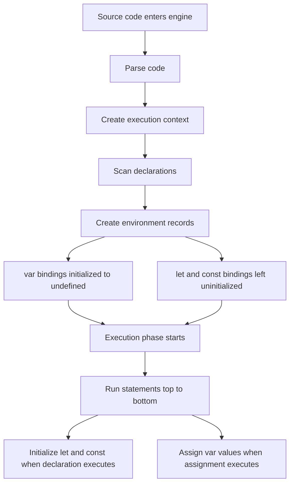
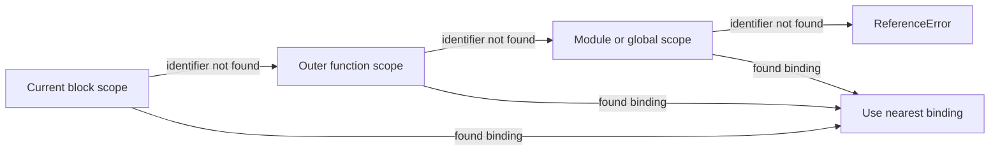
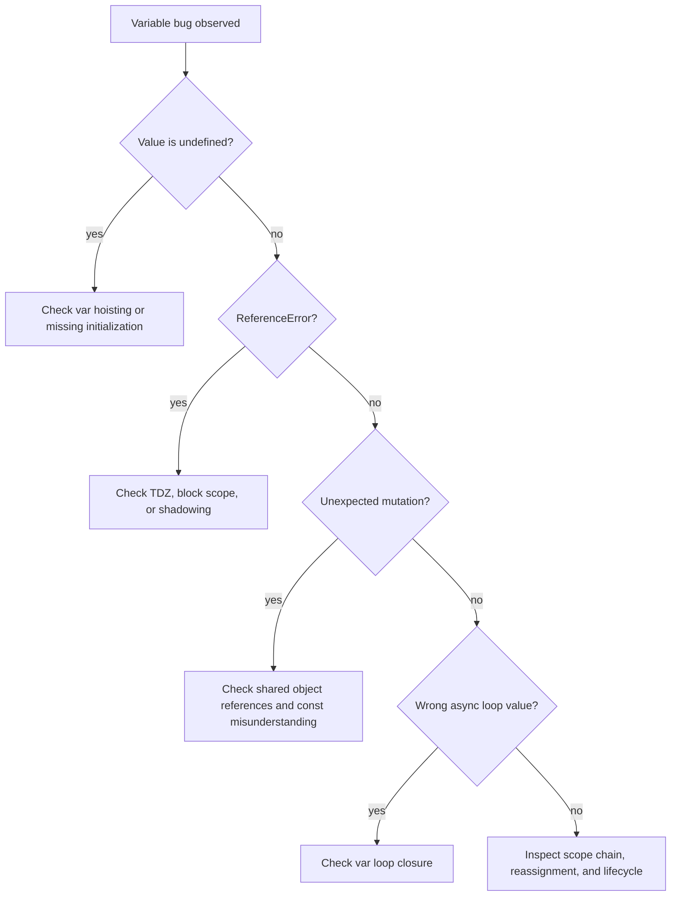

# 001.01.01 Variables & Declarations

Category: JavaScript Core

Topic: 001.01 Language Fundamentals

## Definition

Variables are named bindings that let JavaScript programs refer to values.

Declarations are the syntax JavaScript uses to create those bindings.

JavaScript has three primary declaration forms:

```js
var name = "Ajay";
let count = 1;
const role = "Engineer";
```

At a high level:

- `var` creates a function-scoped or global-scoped binding.
- `let` creates a block-scoped mutable binding.
- `const` creates a block-scoped binding that cannot be reassigned.

Important: `const` protects the binding, not the value itself.

```js
const user = { name: "Ajay" };
user.name = "A.J."; // allowed
user = {}; // TypeError
```

## Why It Exists

Variables exist because programs need names for values, state, intermediate results, function references, object references, configuration, and control flow decisions.

Declarations exist because the JavaScript engine needs to know:

- which identifiers exist,
- where they are visible,
- when they are initialized,
- whether they can be reassigned,
- and how they should behave during execution context creation.

This topic is foundational because it directly affects:

- scope,
- hoisting,
- temporal dead zone,
- closures,
- memory retention,
- `this` confusion,
- module design,
- production bugs caused by shared mutable state.

## Syntax

### `var`

```js
var value = 10;
```

Characteristics:

- function-scoped, not block-scoped,
- hoisted and initialized to `undefined`,
- can be redeclared,
- can be reassigned,
- attaches to global object in browser script scope.

```js
var x = 1;
var x = 2; // allowed
x = 3; // allowed
```

### `let`

```js
let value = 10;
```

Characteristics:

- block-scoped,
- hoisted but not initialized,
- cannot be redeclared in the same scope,
- can be reassigned,
- lives in the temporal dead zone before initialization.

```js
let x = 1;
x = 2; // allowed
let x = 3; // SyntaxError in same scope
```

### `const`

```js
const value = 10;
```

Characteristics:

- block-scoped,
- hoisted but not initialized,
- must be initialized at declaration,
- cannot be reassigned,
- object and array contents can still mutate.

```js
const items = [];
items.push("a"); // allowed
items = []; // TypeError
```

### Declaration Without Initialization

```js
let count;
var total;
```

Both start as `undefined` after initialization, but their creation behavior differs.

```js
console.log(total); // undefined
var total = 1;

console.log(count); // ReferenceError
let count = 1;
```

## Internal Working

JavaScript code runs inside an execution context. Before execution, the engine performs a creation phase.

During creation phase:

```txt
Execution Context Created
  -> scan declarations
  -> create environment records
  -> bind identifiers
  -> initialize var/function declarations
  -> leave let/const uninitialized until execution reaches them
```

### `var` Internal Behavior

```js
console.log(a);
var a = 10;
```

Internal model:

```txt
Creation phase:
  a -> undefined

Execution phase:
  console.log(a) -> undefined
  a = 10
```

### `let` / `const` Internal Behavior

```js
console.log(a);
let a = 10;
```

Internal model:

```txt
Creation phase:
  a -> uninitialized

Execution phase:
  console.log(a) -> ReferenceError
  a = 10
```

That uninitialized period is called the temporal dead zone.

### Environment Records

The engine stores bindings in environment records.

```txt
Global Lexical Environment
  Environment Record
    const appName
    let currentUser
  Outer Reference -> null

Function Lexical Environment
  Environment Record
    parameters
    local let/const
    local var
  Outer Reference -> parent scope
```

## Memory Behavior

Variables do not always store values directly. They store bindings to values.

Primitive values behave like direct immutable values:

```js
let a = 10;
let b = a;
b = 20;

console.log(a); // 10
console.log(b); // 20
```

Objects and arrays are reference values:

```js
const user1 = { name: "Ajay" };
const user2 = user1;

user2.name = "A.J.";

console.log(user1.name); // "A.J."
```

Memory model:

```txt
user1 ----\
          -> { name: "A.J." }
user2 ----/
```

### `const` and Memory

`const` means the binding cannot point somewhere else.

```js
const config = { debug: false };
config.debug = true; // allowed
```

The object can mutate because the binding still points to the same object.

To prevent mutation:

```js
const config = Object.freeze({ debug: false });
config.debug = true; // ignored in non-strict mode, TypeError in strict mode
```

### Closures and Retained Memory

Variables can stay alive after a function returns if a closure references them.

```js
function createCounter() {
  let count = 0;

  return function increment() {
    count += 1;
    return count;
  };
}

const counter = createCounter();
counter(); // 1
counter(); // 2
```

`count` remains in memory because `increment` still references it.

## Execution Behavior

JavaScript executes declarations differently depending on declaration type.

### Function Scope vs Block Scope

```js
if (true) {
  var a = 1;
  let b = 2;
  const c = 3;
}

console.log(a); // 1
console.log(b); // ReferenceError
console.log(c); // ReferenceError
```

`var` ignores block scope. `let` and `const` respect it.

### Redeclaration

```js
var a = 1;
var a = 2; // allowed

let b = 1;
let b = 2; // SyntaxError

const c = 1;
const c = 2; // SyntaxError
```

### Reassignment

```js
var a = 1;
a = 2; // allowed

let b = 1;
b = 2; // allowed

const c = 1;
c = 2; // TypeError
```

## Common Examples

### Prefer `const` by Default

```js
const maxRetries = 3;
const endpoint = "/api/users";
```

Use `const` when the binding should not point to a different value.

### Use `let` for Reassignment

```js
let attempts = 0;

while (attempts < 3) {
  attempts += 1;
}
```

### Avoid `var`

```js
for (var i = 0; i < 3; i++) {
  setTimeout(() => console.log(i), 0);
}
```

Output:

```txt
3
3
3
```

Better:

```js
for (let i = 0; i < 3; i++) {
  setTimeout(() => console.log(i), 0);
}
```

Output:

```txt
0
1
2
```

## Confusing Examples

### Temporal Dead Zone

```js
let value = "outer";

{
  console.log(value);
  let value = "inner";
}
```

Output:

```txt
ReferenceError
```

Why: the inner `value` binding exists for the whole block but is uninitialized until the declaration line executes.

### `typeof` Is Not Always Safe

```js
console.log(typeof missing); // "undefined"
console.log(typeof value); // ReferenceError
let value = 10;
```

`typeof` avoids errors for undeclared variables, but not for variables in TDZ.

### `const` Object Mutation

```js
const permissions = [];
permissions.push("admin");

console.log(permissions); // ["admin"]
```

This is allowed because the array binding did not change.

### Accidental Global

```js
function run() {
  user = "Ajay";
}

run();
console.log(user);
```

In non-strict mode, this can create an accidental global variable.

Strict mode prevents this:

```js
"use strict";

function run() {
  user = "Ajay"; // ReferenceError
}
```

## Production Use Cases

### Configuration

```js
const API_TIMEOUT_MS = 3000;
const FEATURE_FLAGS = Object.freeze({
  newCheckout: true,
});
```

Use `const` and immutable patterns for configuration.

### Request-Scoped State

```js
function handleRequest(req) {
  const requestId = req.headers["x-request-id"];
  let retryCount = 0;
}
```

Do not store request-specific values in shared globals.

Bad:

```js
let currentUser;

function handleRequest(req) {
  currentUser = req.user;
}
```

In Node.js servers, shared mutable state can leak between requests.

### React State Derivation

```js
function Profile({ user }) {
  const displayName = user.name ?? "Unknown";
  let statusLabel = "Offline";

  if (user.isOnline) {
    statusLabel = "Online";
  }

  return `${displayName}: ${statusLabel}`;
}
```

Use `const` for derived values and `let` for controlled reassignment.

## Interview Questions

1. What is the difference between `var`, `let`, and `const`?
2. What does hoisting mean for variable declarations?
3. Why does `var` return `undefined` before declaration but `let` throws?
4. What is the temporal dead zone?
5. Does `const` make an object immutable?
6. What is the difference between redeclaration and reassignment?
7. Why does `var` inside a loop cause closure bugs?
8. What happens when assigning to an undeclared variable?
9. How do variables relate to execution context?
10. How can variables cause memory leaks?

## Senior-Level Pitfalls

### Shared Mutable State

```js
let cache = {};
```

Shared state is not automatically bad, but it needs ownership, invalidation, concurrency assumptions, and observability.

### Long-Lived Closures

```js
function registerHandler(largeObject) {
  window.addEventListener("click", () => {
    console.log(largeObject.id);
  });
}
```

The event handler keeps `largeObject` alive.

### Reassignment Hiding State Transitions

```js
let result = getInitialResult();
result = normalize(result);
result = enrich(result);
result = validate(result);
```

This can be fine, but in complex flows explicit names are clearer:

```js
const initialResult = getInitialResult();
const normalizedResult = normalize(initialResult);
const enrichedResult = enrich(normalizedResult);
const validatedResult = validate(enrichedResult);
```

### `const` Overconfidence

`const` does not mean immutable, thread-safe, deeply frozen, or side-effect-free.

## Best Practices

- Use `const` by default.
- Use `let` only when reassignment is required.
- Avoid `var` in modern JavaScript.
- Declare variables close to where they are used.
- Prefer narrow scope over broad scope.
- Avoid shared mutable module-level state unless ownership is explicit.
- Use descriptive names that encode intent.
- Avoid reusing one variable for multiple meanings.
- Freeze or clone objects when immutability matters.
- Use strict mode or ES modules to prevent accidental globals.

## Debugging Scenarios

### Scenario 1: Unexpected `undefined`

```js
console.log(total);
var total = calculateTotal();
```

Likely cause: `var` hoisting.

Debugging steps:

1. Search for `var` declarations.
2. Check declaration order.
3. Replace with `let` or `const`.
4. Add tests for initialization order.

### Scenario 2: ReferenceError Before Declaration

```js
console.log(user);
const user = getUser();
```

Likely cause: temporal dead zone.

Debugging steps:

1. Identify block scope.
2. Check shadowed variable names.
3. Move declaration before first access.
4. Rename inner bindings if shadowing is confusing.

### Scenario 3: Wrong Loop Value

```js
for (var i = 0; i < items.length; i++) {
  setTimeout(() => process(items[i]), 0);
}
```

Likely cause: one shared `var` binding across loop iterations.

Fix:

```js
for (let i = 0; i < items.length; i++) {
  setTimeout(() => process(items[i]), 0);
}
```

### Scenario 4: Memory Growth

```js
const handlers = [];

function register(data) {
  handlers.push(() => data);
}
```

Likely cause: closures retaining large objects.

Debugging steps:

1. Capture heap snapshot.
2. Inspect retainers.
3. Remove unused handlers.
4. Avoid capturing large objects when only an ID is needed.

## Diagrams

Full diagrams are maintained in [diagrams.md](./diagrams.md).

### Execution Context Creation vs Execution



Key idea: all declarations are discovered before execution, but not all bindings are initialized the same way.

### `var` vs `let` / `const` Before Declaration

```txt
Creation phase

var a;              let b; / const c;
  |                      |
  v                      v
a = undefined       b/c = uninitialized
  |                      |
  v                      v
read before line     read before line
  |                      |
  v                      v
undefined            ReferenceError
```

### Scope Resolution



The engine always uses the nearest matching binding. This is why shadowing can create confusing TDZ bugs.

### Binding vs Value Memory Model

```txt
Primitive copy

let a = 10;
let b = a;

a binding -> 10
b binding -> 10

Object reference

const user1 = { name: "Ajay" };
const user2 = user1;

user1 binding ----\
                  ---> object in heap { name: "Ajay" }
user2 binding ----/
```

`const` freezes the arrow from binding to value. It does not freeze the object the arrow points to.

### Loop Closure Behavior

```txt
var loop

one shared i binding
  i = 0 -> i = 1 -> i = 2 -> i = 3
     \       \       \
      callbacks all read final shared i: 3

let loop

per-iteration i bindings
  iteration 0 -> callback reads i0: 0
  iteration 1 -> callback reads i1: 1
  iteration 2 -> callback reads i2: 2
```

### Debugging Decision Flow



## Mini Exercises

### Exercise 1

Predict the output:

```js
console.log(a);
var a = 10;
console.log(a);
```

### Exercise 2

Predict the output:

```js
console.log(a);
let a = 10;
```

### Exercise 3

Fix the bug:

```js
for (var i = 0; i < 3; i++) {
  setTimeout(() => console.log(i), 100);
}
```

### Exercise 4

Explain why this works:

```js
const user = { name: "Ajay" };
user.name = "A.J.";
```

### Exercise 5

Refactor this to avoid unclear reassignment:

```js
let data = fetchRawData();
data = normalize(data);
data = enrich(data);
data = validate(data);
```

## Summary

Variables and declarations are the foundation of JavaScript execution.

You should remember:

- `var` is function-scoped and initialized to `undefined`.
- `let` is block-scoped and reassignment-friendly.
- `const` is block-scoped and prevents rebinding.
- `let` and `const` have a temporal dead zone.
- `const` does not make objects immutable.
- variable declarations are processed during execution context creation.
- variable choices affect memory, closures, debugging, and production safety.

Master this topic before moving to data types, operators, type conversion, equality, truthy/falsy, control flow, functions, objects, arrays, strict mode, and error basics.
