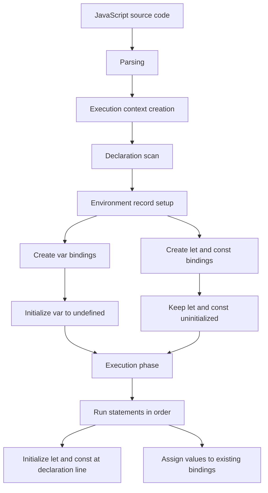
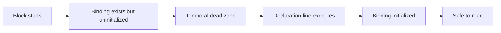
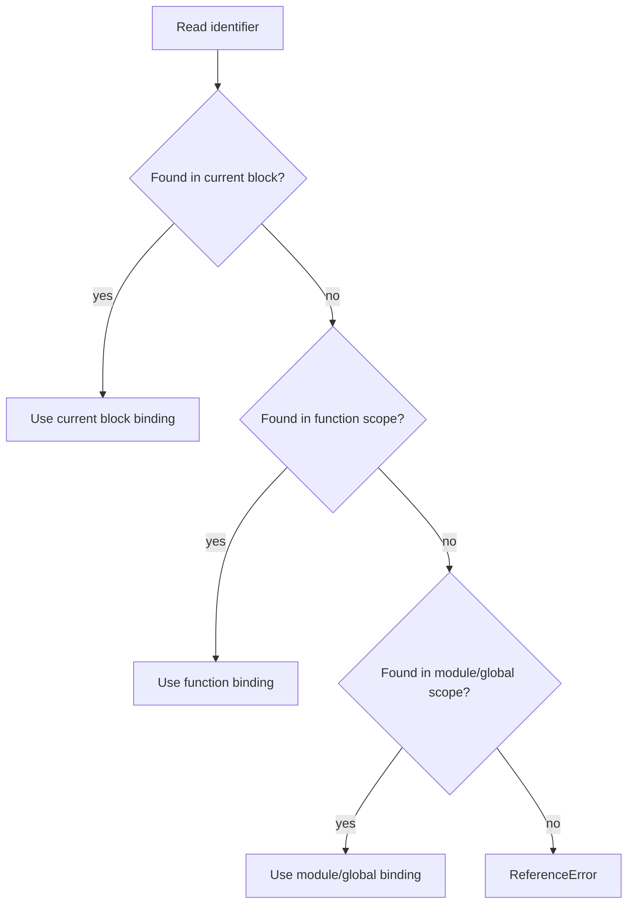
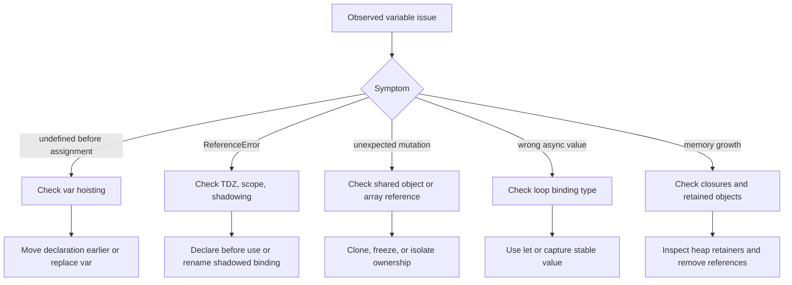
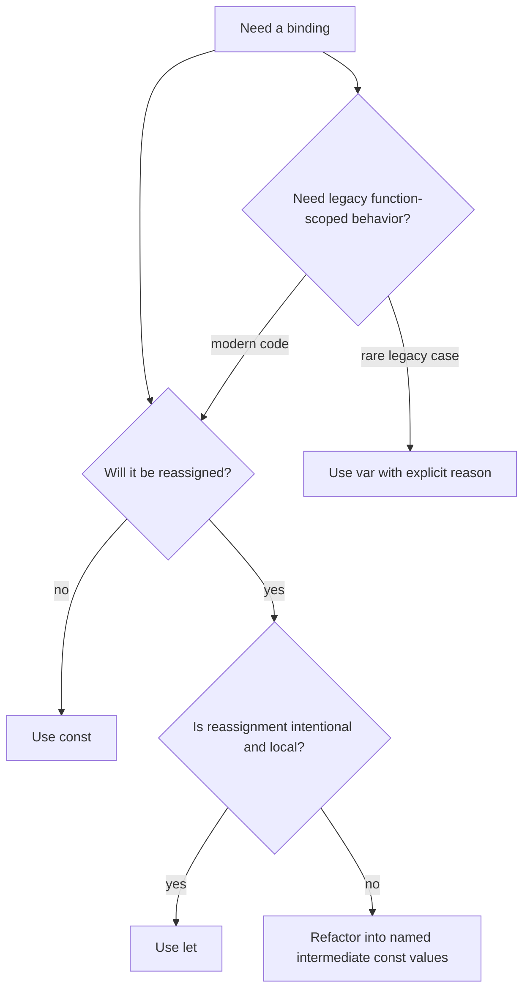

# Diagrams: Variables & Declarations

These diagrams explain how JavaScript variable declarations behave across parsing, execution context creation, scope lookup, memory, loops, and debugging.

## 1. Execution Context Lifecycle



Mental model:

- Creation phase decides what names exist.
- Execution phase decides when values are assigned.
- `var` can be read early because it starts as `undefined`.
- `let` and `const` cannot be read early because they are in the temporal dead zone.

## 2. Declaration State Timeline

```txt
Code:

console.log(a);
var a = 10;

Timeline:

Creation phase       Execution line 1       Execution line 2
-------------        ----------------       ----------------
a exists             read a                 assign a = 10
a = undefined        result: undefined      a = 10
```

```txt
Code:

console.log(b);
let b = 10;

Timeline:

Creation phase       Execution line 1       Execution line 2
-------------        ----------------       ----------------
b exists             read b                 initialize b = 10
b uninitialized      ReferenceError         b = 10
```

## 3. Temporal Dead Zone



Example:

```js
{
  // TDZ starts here for value
  console.log(value); // ReferenceError
  let value = 10; // TDZ ends here
}
```

Important: TDZ is not about physical placement in memory. It is about the runtime state of a lexical binding before initialization.

## 4. Environment Record and Scope Chain

```txt
Global / Module Environment
  bindings:
    API_URL
    createUser
  outer: null

Function Environment
  bindings:
    req
    userId
    retryCount
  outer: Global / Module Environment

Block Environment
  bindings:
    normalizedUser
    isValid
  outer: Function Environment
```

Lookup flow:



Production implication: a local binding can shadow a safe outer binding and change runtime behavior without changing the outer variable.

## 5. Shadowing and TDZ

```js
const featureName = "checkout";

function run() {
  console.log(featureName);

  if (true) {
    console.log(featureName); // ReferenceError
    const featureName = "payments";
  }
}
```

Diagram:

```txt
Outer binding:
featureName -> "checkout"

Inner block binding:
featureName -> uninitialized until declaration line

Inside block before declaration:
nearest featureName is inner binding, not outer binding
read -> ReferenceError
```

Rule: once the engine sees a lexical declaration inside a block, that name belongs to the block for the whole block.

## 6. Binding vs Value

```txt
const user = { name: "Ajay" };

Stack / environment binding        Heap value
---------------------------        ----------------
user ----------------------------> { name: "Ajay" }
```

Mutation:

```txt
user.name = "A.J."

Stack / environment binding        Heap value
---------------------------        -----------------
user ----------------------------> { name: "A.J." }
```

Reassignment:

```txt
user = {}

const binding cannot be moved to a new object
result: TypeError
```

Senior-level takeaway: when immutability matters, protect the value, not only the binding.

## 7. Shared References

```js
const user1 = { roles: ["viewer"] };
const user2 = user1;

user2.roles.push("admin");
```

Diagram:

```txt
user1 ----\
          ---> { roles: ["viewer", "admin"] }
user2 ----/
```

Bug pattern:

- The code that mutates `user2` may look isolated.
- The code that reads `user1` observes the mutation.
- `const` does not prevent this because neither binding was reassigned.

## 8. Loop Closure: `var`

```js
for (var i = 0; i < 3; i++) {
  setTimeout(() => console.log(i), 0);
}
```

Diagram:

```txt
Function/global scope:
  i binding is shared

Iteration 0 callback ----\
Iteration 1 callback -----+--> i final value: 3
Iteration 2 callback ----/
```

Output:

```txt
3
3
3
```

## 9. Loop Closure: `let`

```js
for (let i = 0; i < 3; i++) {
  setTimeout(() => console.log(i), 0);
}
```

Diagram:

```txt
Iteration 0:
  i0 -> 0
  callback0 closes over i0

Iteration 1:
  i1 -> 1
  callback1 closes over i1

Iteration 2:
  i2 -> 2
  callback2 closes over i2
```

Output:

```txt
0
1
2
```

## 10. Closure Retention and Memory

```js
function register(data) {
  return function handler() {
    return data.id;
  };
}
```

Diagram:

```txt
handler function
  [[Environment]] ------------------\
                                     v
closed-over lexical environment -> data -> large object
```

Memory risk:

- The outer function can finish.
- The lexical environment stays alive.
- The large object stays alive if the returned function is still reachable.

Optimization:

```js
function register(data) {
  const id = data.id;

  return function handler() {
    return id;
  };
}
```

Now the closure keeps only the small value it actually needs.

## 11. Production Debugging Flow



## 12. Choosing Declaration Type



Default rule: use `const`, move to `let` when reassignment communicates real state transition, and avoid `var` in modern application code.
