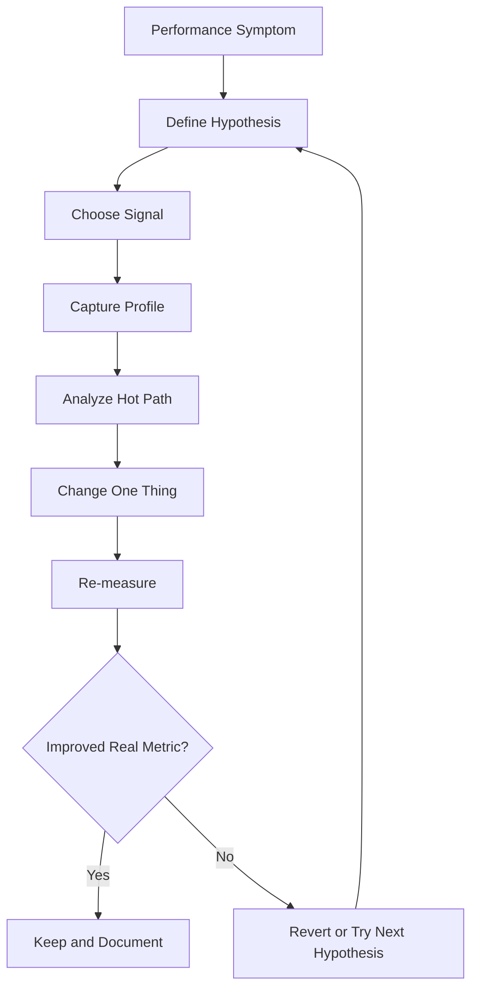
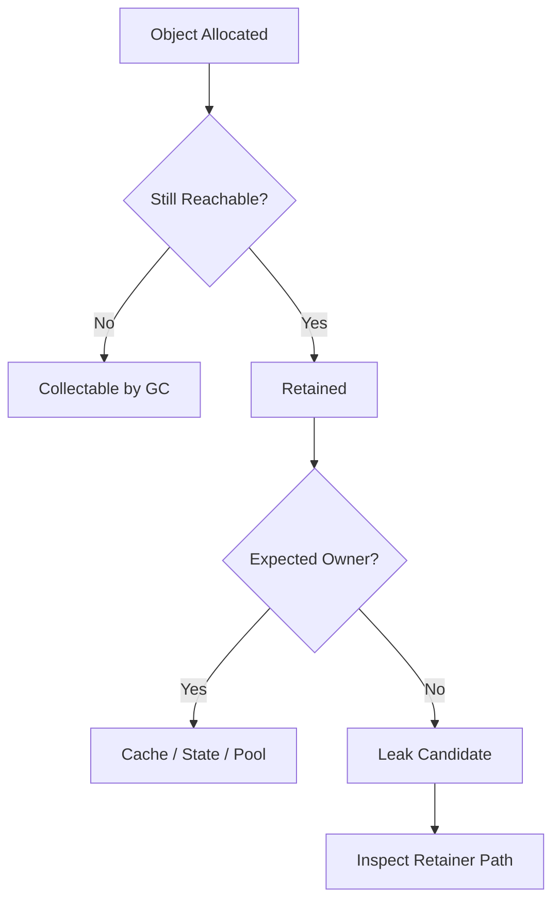
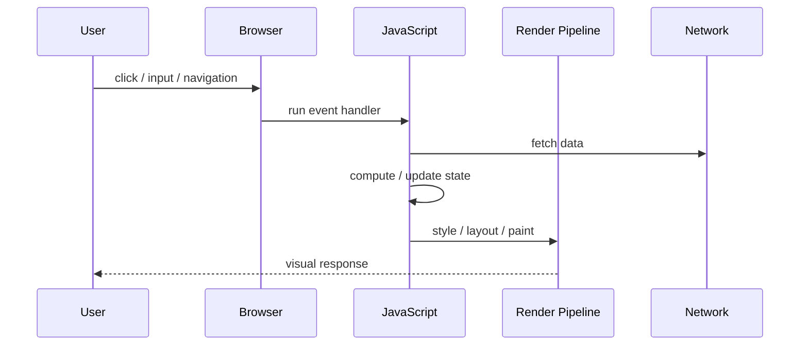
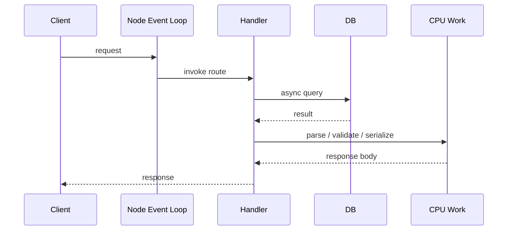
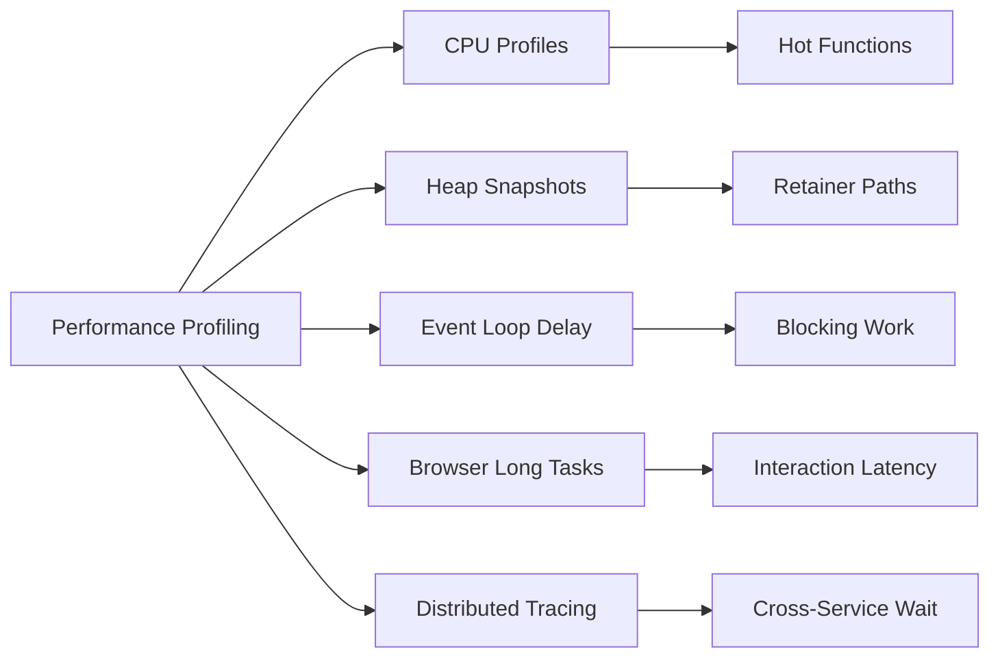
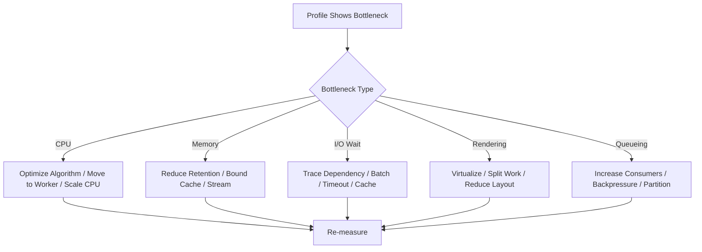

# 001.04.02 Performance Profiling

Category: JavaScript Core<br>
Topic: 001.04 Production JavaScript

Performance profiling is the disciplined process of measuring where JavaScript code spends time, allocates memory, blocks the event loop, delays rendering, waits on I/O, or burns infrastructure cost. It turns "the app feels slow" into evidence: traces, profiles, heap snapshots, timings, counters, and reproducible bottlenecks.

The senior skill is not knowing one profiler button. The senior skill is knowing which question you are asking, collecting the right signal with acceptable overhead, separating symptoms from causes, and proving that the fix improved the real user or system outcome.

---

## 1. Definition

Performance profiling is runtime measurement that identifies bottlenecks in execution time, memory allocation, event-loop responsiveness, rendering, network waiting, I/O, and resource contention.

One-line definition:

- Performance profiling is evidence-driven diagnosis of where a JavaScript system consumes time and resources.

Expanded definition:

- In the browser, profiling often focuses on main-thread work, rendering, layout, paint, JavaScript execution, network waterfalls, Web Vitals, memory leaks, hydration cost, and interaction latency.
- In Node.js, profiling often focuses on CPU hot paths, event-loop delay, garbage collection, async resource lifetime, memory growth, promise churn, I/O latency, worker saturation, and dependency overhead.
- In production systems, profiling connects low-level runtime data to business and reliability outcomes: checkout latency, chat message delay, API p99, page interaction responsiveness, worker throughput, cloud cost, and incident recovery.

Profiling is different from casual timing. A `console.time()` can be useful, but performance profiling usually requires repeatability, representative data, controlled experiments, and a clear hypothesis.

---

## 2. Why It Exists

Performance profiling exists because intuition is unreliable in complex JavaScript systems.

Common false assumptions:

- "This loop must be slow" when the real bottleneck is JSON serialization.
- "The API is slow" when the browser main thread is blocked during hydration.
- "The database is slow" when the Node process is CPU-bound parsing payloads.
- "React is slow" when the app recreates unstable props and invalidates memoization.
- "Memory is fine" when retained closures keep old request data alive.

Profiling solves these problems:

- It identifies the real constraint before optimization work starts.
- It shows whether the bottleneck is CPU, memory, network, I/O, rendering, locking, queueing, or runtime overhead.
- It provides before-and-after evidence.
- It prevents micro-optimizations that make code harder to maintain but do not improve user experience.
- It gives production teams a shared language for latency, throughput, saturation, and cost.

Why it matters before deeper production topics:

- You cannot set capacity plans without understanding resource use.
- You cannot improve reliability if CPU or memory pressure is invisible.
- You cannot debug production incidents if profiles, metrics, and traces are missing.
- You cannot make Staff-level architecture decisions if performance trade-offs are guessed instead of measured.

---

## 3. Syntax & Variants

JavaScript has several profiling surfaces. They are not equivalent; each answers a different question.

### Browser timing APIs

```ts
performance.mark("checkout:start");

await submitCheckout(order);

performance.mark("checkout:end");
performance.measure("checkout", "checkout:start", "checkout:end");

const [measure] = performance.getEntriesByName("checkout");
console.log(measure.duration);
```

Use for custom client-side milestones.

### Browser PerformanceObserver

```ts
const observer = new PerformanceObserver((list) => {
  for (const entry of list.getEntries()) {
    console.log(entry.entryType, entry.name, entry.duration);
  }
});

observer.observe({
  type: "longtask",
  buffered: true,
});
```

Use for observing browser performance entries such as long tasks, resource timings, navigation timings, layout shifts, and measures.

### Web Vitals style signal collection

```ts
type VitalMetric = {
  name: "LCP" | "CLS" | "INP" | "TTFB";
  value: number;
  id: string;
};

function sendVital(metric: VitalMetric) {
  navigator.sendBeacon(
    "/rum",
    JSON.stringify({
      name: metric.name,
      value: metric.value,
      id: metric.id,
      url: location.pathname,
    }),
  );
}
```

Use for real-user monitoring rather than local lab-only profiling.

### Node.js high-resolution timing

```ts
const start = process.hrtime.bigint();

await handler(request);

const durationMs = Number(process.hrtime.bigint() - start) / 1_000_000;
console.log({ durationMs });
```

Use when wall-clock duration matters in backend execution paths.

### Node.js performance API

```ts
import { performance, PerformanceObserver } from "node:perf_hooks";

const obs = new PerformanceObserver((items) => {
  for (const entry of items.getEntries()) {
    console.log(entry.name, entry.duration);
  }
});

obs.observe({ entryTypes: ["measure"] });

performance.mark("handler:start");
await handleRequest();
performance.mark("handler:end");
performance.measure("handler", "handler:start", "handler:end");
```

Use when you want browser-like marks and measures inside Node.

### Event-loop delay monitoring

```ts
import { monitorEventLoopDelay } from "node:perf_hooks";

const histogram = monitorEventLoopDelay({ resolution: 20 });
histogram.enable();

setInterval(() => {
  console.log({
    p99Ms: histogram.percentile(99) / 1_000_000,
    meanMs: histogram.mean / 1_000_000,
  });
  histogram.reset();
}, 10_000);
```

Use to detect CPU blocking, synchronous work, GC pressure, and process saturation.

### CPU profiling

Common options:

- Chrome DevTools Performance panel for browser CPU and rendering.
- Chrome DevTools connected to Node with `node --inspect`.
- Node CPU profiles with the inspector protocol.
- Linux `perf`, eBPF tooling, or cloud profiler in production-like environments.
- Framework profilers such as React DevTools Profiler or Angular DevTools.

### Heap profiling

Common options:

- Browser Memory panel heap snapshots.
- Node heap snapshots through inspector.
- Allocation timelines.
- Retainer path inspection.
- Production heap dumps with strict access control.

### Flame chart reading vocabulary

```text
Wide frame     -> function consumed significant time.
Tall stack     -> deep call chain, not necessarily expensive.
Self time      -> time spent inside that function only.
Total time     -> time spent inside function plus children.
Idle gap       -> waiting, scheduling, network, I/O, or browser idle.
Long task      -> browser main-thread task over 50 ms.
GC block       -> runtime garbage collection pause or pressure.
```

---

## 4. Internal Working

Profiling works by sampling, instrumentation, tracing, or snapshotting.

### High-level profiling flow



### Sampling profilers

Sampling profilers interrupt the runtime periodically and record the current call stack.

```text
Time passes
  -> profiler samples stack every N interval
  -> stacks are aggregated
  -> frequently observed frames become hot paths
  -> output becomes flame chart / call tree / bottom-up view
```

Sampling has low overhead compared with tracing every function call, but it can miss very short-lived work and distort tiny benchmarks.

### Instrumentation profilers

Instrumentation records explicit boundaries.

```ts
performance.mark("parse:start");
const parsed = JSON.parse(payload);
performance.mark("parse:end");
performance.measure("parse", "parse:start", "parse:end");
```

Instrumentation is useful when you already know the business or architectural boundary you care about: route load, checkout submit, API handler, queue job, hydration, search indexing, cache lookup.

### Tracing

Tracing connects spans across services or async boundaries.

```text
Browser click
  -> frontend span
  -> BFF span
  -> payment service span
  -> database span
  -> provider call span
```

Tracing answers: where did this request wait?

### Heap snapshots

Heap snapshots capture objects currently reachable from GC roots.

```text
GC roots
  -> module variables
  -> closures
  -> timers
  -> DOM nodes
  -> caches
  -> request objects
  -> retained heap
```

Heap snapshots answer: why is this memory still alive?

### Engine-level view

In V8-based runtimes, profiling can expose:

- optimized and deoptimized functions,
- hidden class instability,
- inline cache behavior,
- garbage collection pressure,
- promise and async hook overhead,
- C++ runtime frames around JavaScript frames,
- serialization and parsing cost.

You do not need to memorize every V8 internal to profile well, but you must know that code shape affects optimization, allocation, and GC behavior.

---

## 5. Memory Behavior

Performance problems are often memory problems wearing a latency mask.

### Memory costs during profiling

Profiling can allocate memory itself:

- Performance entries stay in buffers until cleared or collected.
- Traces and profiles can become large.
- Heap snapshots can pause the process and require significant memory.
- High-cardinality labels can overload telemetry systems.
- Debug logging can allocate strings and increase I/O pressure.

### JavaScript memory pressure sources

```text
Incoming work
  -> objects allocated
  -> closures capture state
  -> arrays/maps/caches retain references
  -> GC runs more often
  -> CPU time shifts from useful work to collection
  -> latency rises
```

Common allocations that profiling reveals:

- repeated JSON parse/stringify,
- per-request object cloning,
- large array transformations,
- `map().filter().reduce()` chains on big collections,
- unstable React render props,
- unbounded caches,
- retained DOM nodes,
- closures holding request/session data,
- metrics labels with unbounded user IDs,
- async callbacks retaining large payloads.

### Heap profiling mental model



Key terms:

- Shallow size: memory used by the object itself.
- Retained size: memory freed if that object became unreachable.
- Retainer path: chain of references keeping an object alive.
- Allocation rate: how quickly new objects are created.
- Promotion: objects surviving young-generation GC and moving to older memory areas.

### Production memory warning signs

- RSS grows even when traffic returns to normal.
- Heap used grows in a staircase pattern after GC.
- p99 latency spikes during GC.
- Container restarts with out-of-memory events.
- Browser tab becomes slow after long sessions.
- Workers process fewer jobs over time.

---

## 6. Execution Behavior

Performance profiling must respect execution order.

### Browser execution path



Browser performance problems commonly happen when JavaScript monopolizes the main thread before the browser can handle input or paint.

### Node execution path



Node performance problems commonly happen when synchronous CPU work blocks other requests from making progress.

### Wall time vs CPU time

```text
Wall time = real elapsed time.
CPU time  = time actually spent executing on CPU.
Wait time = wall time not spent executing: network, I/O, locks, queueing, timers.
```

If an API takes 2 seconds but CPU profile shows little JavaScript work, the process may be waiting on I/O, a downstream service, a database lock, or queue saturation.

### Sync vs async profiling trap

```ts
console.time("work");
setTimeout(() => {
  expensiveWork();
}, 100);
console.timeEnd("work"); // Not measuring expensiveWork.
```

The timer measures scheduling, not the delayed callback. Async boundaries must be instrumented at the actual work boundary.

---

## 7. Scope & Context Interaction

Profiling boundaries must match ownership boundaries.

### Local function scope

Use when you are isolating an algorithm or hot function.

```ts
function normalizeUsers(users: User[]) {
  performance.mark("normalize:start");

  const result = users.map(normalizeUser);

  performance.mark("normalize:end");
  performance.measure("normalize", "normalize:start", "normalize:end");

  return result;
}
```

### Request scope

Use for backend handlers and API routes.

```ts
async function withRequestTiming<T>(
  route: string,
  work: () => Promise<T>,
): Promise<T> {
  const start = process.hrtime.bigint();
  try {
    return await work();
  } finally {
    const durationMs = Number(process.hrtime.bigint() - start) / 1_000_000;
    metrics.histogram("http.route.duration", durationMs, { route });
  }
}
```

Avoid tagging by raw URL with user IDs or order IDs. That creates high-cardinality metrics and can overload monitoring systems.

### Component scope

Use for React/Angular render and change detection questions.

```tsx
import { Profiler } from "react";

function onRender(
  id: string,
  phase: "mount" | "update",
  actualDuration: number,
) {
  console.log({ id, phase, actualDuration });
}

export function App() {
  return (
    <Profiler id="CheckoutSummary" onRender={onRender}>
      <CheckoutSummary />
    </Profiler>
  );
}
```

### Process scope

Use for event-loop delay, heap growth, CPU saturation, and worker health.

```ts
setInterval(() => {
  metrics.gauge("process.heap.used.mb", process.memoryUsage().heapUsed / 1024 / 1024);
  metrics.gauge("process.rss.mb", process.memoryUsage().rss / 1024 / 1024);
}, 15_000);
```

### Context propagation risk

Profiling async systems requires correlation.

```text
Request ID
  -> logs
  -> metrics labels with bounded values
  -> distributed trace spans
  -> profile capture window
```

Without correlation, teams see "CPU high" and "checkout slow" as separate facts instead of one incident.

---

## 8. Common Examples

### Example 1: Measuring JSON parse cost in Node

```ts
import { performance } from "node:perf_hooks";

export function parsePayload(payload: string) {
  const start = performance.now();
  const parsed = JSON.parse(payload);
  const durationMs = performance.now() - start;

  if (durationMs > 25) {
    logger.warn({ durationMs, bytes: payload.length }, "slow_json_parse");
  }

  return parsed;
}
```

Why it matters:

- Large JSON parsing is synchronous.
- It can block the Node event loop.
- It can hurt unrelated requests sharing the same process.

### Example 2: Finding a slow array pipeline

```ts
const activePremiumUsers = users
  .map(enrichUser)
  .filter((user) => user.active)
  .filter((user) => user.plan === "premium")
  .sort((a, b) => b.lastSeenAt - a.lastSeenAt);
```

Possible issue:

- Multiple passes allocate intermediate arrays.
- Sorting is `O(n log n)`.
- Enrichment may do expensive work before filtering removes most users.

Better shape when profiling proves this is hot:

```ts
const activePremiumUsers: EnrichedUser[] = [];

for (const user of users) {
  if (!user.active || user.plan !== "premium") continue;
  activePremiumUsers.push(enrichUser(user));
}

activePremiumUsers.sort((a, b) => b.lastSeenAt - a.lastSeenAt);
```

Do not rewrite every pipeline like this by default. Use this style when measurement proves the path is hot enough.

### Example 3: Browser long task detection

```ts
const observer = new PerformanceObserver((list) => {
  for (const entry of list.getEntries()) {
    analytics.track("long_task", {
      duration: entry.duration,
      path: location.pathname,
    });
  }
});

observer.observe({ type: "longtask", buffered: true });
```

Long tasks are a strong clue that interaction latency may suffer.

### Example 4: Measuring event-loop delay

```ts
import { monitorEventLoopDelay } from "node:perf_hooks";

const delay = monitorEventLoopDelay({ resolution: 10 });
delay.enable();

setInterval(() => {
  const p95 = delay.percentile(95) / 1_000_000;
  const p99 = delay.percentile(99) / 1_000_000;

  metrics.gauge("node.event_loop_delay.p95_ms", p95);
  metrics.gauge("node.event_loop_delay.p99_ms", p99);

  delay.reset();
}, 30_000);
```

Use this in production to catch blocking work that request timers alone may hide.

### Example 5: Profiling a React render

```tsx
function ProductList({ products }: { products: Product[] }) {
  const visibleProducts = products.filter((product) => product.inStock);

  return visibleProducts.map((product) => (
    <ProductRow key={product.id} product={product} />
  ));
}
```

Potential issue:

- Filtering runs on every render.
- Child rows may re-render if props are unstable.
- The problem may be tiny with 20 products and severe with 10,000.

Profile before deciding whether to memoize, virtualize, paginate, or move filtering to the server.

---

## 9. Confusing / Tricky Examples

### Trap 1: Timing async scheduling instead of async work

```ts
console.time("timer");

setTimeout(() => {
  heavyWork();
}, 0);

console.timeEnd("timer");
```

This does not measure `heavyWork`. It measures how long it took to schedule a timer.

Correct direction:

```ts
setTimeout(() => {
  console.time("heavyWork");
  heavyWork();
  console.timeEnd("heavyWork");
}, 0);
```

### Trap 2: Optimizing average latency while p99 burns

```text
Average latency: 80 ms
p95 latency:     240 ms
p99 latency:     2500 ms
```

The average looks acceptable, but real users or callers are experiencing severe tail latency.

Staff-level interpretation:

- Check GC pauses.
- Check queueing.
- Check downstream timeouts.
- Check cold starts.
- Check lock contention.
- Check large payload outliers.

### Trap 3: Local benchmark lies because of JIT warmup

```ts
console.time("run");
for (let i = 0; i < 1_000; i += 1) {
  doWork(sample);
}
console.timeEnd("run");
```

This can mix cold execution, optimized execution, deoptimized execution, and unrealistic inputs.

Better benchmark practice:

- Warm up before measuring.
- Use realistic data shape.
- Run enough iterations.
- Avoid dead-code elimination.
- Compare against production profiles.

### Trap 4: `console.log` changes the profile

```ts
for (const item of items) {
  console.log(item);
  process(item);
}
```

Logging is I/O and string formatting. It can dominate the profile and hide the original bottleneck.

### Trap 5: Memoization increases memory and hurts performance

```ts
const cache = new Map<string, Result>();

export function compute(input: Input) {
  const key = JSON.stringify(input);
  if (!cache.has(key)) {
    cache.set(key, expensiveCompute(input));
  }
  return cache.get(key);
}
```

Possible failures:

- `JSON.stringify` is itself expensive.
- The cache is unbounded.
- Keys may include user-specific data.
- Memory grows until OOM.
- Hit rate may be too low to justify the cache.

### Trap 6: CPU profile shows "anonymous" or bundled names

Minified bundles and anonymous functions can make profiles hard to read.

Production-quality profiling often requires:

- source maps with secure access,
- named functions for important paths,
- route/component labels,
- release version tagging,
- build artifact traceability.

---

## 10. Real Production Use Cases

### Checkout latency

Problem:

- Users click Pay and wait 4 seconds.

Profiling questions:

- Is the browser blocked by validation or hydration?
- Is the BFF waiting on payment provider I/O?
- Is JSON serialization dominating response time?
- Is p99 caused by retries or provider tail latency?

Useful signals:

- Web Vitals and interaction timing.
- Route-level backend histogram.
- Distributed trace from button click to payment provider.
- CPU profile during load test.

### Chat or realtime systems

Problem:

- Messages arrive late under load.

Profiling questions:

- Is the event loop blocked by message fanout?
- Are WebSocket writes backpressured?
- Is serialization duplicated per subscriber?
- Are presence updates causing too many broadcasts?

Useful signals:

- Event-loop delay.
- Queue depth.
- Per-room fanout duration.
- CPU profile during burst traffic.

### SaaS dashboard

Problem:

- Dashboard freezes when a customer has many records.

Profiling questions:

- Is rendering too many DOM nodes?
- Is client-side grouping too expensive?
- Is a selector recalculating every render?
- Is a chart library doing layout-heavy work?

Useful signals:

- Browser Performance trace.
- React/Angular profiler.
- Long task observer.
- Memory allocation timeline.

### Background job processor

Problem:

- Worker throughput drops after running for hours.

Profiling questions:

- Is heap growing?
- Are job payloads retained after completion?
- Are retries creating duplicate timers?
- Is CPU shifting into garbage collection?

Useful signals:

- Heap snapshots over time.
- Event-loop delay.
- Jobs/sec.
- GC duration and frequency.

### API gateway or BFF

Problem:

- CPU cost is high even though downstream services are fast.

Profiling questions:

- Are request/response bodies repeatedly cloned?
- Is schema validation too expensive for large payloads?
- Is compression running on the event loop?
- Is logging serializing huge objects?

Useful signals:

- CPU profiles.
- Payload-size histograms.
- Per-middleware timing.
- Event-loop delay.

---

## 11. Interview Questions

### Basic

1. What is performance profiling?
2. How is profiling different from logging?
3. What is the difference between wall time and CPU time?
4. What does a flame chart show?
5. What is a browser long task?

### Intermediate

1. How would you debug a Node API whose p99 latency suddenly increased?
2. How would you detect whether a React screen is slow because of rendering or network?
3. Why can `console.time()` give misleading results for async code?
4. What metrics would you collect for a background worker?
5. How do heap snapshots help find memory leaks?

### Advanced

1. Your Node service has low CPU average but high event-loop delay. What could explain this?
2. A CPU profile shows heavy garbage collection. What code patterns would you inspect?
3. A frontend interaction has poor INP but the API is fast. What would you profile?
4. How do you profile safely in production?
5. How would you prove a performance optimization is worth keeping?

### Tricky

1. Why can memoization make performance worse?
2. Why can a faster algorithm make the user experience unchanged?
3. Why can average latency hide a serious production issue?
4. Why can a microbenchmark disagree with a production profile?
5. Why can source maps matter for performance debugging?

Good answers should connect:

- measurement method,
- bottleneck type,
- code/runtime mechanism,
- production impact,
- trade-off of the proposed fix.

---

## 12. Senior-Level Pitfalls

### Pitfall 1: Optimizing without a bottleneck

Changing code because it "looks slow" often creates complexity without outcome improvement.

Senior correction:

- Define the target metric first.
- Capture a baseline.
- Change one meaningful thing.
- Re-measure.

### Pitfall 2: Measuring the wrong environment

Local profiles may not represent production because of:

- smaller data,
- different CPU,
- disabled compression,
- no TLS,
- dev builds,
- missing CDN behavior,
- artificial network conditions,
- no concurrency.

Senior correction:

- Reproduce with production-like data and build settings.
- Compare local, staging, load test, and production signals.

### Pitfall 3: Ignoring tail latency

Average performance is rarely enough for production systems.

Senior correction:

- Track p50, p95, p99, max, and saturation.
- Segment by route, tenant tier, payload size, region, and release.
- Avoid unbounded labels.

### Pitfall 4: Adding high-overhead observability

Too much profiling can become the bottleneck.

Senior correction:

- Sample profiles.
- Bound trace volume.
- Avoid raw payload logging.
- Use controlled profiling windows.
- Turn on expensive instrumentation only during incidents or experiments.

### Pitfall 5: Treating frontend and backend performance separately

Real user latency often crosses both.

Senior correction:

- Correlate browser timings, backend traces, network timings, and release versions.
- Follow user journeys, not only service dashboards.

### Pitfall 6: Fixing symptoms instead of ownership

Example:

- Add caching to hide slow computation.
- Cache grows unbounded.
- Memory pressure creates new latency incidents.

Senior correction:

- Fix algorithm/data ownership when possible.
- Cache only with size limits, TTL, hit-rate measurement, and invalidation rules.

---

## 13. Best Practices

### Measurement discipline

- Start with a user or system symptom.
- Choose the smallest useful metric.
- Capture a baseline.
- Use representative data.
- Profile production builds, not only development builds.
- Prefer p95/p99 for user-facing and service-facing latency.
- Keep one change per experiment when possible.
- Record the result and decision.

### Browser profiling

- Use Chrome DevTools Performance panel for main-thread, rendering, layout, paint, and long tasks.
- Use Network panel for waterfalls and resource timing.
- Use Lighthouse or lab tools carefully; they are not replacements for real-user monitoring.
- Measure Web Vitals in production.
- Watch hydration and route transition cost in modern frontend apps.
- Use virtualization or pagination for large lists.
- Avoid layout thrashing caused by repeated read/write DOM cycles.

### Node profiling

- Track event-loop delay.
- Track heap used, RSS, and GC behavior.
- Use CPU profiles for suspected synchronous bottlenecks.
- Use traces for I/O wait and downstream latency.
- Avoid synchronous crypto, compression, filesystem, and heavy parsing on hot request paths.
- Move CPU-heavy work to worker threads, separate services, queues, or precomputation when appropriate.

### Code-level best practices

- Prefer clear code until profiling proves the path is hot.
- Avoid unbounded caches.
- Avoid high-cardinality metrics.
- Avoid logging huge objects in hot paths.
- Name important functions for readable profiles.
- Keep profiling helpers centralized so measurement is consistent.
- Remove or sample noisy debug instrumentation after diagnosis.

### Architecture best practices

- Define performance budgets.
- Attach SLOs to critical user journeys.
- Keep load tests close to real traffic shape.
- Use canaries to catch performance regressions.
- Store profiles/traces by release version.
- Treat cost as a performance dimension.

---

## 14. Debugging Scenarios

### Scenario 1: Node API p99 latency spike

Symptoms:

- p50 is normal.
- p99 jumps from 300 ms to 4 seconds.
- CPU average is moderate.

Debugging flow:

```text
Check deploy timeline
  -> compare route histograms
  -> inspect event-loop delay
  -> inspect traces for downstream wait
  -> capture CPU profile during spike
  -> segment by payload size and tenant
```

Likely causes:

- large payload outliers,
- synchronous validation,
- GC pauses,
- downstream timeout retries,
- compression or serialization on the event loop,
- noisy tenant behavior.

Fix direction:

- bound payload size,
- move expensive work off hot path,
- optimize serialization,
- add route-specific timeout budgets,
- isolate heavy tenants or workloads.

### Scenario 2: React checkout page input lag

Symptoms:

- Typing into coupon field feels delayed.
- API calls are fast.
- CPU rises during typing.

Debugging flow:

```text
Record browser Performance trace
  -> inspect long tasks
  -> use React Profiler
  -> identify components re-rendering per keystroke
  -> check unstable props/selectors
  -> validate fix with interaction metric
```

Likely causes:

- entire checkout tree re-renders on each keypress,
- expensive derived totals recomputed per render,
- validation runs synchronously on every input,
- large list diffing happens during input.

Fix direction:

- isolate input state,
- memoize proven expensive derived data,
- debounce non-critical validation,
- virtualize large lists,
- split urgent vs non-urgent updates where framework supports it.

### Scenario 3: Worker memory grows until restart

Symptoms:

- Worker starts at 300 MB RSS.
- After 8 hours, RSS reaches 1.8 GB.
- Throughput drops before OOM restart.

Debugging flow:

```text
Capture heap snapshot at start
  -> capture heap snapshot after growth
  -> compare retained objects
  -> inspect retainer paths
  -> correlate with job types
  -> run focused load replay
```

Likely causes:

- job payloads stored in module-level arrays,
- failed jobs retained in retry state forever,
- listeners/timers not removed,
- cache without TTL or max size,
- closure captures large intermediate data.

Fix direction:

- clear references after job completion,
- bound cache size,
- remove listeners,
- stream large payloads,
- add leak regression test where possible.

### Scenario 4: Browser route transition slow only for enterprise tenants

Symptoms:

- Small tenants are fine.
- Enterprise tenants see 6-second dashboard load.

Debugging flow:

```text
Segment RUM by tenant size
  -> inspect network payload size
  -> profile route transition
  -> check client-side transforms and chart rendering
  -> compare DOM node count
```

Likely causes:

- too much data sent to client,
- client-side aggregation at large scale,
- chart library layout cost,
- table renders thousands of rows,
- local storage or IndexedDB work blocks startup.

Fix direction:

- server-side aggregation,
- pagination,
- virtualization,
- lazy chart rendering,
- progressive loading.

---

## 15. Exercises / Practice

### Exercise 1: Predict what is measured

```ts
console.time("request");

fetch("/api/items").then(async (response) => {
  const data = await response.json();
  render(data);
});

console.timeEnd("request");
```

Questions:

- Does this measure network duration?
- Does this measure JSON parsing?
- Where should the timer be placed to measure the full async flow?

### Exercise 2: Find the hot allocation

```ts
export function groupOrders(orders: Order[]) {
  return orders.reduce<Record<string, Order[]>>((groups, order) => {
    const key = `${order.customerId}:${order.region}:${order.status}`;
    return {
      ...groups,
      [key]: [...(groups[key] ?? []), order],
    };
  }, {});
}
```

Tasks:

- Identify avoidable allocations.
- Rewrite using mutation inside a local accumulator.
- Explain why local mutation is acceptable here.

### Exercise 3: Choose the right profiler

For each symptom, choose the best first signal:

```text
1. Browser freezes during typing.
2. Node API p99 spikes during large imports.
3. Worker RSS grows over six hours.
4. Checkout request waits on payment provider.
5. Dashboard route loads slowly only after release.
```

Expected direction:

- browser Performance trace / framework profiler,
- event-loop delay and CPU profile,
- heap snapshots,
- distributed trace,
- release-segmented RUM and route profiling.

### Exercise 4: Debug the cache

```ts
const results = new Map<string, SearchResult[]>();

export async function search(query: string) {
  if (!results.has(query)) {
    results.set(query, await searchProvider(query));
  }
  return results.get(query)!;
}
```

Tasks:

- Explain the performance goal.
- Identify memory and privacy risks.
- Add TTL and max-size policy.
- Define metrics to prove cache value.

### Exercise 5: Explain a flame chart

Given this simplified profile:

```text
handleRequest        total 180 ms, self 3 ms
  validatePayload    total 90 ms, self 88 ms
  fetchAccount       total 40 ms, self 2 ms
  JSON.stringify     total 45 ms, self 45 ms
```

Questions:

- Which functions are CPU-heavy?
- Which function may be waiting on I/O?
- What would you investigate first?
- What fix might be dangerous without more context?

---

## 16. Comparison

### Profiling methods

| Method | Best For | Strength | Risk |
| --- | --- | --- | --- |
| `console.time()` | Quick local timing | Simple and fast | Easy to misuse with async code |
| Performance marks | Known boundaries | Low friction, structured | Needs manual placement |
| CPU profile | Hot JavaScript execution | Finds real CPU consumers | Sampling can miss tiny work |
| Heap snapshot | Memory leaks and retainers | Shows why objects survive | Can pause app and expose sensitive data |
| Distributed tracing | Cross-service latency | Finds wait across systems | Needs propagation and sampling |
| RUM | Real user experience | Production reality | Noisy without segmentation |
| Synthetic benchmark | Algorithm comparison | Repeatable in isolation | Can disagree with production |
| Load test | Capacity behavior | Shows saturation | Expensive to make realistic |

### Browser vs Node profiling

| Dimension | Browser | Node.js |
| --- | --- | --- |
| Main concern | User experience and rendering | Throughput, latency, event loop, memory |
| Primary thread risk | Main thread blocks input/paint | Event loop blocks all requests in process |
| Common tools | DevTools Performance, Memory, Lighthouse, RUM | Inspector, perf_hooks, heap snapshots, tracing, APM |
| Key metrics | LCP, INP, CLS, TTFB, long tasks | p95/p99 latency, event-loop delay, heap/RSS, jobs/sec |
| Common bottleneck | hydration, layout, large renders | JSON, validation, sync CPU, GC, downstream wait |

### Metrics vs profiles vs traces

| Signal | Answers | Example |
| --- | --- | --- |
| Metrics | Is something wrong, and how often? | p99 latency increased |
| Profiles | Where is CPU or memory going? | `JSON.stringify` dominates CPU |
| Traces | Where did one request spend time? | payment provider span took 2 seconds |
| Logs | What happened at a discrete event? | retry started for provider timeout |

Staff-level debugging usually combines all four.

---

## 17. Related Concepts

Performance profiling connects directly to:

- `001.02.01 Call Stack`: CPU profiles are stack samples over time.
- `001.02.02 Event Loop and Tasks`: long tasks and event-loop delay explain responsiveness.
- `001.02.03 Promises and Async-Await`: async boundaries affect timing and trace correlation.
- `001.03.02 Memory and Garbage Collection`: allocation pressure and leaks change latency.
- `002.01.02 Bytecode and JIT`: engine optimization can explain profile changes.
- `002.04.03 Benchmarking Pitfalls`: microbenchmarks need careful interpretation.
- Web Performance: browser metrics, rendering, hydration, and resource loading.
- Observability: metrics, logs, traces, profiles, and alerts.
- Load Testing: proves capacity and saturation behavior.
- Production Debugging: turns profiling evidence into incident action.

Knowledge graph:



---

## Advanced Add-ons

### Performance Impact

Profiling should improve performance, but profiling itself has cost.

Costs to control:

- CPU overhead from instrumentation.
- Memory overhead from retained entries and snapshots.
- Network overhead from telemetry export.
- Storage cost from traces and profile artifacts.
- Developer cost from noisy, unactionable data.

Performance dimensions:

```text
Latency    -> how long a unit of work takes.
Throughput -> how many units complete per time window.
Saturation -> how close a resource is to its limit.
Efficiency -> useful work per CPU, memory, dollar, or watt.
Tail risk  -> rare but severe latency or memory behavior.
```

Optimization hierarchy:

1. Remove unnecessary work.
2. Reduce work per unit.
3. Defer non-critical work.
4. Batch work.
5. Cache with bounds.
6. Parallelize only when safe.
7. Scale infrastructure after code and architecture constraints are understood.

### System Design Relevance

Performance profiling informs architecture decisions:

- Should computation happen on client, BFF, backend service, worker, or database?
- Should a flow be synchronous, asynchronous, streamed, or precomputed?
- Should a service scale horizontally or split CPU-heavy work into workers?
- Should a cache be added, and what invalidation model is acceptable?
- Should large tenant workloads be isolated?
- Should read models, indexes, or materialized views replace repeated runtime aggregation?

Architecture decision loop:



### Security Impact

Profiling data can contain sensitive information.

Risks:

- heap snapshots may include tokens, PII, request bodies, cookies, and secrets,
- traces may include URLs with user identifiers,
- metric labels may leak tenant names or emails,
- logs added during profiling may print raw payloads,
- production inspector endpoints can expose process internals,
- source maps can reveal proprietary code if published carelessly.

Security practices:

- scrub or avoid sensitive fields,
- restrict profile artifact access,
- avoid raw payload logging,
- use bounded labels,
- disable public inspector access,
- define retention policies,
- handle heap dumps like sensitive production data.

### Browser vs Node Behavior

Browser:

- A single long JavaScript task can delay input, animation, and painting.
- Layout and paint can dominate even when JavaScript execution is moderate.
- Third-party scripts can distort performance.
- Device class matters; a fast developer laptop hides mobile pain.
- Real-user monitoring catches network and hardware diversity.

Node:

- Synchronous CPU work blocks the event loop.
- GC pauses affect all requests in the process.
- Worker threads help CPU isolation but add serialization and coordination costs.
- Native addons and C++ frames may appear in profiles.
- Container CPU limits can cause throttling that looks like application slowness.

Shared:

- both rely on V8 in many environments,
- both suffer from excessive allocation,
- both need production-build profiling,
- both require source maps or symbolization for readable traces.

### Polyfill / Implementation

You cannot implement a true runtime CPU profiler in userland JavaScript because stack sampling, heap graph inspection, and engine optimization data require runtime or platform support.

You can implement lightweight instrumentation.

```ts
type TimerSink = (name: string, durationMs: number, tags?: Record<string, string>) => void;

export async function timed<T>(
  name: string,
  work: () => Promise<T>,
  sink: TimerSink,
  tags?: Record<string, string>,
): Promise<T> {
  const start = typeof performance !== "undefined"
    ? performance.now()
    : Number(process.hrtime.bigint()) / 1_000_000;

  try {
    return await work();
  } finally {
    const end = typeof performance !== "undefined"
      ? performance.now()
      : Number(process.hrtime.bigint()) / 1_000_000;

    sink(name, end - start, tags);
  }
}
```

Usage:

```ts
await timed(
  "checkout.submit",
  () => submitCheckout(order),
  (name, durationMs, tags) => {
    metrics.histogram(name, durationMs, tags);
  },
  { route: "/checkout" },
);
```

Limitations:

- It measures wall time, not CPU time.
- It does not show nested hot functions unless you instrument them.
- It can hide async wait vs execution unless spans are carefully placed.
- It needs bounded tag values.

---

## 18. Summary

Performance profiling is how production JavaScript teams replace guesses with evidence.

Quick recall:

- Use metrics to detect a problem.
- Use profiles to find CPU and memory hot spots.
- Use traces to find cross-service wait.
- Use logs to explain discrete events.
- In browsers, watch main-thread work, rendering, Web Vitals, and long tasks.
- In Node, watch event-loop delay, CPU profiles, heap growth, GC, and I/O wait.
- Measure real production-like builds and data.
- Avoid high-cardinality labels and sensitive profiling artifacts.
- Optimize only after proving the bottleneck.
- Re-measure after every meaningful change.

Staff-level takeaway:

- A performance fix is not "the code looks faster." A performance fix is a measured improvement to a meaningful user, system, reliability, or cost metric without creating a worse trade-off elsewhere.
