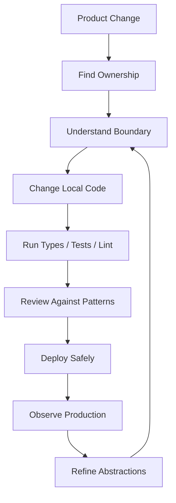
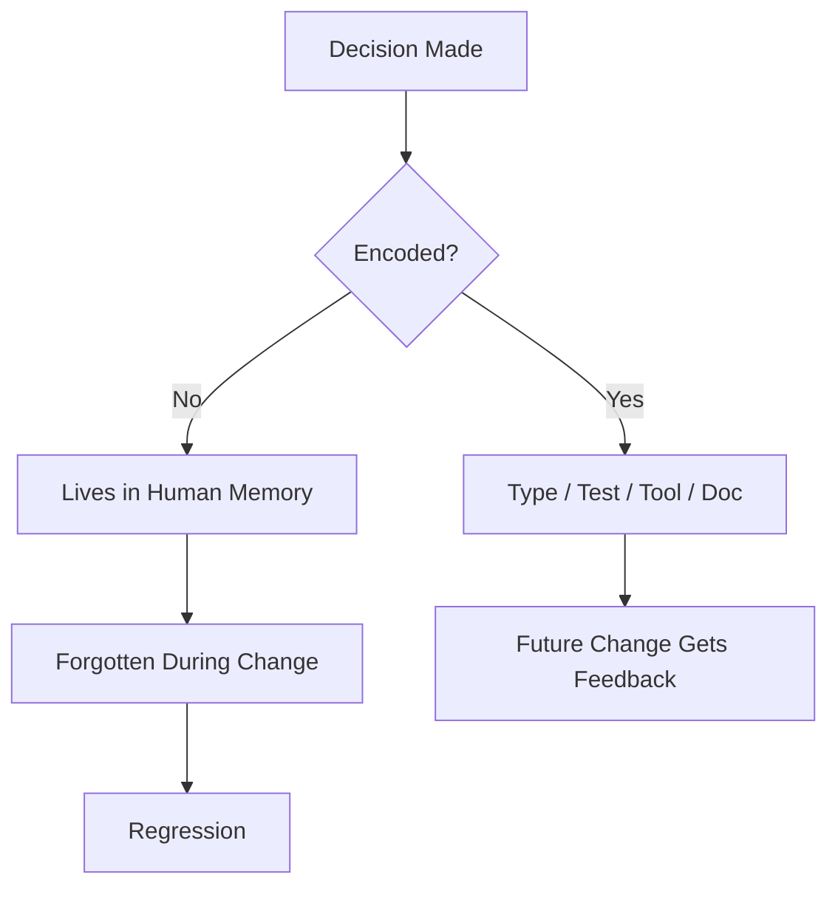
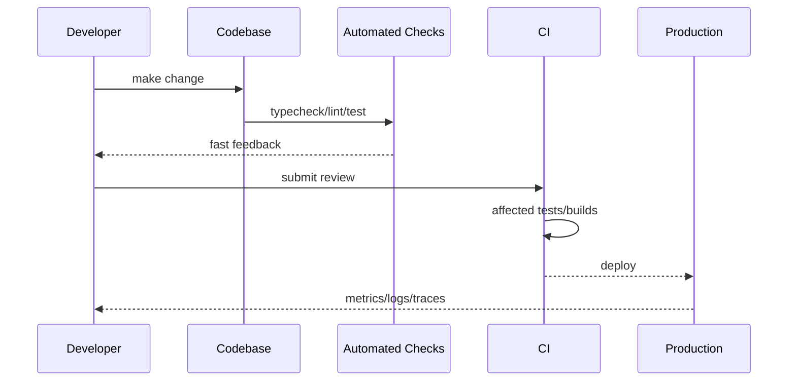
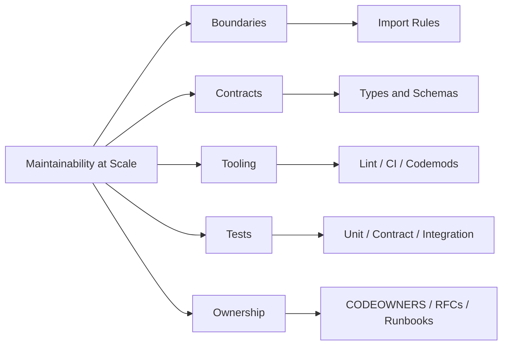
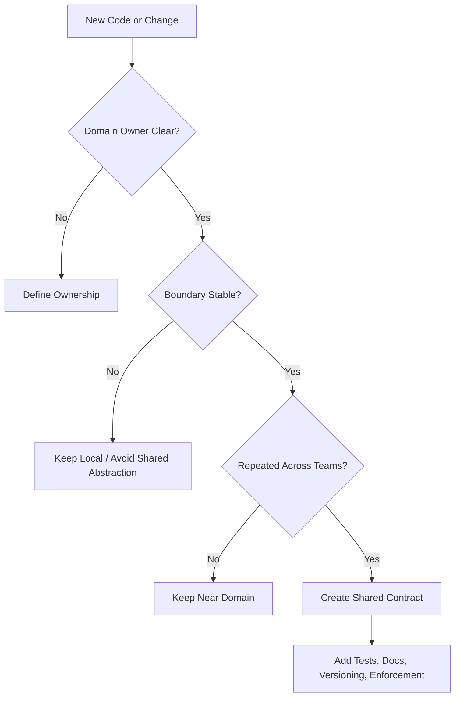

# 001.04.03 Maintainability at Scale

Category: JavaScript Core<br>
Topic: 001.04 Production JavaScript

Maintainability at scale is the ability for a JavaScript codebase to keep changing safely as product surface, traffic, team count, runtime environments, and historical complexity grow.

At small scale, maintainability can look like "the code is readable." At production scale, it becomes a system of contracts, boundaries, tests, tools, ownership, migration paths, observability, and engineering habits that prevent the codebase from turning every change into archaeology.

---

## 1. Definition

Maintainability at scale means a JavaScript system remains understandable, modifiable, testable, observable, and evolvable even when:

- many engineers change it concurrently,
- business rules evolve,
- modules depend on each other,
- frameworks and runtimes upgrade,
- production incidents require fast debugging,
- old and new behavior must coexist during migrations,
- and the codebase is too large for any one person to fully remember.

One-line definition:

- Maintainability at scale is designing JavaScript code so future change is safe, local, and explainable.

Expanded explanation:

- Maintainability is not only clean syntax.
- It includes module boundaries, dependency direction, naming, type contracts, tests, build rules, lint rules, documentation, release strategy, and ownership.
- A maintainable system makes correct changes easier than incorrect changes.
- A scalable maintainability strategy assumes humans are fallible and code history is messy.

In Staff/Principal engineering, maintainability is treated as an architectural quality attribute, not personal taste.

---

## 2. Why It Exists

Maintainability at scale exists because software cost shifts over time.

Early in a project:

- speed matters,
- one person may hold the full mental model,
- local decisions are cheap,
- duplication may be tolerable.

Later in production:

- dozens of teams touch the same paths,
- hidden coupling blocks releases,
- tests become slow or flaky,
- dependencies age,
- types drift away from runtime truth,
- migrations take months,
- incidents expose unclear ownership,
- "simple change" becomes risky.

This topic solves:

- change risk,
- knowledge loss,
- accidental coupling,
- unbounded complexity,
- inconsistent patterns,
- slow onboarding,
- unsafe refactoring,
- fragile deployments,
- and production debugging pain.

Why JavaScript needs special attention:

- JavaScript is highly flexible, so architecture can decay quietly.
- Runtime behavior often permits invalid shapes until production.
- Ecosystem churn is high.
- Frontend and Node projects often mix UI, domain, API, build, and runtime concerns.
- Dynamic imports, bundling, transpilation, and package boundaries can hide dependency problems.

The purpose is not to freeze the codebase. The purpose is to make change cheaper and safer.

---

## 3. Syntax & Variants

Maintainability is expressed through many code and repo shapes rather than one syntax feature.

### Module boundaries

```ts
// Good: callers depend on a stable capability.
import { calculateInvoiceTotal } from "@/billing/domain/calculateInvoiceTotal";

// Risky: caller reaches into internal implementation.
import { taxRulesCache } from "@/billing/internal/taxRulesCache";
```

The first import communicates a domain capability. The second import couples the caller to internals.

### Public API barrels

```ts
// billing/index.ts
export { calculateInvoiceTotal } from "./domain/calculateInvoiceTotal";
export type { Invoice, InvoiceLine } from "./domain/types";
```

Good barrels expose stable public contracts. Bad barrels export everything and erase boundaries.

### Type contracts

```ts
type PaymentStatus =
  | { kind: "pending"; createdAt: string }
  | { kind: "authorized"; authorizationId: string }
  | { kind: "failed"; reason: string };

function labelForStatus(status: PaymentStatus): string {
  switch (status.kind) {
    case "pending":
      return "Pending";
    case "authorized":
      return "Authorized";
    case "failed":
      return `Failed: ${status.reason}`;
  }
}
```

Discriminated unions make states explicit and reduce impossible-state bugs.

### Runtime validation at boundaries

```ts
import { z } from "zod";

const CheckoutRequestSchema = z.object({
  cartId: z.string().min(1),
  couponCode: z.string().optional(),
});

export function parseCheckoutRequest(input: unknown) {
  return CheckoutRequestSchema.parse(input);
}
```

TypeScript types disappear at runtime. External input still needs runtime validation.

### Dependency direction rules

```text
ui -> application -> domain
api -> application -> domain
infrastructure -> application/domain through interfaces
domain -> no framework imports
```

Directional rules prevent low-level or stable modules from depending on volatile UI/framework code.

### Lint and architecture constraints

```js
// eslint rule shape, simplified
{
  "rules": {
    "no-restricted-imports": ["error", {
      "patterns": ["@/billing/internal/*"]
    }]
  }
}
```

Maintainability at scale usually needs automated constraints. Code review alone does not scale.

### Documentation near decisions

```ts
/**
 * We keep invoice calculation pure because checkout, renewal, and admin preview
 * all share this logic. Side effects belong in application services.
 */
export function calculateInvoiceTotal(invoice: Invoice): Money {
  // ...
}
```

Comments should explain durable "why," not repeat "what."

---

## 4. Internal Working

Maintainability at scale works through feedback loops and constraints.

### Maintainability lifecycle



If any step is slow, unclear, or manual-only, maintainability degrades.

### Engine-level relevance

Maintainability is mostly architectural, but it still touches JavaScript runtime behavior:

- unclear object shapes can create hidden class churn,
- accidental mutation makes closures and async flows harder to reason about,
- unbounded module side effects make startup order fragile,
- circular imports create partially initialized modules,
- large shared utilities increase bundle size and cold-start time,
- dynamic property access weakens type and tooling support,
- global mutable state makes tests and concurrent execution brittle.

### Codebase scaling mechanism

```text
Many engineers
  -> many local decisions
  -> inconsistent patterns
  -> harder review
  -> slower changes
  -> more duplication
  -> more fear of refactoring
  -> more patches on top
  -> lower maintainability
```

The antidote:

```text
Clear boundaries
  -> explicit contracts
  -> automated checks
  -> focused tests
  -> documented decisions
  -> safe migrations
  -> faster changes
```

### Staff-level internal questions

- Where is the stable domain boundary?
- Which modules are allowed to know about each other?
- Which dependencies are volatile?
- What contract protects callers?
- What can be changed locally?
- What requires migration?
- What is enforced by tooling instead of memory?
- What will break during a framework/runtime upgrade?

---

## 5. Memory Behavior

Maintainability affects runtime memory and human memory.

### Runtime memory risks

Poor maintainability often creates memory problems indirectly:

- global registries that never clear,
- module-level caches without ownership,
- event listeners added in scattered places,
- repeated data transformations across layers,
- shared mutable objects retained by closures,
- singleton services that accumulate request state,
- duplicated dependencies in bundles,
- large utility imports that pull unused code.

Example:

```ts
// Risky: request-specific state leaks into module scope.
const seenUsers = new Set<string>();

export function trackUser(userId: string) {
  seenUsers.add(userId);
}
```

Better:

```ts
export function createUserTracker() {
  const seenUsers = new Set<string>();

  return {
    track(userId: string) {
      seenUsers.add(userId);
    },
    reset() {
      seenUsers.clear();
    },
  };
}
```

The better version gives state a lifecycle owner.

### Human memory risks

Humans cannot remember:

- every convention,
- every hidden dependency,
- every edge case,
- every migration rule,
- every production incident lesson.

Maintainable systems encode memory into:

- types,
- tests,
- lint rules,
- generated clients,
- schema validation,
- architecture decision records,
- runbooks,
- ownership metadata,
- package boundaries.

### Memory model for maintainability



Staff-level insight:

- Good maintainability reduces reliance on hero memory.

---

## 6. Execution Behavior

Maintainability shows up when code changes execute through the delivery system.

### Change execution path

```text
Developer edits code
  -> local typecheck/lint/test
  -> affected project detection
  -> code review
  -> CI
  -> deploy
  -> runtime telemetry
  -> incident or success learning
```

If feedback is delayed, developers take bigger risks.

### Runtime execution risks from poor maintainability

#### Circular imports

```ts
// a.ts
import { bValue } from "./b";
export const aValue = bValue + 1;

// b.ts
import { aValue } from "./a";
export const bValue = aValue + 1;
```

Circular dependencies can produce partially initialized values, `undefined`, or fragile ordering behavior depending on module system and transpilation.

#### Module side effects

```ts
// metrics.ts
registerGlobalMetricExporter();

export function recordMetric() {
  // ...
}
```

Importing this module changes global process behavior. That makes tests, startup, and reuse harder.

Better:

```ts
export function createMetricsClient(config: MetricsConfig) {
  return new MetricsClient(config);
}
```

#### Hidden async behavior

```ts
export function saveUser(user: User) {
  auditUserChange(user); // fire-and-forget hidden side effect
  return userRepository.save(user);
}
```

Hidden side effects make retries, tests, and failure handling unclear.

Better:

```ts
export async function saveUser(user: User, audit: AuditSink) {
  const saved = await userRepository.save(user);
  await audit.record({ type: "user_saved", userId: saved.id });
  return saved;
}
```

### Execution diagram



Maintainability at scale depends on this loop being trustworthy.

---

## 7. Scope & Context Interaction

Maintainability is mostly about controlling scope.

### Lexical and module scope

Module scope is convenient, but it can become accidental global state.

```ts
let currentTenantId: string | undefined;

export function setTenant(id: string) {
  currentTenantId = id;
}

export function getTenant() {
  return currentTenantId;
}
```

This is risky in Node servers because concurrent requests can interleave and read the wrong tenant.

Better:

```ts
type RequestContext = {
  tenantId: string;
};

export function getTenant(context: RequestContext) {
  return context.tenantId;
}
```

Passing context explicitly improves testability and concurrency safety.

### Ownership scope

Every important module needs an owner:

- who approves changes,
- who handles incidents,
- who owns migrations,
- who decides deprecation,
- who understands domain rules.

Ownership can be encoded in:

- CODEOWNERS,
- package metadata,
- docs,
- team service catalog,
- architecture review records.

### Abstraction scope

Abstractions fail when their scope is wrong.

Too narrow:

- duplicates logic in many places.

Too broad:

- becomes a generic utility nobody can safely change.

Good abstraction:

- has a clear domain purpose,
- hides volatile details,
- exposes stable behavior,
- has tests at the contract boundary,
- has a known owner.

### Context boundary questions

- Is this code request-scoped, process-scoped, tenant-scoped, or global?
- Is this utility truly generic or domain-specific?
- Can this module be imported by frontend and backend safely?
- Does this code rely on browser-only or Node-only globals?
- Does this function mutate inputs?
- Does this abstraction make illegal states impossible or just move them?

---

## 8. Common Examples

### Example 1: Replacing boolean flags with explicit state

Problem:

```ts
type UploadState = {
  loading: boolean;
  success: boolean;
  error?: string;
};
```

This permits impossible combinations:

```ts
{ loading: true, success: true, error: "failed" }
```

Better:

```ts
type UploadState =
  | { kind: "idle" }
  | { kind: "uploading"; progress: number }
  | { kind: "success"; fileId: string }
  | { kind: "failed"; error: string };
```

Maintainability gain:

- state transitions become explicit,
- UI rendering becomes safer,
- future states are easier to add,
- tests can cover each variant.

### Example 2: Keeping domain logic pure

```ts
export function calculateDiscount(cart: Cart, rules: DiscountRule[]): Money {
  return rules.reduce((total, rule) => {
    return total.add(applyRule(cart, rule));
  }, Money.zero(cart.currency));
}
```

Pure domain functions are easier to:

- test,
- reuse,
- profile,
- move between frontend/backend,
- reason about in incidents.

Avoid mixing domain calculation with I/O:

```ts
export async function calculateDiscount(cart: Cart) {
  const rules = await fetchRules();
  await logger.info({ cartId: cart.id });
  return applyRules(cart, rules);
}
```

This version is harder to test and reuse because calculation is tied to fetching and logging.

### Example 3: Enforcing import boundaries

```text
src/
  billing/
    index.ts
    domain/
    application/
    infrastructure/
    internal/
  checkout/
    index.ts
```

Allowed:

```ts
import { calculateInvoiceTotal } from "@/billing";
```

Blocked:

```ts
import { taxRulesCache } from "@/billing/internal/taxRulesCache";
```

Maintainability gain:

- internals can change without breaking callers,
- review surface is smaller,
- migrations become possible.

### Example 4: Centralizing environment access

Problem:

```ts
const timeoutMs = Number(process.env.PAYMENT_TIMEOUT_MS ?? 3000);
```

Scattered environment access causes inconsistent defaults and testing pain.

Better:

```ts
type AppConfig = {
  paymentTimeoutMs: number;
  redisUrl: string;
};

export function loadConfig(env: NodeJS.ProcessEnv): AppConfig {
  return {
    paymentTimeoutMs: Number(env.PAYMENT_TIMEOUT_MS ?? 3000),
    redisUrl: required(env.REDIS_URL, "REDIS_URL"),
  };
}
```

Maintainability gain:

- one validation boundary,
- safer tests,
- clearer deployment requirements.

### Example 5: Making migrations explicit

```ts
export async function getCustomer(id: string, flags: FeatureFlags) {
  if (flags.useCustomerV2) {
    return customerV2Client.getCustomer(id);
  }

  return customerV1Client.getCustomer(id);
}
```

Migration code should include:

- owner,
- rollout plan,
- telemetry,
- rollback behavior,
- removal date or cleanup issue.

Temporary compatibility code becomes permanent unless it has an exit path.

---

## 9. Confusing / Tricky Examples

### Trap 1: "DRY" creates harmful coupling

```ts
export function formatStatus(status: string) {
  if (status === "PENDING") return "Pending";
  if (status === "FAILED") return "Failed";
  return "Unknown";
}
```

This may look reusable, but billing status, shipment status, and user verification status may evolve differently.

Better question:

- Are these the same concept or just the same spelling today?

### Trap 2: Generic utilities become dumping grounds

```text
utils/
  format.ts
  object.ts
  async.ts
  data.ts
  helpers.ts
```

Problems:

- unclear ownership,
- broad imports,
- accidental coupling,
- hard refactoring,
- tree-shaking surprises.

Better:

- keep utilities near their domain until multiple real consumers prove shared ownership is needed.

### Trap 3: TypeScript type safety is mistaken for runtime safety

```ts
type User = {
  id: string;
  role: "admin" | "member";
};

const user = JSON.parse(requestBody) as User;
```

The cast silences the compiler but validates nothing.

Better:

```ts
const user = UserSchema.parse(JSON.parse(requestBody));
```

### Trap 4: Barrel files hide dependency cost

```ts
import { Button } from "@/ui";
```

If `@/ui` exports every component and has side effects, importing one button may pull far more code than expected.

### Trap 5: Refactoring without characterization tests

When legacy behavior is unclear, tests should first capture current behavior. Otherwise, refactoring becomes accidental redesign.

### Trap 6: "Temporary" compatibility paths never die

```ts
if (flags.legacyCheckoutMode || user.createdAt < "2022-01-01") {
  return legacyCheckout(user);
}
```

Without telemetry and cleanup ownership, this branch can survive for years and block future simplification.

---

## 10. Real Production Use Cases

### Large frontend application

Maintainability concerns:

- route ownership,
- shared component APIs,
- state management boundaries,
- design system adoption,
- bundle boundaries,
- feature flag cleanup,
- accessibility regression tests,
- framework upgrade path.

Production example:

- A checkout team changes shared form validation and accidentally breaks signup because both imported a generic `validateForm` helper with hidden assumptions.

Maintainable approach:

- domain-specific validators,
- shared primitive validation helpers,
- contract tests for public form APIs,
- ownership on shared packages.

### Node.js backend service

Maintainability concerns:

- request context,
- schema validation,
- domain/application/infrastructure separation,
- retry and timeout policies,
- logging conventions,
- error taxonomy,
- dependency client ownership.

Production example:

- A team adds payment retry logic inside a repository method. Later, another caller retries the same operation and creates duplicate charges.

Maintainable approach:

- idempotency boundary,
- explicit application service orchestration,
- typed error contract,
- documented retry ownership.

### Monorepo

Maintainability concerns:

- package graph,
- affected builds,
- boundary enforcement,
- shared tooling,
- versioning strategy,
- dependency deduplication,
- code ownership.

Production example:

- A shared package change triggers every CI job, making small pull requests wait an hour.

Maintainable approach:

- smaller packages,
- affected test detection,
- stable public APIs,
- dependency graph rules.

### Long-running migration

Maintainability concerns:

- old and new behavior coexist,
- feature flags,
- telemetry,
- data compatibility,
- rollout sequencing,
- cleanup.

Production example:

- A customer model migrates from `fullName` to `{ firstName, lastName }`, but both shapes leak into UI and APIs.

Maintainable approach:

- compatibility adapter at boundary,
- explicit domain model,
- migration dashboard,
- codemod,
- removal milestone.

### Incident response

Maintainability concerns:

- can responders find the owner?
- can they identify the boundary?
- can they roll back safely?
- can logs/traces explain the path?
- can they patch without understanding the entire system?

Maintainability is tested most honestly during incidents.

---

## 11. Interview Questions

### Basic

1. What does maintainability mean beyond code readability?
2. Why can global mutable state hurt maintainability?
3. What is a module boundary?
4. Why are runtime validation and TypeScript types both useful?
5. What makes an abstraction good?

### Intermediate

1. How would you structure a large JavaScript codebase for multiple teams?
2. How do you prevent forbidden imports across domains?
3. How do circular dependencies affect JavaScript modules?
4. How would you migrate a large API contract safely?
5. How do tests support maintainability without making change slow?

### Advanced

1. How do you decide whether duplication should be removed or preserved?
2. How would you reduce build and test time in a monorepo?
3. How do you prevent a shared package from becoming a bottleneck?
4. How do you design code so feature flags can be removed later?
5. How do you balance local team autonomy with architecture governance?

### Tricky

1. When is DRY harmful?
2. When is a generic utility worse than duplication?
3. Why can a barrel file damage maintainability?
4. Why can strong TypeScript types still allow production bugs?
5. How can a "clean" abstraction increase incident risk?

Strong answers should mention:

- ownership,
- boundaries,
- automated enforcement,
- migration strategy,
- runtime safety,
- production debugging,
- and trade-offs.

---

## 12. Senior-Level Pitfalls

### Pitfall 1: Over-abstracting too early

Premature abstraction hides differences that are not yet understood.

Senior correction:

- tolerate small duplication until stable patterns emerge,
- abstract around domain behavior, not visual similarity,
- keep escape hatches for migration.

### Pitfall 2: Under-investing in boundaries

Without boundaries, every module can import every other module.

Senior correction:

- define public APIs,
- restrict internal imports,
- measure dependency graph health,
- enforce rules in CI.

### Pitfall 3: Treating code review as the only quality gate

Humans miss repetitive architectural violations.

Senior correction:

- move repeatable rules into lint, typecheck, tests, dependency constraints, generators, or templates.

### Pitfall 4: Letting shared packages become organizational bottlenecks

Shared code without clear ownership becomes slow and politically expensive.

Senior correction:

- assign owners,
- publish contracts,
- version breaking changes,
- keep shared surfaces small,
- create migration guides.

### Pitfall 5: Ignoring deletion work

Feature flags, adapters, compatibility paths, and old APIs accumulate.

Senior correction:

- define cleanup criteria,
- track dead code,
- remove flags after rollout,
- monitor unused exports.

### Pitfall 6: Making tests too broad

End-to-end tests catch real integration bugs, but too many broad tests make feedback slow and flaky.

Senior correction:

- use a balanced test pyramid,
- test contracts at boundaries,
- keep pure domain logic unit-testable,
- reserve E2E for critical flows.

### Pitfall 7: Allowing unowned platform decisions

Build tools, lint rules, package managers, and runtime versions affect everyone.

Senior correction:

- treat platform choices as architecture,
- use RFCs for broad changes,
- communicate migration timelines,
- provide automated fixes where possible.

---

## 13. Best Practices

### Code structure

- Organize around domain capabilities, not only technical layers.
- Keep public APIs explicit.
- Avoid deep imports into internals.
- Keep side effects at application boundaries.
- Prefer pure functions for domain rules.
- Keep request-specific state out of module globals.
- Name modules after behavior, not implementation trivia.

### Type and runtime safety

- Use TypeScript to model impossible states out of the program.
- Validate external input at runtime.
- Avoid broad `any`, unsafe casts, and type assertions at boundaries.
- Use discriminated unions for state machines.
- Keep generated API types aligned with schemas.

### Testing

- Unit test pure domain logic.
- Integration test important boundaries.
- Contract test shared APIs.
- Add characterization tests before risky legacy refactors.
- Keep tests deterministic and fast.
- Track flaky tests as production risk.

### Tooling

- Enforce import boundaries.
- Use formatters to remove style debates.
- Use lint rules for common pitfalls.
- Use dependency graph tools.
- Use codemods for large mechanical migrations.
- Use affected builds/tests in monorepos.
- Keep CI feedback fast.

### Documentation

- Document why decisions were made.
- Keep docs close to code when they explain local behavior.
- Use ADRs/RFCs for broad architecture decisions.
- Maintain runbooks for operational paths.
- Include examples in public package docs.

### Operational maintainability

- Standardize logging fields.
- Use bounded metric labels.
- Keep error taxonomy consistent.
- Preserve correlation IDs.
- Make ownership discoverable.
- Make rollbacks routine.

---

## 14. Debugging Scenarios

### Scenario 1: A small change breaks unrelated pages

Symptoms:

- A checkout validation change breaks signup and admin invite flows.
- All three used a shared `validateUserInput` helper.

Debugging flow:

```text
Find changed helper
  -> inspect all consumers
  -> identify hidden domain assumptions
  -> add regression tests for affected flows
  -> split domain-specific behavior
  -> keep only primitive shared helpers
```

Root cause:

- shared abstraction mixed unrelated domains.

Prevention:

- keep domain validation near domain,
- use contracts,
- avoid premature DRY.

### Scenario 2: Circular import causes production-only undefined

Symptoms:

- App works in dev but fails after production bundling.
- Error says a function is not defined during module initialization.

Debugging flow:

```text
Inspect stack trace
  -> map bundled frame through source maps
  -> run dependency graph check
  -> find import cycle
  -> move shared types/constants to independent module
  -> remove module-level side effect
```

Root cause:

- circular dependency with initialization order sensitivity.

Prevention:

- dependency graph checks,
- smaller modules,
- no side effects during import.

### Scenario 3: Refactor causes duplicate payment

Symptoms:

- Payment charge occasionally happens twice.
- Recent refactor moved retry logic to a lower-level client.

Debugging flow:

```text
Trace payment request
  -> inspect retry layers
  -> check idempotency key generation
  -> compare old and new orchestration
  -> add contract test for one logical charge
```

Root cause:

- retry ownership became unclear.

Prevention:

- explicit idempotency boundary,
- application-level orchestration,
- typed operation contracts.

### Scenario 4: CI becomes too slow for normal work

Symptoms:

- Pull requests wait 60 minutes.
- Developers batch risky changes to avoid CI pain.

Debugging flow:

```text
Measure CI stages
  -> identify slowest jobs
  -> inspect affected project graph
  -> split packages or test suites
  -> cache dependencies/build outputs
  -> quarantine flaky tests
```

Root cause:

- codebase changed faster than delivery architecture.

Prevention:

- affected tests,
- package graph hygiene,
- fast local checks,
- ownership of CI health.

### Scenario 5: Feature flag cleanup blocks new architecture

Symptoms:

- New checkout model cannot ship because old flags still branch deep inside domain code.

Debugging flow:

```text
Inventory flags
  -> check production usage
  -> identify dead branches
  -> delete fully rolled-out paths
  -> move temporary compatibility to boundary
  -> add cleanup owner for remaining flags
```

Root cause:

- temporary migration code lacked lifecycle management.

Prevention:

- flag owner,
- expiration,
- telemetry,
- cleanup task,
- compatibility isolated at boundaries.

---

## 15. Exercises / Practice

### Exercise 1: Replace impossible state

Refactor this type:

```ts
type RequestState = {
  loading: boolean;
  data?: User[];
  error?: Error;
};
```

Tasks:

- convert it to a discriminated union,
- write a render function using exhaustive checking,
- explain how it improves maintainability.

### Exercise 2: Find boundary violations

Given:

```ts
import { db } from "@/shared/db";
import { formatCurrency } from "@/shared/utils";
import { internalTaxRules } from "@/billing/internal/tax";
import { Button } from "@/ui";
```

Tasks:

- identify which imports are suspicious,
- explain what boundary each may violate,
- propose safer public APIs.

### Exercise 3: Split a harmful utility

```ts
export function normalizeStatus(status: string) {
  return status.trim().toUpperCase();
}
```

This is used by orders, users, payments, and shipments.

Tasks:

- decide whether it should stay shared,
- identify domain-specific behavior that may diverge,
- propose a safer structure.

### Exercise 4: Make a migration plan

You need to rename `customer.fullName` to `customer.name.display`.

Tasks:

- define compatibility boundary,
- define telemetry,
- define codemod target,
- define rollout sequence,
- define cleanup criteria.

### Exercise 5: Debug module state

```ts
let activeRequestId: string | undefined;

export async function handle(request: Request) {
  activeRequestId = request.id;
  await doWork();
  logger.info({ requestId: activeRequestId });
}
```

Tasks:

- explain the concurrency bug,
- rewrite using explicit context,
- describe how a test could catch it.

---

## 16. Comparison

### Local utility vs shared package

| Option | Best When | Strength | Risk |
| --- | --- | --- | --- |
| Local utility | One domain owns behavior | Easy to change | Some duplication |
| Shared package | Multiple domains need same stable contract | Consistency | Bottleneck and coupling |
| Platform primitive | Many teams need enforced standard | Strong leverage | Higher governance cost |

### Duplication vs abstraction

| Dimension | Duplication | Abstraction |
| --- | --- | --- |
| Early change | Often easier | May be premature |
| Domain divergence | Safe if concepts differ | Risky if concepts differ |
| Consistency | Manual | Built in |
| Refactoring | Multiple sites | One shared site |
| Failure mode | repeated bugs | widespread coupled bug |

### Type safety vs runtime validation

| Concern | TypeScript Types | Runtime Validation |
| --- | --- | --- |
| Compile-time feedback | Strong | Limited |
| External input safety | Not enough alone | Strong |
| Runtime cost | None | Some |
| Documentation value | High | High |
| Production protection | Indirect | Direct |

### Layered architecture vs feature slices

| Structure | Strength | Risk |
| --- | --- | --- |
| Technical layers | Familiar, centralized infrastructure | Domain logic spreads across layers |
| Feature slices | Domain ownership is clear | Shared patterns can diverge |
| Hybrid | Balances domain ownership and shared infrastructure | Needs discipline and tooling |

### Manual convention vs automated enforcement

| Approach | Strength | Risk |
| --- | --- | --- |
| Written convention | Easy to start | People forget |
| Code review | Human judgment | Inconsistent at scale |
| Lint/type/test rule | Repeatable | Needs maintenance |
| Generator/template | Guides new code | Can fossilize bad patterns |

---

## 17. Related Concepts

Maintainability at Scale connects to:

- `001.01.02 Scope, Closures, and Hoisting`: hidden state and closures affect maintainability.
- `001.03.03 Modules and Bundling Boundaries`: import boundaries, circular imports, and bundle cost.
- `001.04.01 Error Handling`: consistent error contracts improve debugging and change safety.
- `001.04.02 Performance Profiling`: maintainable systems are easier to measure and optimize.
- TypeScript Structural Typing: public contracts and safe refactors.
- Frontend Architecture: feature ownership, component boundaries, and state placement.
- Clean Architecture: dependency direction and domain isolation.
- Monorepo Architecture: package boundaries, affected builds, and ownership.
- Refactoring: safe change techniques.
- Documentation and RFC Writing: decision memory.

Knowledge graph:



---

## Advanced Add-ons

### Performance Impact

Maintainability choices affect performance:

- clear module boundaries improve tree-shaking,
- small packages reduce rebuild scope,
- stable APIs reduce duplicate compatibility code,
- pure functions are easier to profile and optimize,
- excessive abstraction can add call overhead, bundle weight, and indirection,
- broad shared packages can increase cold-start and browser bundle size,
- slow tests and CI reduce delivery throughput.

Performance questions:

- Does this abstraction add runtime work or only compile-time structure?
- Does this package pull extra code into critical bundles?
- Does this pattern make profiling easier or harder?
- Does this test strategy keep feedback fast?
- Does this migration create duplicate work on hot paths?

### System Design Relevance

Maintainability is system design at codebase scale.

It maps to architecture through:

- service boundaries,
- domain ownership,
- API contracts,
- versioning,
- compatibility,
- deployment independence,
- incident ownership,
- migration strategy,
- platform standards.

Decision framework:



Staff-level principle:

- Scale is not only requests per second. Scale is also number of engineers, number of changes, number of dependencies, and number of years the system must survive.

### Security Impact

Maintainability affects security because unclear code hides trust boundaries.

Security risks from poor maintainability:

- validation scattered across callers,
- unsafe casts at API boundaries,
- inconsistent authorization checks,
- global state leaking tenant context,
- hidden side effects bypassing audit trails,
- dependency sprawl increasing vulnerable packages,
- unclear ownership delaying patching,
- logs exposing sensitive data inconsistently.

Security practices:

- centralize authentication and authorization boundaries,
- validate all external input,
- keep tenant/request context explicit,
- enforce dependency policy,
- document sensitive data flows,
- add security tests for critical contracts,
- make owners visible for vulnerable modules.

### Browser vs Node Behavior

Browser maintainability:

- component boundaries matter,
- state placement affects re-render risk,
- bundle boundaries affect user experience,
- browser-only APIs must be isolated,
- accessibility and design system contracts need enforcement,
- third-party scripts require ownership.

Node maintainability:

- request context must not leak through globals,
- async errors and retries need explicit ownership,
- configuration must be validated at startup,
- long-running process state needs lifecycle control,
- dependency clients need timeouts, cancellation, and telemetry,
- worker and queue logic needs idempotency.

Shared JavaScript concerns:

- module boundaries,
- package versions,
- TypeScript/runtime mismatch,
- circular imports,
- hidden mutation,
- test determinism,
- observability conventions.

### Polyfill / Implementation

Maintainability cannot be polyfilled as a language feature, but you can implement guardrails.

### Example: exhaustive checking helper

```ts
export function assertNever(value: never): never {
  throw new Error(`Unexpected value: ${JSON.stringify(value)}`);
}

type PaymentState =
  | { kind: "pending" }
  | { kind: "authorized"; id: string }
  | { kind: "failed"; reason: string };

export function paymentLabel(state: PaymentState): string {
  switch (state.kind) {
    case "pending":
      return "Pending";
    case "authorized":
      return "Authorized";
    case "failed":
      return `Failed: ${state.reason}`;
    default:
      return assertNever(state);
  }
}
```

### Example: dependency direction test

```ts
type ImportRule = {
  from: string;
  disallow: string[];
};

const rules: ImportRule[] = [
  { from: "src/domain", disallow: ["src/ui", "src/infrastructure"] },
  { from: "src/billing", disallow: ["src/checkout/internal"] },
];
```

A real implementation would parse imports with an AST parser and fail CI when rules are violated.

### Example: migration wrapper

```ts
type CustomerV1 = { id: string; fullName: string };
type CustomerV2 = { id: string; name: { display: string } };

export function toCustomerV2(customer: CustomerV1 | CustomerV2): CustomerV2 {
  if ("name" in customer) {
    return customer;
  }

  return {
    id: customer.id,
    name: { display: customer.fullName },
  };
}
```

Compatibility wrappers should live at boundaries and have removal plans.

---

## 18. Summary

Maintainability at scale is the engineering discipline of making future JavaScript changes safe, local, and explainable.

Quick recall:

- Optimize for future change, not only current readability.
- Keep boundaries explicit.
- Encode decisions into types, tests, tools, and docs.
- Avoid global mutable state and hidden side effects.
- Use runtime validation at external boundaries.
- Treat shared packages as products with owners and contracts.
- Do not abstract just because code looks similar.
- Use automated enforcement for repeatable rules.
- Plan migrations with telemetry and cleanup.
- Make production debugging part of maintainability.

Staff-level takeaway:

- A maintainable codebase is not one with no complexity. It is one where complexity has names, owners, boundaries, tests, and paths for change.
