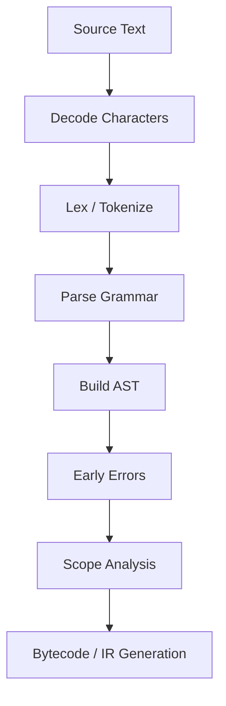
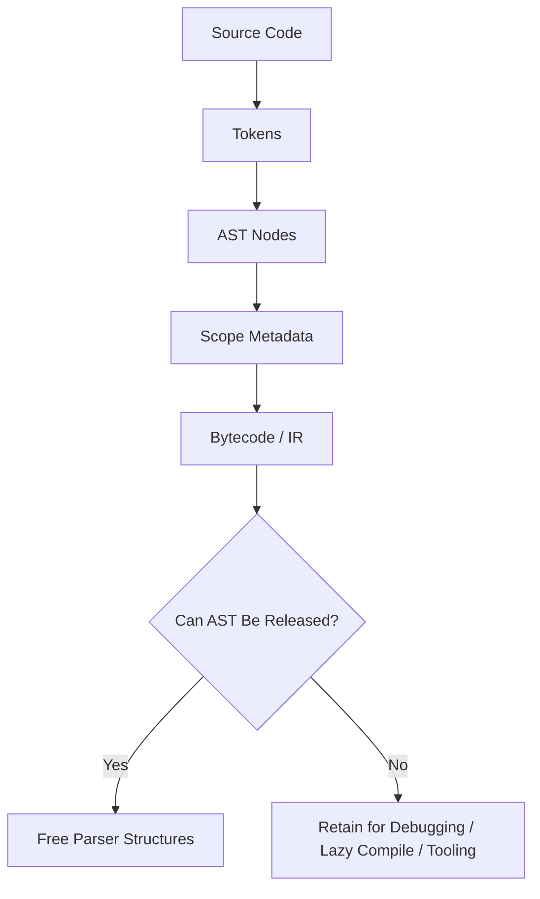
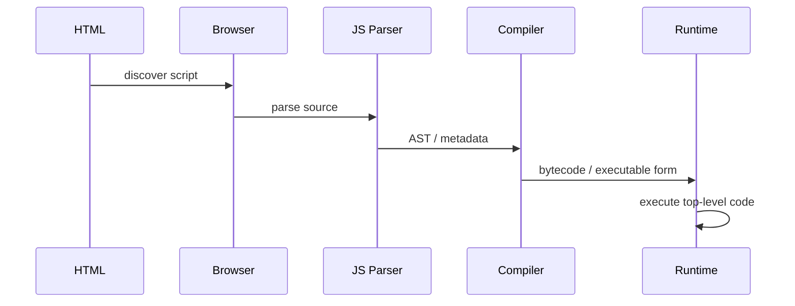
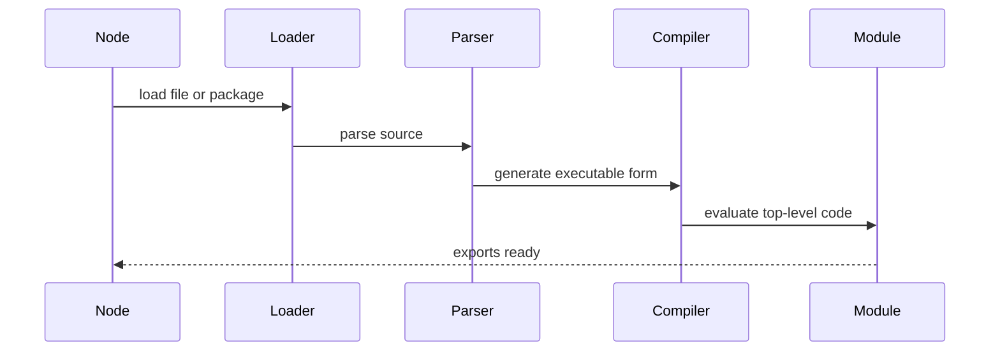
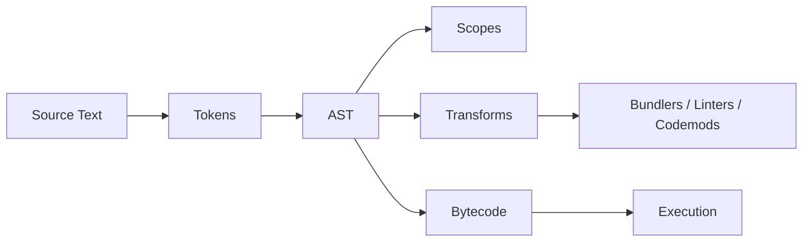
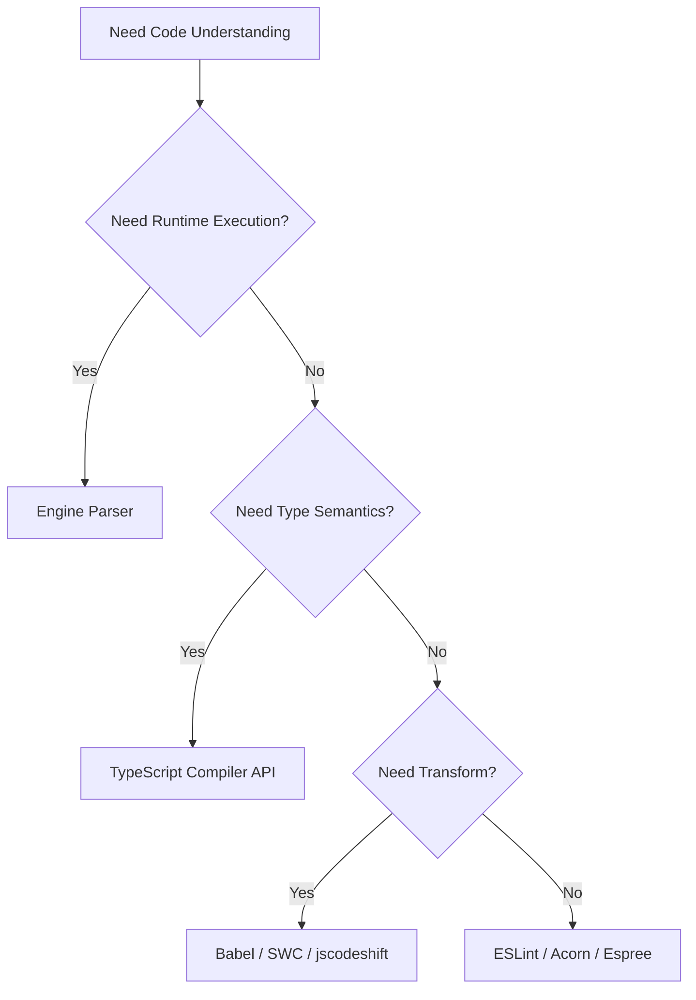

# 002.01.01 Parsing and AST

Category: JavaScript Internals<br>
Topic: 002.01 Engine Architecture

Parsing is the engine phase that turns JavaScript source text into a structured representation the engine can validate, analyze, compile, optimize, and execute. An AST, or Abstract Syntax Tree, is the tree-shaped representation of program structure after the parser understands the source according to the language grammar.

This topic is foundational because every later engine concept depends on it: bytecode, JIT optimization, scope creation, hoisting, module linking, syntax errors, source maps, linting, transpilation, bundling, minification, and many production build failures.

---

## 1. Definition

Parsing is the process of reading JavaScript source code and converting it into structured syntax.

An AST is a tree of nodes that represents the program's syntactic meaning while omitting unnecessary textual details like whitespace and comments unless the parser keeps them as metadata.

One-line definition:

- Parsing turns source text into a validated syntax tree; the AST is the structured form that tools and engines reason about.

Expanded explanation:

- Source text is a sequence of characters.
- Lexing/tokenization groups characters into meaningful tokens.
- Parsing checks token sequences against JavaScript grammar.
- The parser creates nodes such as `Program`, `VariableDeclaration`, `FunctionDeclaration`, `CallExpression`, and `BinaryExpression`.
- Later phases use this structure to create scopes, generate bytecode, perform transformations, report errors, and optimize execution.

Example source:

```js
const total = price * quantity;
```

Simplified AST:

```text
Program
  VariableDeclaration kind="const"
    VariableDeclarator
      Identifier name="total"
      BinaryExpression operator="*"
        Identifier name="price"
        Identifier name="quantity"
```

The AST is not the same as bytecode. AST is syntax structure; bytecode is executable instruction-like representation generated later.

---

## 2. Why It Exists

Parsing exists because engines and tools cannot execute raw text directly.

The engine must answer:

- Is this valid JavaScript?
- Which identifiers are declared?
- Which scopes exist?
- Which constructs are functions, classes, loops, imports, exports, or expressions?
- Which declarations are hoisted?
- Which code can be compiled lazily?
- Which syntax enables strict mode or module semantics?
- Where should errors point in the original source?

ASTs also power tooling:

- TypeScript compilation,
- Babel transforms,
- ESLint rules,
- Prettier formatting,
- bundler dependency analysis,
- tree shaking,
- minification,
- codemods,
- security scanning,
- dead-code detection,
- source map generation.

Why it matters in production:

- Large bundles increase parse and compile time before user code can run.
- Syntax unsupported by a target runtime can crash startup.
- Dynamic imports and lazy routes can defer parse cost.
- Minifiers and transpilers can introduce subtle AST-level behavior changes.
- Incorrect source maps slow incident debugging.
- Build tools fail when parser configuration does not match language features.

Senior-level framing:

- Parsing is both a runtime startup cost and a tooling foundation.

---

## 3. Syntax & Variants

Parsing is shaped by JavaScript syntax, parser goals, and source type.

### Script vs module parsing

```js
// Script goal: allowed in classic scripts.
var x = 1;
```

```js
// Module goal: import/export allowed, strict mode by default.
import { readFile } from "node:fs/promises";
export const x = 1;
```

Important differences:

- modules are strict mode by default,
- top-level `await` is module syntax,
- `import` and `export` are only valid in module parse goal,
- top-level `this` differs between script and module,
- module imports are resolved and linked before evaluation.

### Expression vs statement ambiguity

```js
{} + [];
```

Depending on context, `{}` can be parsed as a block statement rather than an object literal.

To force expression parsing:

```js
({}) + [];
```

### Function declarations vs function expressions

```js
function named() {}

const assigned = function namedExpression() {};
```

They produce different AST shapes and different binding behavior.

### Arrow functions

```js
const double = (x) => x * 2;
```

Arrow functions have concise body syntax and lexical `this`, but the parser must disambiguate parameters from parenthesized expressions.

### Automatic Semicolon Insertion

```js
return
{
  ok: true
};
```

This parses as:

```js
return;
{
  ok: true;
}
```

The parser applies Automatic Semicolon Insertion rules, so syntax can be valid but not mean what a developer intended.

### Optional chaining and nullish coalescing

```js
const city = user.profile?.address?.city ?? "Unknown";
```

Parser support depends on language version. Older parsers fail even if the runtime or transpiler would otherwise handle the code.

### ESTree-style AST node example

Many JavaScript tools use an ESTree-compatible AST shape.

```json
{
  "type": "VariableDeclaration",
  "kind": "const",
  "declarations": [
    {
      "type": "VariableDeclarator",
      "id": { "type": "Identifier", "name": "total" },
      "init": {
        "type": "BinaryExpression",
        "operator": "*",
        "left": { "type": "Identifier", "name": "price" },
        "right": { "type": "Identifier", "name": "quantity" }
      }
    }
  ]
}
```

Engine ASTs are internal and may not match ESTree exactly. Tooling ASTs are public-ish conventions; engine ASTs are optimized implementation details.

---

## 4. Internal Working

Parsing usually follows this conceptual pipeline.



### 1. Character decoding

The engine receives source as bytes or strings and interprets characters. Unicode handling matters because JavaScript identifiers can include many Unicode characters.

Example:

```js
const café = "open";
```

The identifier is valid JavaScript, but tooling must handle encoding correctly.

### 2. Lexical analysis

The lexer groups characters into tokens.

```js
const answer = 40 + 2;
```

Simplified tokens:

```text
Keyword(const)
Identifier(answer)
Punctuator(=)
NumericLiteral(40)
Punctuator(+)
NumericLiteral(2)
Punctuator(;)
```

The lexer must handle:

- comments,
- whitespace,
- string literals,
- template literals,
- numeric separators,
- regex literal ambiguity,
- Unicode escapes,
- JSX or TypeScript syntax when supported by tooling parsers.

### 3. Parsing grammar

The parser checks tokens against ECMAScript grammar.

```js
const = 1;
```

This fails because `const` is a keyword and cannot be used as an identifier in that position.

### 4. AST construction

The parser builds node objects representing syntactic structure.

```text
Program
  body[]
    Statement
    Declaration
    Expression
```

### 5. Early errors

Some errors are not simple token errors. They require contextual validation.

Examples:

```js
"use strict";
delete user.name;
```

Strict mode changes allowed syntax and early error rules.

```js
const x = 1;
const x = 2;
```

Duplicate lexical declarations in the same scope are early errors.

### 6. Scope analysis

The engine identifies declarations and scope relationships:

- global scope,
- module scope,
- function scope,
- block scope,
- catch scope,
- class scope,
- private name scope.

This is where later behavior like TDZ, closures, and hoisting becomes possible.

### Lazy parsing

Engines often parse some function bodies lazily.

```js
function rarelyUsed() {
  // Large function body may be skipped initially.
}
```

Why:

- reduce startup time,
- avoid fully parsing code that never runs,
- improve page load or Node startup.

Trade-off:

- first call may pay deferred parse/compile cost.

### Pre-parsing

A lightweight parser may scan function bodies enough to discover syntax validity, declarations, and metadata without building a full AST for every statement.

This is an implementation optimization, not something JavaScript developers control directly.

---

## 5. Memory Behavior

Parsing allocates memory for tokens, AST nodes, source positions, scopes, literals, and metadata.

### Parse memory flow



### Engine memory behavior

In runtime engines:

- token streams may be temporary,
- AST nodes may be freed after bytecode generation,
- source text may be retained for stack traces and debugging,
- functions may keep metadata for lazy compilation,
- source maps may be kept by tooling or devtools,
- module records retain import/export metadata.

### Tooling memory behavior

Build tools often retain ASTs longer than engines:

- Babel keeps ASTs for transforms,
- ESLint traverses ASTs with scope metadata,
- TypeScript keeps ASTs and symbol tables for type checking,
- bundlers keep module graphs,
- minifiers keep ASTs for optimization and output.

Large codebases can hit memory pressure during:

- typechecking,
- linting,
- bundling,
- source map generation,
- codemods,
- test transpilation.

### Production implications

Browser:

- large JavaScript bundles increase parse memory and startup time,
- low-end mobile devices suffer first,
- code splitting reduces initial parse pressure.

Node:

- startup time increases with large dependency graphs,
- serverless cold starts can suffer from parse/compile cost,
- importing huge packages for one function wastes memory.

### Memory pitfall

```ts
// Tooling script risk: stores every parsed file AST forever.
const allAsts = new Map<string, unknown>();

for (const file of files) {
  allAsts.set(file, parseFile(file));
}
```

Better:

```ts
for (const file of files) {
  const ast = parseFile(file);
  analyze(ast);
  // Let ast become unreachable before processing the next batch.
}
```

Streaming or batching AST work is often necessary for monorepos.

---

## 6. Execution Behavior

Parsing happens before execution, but not always all at once.

### Browser execution timeline



For blocking scripts, parsing and execution can delay page rendering. For module scripts, fetching, parsing, linking, and evaluation follow module semantics.

### Node execution timeline



Node startup can be affected by:

- number of imported modules,
- package size,
- transpiled helper code,
- source map support,
- ESM loader hooks,
- TypeScript runtime transpilation,
- cold filesystem cache.

### Syntax errors happen before runtime

```js
if (true {
  console.log("broken");
}
```

This code cannot start executing because parsing fails.

### Runtime errors happen after parsing

```js
const user = null;
console.log(user.name);
```

This parses successfully but fails during execution.

### Lazy parse execution behavior

```js
console.log("startup");

function later() {
  return expensiveSyntaxTreeToCompile();
}
```

The top-level program must be parsed enough to know `later` exists. The body of `later` may be fully parsed later depending on engine strategy.

### Parse goal affects execution

```js
await fetch("/config");
```

Top-level `await` is valid in modules, not classic scripts. The same text can be valid or invalid depending on parse goal.

---

## 7. Scope & Context Interaction

Parsing creates the structure needed for scope and context analysis.

### Declarations discovered during parsing

```js
function outer() {
  let count = 0;

  return function inner() {
    count += 1;
    return count;
  };
}
```

The parser and later scope analysis identify:

- `outer` in outer scope,
- `count` in function/block scope,
- `inner` function,
- `inner` references `count`,
- closure metadata is needed.

### Hoisting depends on syntactic form

```js
console.log(fn());

function fn() {
  return 1;
}
```

Function declarations and variable declarations have different parse nodes and later binding behavior.

### Block scope

```js
if (enabled) {
  const message = "on";
}
```

The AST includes a `BlockStatement`, and scope analysis creates a lexical environment for `message`.

### `this` behavior depends on node type

```js
const obj = {
  value: 1,
  method() {
    return this.value;
  },
  arrow: () => this.value,
};
```

The parser identifies method syntax and arrow function syntax differently. Later runtime semantics make `this` dynamic for the method and lexical for the arrow.

### Module scope

```js
import { config } from "./config.js";

const value = config.value;
```

Module parsing creates import/export records before evaluation. That enables module linking and live bindings.

### AST context matters

The same token can mean different things in different contexts.

```js
/abc/.test(input);
```

Here `/abc/` is a regex literal.

```js
x / abc / y;
```

Here `/` is division.

The parser and lexer coordinate because token meaning depends on syntactic context.

---

## 8. Common Examples

### Example 1: Inspecting an AST with a parser

Using a tooling parser such as Acorn or Babel parser:

```ts
import { parse } from "acorn";

const ast = parse("const total = price * quantity;", {
  ecmaVersion: "latest",
  sourceType: "module",
});

console.log(ast.type); // Program
```

This is tooling-level parsing, not direct access to V8's private AST.

### Example 2: Finding imports in a file

```ts
type ImportInfo = {
  source: string;
  names: string[];
};

function collectImports(program: any): ImportInfo[] {
  return program.body
    .filter((node: any) => node.type === "ImportDeclaration")
    .map((node: any) => ({
      source: node.source.value,
      names: node.specifiers.map((specifier: any) => specifier.local.name),
    }));
}
```

Bundlers and dependency graph tools use AST-based analysis to find static imports.

### Example 3: ESLint rule shape

```ts
export default {
  meta: {
    type: "problem",
    messages: {
      noConsole: "Avoid console.log in production code.",
    },
  },
  create(context: any) {
    return {
      CallExpression(node: any) {
        if (
          node.callee.type === "MemberExpression" &&
          node.callee.object.name === "console" &&
          node.callee.property.name === "log"
        ) {
          context.report({ node, messageId: "noConsole" });
        }
      },
    };
  },
};
```

Lint rules traverse AST nodes and report patterns.

### Example 4: Codemod transformation

Before:

```ts
oldTrackEvent("checkout_submit", payload);
```

After:

```ts
trackEvent({ name: "checkout_submit", payload });
```

Codemods parse code into AST, transform specific nodes, and print updated source. This is safer than regex for non-trivial code changes.

### Example 5: Tree shaking needs AST

```ts
import { used } from "./lib";

used();
```

Bundlers inspect import/export AST nodes to determine which exports may be removable. Dynamic access and side effects make this harder.

---

## 9. Confusing / Tricky Examples

### Trap 1: Object literal vs block statement

```js
{} + []
```

At statement position, `{}` can parse as an empty block. This is why output can differ from `({}) + []`.

### Trap 2: ASI after `return`

```js
function getUser() {
  return
  {
    id: "u1"
  };
}
```

This returns `undefined`, because a semicolon is inserted after `return`.

### Trap 3: Regex literal vs division

```js
const result = a / b / c;
const match = /b/.test(text);
```

The `/` character is ambiguous until the parser knows the context.

### Trap 4: TypeScript syntax is not JavaScript syntax

```ts
const id: string = "u1";
```

A JavaScript parser without TypeScript support will reject this. Tools must use the correct parser and configuration.

### Trap 5: JSX is not standard JavaScript syntax

```tsx
const element = <Button disabled />;
```

JSX requires a parser extension. Build tools must agree on file extensions and parser settings.

### Trap 6: Minification can change function names

```js
function processPayment() {}
```

After minification, names may become unreadable unless configured. This affects stack traces and profiles.

### Trap 7: Optional chaining parser mismatch

```js
const city = user?.profile?.city;
```

If one tool in the chain uses an older parser, the build fails even if other tools support the syntax.

---

## 10. Real Production Use Cases

### Bundling and dependency graphs

Bundlers parse modules to discover:

- static imports,
- dynamic imports,
- exports,
- side effect boundaries,
- dead code candidates,
- chunk split points.

Production failure:

- a package uses syntax unsupported by the configured parser, causing CI or production build failure.

### Linting architecture rules

AST-based lint rules can enforce:

- no deep imports into internals,
- no restricted browser APIs,
- no unsafe `any`,
- no direct environment access outside config modules,
- no database access from UI packages.

Production value:

- repeated architecture rules become automated instead of relying on code review memory.

### Codemods for migrations

Large migrations use AST transforms:

- changing API names,
- replacing imports,
- converting React class components,
- updating telemetry calls,
- removing deprecated flags,
- moving from CommonJS to ESM.

Production value:

- migration becomes repeatable and reviewable across thousands of files.

### Source maps and incident debugging

Build tools map transformed/minified code back to original source.

Production failure:

- an error stack points to bundled line 1, column 389021, and source maps are missing or wrong.

AST and parser metadata help preserve locations through transformations.

### Security scanning

AST analysis can detect:

- dangerous eval patterns,
- insecure crypto usage,
- raw SQL string concatenation,
- unsanitized DOM sinks,
- hardcoded secrets,
- unsafe deserialization.

Static analysis is not perfect, but it scales better than manual review.

### Serverless cold starts

Large dependency graphs increase parse/compile cost during cold start.

Production value:

- reducing initial imports or using lazy imports can reduce startup latency.

---

## 11. Interview Questions

### Basic

1. What is parsing?
2. What is an AST?
3. How is an AST different from bytecode?
4. What does a tokenizer do?
5. Why does JavaScript need syntax errors before runtime execution?

### Intermediate

1. How do bundlers use ASTs?
2. Why can `return` followed by a newline be dangerous?
3. What is the difference between script and module parsing?
4. Why does TypeScript syntax require a TypeScript-aware parser?
5. How do lint rules use AST traversal?

### Advanced

1. What is lazy parsing, and why do engines use it?
2. How can parse time affect browser performance?
3. Why can dynamic imports improve startup?
4. How can circular imports relate to parse/link/evaluation phases?
5. Why are source locations important for transformations and source maps?

### Tricky

1. Why does `{}` sometimes parse as a block instead of an object?
2. Why is `/` hard for a lexer to classify without parser context?
3. Why can two tools disagree on whether the same file is valid?
4. Why can a codemod based on regex break valid code?
5. Why can a large unused dependency still hurt startup?

Strong answers should move from source text to tokens, grammar, AST, scope analysis, bytecode, and production implications.

---

## 12. Senior-Level Pitfalls

### Pitfall 1: Treating ASTs as stable across parsers

ESTree, Babel, TypeScript, SWC, and engine-internal ASTs differ.

Senior correction:

- know which AST format your tool uses,
- test transforms against real code samples,
- avoid relying on undocumented node shapes.

### Pitfall 2: Regex-based code transformation

Regex cannot reliably understand nested syntax, comments, strings, JSX, TypeScript, or import variants.

Senior correction:

- use AST codemods for structural changes.

### Pitfall 3: Ignoring parser configuration

Wrong `sourceType`, ECMAScript version, JSX flag, or TypeScript plugin can break builds.

Senior correction:

- centralize parser settings,
- align ESLint, TypeScript, Babel/SWC, Jest/Vitest, and bundler configs.

### Pitfall 4: Underestimating parse cost

Large JavaScript payloads cost time before execution starts.

Senior correction:

- measure parse/compile time,
- split code,
- avoid large startup imports,
- ship less JavaScript to low-power clients.

### Pitfall 5: Losing source locations during transforms

Poor transforms make source maps useless.

Senior correction:

- preserve `loc`, `range`, comments, and source map chains where relevant.

### Pitfall 6: Assuming TypeScript type information is in the AST

Basic AST traversal shows syntax. Type relationships require type checker APIs.

Senior correction:

- use TypeScript compiler APIs when semantic type information is needed.

### Pitfall 7: Forgetting module linking happens before evaluation

Imports are discovered and linked before module body execution.

Senior correction:

- understand parse, instantiate/link, and evaluate as separate phases.

---

## 13. Best Practices

### For application engineers

- Keep initial bundles small to reduce parse and compile time.
- Prefer code splitting for rarely used paths.
- Avoid importing large packages on startup for tiny functions.
- Treat syntax target and runtime target as explicit decisions.
- Keep source maps accurate and access-controlled.

### For tooling engineers

- Use AST parsing for structural code changes.
- Choose the parser that matches the code: Babel, TypeScript, SWC, Acorn, Espree.
- Preserve source locations when transforming code.
- Test with real project syntax: JSX, TS, decorators, dynamic imports, top-level await.
- Avoid loading every AST into memory at once for large repos.
- Use visitors/traversal utilities instead of hand-recursing when available.

### For build systems

- Align parser options across tools.
- Fail fast when syntax is unsupported.
- Cache parse/typecheck results where safe.
- Segment work by affected files/packages.
- Watch memory usage during large lint/build jobs.
- Produce usable source maps for production debugging.

### For architecture governance

- Enforce dependency rules with AST-aware linting.
- Use codemods for broad migrations.
- Document supported language features.
- Track bundle parse cost as part of performance budgets.

---

## 14. Debugging Scenarios

### Scenario 1: Build fails on optional chaining

Symptoms:

- CI fails with `Unexpected token ?`.
- Local app works.

Debugging flow:

```text
Find failing tool
  -> check parser version
  -> check ecmaVersion / Babel plugins / SWC config
  -> compare local and CI lockfiles
  -> align parser configuration
```

Root cause:

- one tool in the chain does not support the syntax.

### Scenario 2: Production stack trace points to bundled line 1

Symptoms:

- Error stack says `app.min.js:1:389021`.
- Source maps do not resolve.

Debugging flow:

```text
Check release artifact
  -> verify source map uploaded
  -> verify minifier sourceMappingURL
  -> verify deployment version
  -> verify transform chain preserves mappings
```

Root cause:

- source map chain broken or wrong artifact version.

### Scenario 3: Codemod changes strings accidentally

Symptoms:

- A migration changed `"oldTrackEvent"` inside docs and test fixtures.

Debugging flow:

```text
Inspect transform approach
  -> confirm regex was used
  -> rewrite as AST transform
  -> target CallExpression only
  -> rerun on fixture suite
```

Root cause:

- textual replacement ignored syntax.

### Scenario 4: Browser startup slow after adding dependency

Symptoms:

- No heavy code runs yet, but page becomes slower to interactive.

Debugging flow:

```text
Compare bundle stats
  -> inspect parse/compile time in Performance trace
  -> check imported dependency graph
  -> split or lazy-load rarely used package
```

Root cause:

- parse/compile cost increased due to shipped JavaScript size.

### Scenario 5: ESLint crashes on new syntax

Symptoms:

- App builds but lint fails on decorators or import assertions.

Debugging flow:

```text
Check ESLint parser
  -> check parserOptions
  -> check plugin support
  -> align with TypeScript/Babel config
```

Root cause:

- linter parser does not match project syntax.

---

## 15. Exercises / Practice

### Exercise 1: Draw the AST

Draw a simplified AST for:

```js
const message = user.name ?? "Guest";
```

Include:

- `VariableDeclaration`,
- `VariableDeclarator`,
- `Identifier`,
- `LogicalExpression` or parser-specific equivalent,
- `MemberExpression`,
- `Literal`.

### Exercise 2: Classify errors

For each snippet, decide whether the error is parse-time or runtime:

```js
const = 1;
```

```js
const user = null;
console.log(user.name);
```

```js
import x from "./x.js";
```

Question:

- Does the last snippet depend on script vs module parse goal?

### Exercise 3: ASI prediction

Predict the output:

```js
function value() {
  return
  42;
}

console.log(value());
```

Explain the parser behavior.

### Exercise 4: Write an import collector

Given an ESTree `Program`, write a function that returns every static import source.

Input shape:

```ts
type Program = {
  body: Array<{ type: string; source?: { value: string } }>;
};
```

Expected output for:

```js
import a from "a";
import { b } from "b";
console.log(a, b);
```

```ts
["a", "b"]
```

### Exercise 5: Pick the right parser

Choose a parser for each file:

```text
1. app.js with modern ECMAScript
2. component.tsx with React JSX and TypeScript
3. eslint rule for plain JS
4. Type-aware codemod
5. minifier for browser bundles
```

Explain the trade-offs.

---

## 16. Comparison

### Tokens vs AST vs bytecode

| Representation | What It Contains | Used For | Example |
| --- | --- | --- | --- |
| Tokens | Flat stream of lexical units | Parsing | `Keyword(const)`, `Identifier(x)` |
| AST | Tree of syntax meaning | Analysis, transforms, compilation | `VariableDeclaration` |
| Bytecode | Executable intermediate instructions | Runtime execution | load, add, return-style instructions |

### Parser types

| Parser | Common Use | Strength | Caveat |
| --- | --- | --- | --- |
| Acorn | Fast JS parsing | Small and flexible | Needs plugins for non-standard syntax |
| Espree | ESLint default parser | ESLint compatibility | Follows ESLint needs |
| Babel parser | Transforms and modern syntax | Rich plugin support | AST differs from ESTree in places |
| TypeScript parser | TS syntax and linting | TS-aware syntax support | Type info needs TypeScript checker |
| SWC parser | Fast builds/transforms | Performance | Ecosystem differences |
| Engine parser | Runtime execution | Optimized for engine | Not a public tooling API |

### Parse error vs early error vs runtime error

| Error Type | When Found | Example |
| --- | --- | --- |
| Parse error | Grammar cannot parse tokens | `if (true {}` |
| Early error | Syntax parsed but violates static rule | duplicate `const` in same scope |
| Runtime error | Fails during execution | `null.name` |

### Script vs module

| Dimension | Script | Module |
| --- | --- | --- |
| Strict mode | Optional | Default |
| `import/export` | Invalid | Valid |
| Top-level await | Invalid | Valid in modern modules |
| Top-level `this` | Usually global object in browsers | `undefined` |
| Loading | Classic script semantics | Link before evaluate |

---

## 17. Related Concepts

Parsing and AST connects to:

- `001.01.02 Scope, Closures, and Hoisting`: declarations and scopes are discovered from syntax.
- `001.02.01 Call Stack`: parsed code later becomes executable frames.
- `001.03.03 Modules and Bundling Boundaries`: imports and exports come from module ASTs.
- `002.01.02 Bytecode and JIT`: AST and metadata feed bytecode generation.
- `002.02.01 Execution Contexts`: parse results inform declarations and environments.
- `002.02.02 Lexical Environments`: scope analysis follows syntactic structure.
- Build Tools: Babel, SWC, TypeScript, bundlers, linters, minifiers.
- Performance Profiling: parse/compile time is part of startup cost.
- Refactoring: codemods rely on ASTs.

Knowledge graph:



---

## Advanced Add-ons

### Performance Impact

Parsing cost matters when JavaScript volume is large.

Browser impact:

- more JavaScript means more download, parse, compile, and execute work,
- parse/compile happens before many interactions are ready,
- low-end mobile devices pay much higher cost,
- large framework/runtime bundles can delay interactivity.

Node impact:

- startup time grows with import graph size,
- serverless cold starts are sensitive to parsing and compilation,
- test runners and CLIs can feel slow because they load many modules,
- runtime TypeScript transpilation adds parser and transform cost.

Optimization techniques:

- reduce shipped JavaScript,
- split code by route or feature,
- lazy-load rare paths,
- avoid large startup imports,
- precompile where appropriate,
- cache build artifacts,
- avoid source map work in hot production startup paths.

### System Design Relevance

Parsing and AST influence system design through build and delivery architecture.

Examples:

- A frontend architecture may split routes to reduce initial parse cost.
- A monorepo may use affected-file parsing to avoid linting everything.
- A platform team may provide codemods for migrations.
- A security team may scan ASTs for unsafe sinks.
- A serverless team may reduce cold starts by shrinking dependency graphs.

Decision framework:



### Security Impact

Parsing and ASTs help security, but they also introduce risks.

Security uses:

- static analysis,
- dependency scanning,
- taint analysis,
- unsafe sink detection,
- policy enforcement,
- detecting `eval`, `Function`, and dynamic import patterns.

Risks:

- parser bugs can miss dangerous code,
- unsupported syntax can create blind spots,
- source maps can expose source code,
- code generators can introduce injection bugs,
- AST transforms can remove security checks accidentally.

Secure practice:

- scan the same syntax your app actually uses,
- fail closed when parser support is missing,
- protect source maps,
- review security-sensitive codemods carefully.

### Browser vs Node Behavior

Browser:

- script discovery, fetching, parsing, and execution interact with rendering,
- modules are deferred by default compared with classic blocking scripts,
- parse cost affects time to interactive,
- devtools can show parse/compile time in performance traces.

Node:

- module loading triggers parsing and evaluation,
- CommonJS and ESM have different loader/linking behavior,
- top-level `await` affects module evaluation timing,
- startup and cold-start performance depend on dependency graph size.

Shared:

- syntax support depends on runtime version,
- source maps matter for debugging,
- parse errors happen before user code can run.

### Polyfill / Implementation

You cannot polyfill the engine parser, but you can implement a tiny parser for a small expression grammar to understand the concept.

Example tokenizer:

```ts
type Token =
  | { type: "number"; value: string }
  | { type: "plus"; value: "+" }
  | { type: "star"; value: "*" };

function tokenize(input: string): Token[] {
  const tokens: Token[] = [];
  let i = 0;

  while (i < input.length) {
    const char = input[i];

    if (char === " ") {
      i += 1;
      continue;
    }

    if (char === "+") {
      tokens.push({ type: "plus", value: char });
      i += 1;
      continue;
    }

    if (char === "*") {
      tokens.push({ type: "star", value: char });
      i += 1;
      continue;
    }

    if (/\d/.test(char)) {
      let value = char;
      i += 1;
      while (i < input.length && /\d/.test(input[i])) {
        value += input[i];
        i += 1;
      }
      tokens.push({ type: "number", value });
      continue;
    }

    throw new Error(`Unexpected character: ${char}`);
  }

  return tokens;
}
```

This only tokenizes a tiny subset. A real JavaScript parser must handle the full ECMAScript grammar, Unicode, modules, classes, async syntax, regex ambiguity, ASI, strict mode, and many early errors.

---

## 18. Summary

Parsing and AST are the bridge between JavaScript source text and everything engines and tools can do with that code.

Quick recall:

- Lexing turns characters into tokens.
- Parsing turns tokens into structured syntax.
- AST nodes represent program structure.
- Early errors happen after parsing but before execution.
- Scope analysis uses the parsed structure.
- Engines may parse lazily to reduce startup cost.
- Tooling ASTs are not the same as engine-internal ASTs.
- Bundlers, linters, transpilers, minifiers, and codemods depend on ASTs.
- Parser configuration must match project syntax.
- Large JavaScript bundles increase parse and compile cost.

Staff-level takeaway:

- Understanding parsing lets you debug build failures, source map problems, syntax support issues, codemod risks, bundle startup cost, and the engine pipeline that leads into bytecode and JIT optimization.
