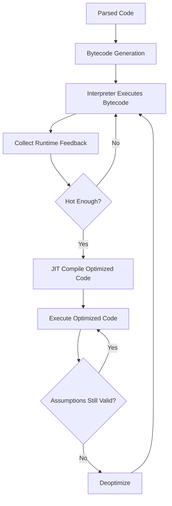
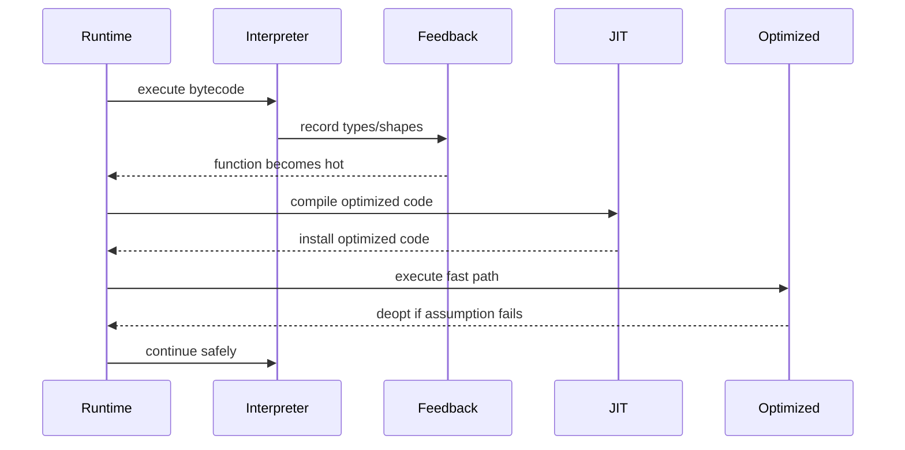
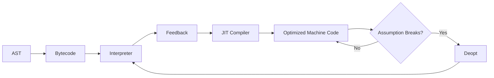
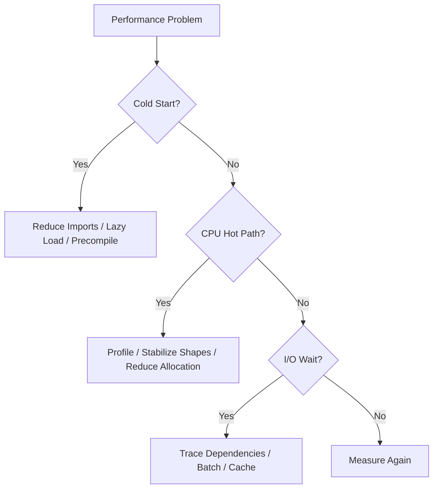

# 002.01.02 Bytecode and JIT

Category: JavaScript Internals<br>
Topic: 002.01 Engine Architecture

Bytecode and JIT explain how a JavaScript engine turns parsed code into something it can execute efficiently. After parsing, engines usually generate an intermediate representation such as bytecode, execute it in an interpreter, collect runtime feedback, and compile hot code paths into optimized machine code with a Just-In-Time compiler.

This is the bridge between "JavaScript is dynamic" and "JavaScript can run fast."

---

## 1. Definition

Bytecode is a compact intermediate instruction format generated from parsed JavaScript. It is lower-level than source code but usually not raw CPU machine code.

JIT, or Just-In-Time compilation, is runtime compilation that turns frequently executed JavaScript into optimized machine code based on observed behavior.

One-line definition:

- Bytecode is the engine's executable intermediate form; JIT is the runtime optimization pipeline that compiles hot bytecode paths into faster machine code.

Expanded explanation:

- Source code is parsed into syntax structure and scope metadata.
- The engine generates bytecode or another intermediate representation.
- The interpreter executes bytecode quickly without expensive upfront native compilation.
- Runtime feedback records observed types, object shapes, call targets, and branch behavior.
- Hot functions may be compiled into optimized machine code.
- If assumptions become false, the engine deoptimizes back to safer code.

Simplified pipeline:

```text
Source
  -> Parser / AST
  -> Bytecode
  -> Interpreter
  -> Runtime feedback
  -> JIT optimized code
  -> Deopt back to interpreter if assumptions break
```

Important distinction:

- Bytecode is usually portable within the engine implementation.
- JIT output is CPU-specific machine code.
- Different engines use different pipelines and names.

---

## 2. Why It Exists

JavaScript engines need to balance startup speed, memory use, dynamic semantics, and peak performance.

Pure interpretation:

- starts quickly,
- is simpler,
- but can be slower for hot code.

Ahead-of-time compilation:

- can produce fast machine code,
- but JavaScript's dynamic behavior makes full static optimization difficult,
- and compiling everything upfront hurts startup.

JIT exists as a compromise:

- start quickly with bytecode/interpreter,
- observe real runtime behavior,
- optimize hot paths,
- fall back safely when assumptions fail.

Why bytecode exists:

- it is faster to execute than walking an AST,
- it is compact,
- it supports debugging and stack traces,
- it gives the engine a stable execution format,
- it enables feedback collection for later optimization.

Why this matters to engineers:

- code shape influences optimization,
- monomorphic object access can be fast,
- unpredictable types can cause deoptimization,
- warmup affects benchmarks,
- cold-start paths may never benefit from JIT,
- memory pressure can come from generated code,
- production profiles show interpreter, optimized, and deoptimized behavior differently.

---

## 3. Syntax & Variants

There is no JavaScript syntax for "generate bytecode" or "JIT this function now" in standard JavaScript. Bytecode and JIT are engine internals. But code patterns strongly influence the pipeline.

### Stable input shapes

```ts
type User = {
  id: string;
  score: number;
};

function addScore(user: User, delta: number) {
  return user.score + delta;
}
```

If `user` consistently has the same object shape and `score` is consistently numeric, the engine can optimize property access and arithmetic.

### Unstable input shapes

```ts
function addScore(user: any, delta: any) {
  return user.score + delta;
}

addScore({ score: 1 }, 2);
addScore({ score: "1" }, 2);
addScore({ points: 1, score: 1 }, "2");
```

Different object shapes and types make optimization harder.

### Hot function

```ts
function calculateTax(amount: number, rate: number) {
  return amount * rate;
}

for (let i = 0; i < 1_000_000; i += 1) {
  calculateTax(i, 0.18);
}
```

Repeated calls may make a function hot enough for optimization.

### Cold function

```ts
function rarelyUsedAdminExport(data: unknown[]) {
  return JSON.stringify(data);
}
```

If this rarely runs, optimizing it aggressively may not be worth the compile cost.

### Function shape variants

```ts
function declared(x: number) {
  return x + 1;
}

const expressed = function (x: number) {
  return x + 1;
};

const arrow = (x: number) => x + 1;
```

These have different syntax and semantics, but optimization depends more on actual runtime behavior: call frequency, captured variables, argument types, object shapes, and whether assumptions remain stable.

### Engine-specific diagnostic flags

In local experiments, Node/V8 can expose internal diagnostics.

```bash
node --trace-opt --trace-deopt app.js
```

These flags are engine-specific and noisy. They are useful for learning and deep performance work, not normal application logging.

---

## 4. Internal Working

The exact pipeline differs by engine, but the conceptual flow is consistent.



### V8 example pipeline

V8 implementation names have evolved, but common concepts include:

- Ignition: bytecode interpreter.
- Sparkplug: baseline compiler.
- Maglev: mid-tier optimizing compiler in modern V8 pipelines.
- TurboFan: optimizing compiler for high-performance machine code.

Do not treat these names as JavaScript language rules. They are implementation details of one engine family.

### Bytecode generation

Source:

```js
function add(a, b) {
  return a + b;
}
```

Simplified bytecode idea:

```text
LoadParam a
LoadParam b
Add
Return
```

Real engine bytecode is more complex and engine-specific.

### Interpreter execution

The interpreter reads bytecode instructions and performs operations:

```text
instruction pointer -> bytecode instruction -> runtime operation -> next instruction
```

Benefits:

- lower startup cost,
- predictable fallback,
- easier debug support,
- feedback collection.

### Runtime feedback

The engine records observations:

- argument types,
- property access shapes,
- call targets,
- arithmetic types,
- branch frequency,
- array element kinds,
- constructor usage.

Example:

```ts
function getName(user: { name: string }) {
  return user.name;
}
```

If `getName` always sees objects with the same hidden class/shape, property access can be optimized.

### Optimization

The JIT compiler uses feedback to make assumptions:

- this property is at this offset,
- this call usually targets this function,
- this arithmetic uses numbers,
- this array contains packed numbers,
- this branch is likely/unlikely.

Optimized code is fast because it avoids generic dynamic checks where assumptions are strong enough.

### Deoptimization

Deoptimization happens when optimized assumptions break.

```ts
function multiply(x: number, y: number) {
  return x * y;
}

multiply(2, 3);
multiply(4, 5);
multiply("6" as any, 7);
```

If optimized machine code assumed numbers, a string input can force a fallback to generic behavior.

### Tiering

Modern engines often use multiple tiers:

```text
Cold code
  -> interpreter
Warm code
  -> baseline compiled code
Hot stable code
  -> optimized compiled code
Unstable code
  -> deopt / lower tier
```

Tiering avoids spending expensive optimization effort on code that rarely runs.

---

## 5. Memory Behavior

Bytecode and JIT use memory for multiple runtime artifacts.

### Memory artifacts

```text
Source text
  -> parser metadata
  -> bytecode
  -> feedback vectors
  -> baseline code
  -> optimized machine code
  -> deoptimization metadata
```

### What consumes memory

- bytecode arrays,
- constant pools,
- feedback vectors,
- inline cache state,
- optimized code objects,
- source positions,
- deoptimization metadata,
- debug metadata,
- retained function closures.

### Code memory vs heap memory

JavaScript developers often focus on heap memory, but JIT introduces code memory.

Heap memory:

- objects,
- arrays,
- closures,
- strings,
- maps,
- application data.

Code memory:

- bytecode,
- generated machine code,
- metadata needed to execute and deopt.

### Why engines do not optimize everything

Optimizing everything would:

- increase startup time,
- use more memory,
- compile code that may never run,
- burn CPU on compilation,
- create more code cache pressure.

### Production memory signals

Watch for:

- high RSS with moderate JS heap,
- serverless functions with large cold-start memory,
- browser tabs consuming memory after loading huge apps,
- CPU profiles showing compilation or deoptimization churn,
- memory spikes during warmup or hot route activation.

### Example: too many generated functions

```ts
function makeAccessor(field: string) {
  return new Function("obj", `return obj.${field}`);
}

const accessors = fields.map(makeAccessor);
```

Risks:

- generated code consumes code memory,
- `new Function` has security and CSP implications,
- generated code is harder to profile and debug,
- optimization behavior may be poor or unpredictable.

---

## 6. Execution Behavior

Execution can move between tiers as a program runs.

### Function lifecycle



### Warmup behavior

```ts
function normalize(value: number) {
  return value + 1;
}

for (let i = 0; i < 10; i += 1) {
  normalize(i);
}
```

This may remain interpreted or baseline compiled. It may never be hot enough for top-tier optimization.

### Benchmark behavior

```ts
console.time("run");
for (let i = 0; i < 1_000_000; i += 1) {
  normalize(i);
}
console.timeEnd("run");
```

This benchmark includes warmup, optimization, potential deoptimization, and measurement overhead. That is why microbenchmarks need care.

### Deopt behavior

```ts
function readX(obj: { x: number }) {
  return obj.x + 1;
}

readX({ x: 1 });
readX({ x: 2 });
readX({ y: 3, x: 4 });
delete ({} as any).x;
```

Changing object shapes, deleting properties, or passing inconsistent objects can invalidate optimized assumptions.

### Async behavior

Async functions also go through bytecode and optimization, but their execution is split around await points.

```ts
async function loadUser(id: string) {
  const user = await fetchUser(id);
  return user.name;
}
```

The engine must handle promise machinery, continuation state, and stack reconstruction. Hot async paths can still be optimized, but allocation and scheduling overhead may matter.

---

## 7. Scope & Context Interaction

Bytecode and JIT interact with scope, closures, object shapes, and module boundaries.

### Closures can require context objects

```ts
function makeCounter() {
  let count = 0;

  return function increment() {
    count += 1;
    return count;
  };
}
```

Because `count` escapes into an inner function, the engine must preserve it beyond the outer call. This can affect allocation and optimization.

### Local variables can be optimized aggressively

```ts
function sum(a: number, b: number) {
  const total = a + b;
  return total;
}
```

When values do not escape and types remain stable, engines can keep data in registers or optimized stack slots.

### `eval` and `with` hurt optimization

```js
function risky(obj) {
  with (obj) {
    return value;
  }
}
```

`with` changes name resolution dynamically. Direct `eval` can introduce or access bindings in ways that make scope analysis harder.

### Module boundaries

Static imports help engines and tools understand module structure.

```ts
import { calculate } from "./calculate";
```

Dynamic access and runtime code generation are harder:

```ts
const mod = await import(`./plugins/${name}.js`);
```

Dynamic imports are useful for code splitting, but they change when parse/compile work happens.

### Object context

```ts
function getTotal(order: { total: number }) {
  return order.total;
}
```

If many call sites pass objects with different shapes, inline caches can become polymorphic or megamorphic, reducing optimization quality.

---

## 8. Common Examples

### Example 1: Stable numeric function

```ts
function distance(x1: number, y1: number, x2: number, y2: number) {
  const dx = x2 - x1;
  const dy = y2 - y1;
  return Math.sqrt(dx * dx + dy * dy);
}
```

Why this optimizes well:

- stable argument types,
- predictable numeric operations,
- no object shape churn,
- no dynamic property access.

### Example 2: Unstable addition

```ts
function combine(a: any, b: any) {
  return a + b;
}

combine(1, 2);
combine("hello", "world");
combine([], {});
```

`+` can mean numeric addition or string concatenation. The engine must handle many cases.

### Example 3: Hidden class friendly object creation

```ts
function createUser(id: string, name: string) {
  return {
    id,
    name,
    active: true,
  };
}
```

Objects created with the same property order tend to have stable shapes.

### Example 4: Shape churn

```ts
function createUser(id: string, name: string, includeMeta: boolean) {
  const user: any = { id };
  user.name = name;

  if (includeMeta) {
    user.meta = {};
  }

  return user;
}
```

Conditional property additions can create multiple shapes. Sometimes this is fine; on hot paths it may matter.

### Example 5: Array element kind changes

```ts
const values = [1, 2, 3];
values.push(4);
values.push("5" as any);
```

An array that starts as numbers and later stores strings may force less specialized representation.

### Example 6: Try/catch in hot code

```ts
function parseMany(values: string[]) {
  return values.map((value) => {
    try {
      return JSON.parse(value);
    } catch {
      return null;
    }
  });
}
```

Modern engines handle many `try/catch` cases better than older engines did, but exceptions in hot paths still carry cost. Measure before rewriting.

---

## 9. Confusing / Tricky Examples

### Trap 1: Fast after warmup is not fast at startup

```ts
for (let i = 0; i < 5_000_000; i += 1) {
  hotFunction(i);
}
```

This may look fast after optimization, but a serverless handler or first page load may never reach the same optimized tier before the user notices latency.

### Trap 2: Microbenchmarks can measure the optimizer

```ts
function test() {
  return 1 + 2;
}
```

The engine may constant-fold or optimize away work that real production code cannot avoid.

### Trap 3: TypeScript annotations do not force runtime types

```ts
function add(a: number, b: number) {
  return a + b;
}

add("1" as any, 2 as any);
```

TypeScript helps developers and tooling, but runtime values are still dynamic JavaScript values.

### Trap 4: Deopt does not mean bug

Deoptimization is a normal correctness mechanism. It is only a problem when it happens often enough to affect performance.

### Trap 5: "Use for loops because JIT" is too simplistic

```ts
items.map(transform).filter(isValid);
```

This may be fine. In hot paths with large arrays, allocations and callback overhead may matter. The answer is measurement, not folklore.

### Trap 6: Engine-specific tricks age badly

Code written to satisfy one version of one engine may become unnecessary or harmful later.

Prefer:

- stable data shapes,
- simple control flow,
- measured changes,
- readable code unless profiling proves otherwise.

---

## 10. Real Production Use Cases

### Browser startup performance

Problem:

- A dashboard ships 5 MB of JavaScript.
- Users wait before the app becomes interactive.

Internals:

- browser must parse, generate bytecode, compile, and execute startup code.

Action:

- reduce bundle size,
- split routes,
- lazy-load admin-only modules,
- remove unused dependencies,
- measure parse/compile time in performance traces.

### Node API CPU hot path

Problem:

- p99 latency spikes under load.
- CPU profile shows a hot validation function.

Internals:

- function may be optimized, deoptimized, or allocation-heavy.

Action:

- inspect input shape stability,
- reduce repeated parsing,
- avoid polymorphic property access in the hot loop,
- benchmark with realistic data,
- verify with CPU profile.

### Serverless cold start

Problem:

- Function takes 1.5 seconds before handling first request.

Internals:

- dependency graph parsing and compilation dominate cold start.

Action:

- reduce top-level imports,
- lazy-load rare dependencies,
- bundle only required code,
- avoid runtime transpilation.

### Realtime message fanout

Problem:

- Chat fanout becomes CPU-bound at peak.

Internals:

- repeated serialization and dynamic object shapes may create CPU and GC pressure.

Action:

- precompute stable payload parts,
- keep message shapes consistent,
- batch writes,
- profile under realistic room sizes.

### Data processing worker

Problem:

- Worker is fast for first million records then slows.

Internals:

- deopt churn, array representation changes, or GC pressure may increase.

Action:

- inspect CPU profile,
- check memory allocation,
- stabilize object and array shapes,
- process in batches.

---

## 11. Interview Questions

### Basic

1. What is bytecode?
2. What does JIT mean?
3. Why do engines not compile all JavaScript to optimized machine code immediately?
4. What is interpreter warmup?
5. What is deoptimization?

### Intermediate

1. How does runtime feedback help JIT optimization?
2. Why do stable object shapes improve performance?
3. How can TypeScript help code shape but not guarantee runtime optimization?
4. Why can cold-start code behave differently from hot-loop code?
5. How do bytecode and AST differ?

### Advanced

1. Explain a tiered compilation pipeline.
2. What kinds of assumptions can optimized code make?
3. How can polymorphic or megamorphic property access affect performance?
4. How would you investigate frequent deoptimization in Node?
5. Why can generated code increase memory and security risk?

### Tricky

1. Is deoptimization always bad?
2. Can a slower-looking loop be faster in production because it allocates less?
3. Why can a microbenchmark disagree with a CPU profile?
4. Does `number` in TypeScript force V8 to store a number?
5. Why might a function become slower after receiving one unusual input?

Strong answers should connect dynamic semantics, feedback, assumptions, optimized code, deopt, and measurement.

---

## 12. Senior-Level Pitfalls

### Pitfall 1: Optimizing for engine folklore

Old advice about one engine version can become wrong.

Senior correction:

- profile current runtime,
- prefer readable code,
- optimize proven hot paths.

### Pitfall 2: Ignoring warmup in benchmarks

Benchmarks may include interpreter time, optimization time, and deopt time.

Senior correction:

- warm up intentionally,
- isolate steady-state and cold-start behavior,
- use realistic input variation.

### Pitfall 3: Treating TypeScript as runtime specialization

TypeScript types are erased.

Senior correction:

- validate external input,
- keep runtime shapes stable,
- avoid unsafe casts in hot paths.

### Pitfall 4: Shipping too much cold code

Code that never becomes hot still costs parse and bytecode generation.

Senior correction:

- reduce startup imports,
- split bundles,
- lazy-load rare features.

### Pitfall 5: Overusing dynamic code generation

`eval` and `new Function` complicate optimization, security, debugging, and CSP.

Senior correction:

- prefer explicit functions,
- generate code only with strong constraints and review.

### Pitfall 6: Misreading CPU profiles

Optimized frames, native frames, inlined functions, and deoptimized paths can be hard to interpret.

Senior correction:

- compare profiles before and after,
- include source maps/symbols,
- understand inlining and self time vs total time.

### Pitfall 7: Optimizing one path while hurting maintainability

Micro-optimized code can be difficult to review and easy to break.

Senior correction:

- document measured reason,
- keep optimized code isolated,
- add regression tests and benchmarks.

---

## 13. Best Practices

### Code shape

- Keep hot-path input types stable.
- Create objects with consistent property order when practical.
- Avoid deleting properties in hot paths.
- Avoid mixing many unrelated types in one hot function.
- Keep arrays homogeneous when possible.
- Avoid unnecessary dynamic property access in hot loops.
- Keep domain code readable unless profiling proves a bottleneck.

### Measurement

- Use CPU profiles before optimizing.
- Separate cold-start and steady-state measurements.
- Watch event-loop delay in Node.
- Measure p95/p99, not only average.
- Benchmark with representative data.
- Re-run tests after optimization because deopt-safe code must still be correct.

### Runtime choices

- Know your runtime version.
- Avoid runtime transpilation in production hot startup paths.
- Use production builds for profiling frontend code.
- Use source maps carefully for readable profiles.
- Keep dependencies updated enough to benefit from engine/tool improvements.

### Architecture

- Split cold and hot paths.
- Move CPU-heavy work to workers or separate services when needed.
- Cache only after measuring hit rate and memory cost.
- Avoid shipping rarely used code in initial browser bundles.
- Keep performance-sensitive code behind clear interfaces.

---

## 14. Debugging Scenarios

### Scenario 1: Node service CPU regression after release

Symptoms:

- p99 latency increased.
- CPU utilization rose.
- No downstream service slowdown.

Debugging flow:

```text
Capture CPU profile
  -> identify hot functions
  -> compare release diff
  -> inspect input shapes and allocations
  -> run realistic benchmark
  -> check trace-deopt locally if needed
```

Likely causes:

- polymorphic input to hot function,
- more JSON serialization,
- array shape changes,
- new dependency in hot path,
- deopt churn.

### Scenario 2: Serverless cold start worsens

Symptoms:

- first invocation is slow,
- warm invocations are acceptable.

Debugging flow:

```text
Measure startup phases
  -> inspect import graph
  -> profile module load
  -> remove/lazy-load heavy imports
  -> bundle and compare cold start
```

Likely causes:

- large dependency parse/compile cost,
- top-level initialization,
- runtime TypeScript transpilation,
- source map registration overhead.

### Scenario 3: Hot function slows after rare input

Symptoms:

- fast under normal data,
- slower after one tenant sends unusual payload.

Debugging flow:

```text
Capture representative inputs
  -> compare object shapes
  -> check property additions/deletions
  -> inspect array element kinds
  -> reproduce with CPU profile
```

Likely causes:

- optimized assumptions invalidated,
- polymorphic call site,
- fallback to generic operations.

### Scenario 4: Browser app slow before any user interaction

Symptoms:

- main thread busy during load,
- no user actions yet.

Debugging flow:

```text
Record Performance trace
  -> inspect parse/compile/evaluate time
  -> inspect bundle chunks
  -> identify large startup modules
  -> code-split or defer
```

Likely causes:

- too much startup JavaScript,
- heavy top-level module work,
- large dependency imported eagerly.

### Scenario 5: Benchmark result changes between Node versions

Symptoms:

- same code benchmarks differently after runtime upgrade.

Debugging flow:

```text
Confirm runtime versions
  -> run production-like workload
  -> inspect release notes if needed
  -> compare CPU profiles
  -> avoid engine-specific assumptions
```

Likely causes:

- changed optimization heuristics,
- different compiler tier behavior,
- updated built-in implementation.

---

## 15. Exercises / Practice

### Exercise 1: Identify stable and unstable shapes

Which is more optimization-friendly?

```ts
function makePoint(x: number, y: number) {
  return { x, y };
}
```

```ts
function makePoint(x: number, y: number, label?: string) {
  const point: any = { x };
  if (label) point.label = label;
  point.y = y;
  return point;
}
```

Explain why.

### Exercise 2: Cold-start vs steady-state

Design two benchmarks for:

```ts
function calculate(value: number) {
  return value * 1.2 + 10;
}
```

One should measure cold behavior; one should measure warmed steady-state behavior. Explain why both matter.

### Exercise 3: Deopt trigger

Predict which call may break numeric assumptions:

```ts
function add(a: number, b: number) {
  return a + b;
}

add(1, 2);
add(3, 4);
add("5" as any, 6);
```

Explain what the engine must preserve: performance or correctness.

### Exercise 4: Production diagnosis

A CPU profile shows high time in validation after a release. What questions do you ask?

Checklist:

- Did input size change?
- Did object shape change?
- Did validation become recursive?
- Did TypeScript types diverge from runtime data?
- Did logging or error formatting enter the hot path?

### Exercise 5: Refactor carefully

Rewrite this hot function to reduce type instability:

```ts
function total(values: Array<number | string>) {
  return values.reduce((sum, value) => sum + Number(value), 0);
}
```

Consider:

- where conversion should happen,
- whether upstream validation is better,
- how to keep the hot path numeric.

---

## 16. Comparison

### AST vs bytecode vs machine code

| Representation | Level | Purpose | Human Readability |
| --- | --- | --- | --- |
| AST | Syntax tree | Analysis and compilation input | Medium for tools |
| Bytecode | Engine instruction form | Interpreter execution | Low |
| Machine code | CPU instructions | Fast execution | Very low |

### Interpreter vs JIT

| Approach | Strength | Trade-off |
| --- | --- | --- |
| Interpreter | Fast startup, low compile cost | Slower peak performance |
| Baseline compiler | Faster than interpreter | Less optimized |
| Optimizing JIT | High peak performance | Compile cost, memory, deopt complexity |

### Cold code vs hot code

| Code Type | Engine Strategy | Optimization Goal |
| --- | --- | --- |
| Cold | Interpret or baseline only | Minimize startup and memory |
| Warm | Collect feedback, maybe baseline compile | Balanced execution |
| Hot stable | Optimize aggressively | Peak throughput |
| Hot unstable | Deopt or generic path | Correctness and adaptability |

### Monomorphic vs polymorphic vs megamorphic

| Call Site | Meaning | Performance Tendency |
| --- | --- | --- |
| Monomorphic | One observed shape/type | Usually easiest to optimize |
| Polymorphic | Several observed shapes/types | Can still be optimized with limits |
| Megamorphic | Many shapes/types | Often falls back to generic handling |

---

## 17. Related Concepts

Bytecode and JIT connects to:

- `002.01.01 Parsing and AST`: bytecode generation follows parsing.
- `002.01.03 Inline Caches and Hidden Classes`: feedback and property access optimization.
- `002.04.01 Deoptimization`: optimized assumptions can fail.
- `002.04.02 Shape Changes`: object shape stability affects ICs and JIT.
- `002.04.03 Benchmarking Pitfalls`: warmup and optimization distort benchmarks.
- `001.03.02 Memory and Garbage Collection`: allocation pressure affects runtime speed.
- `001.04.02 Performance Profiling`: CPU profiles reveal hot functions and runtime behavior.
- Web Performance: parse/compile/evaluate time affects interactivity.
- Node.js Performance: event-loop delay and CPU saturation often involve hot JS paths.

Knowledge graph:



---

## Advanced Add-ons

### Performance Impact

Bytecode and JIT directly affect:

- startup latency,
- steady-state throughput,
- CPU use,
- memory use,
- battery use on mobile,
- serverless cold starts,
- p99 latency under load.

Performance rules of thumb:

- Cold code benefits from less code and less initialization.
- Hot code benefits from stable types and shapes.
- Optimized code is fastest when assumptions remain true.
- Deoptimization is normal but frequent deopt churn is costly.
- Allocation-heavy code can lose gains to GC.
- Microbenchmarks need warmup and realistic variation.

### System Design Relevance

Runtime optimization affects architecture decisions:

- Should heavy work happen on request path or in a worker?
- Should rare admin code be lazy-loaded?
- Should validation happen once at boundary or repeatedly in hot loops?
- Should a serverless function split into smaller handlers?
- Should a large frontend feature be route-split?
- Should performance-critical code be isolated and benchmarked?

System-level decision map:



### Security Impact

JIT and dynamic code generation have security implications.

Important points:

- `eval` and `new Function` execute strings as code.
- Content Security Policy may block dynamic code in browsers.
- Generated code can bypass static analysis.
- Source maps and debug flags can expose implementation details.
- JIT engines are complex and historically security-sensitive components.

Application practices:

- avoid runtime code generation unless necessary,
- never execute untrusted strings,
- use CSP in browsers,
- keep runtimes updated,
- do not expose inspector/debug endpoints publicly.

### Browser vs Node Behavior

Browser:

- parse/compile/evaluate competes with rendering and input responsiveness,
- initial bundle size matters heavily,
- code splitting can defer bytecode/JIT work,
- mobile devices magnify parse and compile cost,
- browser devtools expose parse/compile/evaluate tasks.

Node:

- startup imports affect CLI/serverless latency,
- long-running services may benefit more from JIT warmup,
- CPU-heavy request paths block the event loop,
- Node diagnostic flags can expose optimization/deoptimization details,
- container CPU limits can distort compilation and runtime behavior.

Shared:

- both depend on engine version,
- both trade startup against peak performance,
- both can suffer from unstable object shapes and excessive allocation.

### Polyfill / Implementation

You cannot polyfill JIT in JavaScript. JIT requires runtime support, machine code generation, executable memory management, and deep engine integration.

You can implement a tiny bytecode interpreter to understand the model.

```ts
type Instruction =
  | { op: "push"; value: number }
  | { op: "add" }
  | { op: "mul" }
  | { op: "return" };

function run(bytecode: Instruction[]) {
  const stack: number[] = [];

  for (const instruction of bytecode) {
    switch (instruction.op) {
      case "push":
        stack.push(instruction.value);
        break;
      case "add": {
        const right = stack.pop()!;
        const left = stack.pop()!;
        stack.push(left + right);
        break;
      }
      case "mul": {
        const right = stack.pop()!;
        const left = stack.pop()!;
        stack.push(left * right);
        break;
      }
      case "return":
        return stack.pop();
    }
  }

  throw new Error("Missing return");
}

const result = run([
  { op: "push", value: 2 },
  { op: "push", value: 3 },
  { op: "add" },
  { op: "push", value: 4 },
  { op: "mul" },
  { op: "return" },
]);

console.log(result); // 20
```

This is interpretation, not JIT. A real JIT would compile hot instruction sequences into machine code and manage assumptions, guards, and deoptimization.

---

## 18. Summary

Bytecode and JIT explain how JavaScript moves from parsed source to efficient execution.

Quick recall:

- Bytecode is an intermediate executable form.
- The interpreter runs bytecode quickly without heavy upfront compilation.
- Runtime feedback records observed behavior.
- JIT compilers optimize hot code using assumptions.
- Deoptimization preserves correctness when assumptions fail.
- Stable types, object shapes, and arrays are easier to optimize.
- Cold-start paths may never benefit from top-tier optimization.
- Microbenchmarks must account for warmup and deopt.
- Large startup code increases parse, bytecode, and compile cost.
- JIT details are engine-specific; measure your actual runtime.

Staff-level takeaway:

- The goal is not to write weird engine-targeted code everywhere. The goal is to write clear JavaScript, measure real bottlenecks, and understand enough internals to avoid patterns that punish hot paths or startup performance.
