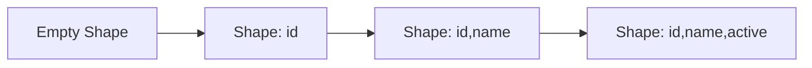
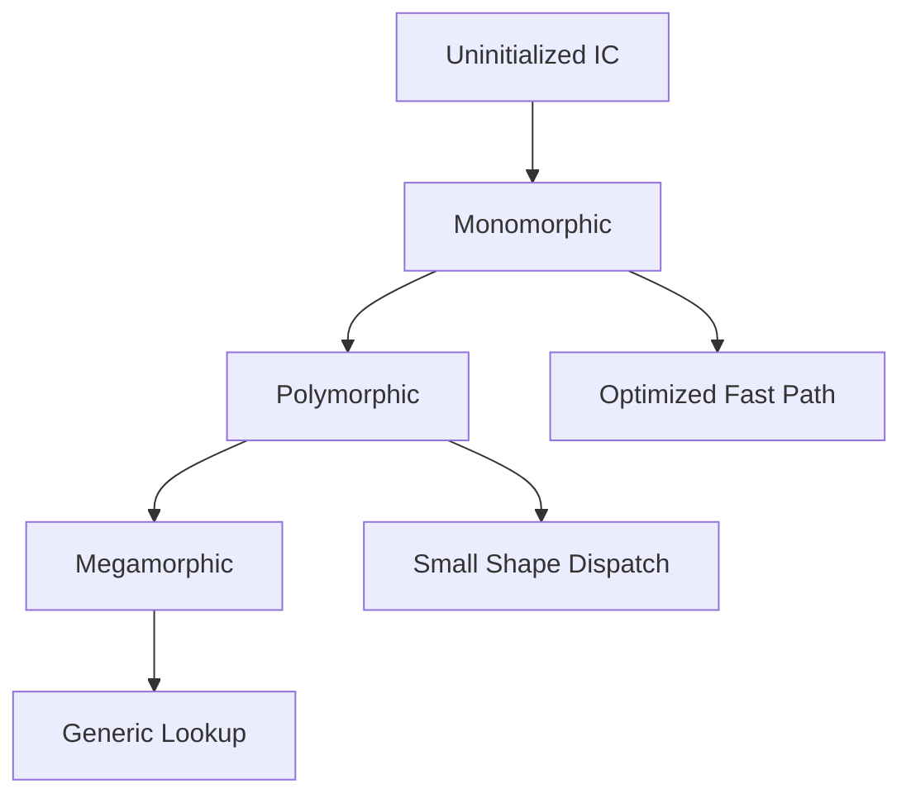
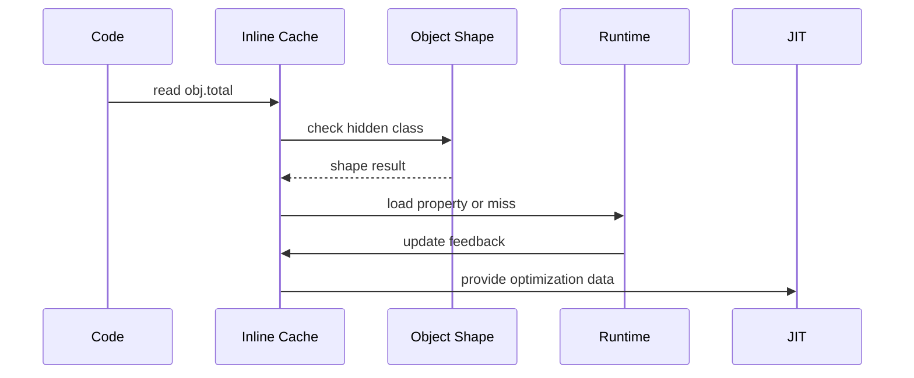
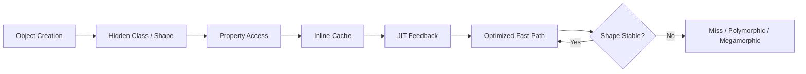
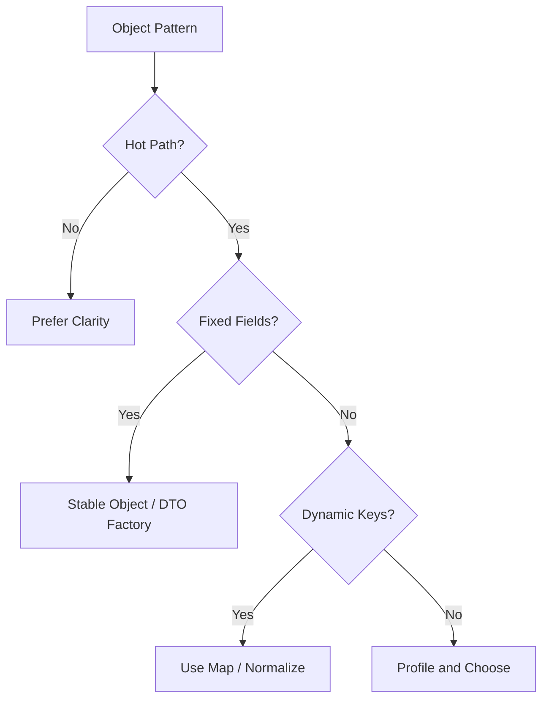

# 002.01.03 Inline Caches and Hidden Classes

Category: JavaScript Internals<br>
Topic: 002.01 Engine Architecture

Inline caches and hidden classes are engine techniques that make dynamic JavaScript property access fast. They let engines treat repeated property reads, writes, and calls as predictable operations when runtime object shapes stay stable.

This topic explains why `obj.name` can be close to a fixed-offset load in optimized code, and why the same expression can become slower when a call site sees too many object shapes.

---

## 1. Definition

A hidden class is an engine-internal description of an object's property layout. It is not visible in JavaScript code, and different engines may use different names such as hidden class, map, shape, or structure.

An inline cache, often shortened to IC, is runtime feedback stored at an operation site, such as `obj.name`, that remembers how the engine previously resolved that operation.

One-line definition:

- Hidden classes describe object layouts; inline caches remember observed layouts at property access sites so the engine can avoid repeated generic lookup.

Expanded explanation:

- JavaScript objects are dynamic, but most programs create many objects with similar structure.
- Engines exploit that regularity by assigning internal shape metadata.
- A property read can check the object's hidden class and then load from a known offset.
- If a call site sees one shape, it is monomorphic and usually easy to optimize.
- If it sees a few shapes, it is polymorphic.
- If it sees many shapes, it becomes megamorphic and often falls back to generic lookup.

Example:

```ts
function getName(user: { name: string }) {
  return user.name;
}
```

If `getName` always receives user objects with the same layout, the property read can become highly optimized.

---

## 2. Why It Exists

JavaScript allows dynamic object behavior:

```ts
const user: any = {};
user.name = "Ava";
user.age = 30;
delete user.age;
user["plan"] = "pro";
```

A naive engine would need generic dictionary-style lookup for every property access:

```text
obj.name
  -> inspect object
  -> search property table
  -> check prototype chain
  -> handle accessors/proxies
  -> return value
```

That is correct but expensive when repeated millions of times.

Inline caches and hidden classes exist because real JavaScript often behaves more predictably:

```ts
function createUser(id: string, name: string) {
  return { id, name, active: true };
}
```

Thousands of objects may share the same property layout. Engines use that stability.

They solve:

- repeated property lookup overhead,
- method call dispatch overhead,
- dynamic language performance cost,
- JIT optimization feedback,
- fast object allocation paths.

Why this matters in production:

- hot API handlers read object properties constantly,
- frontend render loops traverse props and state,
- data pipelines map millions of records,
- unstable shapes can increase CPU and deoptimization,
- profiling hot paths often reveals property access and object allocation patterns.

---

## 3. Syntax & Variants

Hidden classes and inline caches have no standard syntax, but many JavaScript patterns influence them.

### Stable property order

```ts
function createPoint(x: number, y: number) {
  return { x, y };
}

const a = createPoint(1, 2);
const b = createPoint(3, 4);
```

`a` and `b` are likely to share an internal shape.

### Different property order

```ts
const a = { x: 1, y: 2 };
const b = { y: 2, x: 1 };
```

These objects have the same visible properties but may have different internal shapes because properties were created in a different order.

### Conditional properties

```ts
function createUser(id: string, includeMeta: boolean) {
  const user: any = { id, active: true };

  if (includeMeta) {
    user.meta = {};
  }

  return user;
}
```

This can produce multiple shapes from one factory.

### Predeclared optional fields

```ts
function createUser(id: string, includeMeta: boolean) {
  return {
    id,
    active: true,
    meta: includeMeta ? {} : null,
  };
}
```

This is often more shape-stable, though it may allocate or store fields you do not always need. Measure hot paths before making code less natural.

### Delete changes shape

```ts
const user: any = { id: "u1", name: "Ava", active: true };
delete user.active;
```

Deleting properties can push objects toward slower dictionary-like representations.

Prefer:

```ts
user.active = false;
```

or create a new object with the desired shape when immutability is appropriate.

### Dynamic property names

```ts
function read(obj: Record<string, unknown>, key: string) {
  return obj[key];
}
```

Dynamic access is flexible but harder to optimize than fixed property access.

### Prototype changes

```ts
Object.setPrototypeOf(obj, newProto);
```

Changing prototypes at runtime can invalidate assumptions across many property accesses.

---

## 4. Internal Working

### Hidden class transition model

When properties are added, the engine can transition an object through internal shapes.



Code:

```ts
const user: any = {};
user.id = "u1";
user.name = "Ava";
user.active = true;
```

If many objects follow the same transition path, they can share shapes.

### Property access without inline cache

```text
Read obj.name
  -> check own properties
  -> check property descriptors
  -> maybe check prototype chain
  -> maybe handle accessor
  -> return value
```

Correct but generic.

### Property access with inline cache

```text
Read obj.name at call site
  -> check object's hidden class
  -> if expected shape, load field at known offset
  -> otherwise miss cache and update feedback
```

### IC state lifecycle



Typical states:

- Uninitialized: no useful feedback yet.
- Monomorphic: one observed shape.
- Polymorphic: a few observed shapes.
- Megamorphic: many observed shapes; generic handling likely.

### Example call site

```ts
function renderLabel(item: { label: string }) {
  return item.label;
}
```

This call site is `item.label`.

If called with:

```ts
renderLabel({ label: "A" });
renderLabel({ label: "B" });
```

it may remain monomorphic.

If called with many unrelated object layouts:

```ts
renderLabel({ label: "A" });
renderLabel({ id: 1, label: "B" });
renderLabel({ label: "C", meta: {} });
renderLabel(Object.create({ label: "D" }));
```

it may become polymorphic or megamorphic.

### Relation to JIT

Inline caches feed the optimizer.

```text
IC feedback
  -> observed shape is stable
  -> JIT emits shape guard
  -> fast offset load
  -> deopt or fallback if guard fails
```

The JIT can inline property access only when the feedback is predictable enough.

---

## 5. Memory Behavior

Hidden classes and inline caches use memory, but usually reduce CPU cost.

### Memory artifacts

```text
Object
  -> pointer to hidden class / shape
  -> property storage
  -> elements storage for arrays

Call site
  -> inline cache feedback
  -> observed shapes
  -> handler stubs / metadata
```

### Object memory

Objects may store:

- in-object properties,
- out-of-object property storage,
- elements storage for array-like indexed values,
- pointer to shape metadata.

Stable object layouts help engines store fields efficiently.

### Shape memory

Each distinct transition path can create or reference shape metadata.

Many unique shapes can increase:

- metadata memory,
- IC complexity,
- JIT guard complexity,
- generic fallback frequency.

### Dictionary mode

Some engines may switch objects with many additions/deletions to dictionary-like property storage.

This helps dynamic use cases but can slow fixed property access.

### Production memory implications

Watch for:

- large numbers of object shapes from ad hoc payload transformation,
- unbounded maps of dynamic keys,
- per-request objects with unique property names,
- generated objects that include user-defined keys as properties,
- array element kind transitions.

Example risk:

```ts
function toObject(metrics: Array<{ name: string; value: number }>) {
  const result: Record<string, number> = {};

  for (const metric of metrics) {
    result[metric.name] = metric.value;
  }

  return result;
}
```

This may be fine for small objects. For high-volume hot paths with many unique keys, `Map` may be more appropriate.

---

## 6. Execution Behavior

Inline caches evolve during execution.

### First call

```ts
function getTotal(order: { total: number }) {
  return order.total;
}

getTotal({ id: "o1", total: 100 });
```

The IC starts uninitialized, performs a lookup, and records feedback.

### Repeated stable calls

```ts
getTotal({ id: "o2", total: 200 });
getTotal({ id: "o3", total: 300 });
```

If shapes match, the IC becomes monomorphic and fast.

### Shape variation

```ts
getTotal({ total: 400, id: "o4" });
```

Same properties, different creation order. This may produce a different shape and update IC state.

### Many shapes

```ts
for (const order of mixedOrderSources) {
  getTotal(order);
}
```

If sources create many layouts, the IC may become megamorphic.

### Execution diagram



### Correctness always wins

If a property is accessor-based, inherited, proxied, deleted, or shape-mismatched, the engine must preserve JavaScript semantics even if it means using a slower path.

---

## 7. Scope & Context Interaction

Hidden classes belong to objects, while inline caches belong to operation sites.

### Call-site context

```ts
function getId(entity: { id: string }) {
  return entity.id; // one IC site
}
```

This IC gathers feedback for this specific property access site.

Another identical-looking access elsewhere has separate feedback:

```ts
function logId(entity: { id: string }) {
  console.log(entity.id); // different IC site
}
```

### Closure interaction

```ts
function makeReader(key: string) {
  return function read(obj: Record<string, unknown>) {
    return obj[key];
  };
}
```

Dynamic keys captured by closures can make property access less predictable.

### Prototype chain context

```ts
const proto = { active: true };
const user = Object.create(proto);
user.id = "u1";

console.log(user.active);
```

The engine must account for prototype lookup. If prototypes change, assumptions can be invalidated.

### Module context

Factories in one module can enforce consistent shapes:

```ts
export function createOrder(id: string, total: number) {
  return { id, total, status: "pending" as const };
}
```

Callers that bypass factories may create divergent shapes.

### Framework context

React/Angular props and state objects benefit from predictable shape:

```ts
const props = {
  id,
  label,
  disabled: Boolean(disabled),
};
```

This is not a reason to contort component code, but stable object shapes help hot render paths and memoization.

---

## 8. Common Examples

### Example 1: Shape-stable factory

```ts
type ProductView = {
  id: string;
  name: string;
  price: number;
  discounted: boolean;
};

function createProductView(product: Product): ProductView {
  return {
    id: product.id,
    name: product.name,
    price: product.price,
    discounted: product.discount != null,
  };
}
```

Every returned object has the same property set and order.

### Example 2: Shape-unstable mapper

```ts
function createProductView(product: Product) {
  const view: any = {
    id: product.id,
    name: product.name,
  };

  if (product.discount) {
    view.discounted = true;
    view.discount = product.discount;
  }

  if (product.inventory) {
    view.inventory = product.inventory;
  }

  return view;
}
```

This may create several shapes. It may be acceptable for non-hot code, but expensive in hot loops.

### Example 3: Avoiding delete on hot objects

```ts
delete user.temporaryToken;
```

Alternative:

```ts
user.temporaryToken = undefined;
```

or:

```ts
const { temporaryToken, ...safeUser } = user;
```

Choose based on semantics, hotness, and allocation cost.

### Example 4: Prefer `Map` for unknown dynamic keys

```ts
const counts = new Map<string, number>();

for (const event of events) {
  counts.set(event.name, (counts.get(event.name) ?? 0) + 1);
}
```

When keys are unbounded and dynamic, `Map` may represent intent better than creating object properties dynamically.

### Example 5: Stable arrays

```ts
const scores = [10, 20, 30];
scores.push(40);
```

More stable than:

```ts
scores.push("unknown" as any);
scores[10_000] = 1;
```

Mixed types and sparse arrays can move arrays to less optimized representations.

### Example 6: Method call IC

```ts
function notify(user: { send(message: string): void }) {
  user.send("hello");
}
```

The method call site can cache observed receiver shapes and call targets. Passing many unrelated object types can make it less predictable.

---

## 9. Confusing / Tricky Examples

### Trap 1: Same properties do not guarantee same shape

```ts
const a = { x: 1, y: 2 };
const b = { y: 2, x: 1 };
```

Visible result is similar, but creation order may produce different hidden classes.

### Trap 2: `delete` can be more expensive than assignment

```ts
delete obj.field;
```

This changes object structure. If the object is hot, it can harm property access. But if deletion is semantically correct and not hot, clarity may be better.

### Trap 3: Object spread can create new shapes

```ts
const next = { ...base, extra: true };
```

Object spread is useful and often clear, but in hot loops it allocates and may create shapes based on spread source order.

### Trap 4: Polymorphism is not always bad

A few stable shapes can still be optimized. The problem is uncontrolled shape variety on hot paths.

### Trap 5: Proxies defeat many assumptions

```ts
const proxy = new Proxy(user, {
  get(target, key) {
    return target[key as keyof typeof target];
  },
});
```

Proxies can intercept fundamental operations, so engines must preserve dynamic semantics.

### Trap 6: TypeScript type equality is not runtime shape equality

```ts
type Point = { x: number; y: number };

const a: Point = { x: 1, y: 2 };
const b: Point = JSON.parse('{"y":2,"x":1}');
```

Both satisfy the TypeScript type, but runtime creation paths may differ.

---

## 10. Real Production Use Cases

### API response normalization

Problem:

- A Node service maps thousands of database rows per request.
- CPU rises after adding optional fields.

Internals:

- row view objects now have many shapes.
- property reads in serializers become polymorphic or megamorphic.

Action:

- normalize output shape,
- predeclare optional fields as `null`,
- avoid ad hoc property additions in hot mappers,
- profile before and after.

### Frontend render lists

Problem:

- A virtualized table still has CPU-heavy cell rendering.

Internals:

- row objects from different sources have inconsistent shapes.
- cell renderers read dynamic keys repeatedly.

Action:

- transform rows once at boundary,
- use stable view models,
- avoid per-cell dynamic object creation,
- measure render performance.

### Analytics aggregation

Problem:

- Event aggregation worker slows with high-cardinality event names.

Internals:

- plain object used as a dictionary with unbounded dynamic keys.

Action:

- switch to `Map`,
- bound cardinality,
- batch aggregation,
- monitor heap and CPU.

### GraphQL resolver hot path

Problem:

- resolver receives parent objects with different shapes from different loaders.

Internals:

- property access ICs become polymorphic or megamorphic.

Action:

- standardize loader output,
- use typed DTO factories,
- avoid mixing ORM entities and plain objects in hot resolver paths.

### Feature flag payloads

Problem:

- flag objects include dynamic experiment names as properties.

Internals:

- every tenant may create different object shapes.

Action:

- use `Map` or array entries for dynamic flags,
- keep stable fixed fields for known metadata.

---

## 11. Interview Questions

### Basic

1. What is a hidden class?
2. What is an inline cache?
3. Why can JavaScript property access be fast despite dynamic objects?
4. What does monomorphic mean?
5. Why can deleting a property hurt performance?

### Intermediate

1. How does property creation order affect hidden classes?
2. What is the difference between monomorphic, polymorphic, and megamorphic ICs?
3. When would `Map` be better than an object?
4. How can optional fields affect object shapes?
5. How do inline caches feed JIT optimization?

### Advanced

1. Explain how a property read can become a shape check plus offset load.
2. How can proxies affect optimization?
3. How would you debug megamorphic behavior in a hot Node path?
4. Why can TypeScript types fail to guarantee runtime shape stability?
5. How do hidden classes relate to deoptimization?

### Tricky

1. Are hidden classes part of the JavaScript specification?
2. Is polymorphic always bad?
3. Should you always predeclare all optional properties?
4. Can two objects with identical JSON-visible fields have different shapes?
5. Why might object spread hurt a hot loop?

Strong answers should separate language semantics from engine optimizations.

---

## 12. Senior-Level Pitfalls

### Pitfall 1: Making all code shape-obsessed

Most application code is not hot enough to justify readability loss.

Senior correction:

- optimize only measured hot paths,
- preserve clear domain modeling,
- document intentional shape-sensitive code.

### Pitfall 2: Using objects as unbounded dictionaries

Objects are often fine for records with known fields. They are less ideal for arbitrary key sets.

Senior correction:

- use `Map` for unknown, high-cardinality, or frequently mutated dictionaries.

### Pitfall 3: Mixing DTOs, ORM entities, and API objects

Passing many object families into one hot function can make ICs unstable.

Senior correction:

- normalize at boundaries,
- use stable view models,
- keep hot functions narrow.

### Pitfall 4: Deleting properties in sanitizers

```ts
delete user.passwordHash;
```

Senior correction:

- construct a safe response object instead,
- avoid mutating shared domain objects,
- preserve clear security semantics.

### Pitfall 5: Trusting TypeScript shape alone

Runtime shape depends on creation path, not only compile-time type.

Senior correction:

- validate and normalize external data,
- avoid unsafe casts,
- use factories for critical DTOs.

### Pitfall 6: Ignoring arrays

Array element kinds also matter.

Senior correction:

- avoid sparse arrays in hot paths,
- avoid mixing unrelated value types in numeric arrays,
- use typed arrays for numeric-heavy workloads when appropriate.

### Pitfall 7: Misreading engine internals as spec guarantees

Hidden classes and IC behavior are implementation strategies.

Senior correction:

- never depend on them for correctness,
- use them only to guide performance-sensitive design.

---

## 13. Best Practices

### General

- Write clear code first.
- Profile before optimizing hidden-class behavior.
- Keep hot-path objects shape-stable when practical.
- Avoid `delete` on hot objects.
- Avoid unbounded dynamic object keys in hot paths.
- Prefer factories for important DTOs and view models.
- Normalize external data at boundaries.
- Use `Map` for dictionary-like dynamic key collections.

### Object creation

- Create common fields in consistent order.
- Prefer fixed optional fields as `null` or `undefined` only when the path is hot and measured.
- Avoid adding properties in many different branches.
- Avoid changing prototypes at runtime.
- Avoid mixing class instances and plain objects in the same hot call site unless measured.

### Arrays

- Keep arrays dense.
- Avoid large holes.
- Avoid mixing numeric and string/object values in hot numeric arrays.
- Use typed arrays for large numeric data pipelines when appropriate.

### Tooling and measurement

- Use CPU profiles to identify hot property access.
- Use engine diagnostic flags locally for deep investigation.
- Compare before and after with realistic data.
- Treat microbenchmarks carefully.
- Check Node/browser version because heuristics vary.

### Code review guidance

- Do not block readable code based on theoretical hidden-class concerns.
- Do question shape churn in proven hot loops, serializers, renderers, validators, and data mappers.
- Ask for measurement when optimization makes code less clear.

---

## 14. Debugging Scenarios

### Scenario 1: Serializer CPU regression

Symptoms:

- API p99 latency increased.
- CPU profile points to response serialization.

Debugging flow:

```text
Inspect hot serializer
  -> compare DTO shapes
  -> check optional property branches
  -> check deletes/sanitization
  -> normalize output shape
  -> profile again
```

Likely root cause:

- many response object shapes at one property access site.

### Scenario 2: Worker slows after high-cardinality data

Symptoms:

- aggregation worker slows as customer count grows.
- memory and CPU increase.

Debugging flow:

```text
Inspect accumulator
  -> identify dynamic object keys
  -> measure key cardinality
  -> compare object vs Map implementation
  -> profile under realistic data
```

Likely root cause:

- plain object used as dictionary with unbounded dynamic keys.

### Scenario 3: Frontend list rendering spikes

Symptoms:

- rendering 10,000 rows is slow after new optional columns.

Debugging flow:

```text
Profile render
  -> inspect row creation
  -> check property order and optional fields
  -> create stable row view model
  -> virtualize if DOM count is also high
```

Likely root cause:

- row object shape instability plus rendering volume.

### Scenario 4: Sanitizer mutates domain object

Symptoms:

- after removing sensitive fields with `delete`, later code behaves oddly and performance drops.

Debugging flow:

```text
Find sanitizer
  -> check object mutation
  -> construct safe response object instead
  -> add test for original domain object preservation
```

Likely root cause:

- mutation changed object shape and broke ownership expectations.

### Scenario 5: Proxy-heavy abstraction slows hot path

Symptoms:

- config access or state access is slow after introducing proxies.

Debugging flow:

```text
Profile property reads
  -> identify proxy traps
  -> measure access frequency
  -> replace hot-path proxy access with plain snapshot
```

Likely root cause:

- proxy traps prevent normal fast property assumptions.

---

## 15. Exercises / Practice

### Exercise 1: Same fields, different shape

Explain why these may differ internally:

```ts
const a = { id: "1", total: 100 };
const b: any = {};
b.total = 100;
b.id = "1";
```

### Exercise 2: Normalize a hot DTO

Refactor:

```ts
function toUserDto(user: User) {
  const dto: any = { id: user.id, name: user.name };

  if (user.avatarUrl) dto.avatarUrl = user.avatarUrl;
  if (user.plan) dto.plan = user.plan;

  return dto;
}
```

Goal:

- keep a stable shape,
- preserve clear API semantics,
- avoid leaking internal fields.

### Exercise 3: Pick Object or Map

Choose `Object` or `Map`:

```text
1. Known DTO fields: id, name, status.
2. Counts by arbitrary event name.
3. Cache by tenant ID with deletes.
4. Small config object with fixed keys.
5. Grouping millions of records by dynamic key.
```

Explain each choice.

### Exercise 4: Find hidden shape churn

```ts
function enrich(order: any, includeDebug: boolean) {
  order.totalWithTax = order.total * 1.18;

  if (includeDebug) {
    order.debug = { source: "checkout" };
  }

  delete order.internalNotes;
  return order;
}
```

Tasks:

- identify shape-changing operations,
- propose a safer response-mapping approach,
- decide whether the change matters without profiling.

### Exercise 5: IC state reasoning

A function `readName(obj) { return obj.name; }` is called with:

```ts
{ name: "A" }
{ name: "B" }
{ id: 1, name: "C" }
{ name: "D", meta: {} }
100 different plugin objects with name fields
```

Describe how the call site may evolve from monomorphic to megamorphic.

---

## 16. Comparison

### Hidden class vs JavaScript class

| Concept | Meaning | Visible in JS? |
| --- | --- | --- |
| JavaScript `class` | Syntax for constructor/prototype patterns | Yes |
| Hidden class/shape | Engine-internal object layout metadata | No |

### Object vs Map

| Use Case | Object | Map |
| --- | --- | --- |
| Fixed fields | Strong fit | Usually unnecessary |
| Dynamic unknown keys | Can work, but may shape churn | Strong fit |
| Frequent deletes | Can degrade object layout | Designed for mutation |
| JSON serialization | Natural | Needs conversion |
| Prototype concerns | Needs care or `Object.create(null)` | No prototype key collision |

### Monomorphic vs polymorphic vs megamorphic

| IC State | Observed Shapes | Performance Tendency |
| --- | --- | --- |
| Monomorphic | One | Best for optimization |
| Polymorphic | Few | Often still optimized |
| Megamorphic | Many | Generic path more likely |

### Shape stability vs readability

| Choice | Benefit | Risk |
| --- | --- | --- |
| Natural dynamic object | Clear and flexible | Hot-path shape churn |
| Stable DTO factory | Predictable and testable | More boilerplate |
| Manual micro-optimization | Potential speedup | Harder maintenance |

---

## 17. Related Concepts

Inline Caches and Hidden Classes connect to:

- `002.01.02 Bytecode and JIT`: IC feedback feeds optimization.
- `002.04.01 Deoptimization`: broken assumptions can deopt optimized code.
- `002.04.02 Shape Changes`: object layout transitions are the core mechanism.
- `002.04.03 Benchmarking Pitfalls`: IC warmup affects benchmark results.
- `001.03.02 Memory and Garbage Collection`: object allocation patterns influence GC.
- `001.04.02 Performance Profiling`: CPU profiles reveal hot property access and polymorphism symptoms.
- React/Angular rendering: stable props/state can reduce hot-path churn.
- API serialization: DTO shape stability can matter at high throughput.

Knowledge graph:



---

## Advanced Add-ons

### Performance Impact

Performance impact is highest in hot loops, serializers, renderers, validators, and data pipelines.

Shape-stable code can improve:

- property read speed,
- method call dispatch,
- JIT optimization quality,
- CPU efficiency,
- tail latency under load.

Shape-unstable code can increase:

- generic property lookup,
- deoptimization,
- CPU time,
- metadata pressure,
- GC pressure through extra allocations.

Important caution:

- IC and hidden class concerns are usually second-order unless the path is hot. Measure first.

### System Design Relevance

This topic influences system design in high-throughput JavaScript systems.

Examples:

- API gateways should normalize request/response DTOs at boundaries.
- Realtime systems should keep message payload shapes stable.
- Analytics workers may use `Map` for dynamic dimensions.
- Frontend apps should avoid repeatedly creating shape-chaotic row objects in render loops.
- Platform libraries should avoid proxy-heavy abstractions in hot paths unless measured.

Decision framework:



### Security Impact

Hidden classes are performance internals, but related code patterns affect security.

Security concerns:

- deleting sensitive fields from domain objects can leave ownership confusion,
- object dictionaries with prototype keys can cause prototype pollution risk,
- dynamic property writes from untrusted input are dangerous,
- proxies can hide sensitive behavior from simple static analysis.

Safer practices:

- construct safe response DTOs instead of deleting secrets,
- validate keys before dynamic writes,
- use `Map` or `Object.create(null)` for dictionary-like data when appropriate,
- avoid merging untrusted objects into trusted config.

Example risk:

```ts
function mergeConfig(target: any, input: Record<string, unknown>) {
  for (const key of Object.keys(input)) {
    target[key] = input[key];
  }
}
```

Validate or block special keys such as `__proto__`, `constructor`, and `prototype` when accepting dynamic object keys.

### Browser vs Node Behavior

Browser:

- hidden classes affect render hot paths, state transforms, charting, and table rendering,
- low-end devices amplify CPU inefficiency,
- bundlers/transpilers may change object creation patterns,
- proxies in state libraries can affect hot access paths.

Node:

- DTO mapping, validation, serialization, and queue processing are common hot paths,
- long-running services can warm ICs and JIT well,
- serverless functions may not warm enough for steady-state assumptions,
- Node diagnostic flags can help deep local investigation.

Shared:

- implementation details vary by engine/version,
- correctness never depends on hidden classes,
- stable object shape is a performance hint, not a language contract.

### Polyfill / Implementation

You cannot polyfill hidden classes or inline caches. They are engine internals.

You can model the idea with a tiny conceptual cache:

```ts
type Shape = string;

function shapeOf(obj: Record<string, unknown>): Shape {
  return Object.keys(obj).join(",");
}

function createPropertyReader(property: string) {
  let cachedShape: Shape | undefined;

  return function read(obj: Record<string, unknown>) {
    const currentShape = shapeOf(obj);

    if (cachedShape === currentShape) {
      // Conceptual fast path. Real engines load by offset, not Object.keys.
      return obj[property];
    }

    cachedShape = currentShape;
    return obj[property];
  };
}

const readName = createPropertyReader("name");
readName({ id: "1", name: "A" });
readName({ id: "2", name: "B" });
```

This is not how engines implement ICs, and this code is slower than normal property access. It only demonstrates the idea of remembering a shape at an access site.

---

## 18. Summary

Inline caches and hidden classes are how engines make dynamic property access fast when runtime behavior is stable.

Quick recall:

- Hidden classes are internal object layout descriptions.
- Inline caches store feedback at property access/call sites.
- Monomorphic sites see one shape and optimize well.
- Polymorphic sites see a few shapes and may still optimize.
- Megamorphic sites see many shapes and often fall back to generic lookup.
- Property creation order can affect shape.
- `delete`, dynamic keys, proxies, and prototype changes can hurt optimization.
- Use `Map` for dynamic dictionaries.
- Normalize hot DTOs and view models when profiling proves shape churn.
- Never rely on hidden classes for correctness.

Staff-level takeaway:

- Shape stability is a performance design tool for hot JavaScript paths. Use it with measurement, keep code readable, and remember that engine internals guide optimization but do not define the language.
