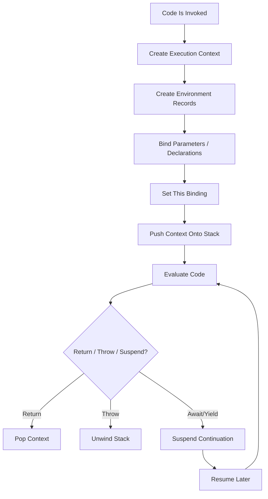
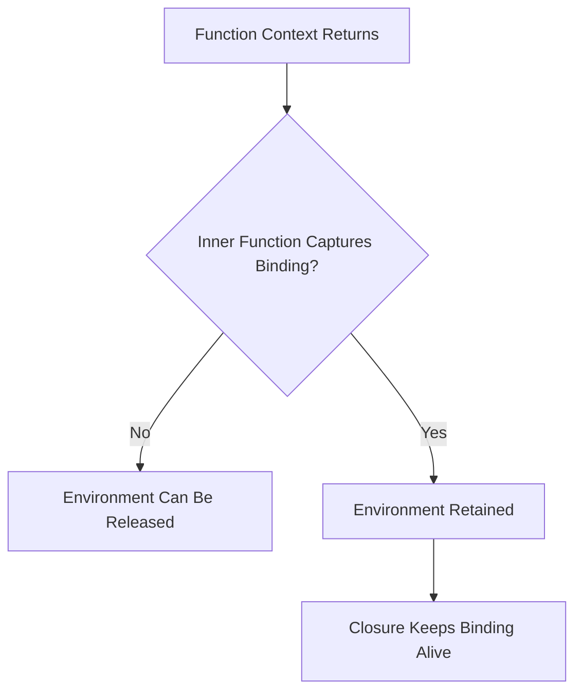
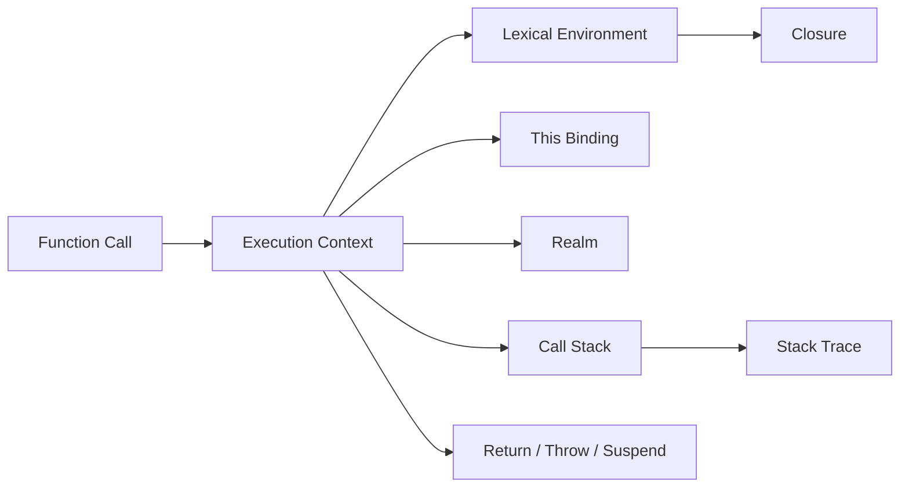
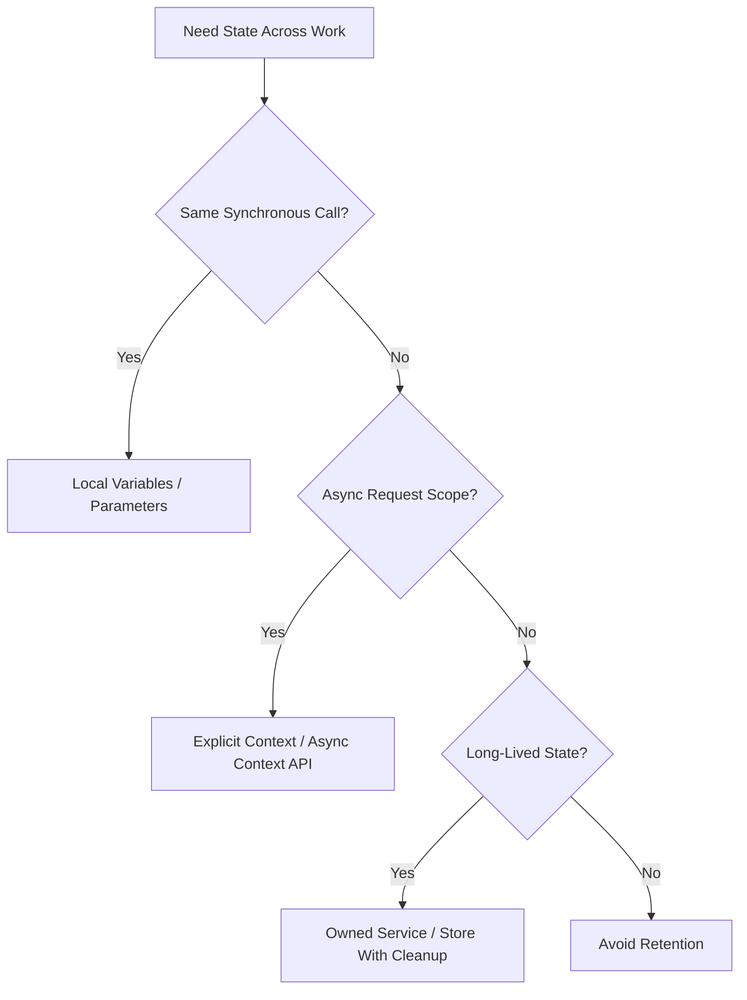

# 002.02.01 Execution Contexts

Category: JavaScript Internals<br>
Topic: 002.02 Runtime Semantics

Execution contexts are the runtime records JavaScript uses to track what code is currently running, which bindings are visible, what `this` means, which realm is active, and where control should return when the current code finishes.

This is the internals version of the classic "creation phase and execution phase" topic. At Staff/Principal depth, you should connect execution contexts to lexical environments, call stack frames, module evaluation, `this` binding, closures, async boundaries, stack traces, and production debugging.

---

## 1. Definition

An execution context is an internal runtime structure that represents the environment in which JavaScript code is evaluated.

One-line definition:

- An execution context is the engine's active record for running code: it carries the current lexical environment, variable environment, `this` binding, realm, and continuation state.

Expanded explanation:

- When global code starts, a global execution context is created.
- When a function is called, a function execution context is created and pushed onto the execution context stack.
- When module code is evaluated, module-specific context and environment records are used.
- When `eval` runs, eval code may create its own execution context with special scoping rules.
- When the current context finishes, it is popped and control returns to the previous context.

Simplified model:

```text
Execution Context
  -> LexicalEnvironment
  -> VariableEnvironment
  -> PrivateEnvironment
  -> ThisBinding
  -> Realm
  -> Running code / continuation
```

Real specifications are more precise than this diagram, but this model is enough to reason about most production bugs and interview problems.

---

## 2. Why It Exists

JavaScript needs execution contexts because code execution is nested, scoped, dynamic, and resumable.

The runtime must answer:

- Which statement is running now?
- Which variables are visible?
- Which declarations have been created?
- Which bindings are initialized?
- What does `this` refer to?
- Which global object and built-ins belong to this code?
- What happens when a function returns?
- What stack frame appears in an error?
- What state must survive for closures?
- What state must resume after `await`?

Without execution contexts, the engine could not correctly implement:

- function calls,
- global code,
- modules,
- lexical scoping,
- `var` hoisting,
- `let`/`const` TDZ,
- `this` binding,
- closures,
- recursion,
- stack traces,
- direct eval,
- async function suspension and resumption.

Production relevance:

- stack overflows are execution-context stack problems,
- wrong `this` bugs are context/binding bugs,
- closure leaks retain context-linked state,
- async stack traces reconstruct context across turns,
- module initialization failures occur during module evaluation contexts,
- request context bugs in Node often come from confusing JavaScript execution context with application request context.

---

## 3. Syntax & Variants

Developers do not create execution contexts directly. They are created by language constructs.

### Global script context

```js
var globalVar = 1;
let globalLet = 2;
function globalFn() {}
```

Global code creates a global execution context. In scripts, `var` and function declarations interact with the global object; `let` and `const` are global lexical bindings but not global object properties.

### Function execution context

```js
function add(a, b) {
  const total = a + b;
  return total;
}

add(1, 2);
```

Calling `add` creates a function execution context with parameters, local declarations, `this` binding behavior, and a link to outer lexical environments.

### Arrow function context behavior

```js
const obj = {
  value: 10,
  method() {
    const read = () => this.value;
    return read();
  },
};
```

Arrow functions do not create their own `this` binding. They close over `this` from the surrounding context.

### Module execution context

```js
import { config } from "./config.js";

export const value = config.value;
```

Modules use module environment records, are strict by default, and evaluate after dependency linking.

### Eval execution context

```js
function run(source) {
  return eval(source);
}
```

Direct eval has special access to the caller's lexical environment. Indirect eval behaves more like global eval.

```js
(0, eval)("var x = 1");
```

### Class and private environments

```js
class Account {
  #balance = 0;

  deposit(amount) {
    this.#balance += amount;
  }
}
```

Private names require private environment tracking during class evaluation.

### Async function context

```js
async function load() {
  const user = await fetchUser();
  return user.name;
}
```

An async function context can suspend at `await` and resume later through the microtask queue.

---

## 4. Internal Working

Execution context handling is a lifecycle.



### Creation phase

Before executing statements, the engine prepares bindings.

For a function call:

- creates parameter bindings,
- creates `arguments` object where applicable,
- creates function/local lexical environment,
- creates `var` bindings,
- creates `let`/`const`/class bindings in uninitialized state,
- sets `this` binding based on call form,
- links to outer lexical environment.

### Execution phase

The engine evaluates statements in order:

- initializes `let`/`const` when declarations run,
- assigns values,
- calls functions,
- reads/writes bindings,
- handles returns and throws,
- creates inner execution contexts for nested calls.

### Execution context stack

```text
Top -> current function context
       caller function context
       global/module context
```

Example:

```js
function a() {
  b();
}

function b() {
  c();
}

function c() {
  throw new Error("boom");
}

a();
```

Stack at throw:

```text
c execution context
b execution context
a execution context
global execution context
```

### Spec-level components

Conceptually, an execution context includes:

- LexicalEnvironment: current lexical bindings.
- VariableEnvironment: `var` and function declaration environment for some code.
- PrivateEnvironment: private names for classes.
- Realm: global object, intrinsics, and associated host environment.
- Function: current function object for function contexts.
- ScriptOrModule: source record for script/module code.

Exact details vary by ECMAScript spec edition, but these are core mental hooks.

### Completion records

Evaluation produces completions:

```text
normal completion
return completion
throw completion
break / continue completion
```

This is why `try/finally`, loops, function returns, and thrown errors compose predictably.

---

## 5. Memory Behavior

Execution contexts are temporary, but their environments can outlive them.

### Normal function call

```js
function sum(a, b) {
  const total = a + b;
  return total;
}

sum(1, 2);
```

After return:

- execution context is popped,
- local values become unreachable if nothing captures them,
- memory can be reclaimed.

### Closure retention

```js
function createCounter() {
  let count = 0;

  return function increment() {
    count += 1;
    return count;
  };
}

const increment = createCounter();
```

After `createCounter` returns, `count` must remain alive because `increment` references it.

Memory model:



### Async retention

```js
async function processLarge(payload) {
  const parsed = JSON.parse(payload);
  await save(parsed.id);
  return parsed.status;
}
```

Variables needed after `await` may be retained in continuation state. Large objects held across `await` can increase memory pressure.

Better when possible:

```js
async function processLarge(payload) {
  const { id, status } = JSON.parse(payload);
  await save(id);
  return status;
}
```

### Stack memory

Deep recursion creates many execution contexts.

```js
function recurse(n) {
  if (n === 0) return;
  recurse(n - 1);
}

recurse(1_000_000);
```

This can throw `RangeError: Maximum call stack size exceeded`.

### Production memory risks

- closures retaining request payloads,
- async functions holding large data across `await`,
- event listeners capturing component state after unmount,
- timers retaining context,
- recursive algorithms growing stack,
- request-scoped data accidentally stored in module scope.

---

## 6. Execution Behavior

### Function call behavior

```js
function outer() {
  const x = 1;
  inner();

  function inner() {
    console.log(x);
  }
}

outer();
```

Execution:

```text
global context
  -> outer context
    -> inner context
```

`inner` resolves `x` through the lexical environment chain, not through the call stack alone.

### `this` depends on call form

```js
const user = {
  name: "Ava",
  readName() {
    return this.name;
  },
};

user.readName(); // this -> user

const fn = user.readName;
fn(); // this -> undefined in strict mode, global object in sloppy script mode
```

The function is the same, but the call expression creates a different `this` binding.

### Throw unwinds contexts

```js
function a() {
  b();
}

function b() {
  throw new Error("failed");
}

a();
```

When `b` throws:

- `b` context exits abruptly,
- `a` context exits unless it catches,
- stack unwinds until a handler or host boundary.

### Async function execution

```js
async function run() {
  console.log("A");
  await Promise.resolve();
  console.log("B");
}

run();
console.log("C");
```

Output:

```text
A
C
B
```

The async function starts synchronously, suspends at `await`, and resumes in a later microtask.

### Context vs task

Execution context is about currently running JavaScript code. Tasks and microtasks are scheduling mechanisms that decide when code gets a chance to run.

```text
Task starts
  -> execution context stack grows/shrinks
  -> stack becomes empty
  -> microtasks drain
  -> next task starts
```

---

## 7. Scope & Context Interaction

Execution contexts and lexical environments are tightly related but not identical.

### Execution context

Answers:

- What code is running?
- What should happen on return or throw?
- What is current `this`?
- What realm is active?

### Lexical environment

Answers:

- Where do identifier lookups go?
- Which bindings are available?
- Which outer environment is next?

### Example

```js
const globalValue = "global";

function outer() {
  const outerValue = "outer";

  return function inner() {
    return `${globalValue}:${outerValue}`;
  };
}
```

When `inner` runs:

- a new execution context is created for `inner`,
- its lexical environment points to captured outer environments,
- it can resolve `outerValue` even though `outer` already returned.

### `var` vs lexical environment

```js
function example() {
  console.log(a); // undefined
  var a = 1;

  console.log(b); // ReferenceError
  let b = 2;
}
```

Both declarations are known during context creation, but `var` is initialized to `undefined`, while `let` is uninitialized until declaration evaluation.

### Module context

```js
export let count = 0;

export function increment() {
  count += 1;
}
```

Module exports are live bindings. Importers observe changes through module environment records rather than receiving copied values.

### Realm interaction

Different realms have different global objects and intrinsic objects.

Browser examples:

- main window,
- iframe,
- worker.

This matters for:

- `instanceof`,
- cross-realm arrays,
- security boundaries,
- global object behavior.

---

## 8. Common Examples

### Example 1: Function context and local bindings

```js
function greet(name) {
  const message = `Hello, ${name}`;
  return message;
}

greet("Ava");
```

Context contains:

- parameter binding `name`,
- lexical binding `message`,
- outer environment link,
- return continuation.

### Example 2: Method call and `this`

```js
const cart = {
  total: 100,
  applyDiscount(percent) {
    return this.total * (1 - percent);
  },
};

cart.applyDiscount(0.1);
```

`this` is set by the call expression `cart.applyDiscount(...)`.

### Example 3: Lost `this`

```js
const apply = cart.applyDiscount;
apply(0.1);
```

The call no longer has `cart` as the receiver.

Fix:

```js
const apply = cart.applyDiscount.bind(cart);
apply(0.1);
```

### Example 4: Closure keeps environment alive

```js
function makeFeatureFlagReader(flags) {
  return function isEnabled(name) {
    return Boolean(flags[name]);
  };
}
```

The returned function retains the `flags` binding.

### Example 5: Module live binding

```js
// counter.js
export let count = 0;
export const increment = () => {
  count += 1;
};
```

```js
// app.js
import { count, increment } from "./counter.js";

increment();
console.log(count); // 1
```

The imported `count` is a live binding, not a copied primitive.

---

## 9. Confusing / Tricky Examples

### Trap 1: Call stack is not the same as scope chain

```js
function outer() {
  const secret = "x";
  return function inner() {
    return secret;
  };
}

const inner = outer();
inner();
```

`outer` is no longer on the call stack, but its lexical environment is retained.

### Trap 2: `this` is not lexical in normal functions

```js
const user = {
  name: "Ava",
  read() {
    return this.name;
  },
};

setTimeout(user.read, 0);
```

The callback is called without the original receiver, so `this` is lost.

### Trap 3: Arrow `this` can surprise inside objects

```js
const user = {
  name: "Ava",
  read: () => this.name,
};
```

The arrow does not bind `this` to `user`; it captures `this` from the outer context.

### Trap 4: `var` and `let` are both hoisted, but differently

```js
console.log(a); // undefined
var a = 1;

console.log(b); // ReferenceError
let b = 2;
```

`let` is known before execution but uninitialized until its declaration runs.

### Trap 5: Direct eval differs from indirect eval

```js
function test() {
  const local = 1;
  return eval("local");
}
```

Direct eval can access local scope.

```js
function test() {
  const local = 1;
  const indirect = eval;
  return indirect("typeof local");
}
```

Indirect eval does not access the same local lexical environment.

### Trap 6: Async stacks are reconstructed

Async stack traces may show logical async call chains, but the original synchronous call stack was emptied between turns.

---

## 10. Real Production Use Cases

### Node request context bugs

Problem:

- Logs show the wrong tenant ID under concurrent requests.

Cause:

- request-specific data stored in module/global scope instead of explicit context or async-local context.

Connection:

- JavaScript execution context is not the same thing as application request context.

### Lost `this` in callback

Problem:

- A class method fails when passed as an event handler.

```ts
button.addEventListener("click", service.handleClick);
```

Cause:

- method called without the instance receiver.

Fix:

- bind method,
- use arrow field where appropriate,
- pass explicit dependency.

### Closure memory leak

Problem:

- Browser component unmounts, but memory grows.

Cause:

- event listener captures component state and is never removed.

Connection:

- closure retains lexical environment after the original execution context is gone.

### Module initialization incident

Problem:

- service crashes during startup after circular module import change.

Cause:

- module evaluation order exposes uninitialized binding or partial state.

Connection:

- module contexts and live bindings have distinct initialization/evaluation phases.

### Async stack debugging

Problem:

- error occurs after `await`, stack trace seems incomplete or confusing.

Cause:

- execution resumed in a later microtask; tools reconstruct async causality differently.

Connection:

- synchronous execution context stack and async logical call chain are different.

---

## 11. Interview Questions

### Basic

1. What is an execution context?
2. When is a function execution context created?
3. What is stored in an execution context?
4. How is the call stack related to execution contexts?
5. What is the difference between creation phase and execution phase?

### Intermediate

1. Why does `var` read as `undefined` before assignment while `let` throws?
2. How does `this` get its value in a normal function call?
3. Why does a closure keep variables alive after the outer function returns?
4. How do modules differ from scripts at execution time?
5. What happens to the execution context when an error is thrown?

### Advanced

1. Explain the difference between execution context and lexical environment.
2. How does async/await suspend and resume execution?
3. What is a realm, and why does it matter?
4. How does direct eval affect local scope?
5. How would you debug a memory leak caused by retained lexical environments?

### Tricky

1. Is the scope chain the same as the call stack?
2. Does an arrow function create a `this` binding?
3. Are imported module values copied?
4. Does `await` keep the same call stack?
5. Is "hoisting" one behavior or several related binding-creation rules?

Strong answers should use precise language: context stack, lexical environment, variable environment, `this` binding, realm, creation, evaluation, return, throw, and suspension.

---

## 12. Senior-Level Pitfalls

### Pitfall 1: Confusing JavaScript execution context with app request context

Execution contexts are language runtime records. Request context is application state.

Senior correction:

- pass request context explicitly or use controlled async context APIs,
- do not store request data in globals.

### Pitfall 2: Assuming closures are free

Closures are powerful, but they retain environments.

Senior correction:

- avoid capturing large objects unnecessarily,
- clear listeners/timers,
- inspect retainer paths in heap snapshots.

### Pitfall 3: Treating `this` as where a function was defined

For normal functions, `this` depends on call form.

Senior correction:

- use explicit receivers,
- bind callbacks,
- prefer dependency parameters for critical code.

### Pitfall 4: Ignoring module evaluation order

Circular imports can expose uninitialized live bindings.

Senior correction:

- break cycles,
- move shared contracts to independent modules,
- avoid top-level side effects.

### Pitfall 5: Misreading async stack traces

Async stacks are logical reconstructions.

Senior correction:

- use correlation IDs,
- log boundaries around awaits,
- understand task/microtask scheduling.

### Pitfall 6: Using eval in production paths

Eval complicates scope, optimization, security, and tooling.

Senior correction:

- avoid eval,
- use parsers/interpreters/safe expression languages when needed,
- never evaluate untrusted strings.

---

## 13. Best Practices

### Code clarity

- Keep state ownership explicit.
- Avoid hidden globals.
- Prefer pure functions for domain logic.
- Pass context explicitly across critical boundaries.
- Use closures intentionally and keep captured state small.

### `this` handling

- Do not pass unbound methods as callbacks.
- Prefer arrow functions when lexical `this` is desired.
- Prefer normal methods when receiver-based `this` is desired.
- In classes, bind methods or use arrow fields consistently when used as callbacks.

### Async context

- Treat code after `await` as a later continuation.
- Avoid retaining large data across awaits.
- Use correlation IDs for logs/traces.
- Use async-local context carefully and test concurrency behavior.

### Modules

- Avoid top-level side effects where possible.
- Keep module initialization deterministic.
- Avoid circular imports.
- Keep configuration loading explicit.

### Debugging

- Read stack traces as execution-context history, not full application causality.
- Use heap snapshots for retained closures.
- Use breakpoints to inspect scope chains.
- Use traces/logs to connect async boundaries.

---

## 14. Debugging Scenarios

### Scenario 1: Lost `this` in production callback

Symptoms:

- `Cannot read properties of undefined`.
- Stack points to a class method used as callback.

Debugging flow:

```text
Inspect call site
  -> check whether method is passed without receiver
  -> inspect strict mode behavior
  -> bind or wrap callback
  -> add regression test
```

Fix:

```ts
button.addEventListener("click", () => service.handleClick());
```

### Scenario 2: Request tenant leaks between users

Symptoms:

- logs sometimes show wrong tenant.
- bug appears only under concurrency.

Debugging flow:

```text
Search for module-level request state
  -> reproduce with concurrent requests
  -> pass context explicitly
  -> add correlation ID tests
```

Root cause:

- application request context confused with global/module state.

### Scenario 3: Closure retains large payload

Symptoms:

- heap grows after processing large requests.
- heap snapshot shows payload retained by timer callback.

Debugging flow:

```text
Take heap snapshot
  -> inspect retainer path
  -> find closure
  -> clear timer/listener
  -> reduce captured data
```

Fix direction:

- capture only needed IDs/primitive fields,
- remove listener on cleanup.

### Scenario 4: Circular module startup failure

Symptoms:

- startup throws `Cannot access before initialization`.

Debugging flow:

```text
Inspect stack and module graph
  -> find circular import
  -> move shared type/constant to third module
  -> remove top-level side effect
```

Root cause:

- module live binding accessed before initialization during evaluation cycle.

### Scenario 5: Async stack does not show original caller

Symptoms:

- error after `await` lacks expected synchronous frames.

Debugging flow:

```text
Add trace span/correlation ID
  -> log before and after await
  -> inspect async stack support
  -> preserve causal context explicitly
```

Root cause:

- original execution context stack completed before async continuation resumed.

---

## 15. Exercises / Practice

### Exercise 1: Draw the context stack

For:

```js
function a() {
  b();
}

function b() {
  c();
}

function c() {
  return 1;
}

a();
```

Draw the execution context stack at the moment `c` is running.

### Exercise 2: Predict `this`

```js
"use strict";

const user = {
  name: "Ava",
  read() {
    return this.name;
  },
};

const read = user.read;
console.log(read());
```

What happens and why?

### Exercise 3: Closure retention

```js
function create() {
  const large = new Array(1_000_000).fill("x");
  return () => large.length;
}
```

Questions:

- Why is `large` retained?
- How would you reduce retained memory if only the length is needed?

### Exercise 4: Var vs let

Predict:

```js
function test() {
  console.log(a);
  var a = 1;

  console.log(b);
  let b = 2;
}
```

Explain creation phase vs execution phase.

### Exercise 5: Async ordering

Predict:

```js
async function run() {
  console.log("1");
  await null;
  console.log("2");
}

run();
console.log("3");
```

Explain context suspension and microtask resumption.

---

## 16. Comparison

### Execution context vs lexical environment

| Concept | Answers | Example |
| --- | --- | --- |
| Execution context | What code is running and how it returns | function call frame |
| Lexical environment | Where identifiers are resolved | block/function/module scope |

### Global vs function vs module context

| Context | Created By | Key Traits |
| --- | --- | --- |
| Global script | classic script execution | global object interaction, sloppy/strict depends |
| Function | function call | parameters, local bindings, `this` |
| Module | module evaluation | strict by default, imports/exports, live bindings |
| Eval | eval call | special rules for direct vs indirect eval |

### Normal function vs arrow function

| Feature | Normal Function | Arrow Function |
| --- | --- | --- |
| Own `this` | Yes, based on call form | No, lexical |
| `arguments` | Own in non-arrow functions | Uses outer if referenced |
| Constructor | Can be if constructible | Cannot be used with `new` |
| Best for | methods, dynamic receiver | callbacks, lexical context |

### Synchronous stack vs async causality

| Concept | Meaning |
| --- | --- |
| Synchronous stack | Active execution contexts right now |
| Async causality | Logical chain across tasks/microtasks |
| Stack trace | Runtime/tool reconstruction of failure path |
| Trace/correlation ID | Application-level causality across async/service boundaries |

---

## 17. Related Concepts

Execution Contexts connect to:

- `001.01.02 Scope, Closures, and Hoisting`: visible user-level behavior.
- `001.02.01 Call Stack`: execution contexts are represented as stack frames.
- `001.02.03 Promises and Async-Await`: contexts suspend and resume across awaits.
- `002.02.02 Lexical Environments`: binding resolution details.
- `002.02.03 Microtasks and Macrotasks`: scheduling of async continuation.
- `002.03.03 Leaks and Retainers`: closures retain lexical environments.
- Modules and Bundling Boundaries: module contexts and live bindings.
- Production Debugging: stack traces, async traces, retained closures.

Knowledge graph:



---

## Advanced Add-ons

### Performance Impact

Execution contexts affect performance through:

- function call overhead,
- recursion depth,
- closure allocation,
- captured environment retention,
- async continuation allocation,
- stack trace capture cost,
- optimization constraints from `eval`, `with`, and dynamic scope behavior.

Performance guidance:

- avoid deep recursion in production data paths unless bounded,
- avoid unnecessary closure creation in hot loops when measured,
- avoid retaining large values across async boundaries,
- avoid direct eval in optimized paths,
- use iterative algorithms for unbounded depth.

### System Design Relevance

Execution-context knowledge helps design:

- request context propagation,
- logging correlation,
- async-local storage usage,
- worker boundaries,
- safe callback APIs,
- module initialization strategy,
- memory leak prevention.

Decision framework:



### Security Impact

Execution contexts touch security in several ways:

- `eval` can execute attacker-controlled code,
- wrong `this` can bypass expected object ownership,
- closure retention can keep secrets in memory longer,
- global/module state can leak tenant or request data,
- cross-realm behavior affects sandboxing and object checks.

Security practices:

- avoid eval and `new Function` with untrusted input,
- keep tenant/user context explicit,
- clear sensitive data references when practical,
- avoid relying on `instanceof` across realms for security checks,
- prefer capability passing over global access.

### Browser vs Node Behavior

Browser:

- global script `var` attaches to `window`,
- modules have top-level `this` as `undefined`,
- realms appear through iframes, workers, and windows,
- event handlers create callback contexts,
- closures often retain DOM nodes and component state.

Node:

- CommonJS wraps modules in a function-like wrapper,
- ESM follows module semantics,
- top-level `this` differs between CommonJS and ESM,
- async request context is commonly handled with explicit context or `AsyncLocalStorage`,
- module-level state is shared across requests in a process.

Shared:

- function calls create execution contexts,
- closures retain environments,
- async/await suspends and resumes later,
- stack traces show execution context history imperfectly.

### Polyfill / Implementation

You cannot polyfill execution contexts because they are part of the language runtime. You can model a tiny interpreter to understand context stacks.

```ts
type Frame = {
  name: string;
  locals: Record<string, unknown>;
};

class TinyRuntime {
  private stack: Frame[] = [];

  call<T>(name: string, locals: Record<string, unknown>, fn: () => T): T {
    this.stack.push({ name, locals });
    try {
      return fn();
    } finally {
      this.stack.pop();
    }
  }

  trace() {
    return [...this.stack].reverse().map((frame) => frame.name);
  }
}

const runtime = new TinyRuntime();

runtime.call("a", {}, () => {
  runtime.call("b", {}, () => {
    console.log(runtime.trace()); // ["b", "a"]
  });
});
```

This model shows stack push/pop, but real JavaScript contexts include lexical environments, `this`, realms, completion records, private environments, and async suspension.

---

## 18. Summary

Execution contexts are the runtime backbone of JavaScript execution.

Quick recall:

- Global, function, module, and eval code create execution contexts.
- Function calls push contexts onto the execution context stack.
- Returning pops a context; throwing unwinds contexts.
- Contexts carry lexical environment, variable environment, `this`, realm, and continuation state.
- Creation phase prepares bindings; execution phase evaluates statements.
- `var` and `let` differ in initialization behavior.
- Closures retain lexical environments after contexts return.
- Async functions suspend and resume later through microtasks.
- `this` depends on call form for normal functions.
- Execution context is not the same as application request context.

Staff-level takeaway:

- Execution context mastery lets you explain hoisting, closures, `this`, stack traces, async behavior, module initialization, memory retention, and a surprising number of production bugs from one coherent model.
