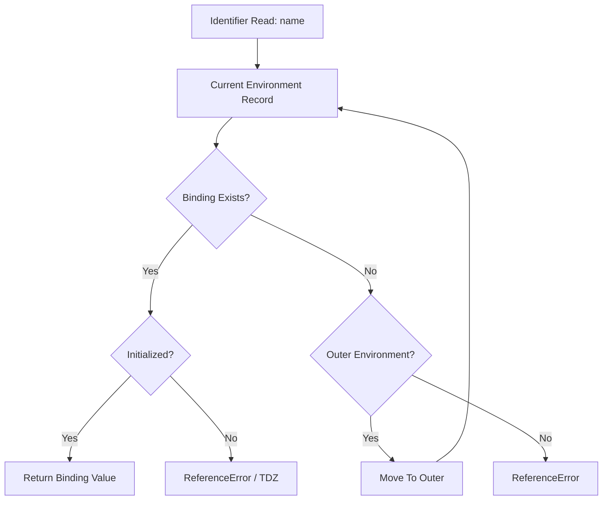
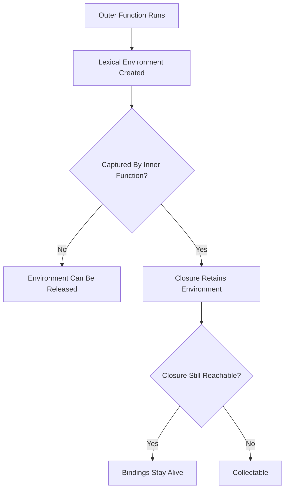
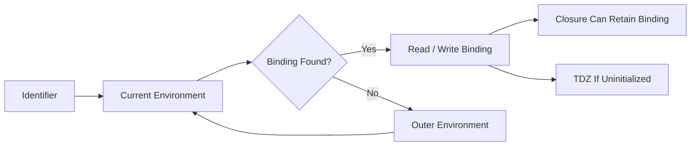
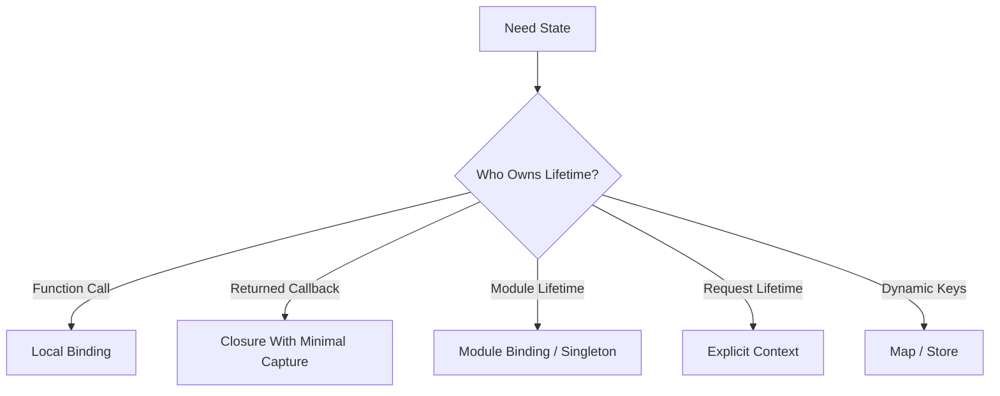

# 002.02.02 Lexical Environments

Category: JavaScript Internals<br>
Topic: 002.02 Runtime Semantics

Lexical environments are the internal structures JavaScript uses to resolve identifiers. They explain why a variable is visible in one place but not another, why closures work after an outer function returns, why `let` and `const` have a temporal dead zone, and why module imports are live bindings.

If execution contexts answer "what code is running?", lexical environments answer "where does this name come from?"

---

## 1. Definition

A lexical environment is a specification-level structure that maps identifier names to bindings and points to an outer lexical environment.

One-line definition:

- A lexical environment is a binding table plus an outer link used for lexical name resolution.

Expanded explanation:

- Each lexical environment contains an environment record.
- The environment record stores bindings such as `let`, `const`, function declarations, class declarations, parameters, imports, or object-backed global bindings.
- The lexical environment points to an outer environment, forming a chain.
- Identifier lookup walks this chain until it finds a binding or fails with `ReferenceError`.

Conceptual shape:

```text
LexicalEnvironment
  EnvironmentRecord
    name -> binding
  OuterLexicalEnvironment -> another LexicalEnvironment or null
```

Example:

```js
const globalName = "global";

function outer() {
  const outerName = "outer";

  function inner() {
    return `${globalName}:${outerName}`;
  }

  return inner;
}
```

`inner` resolves `outerName` through the retained outer lexical environment and `globalName` through the global lexical environment.

---

## 2. Why It Exists

JavaScript needs lexical environments to implement lexical scoping.

The runtime must answer:

- Where is `user` declared?
- Is `count` initialized yet?
- Should this assignment update a local, outer, module, or global binding?
- Can this closure still access a variable after the outer function returned?
- Does this `catch` parameter shadow an outer variable?
- Is an imported binding live?
- Should this name lookup throw `ReferenceError`?

Lexical environments make these features possible:

- block scope,
- function scope,
- closures,
- TDZ,
- module live bindings,
- catch scope,
- class private names together with private environments,
- global lexical bindings,
- direct eval behavior,
- identifier shadowing.

Production relevance:

- closure leaks retain environments,
- shadowing causes subtle bugs,
- module cycles expose uninitialized bindings,
- async callbacks keep lexical state alive,
- wrong variable capture in loops causes incorrect behavior,
- runtime config captured too early can become stale,
- debugging scope chains explains many "why is this value still here?" incidents.

---

## 3. Syntax & Variants

Lexical environments are created by language constructs.

### Global lexical environment

```js
let appMode = "prod";
const version = "1.0.0";
```

Global `let` and `const` create global lexical bindings but do not become properties on `globalThis`.

### Function environment

```js
function greet(name) {
  const message = `Hello, ${name}`;
  return message;
}
```

Function calls create environments for parameters and local declarations.

### Block environment

```js
if (enabled) {
  let message = "enabled";
  console.log(message);
}
```

Blocks can create lexical environments for `let`, `const`, class declarations, and block-scoped function behavior depending on mode and environment.

### Loop environment

```js
const callbacks = [];

for (let i = 0; i < 3; i += 1) {
  callbacks.push(() => i);
}
```

`let` in loops can create a fresh binding per iteration, which is why this returns `0`, `1`, `2` instead of all `3`.

### Catch environment

```js
try {
  throw new Error("failed");
} catch (error) {
  console.log(error.message);
}
```

`catch` creates a scope for the catch parameter.

### Module environment

```js
import { count } from "./counter.js";
export const label = `count:${count}`;
```

Modules use module environment records and live bindings.

### Object environment record

Classic `with` uses an object environment record.

```js
with (obj) {
  console.log(name);
}
```

`with` makes identifier resolution dynamic and is disallowed in strict mode.

---

## 4. Internal Working

Identifier resolution follows an environment chain.



### Binding creation

During context setup, declarations are discovered and bindings are created.

```js
function example() {
  var a = 1;
  let b = 2;
  const c = 3;
}
```

Conceptually:

- `a` is a `var` binding initialized to `undefined`.
- `b` is a lexical binding initially uninitialized.
- `c` is a lexical binding initially uninitialized.
- `b` and `c` are initialized when their declarations execute.

### TDZ

```js
console.log(value);
let value = 1;
```

The binding exists, but it is uninitialized. Access throws `ReferenceError`.

### Outer link

```js
function outer() {
  const token = "abc";

  return function inner() {
    return token;
  };
}
```

`inner` stores a link to the lexical environment where `token` exists.

### Shadowing

```js
const value = "global";

function read() {
  const value = "local";
  return value;
}
```

Lookup finds the nearest binding first.

### Live bindings

```js
// counter.js
export let count = 0;
export function increment() {
  count += 1;
}
```

Importers observe the same binding, not a copied value.

### Environment record types

Common conceptual records:

- Declarative environment record: stores bindings for functions, blocks, catch, modules.
- Object environment record: binds names to object properties, used by `with` and part of global behavior.
- Global environment record: combines object-backed global bindings and declarative global lexical bindings.
- Module environment record: supports imports, exports, and live bindings.
- Function environment record: includes `this`, `super`, parameters, and function-specific behavior.

---

## 5. Memory Behavior

Lexical environments can be short-lived or retained.

### Short-lived environment

```js
function sum(a, b) {
  const total = a + b;
  return total;
}
```

If no inner function captures `total`, the environment can be discarded after the call.

### Retained environment

```js
function makeFormatter(prefix) {
  return function format(value) {
    return `${prefix}:${value}`;
  };
}

const formatOrder = makeFormatter("order");
```

The `prefix` binding remains alive because `formatOrder` uses it.

### Async retention

```js
async function handle(payload) {
  const parsed = JSON.parse(payload);
  await save(parsed.id);
  return parsed.status;
}
```

Bindings needed after `await` can be retained across the async suspension.

### Memory leak pattern

```js
function attach(element, data) {
  element.addEventListener("click", () => {
    console.log(data.largePayload.id);
  });
}
```

The event listener retains `data` through the closure. If the listener is never removed, the environment remains reachable.

### Memory diagram



### Production memory signals

- heap snapshots show `Closure` retaining large objects,
- DOM nodes retained by listeners,
- timers keep old config/state alive,
- async jobs retain payloads across awaits,
- caches store closures that capture request data.

---

## 6. Execution Behavior

### Lookup order

```js
const value = "global";

function outer() {
  const value = "outer";

  function inner() {
    const value = "inner";
    return value;
  }

  return inner();
}
```

`inner` returns `"inner"` because lookup starts in the nearest environment.

### Outer lookup

```js
const taxRate = 0.18;

function total(amount) {
  return amount + amount * taxRate;
}
```

`taxRate` is not local, so lookup moves outward.

### Assignment lookup

```js
let count = 0;

function increment() {
  count += 1;
}
```

Assignment resolves the binding and updates it. It does not create a new local binding unless a declaration exists.

### Accidental global in sloppy mode

```js
function bad() {
  missingDeclaration = 1;
}
```

In sloppy scripts, assignment to an unresolved reference can create a global property. Strict mode throws.

### Per-iteration environment

```js
const fns = [];

for (let i = 0; i < 3; i += 1) {
  fns.push(() => i);
}

console.log(fns.map((fn) => fn())); // [0, 1, 2]
```

Each iteration has a distinct `i` binding.

### `var` loop capture

```js
const fns = [];

for (var i = 0; i < 3; i += 1) {
  fns.push(() => i);
}

console.log(fns.map((fn) => fn())); // [3, 3, 3]
```

There is one function/global-scoped `i` binding.

---

## 7. Scope & Context Interaction

Execution contexts hold references to lexical environments.

```text
Execution Context
  -> LexicalEnvironment
       EnvironmentRecord
       Outer -> LexicalEnvironment
  -> VariableEnvironment
```

### Lexical scope vs dynamic call stack

```js
function makeReader() {
  const value = "created";
  return function read() {
    return value;
  };
}

function callReader(fn) {
  const value = "caller";
  return fn();
}

callReader(makeReader()); // "created"
```

The function resolves variables based on where it was created, not where it was called.

### `this` is not lexical environment lookup

```js
const value = "global";

const obj = {
  value: "object",
  read() {
    return this.value;
  },
};
```

`this` comes from call form, not identifier lookup. Arrow functions are different because they capture lexical `this`.

### VariableEnvironment vs LexicalEnvironment

Historically and spec-wise, execution contexts distinguish variable and lexical environments in some cases.

Practical model:

- `var` and function declarations often belong to the variable environment.
- `let`, `const`, class, and block declarations belong to lexical environments.
- During execution, current lexical environment can change when entering blocks.

### Module live binding context

```js
import { featureEnabled } from "./flags.js";
```

The imported name is resolved through a module environment record that references the exporting module's binding.

### Direct eval

```js
function demo() {
  let local = 1;
  eval("local = 2");
  return local;
}
```

Direct eval can interact with local lexical environments, which is one reason it complicates optimization and reasoning.

---

## 8. Common Examples

### Example 1: Block scope

```js
if (true) {
  const message = "inside";
}

console.log(message); // ReferenceError
```

The `message` binding exists only in the block's lexical environment.

### Example 2: Shadowing

```js
const status = "global";

function render() {
  const status = "local";
  return status;
}
```

Local `status` shadows global `status`.

### Example 3: Closure state

```js
function createStore(initialValue) {
  let value = initialValue;

  return {
    get() {
      return value;
    },
    set(next) {
      value = next;
    },
  };
}
```

Both methods share the same retained lexical environment.

### Example 4: Module live binding

```js
// feature.js
export let enabled = false;
export function enable() {
  enabled = true;
}
```

```js
// app.js
import { enabled, enable } from "./feature.js";

console.log(enabled); // false
enable();
console.log(enabled); // true
```

`enabled` is live.

### Example 5: Catch parameter scope

```js
const error = "outer";

try {
  throw new Error("inner");
} catch (error) {
  console.log(error.message);
}

console.log(error); // "outer"
```

The catch parameter shadows the outer `error`.

### Example 6: Per-iteration binding

```js
const handlers = [];

for (let index = 0; index < 3; index += 1) {
  handlers.push(() => index);
}
```

Each handler captures a different `index` binding.

---

## 9. Confusing / Tricky Examples

### Trap 1: TDZ makes `typeof` throw

```js
{
  console.log(typeof value);
  let value = 1;
}
```

This throws because `value` is in the TDZ.

### Trap 2: Closure captures binding, not value snapshot

```js
let count = 0;

const read = () => count;
count = 5;

console.log(read()); // 5
```

The closure sees the binding's current value.

### Trap 3: Loop capture with `var`

```js
for (var i = 0; i < 3; i += 1) {
  setTimeout(() => console.log(i), 0);
}
```

Logs `3`, `3`, `3`.

### Trap 4: Shadowing can hide imports

```js
import { config } from "./config.js";

function start(config) {
  return config.port;
}
```

The parameter shadows the imported binding.

### Trap 5: Global lexical bindings are not global object properties

```js
let app = "x";
console.log(globalThis.app); // usually undefined
```

But:

```js
var legacy = "x";
console.log(globalThis.legacy); // script environments commonly expose this
```

### Trap 6: Imported bindings are read-only from importer

```js
import { count } from "./counter.js";

count += 1; // TypeError in modules
```

The exporting module controls mutation.

---

## 10. Real Production Use Cases

### React stale closures

Problem:

- event handler uses stale state.

Connection:

- the handler closes over bindings from a particular render.

Fix direction:

- understand render scope,
- use functional updates,
- manage dependencies intentionally,
- avoid pretending closures update magically.

### Node config captured too early

Problem:

- tests update environment/config but service still uses old value.

Connection:

- module-level constants capture configuration during module evaluation.

Fix direction:

- load config explicitly,
- pass config into factories,
- avoid hidden module-scope reads in testable code.

### Event listener leak

Problem:

- old page state remains in memory after navigation.

Connection:

- listener closure retains lexical environment.

Fix direction:

- remove listeners,
- use lifecycle cleanup,
- capture minimal data.

### Feature flag snapshot bug

Problem:

- function continues reading old flags after refresh.

Connection:

- closure captured a snapshot object instead of reading current store binding.

Fix direction:

- define whether code should capture snapshot or live source,
- name APIs accordingly.

### Module cycle ReferenceError

Problem:

- module import cycle throws before initialization.

Connection:

- live binding exists but is uninitialized during module evaluation.

Fix direction:

- break cycles,
- move shared constants,
- avoid top-level work that reads cyclic imports.

---

## 11. Interview Questions

### Basic

1. What is a lexical environment?
2. What is an environment record?
3. What is an outer lexical environment?
4. How does JavaScript resolve an identifier?
5. What is the TDZ?

### Intermediate

1. Why do closures work after the outer function returns?
2. Why does `let` in a loop fix the classic closure bug?
3. How do global `let` and global `var` differ?
4. What is shadowing?
5. How do module live bindings differ from copied values?

### Advanced

1. Explain declarative, object, global, function, and module environment records.
2. How does direct eval affect lexical environments?
3. Why can closures cause memory leaks?
4. How do async functions retain lexical state across `await`?
5. How can module cycles expose uninitialized bindings?

### Tricky

1. Does a closure capture a value or a binding?
2. Is the scope chain the same as the call stack?
3. Why can `typeof x` throw when `x` is a `let` binding in TDZ?
4. Can an imported binding be reassigned by the importer?
5. Is `globalThis.x` always the same as global `x`?

Strong answers should trace identifier lookup through environment records and outer links.

---

## 12. Senior-Level Pitfalls

### Pitfall 1: Capturing too much in closures

Closures retain bindings and often the objects those bindings reference.

Senior correction:

- capture minimal values,
- clean up listeners/timers,
- inspect heap retainer paths.

### Pitfall 2: Confusing binding capture with value snapshot

Closures capture bindings.

Senior correction:

- make snapshot vs live behavior explicit in API names and implementation.

### Pitfall 3: Module-scope state in request systems

Module state is shared across requests in a Node process.

Senior correction:

- avoid request-specific module state,
- use explicit request context,
- test concurrent requests.

### Pitfall 4: Shadowing critical names

Shadowing can hide imports, globals, or outer state.

Senior correction:

- use lint rules for confusing shadowing,
- name parameters precisely,
- avoid broad names like `config`, `data`, and `state` in nested scopes.

### Pitfall 5: Overusing direct eval

Eval can access local lexical environments and break optimization assumptions.

Senior correction:

- avoid eval,
- use safe parsers or expression evaluators.

### Pitfall 6: Ignoring module cycles

Live bindings plus evaluation order can create TDZ-like failures.

Senior correction:

- enforce dependency graph rules,
- move contracts to acyclic modules,
- delay reads until after initialization when necessary.

---

## 13. Best Practices

### Scoping

- Prefer `const` by default.
- Use `let` for intentional reassignment.
- Avoid `var` in modern code unless maintaining legacy code.
- Keep variable scope as narrow as possible.
- Avoid shadowing that reduces clarity.

### Closures

- Use closures intentionally for encapsulation.
- Avoid capturing large payloads accidentally.
- Clean up closures registered with listeners, timers, or subscriptions.
- In React and Angular, understand render/lifecycle scope.

### Modules

- Avoid mutable module state for request-specific data.
- Prefer explicit factories for configurable services.
- Avoid circular imports.
- Treat imported bindings as live but read-only from importer code.

### Runtime safety

- Use strict mode/module semantics.
- Avoid direct eval.
- Validate external data before storing in long-lived closures.
- Use heap snapshots to investigate retained environments.

### Tooling

- Enable no-shadow rules where helpful.
- Use TypeScript no-use-before-define settings carefully.
- Use lint rules to catch accidental globals.
- Use dependency graph tooling to detect module cycles.

---

## 14. Debugging Scenarios

### Scenario 1: Stale closure in UI

Symptoms:

- button handler uses old state value.

Debugging flow:

```text
Find handler creation
  -> identify which render created closure
  -> inspect dependencies / captured bindings
  -> switch to functional update or current ref where appropriate
```

Root cause:

- closure captured binding from a previous render scope.

### Scenario 2: Memory leak from listener

Symptoms:

- heap snapshot shows old component retained.

Debugging flow:

```text
Take heap snapshot
  -> inspect retainer path
  -> find event listener closure
  -> remove listener on cleanup
  -> reduce captured values
```

Root cause:

- lexical environment remains reachable through listener.

### Scenario 3: Unexpected `ReferenceError`

Symptoms:

- `Cannot access 'config' before initialization`.

Debugging flow:

```text
Find binding declaration
  -> check TDZ access
  -> check module cycle
  -> check shadowing
  -> reorder or break dependency
```

Root cause:

- binding exists but is uninitialized.

### Scenario 4: Wrong tenant in Node service

Symptoms:

- request A sees tenant from request B.

Debugging flow:

```text
Search module-scope mutable state
  -> reproduce with concurrent requests
  -> pass context explicitly
  -> add concurrency test
```

Root cause:

- shared module binding used as request-local state.

### Scenario 5: Config changes ignored in tests

Symptoms:

- test changes env var but service still uses old value.

Debugging flow:

```text
Inspect module evaluation
  -> find top-level config capture
  -> refactor into loadConfig/factory
  -> reset module cache only as last resort in tests
```

Root cause:

- lexical binding captured at module load time.

---

## 15. Exercises / Practice

### Exercise 1: Trace lookup

```js
const value = "global";

function outer() {
  const value = "outer";
  return function inner() {
    return value;
  };
}

console.log(outer()());
```

Draw the environment chain used by `inner`.

### Exercise 2: TDZ prediction

```js
{
  console.log(typeof feature);
  const feature = "on";
}
```

Predict the result and explain why.

### Exercise 3: Loop closure

Predict:

```js
const a = [];
for (var i = 0; i < 3; i += 1) a.push(() => i);

const b = [];
for (let j = 0; j < 3; j += 1) b.push(() => j);

console.log(a.map((fn) => fn()));
console.log(b.map((fn) => fn()));
```

### Exercise 4: Avoid retention

Refactor:

```js
function makeHandler(payload) {
  return () => payload.records.length;
}
```

Assume only `records.length` is needed.

### Exercise 5: Module live binding

Explain why this logs the updated value:

```js
// state.js
export let ready = false;
export function markReady() {
  ready = true;
}
```

```js
// app.js
import { ready, markReady } from "./state.js";
markReady();
console.log(ready);
```

---

## 16. Comparison

### Lexical environment vs execution context

| Concept | Main Job | Lifetime |
| --- | --- | --- |
| Execution context | Track running code and control flow | Usually call duration, can suspend |
| Lexical environment | Resolve identifiers and retain bindings | Can outlive call if captured |

### `var` vs `let` vs `const`

| Feature | `var` | `let` | `const` |
| --- | --- | --- | --- |
| Scope | Function/global | Block | Block |
| Initial state | `undefined` | Uninitialized TDZ | Uninitialized TDZ |
| Reassign | Yes | Yes | No binding reassignment |
| Global object property in scripts | Often yes | No | No |
| Per-loop binding | No | Yes in `for` loops | Yes where applicable |

### Object environment vs declarative environment

| Environment Record | Stores Bindings In | Example |
| --- | --- | --- |
| Declarative | internal binding table | function/block/module scope |
| Object | object properties | `with`, global object part |
| Module | module binding records | imports/exports |
| Function | declarative plus function-specific data | parameters, `this`, `super` |

### Snapshot vs live binding

| Pattern | Behavior |
| --- | --- |
| Closure over binding | reads latest value of that binding |
| Local copied value | snapshot at copy time |
| Module import | live binding to exporter |
| Destructured object property | snapshot of property value at destructure time |

---

## 17. Related Concepts

Lexical Environments connect to:

- `002.02.01 Execution Contexts`: contexts hold lexical environments.
- `001.01.02 Scope, Closures, and Hoisting`: user-facing behavior.
- `001.01.01 Variables & Declarations`: declaration semantics.
- `002.02.03 Microtasks and Macrotasks`: async callbacks retain lexical state.
- `002.03.03 Leaks and Retainers`: closures retain environments.
- Modules and Bundling Boundaries: module live bindings and cycles.
- React State Management: stale closures and render scope.
- Node.js Request Context: avoiding shared module bindings for request data.

Knowledge graph:



---

## Advanced Add-ons

### Performance Impact

Lexical environments affect performance through:

- closure allocation,
- retained context objects,
- variable lookup complexity in dynamic cases,
- optimization barriers from direct eval and `with`,
- memory pressure from captured data,
- async continuation state.

Guidance:

- do not fear closures in normal code,
- do avoid accidental large captures in long-lived callbacks,
- avoid direct eval and `with`,
- prefer narrow scopes,
- profile before rewriting lexical patterns.

### System Design Relevance

Lexical environments matter to system design because state lifetime and ownership are architectural concerns.

Examples:

- Node services should not store request state in shared module bindings.
- Frontend components must clean up closures registered externally.
- Feature-flag systems must distinguish live reads from snapshots.
- Configuration should be loaded and passed intentionally.
- Long-running jobs should avoid retaining full payloads across awaits.

Decision framework:



### Security Impact

Lexical environment bugs can create security issues:

- secrets retained in closures longer than expected,
- tenant/user context stored globally,
- shadowing hides security checks,
- eval accesses local scope,
- module cycles bypass expected initialization order.

Practices:

- avoid capturing secrets in long-lived callbacks,
- pass authorization context explicitly,
- lint shadowing around security-sensitive names,
- avoid eval,
- clear references when lifecycle ends.

### Browser vs Node Behavior

Browser:

- global `let`/`const` do not become `window` properties,
- event listeners often retain DOM and component environments,
- closures across renders cause stale-state bugs,
- iframes/workers have separate globals and realms.

Node:

- module bindings live for process/module-cache lifetime,
- CommonJS and ESM differ in module wrapping and live binding semantics,
- request-specific data must not be stored in module bindings,
- async callbacks often retain request payloads.

Shared:

- lexical lookup is based on source location,
- closures capture bindings,
- TDZ applies before initialization,
- direct eval complicates local environments.

### Polyfill / Implementation

You cannot polyfill lexical environments, but you can model identifier lookup.

```ts
type Env = {
  bindings: Map<string, unknown>;
  outer?: Env;
};

function resolve(env: Env, name: string): unknown {
  if (env.bindings.has(name)) {
    return env.bindings.get(name);
  }

  if (env.outer) {
    return resolve(env.outer, name);
  }

  throw new ReferenceError(`${name} is not defined`);
}

const globalEnv: Env = {
  bindings: new Map([["appName", "Interview"]]),
};

const functionEnv: Env = {
  bindings: new Map([["user", "Ava"]]),
  outer: globalEnv,
};

console.log(resolve(functionEnv, "appName")); // Interview
```

This model omits TDZ, mutable/immutable binding records, `this`, modules, private names, and many spec details. It is only a learning sketch.

---

## 18. Summary

Lexical environments are how JavaScript resolves names and preserves scope.

Quick recall:

- A lexical environment is an environment record plus an outer link.
- Identifier lookup walks the environment chain.
- Closures retain lexical environments.
- `let` and `const` bindings exist before initialization and can be in TDZ.
- `var` is function/global scoped and initialized to `undefined`.
- `let` in loops can create per-iteration bindings.
- Module imports are live bindings.
- Global lexical bindings are not the same as global object properties.
- Direct eval and `with` complicate lexical reasoning.
- Many memory leaks are retained lexical environments through closures.

Staff-level takeaway:

- Lexical environment mastery gives you a precise model for closures, TDZ, stale state, module live bindings, retained memory, and the difference between where code is called and where names are resolved.
