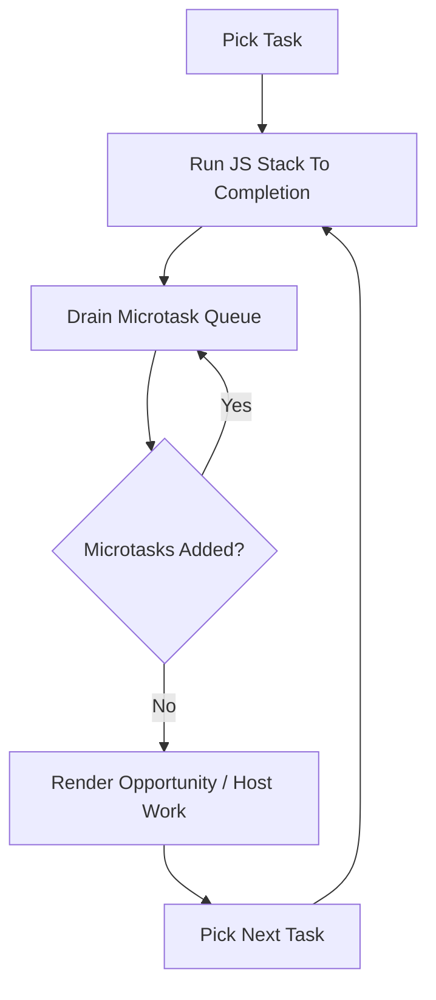
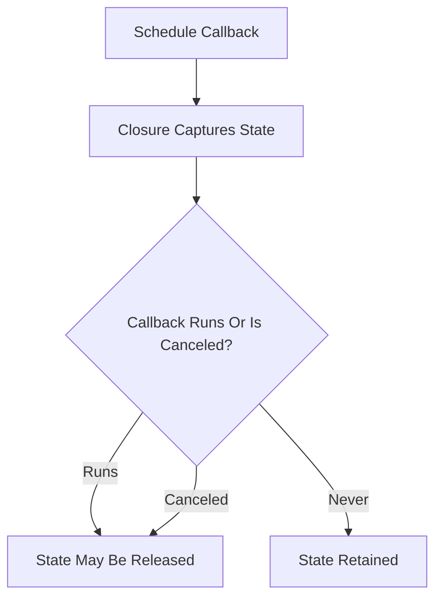
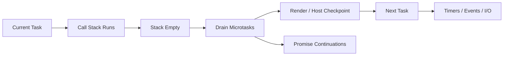
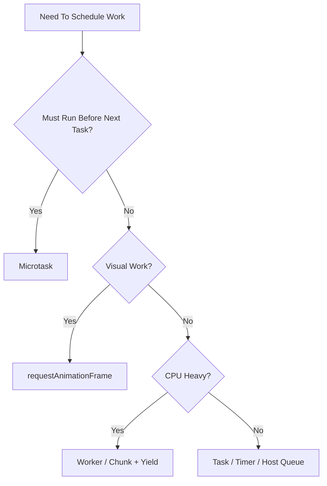

# 002.02.03 Microtasks and Macrotasks

Category: JavaScript Internals<br>
Topic: 002.02 Runtime Semantics

Microtasks and macrotasks describe how JavaScript runtimes schedule asynchronous work around the call stack. The precise web-platform term is usually "task" rather than "macrotask," but "macrotask" is widely used in interviews and teaching to distinguish task-queue work from microtask-queue work.

This topic explains why Promise callbacks run before timers, why too many microtasks can starve rendering or I/O, why Node's `process.nextTick` needs special care, and why async ordering bugs are often scheduling bugs rather than Promise bugs.

---

## 1. Definition

A task, commonly called a macrotask, is a unit of work scheduled by the host environment, such as script execution, timers, I/O callbacks, UI events, or message events.

A microtask is a higher-priority job that runs after the current JavaScript stack becomes empty and before the runtime moves to the next task or rendering checkpoint.

One-line definition:

- Tasks start turns of the event loop; microtasks run at checkpoints before the next task proceeds.

Expanded explanation:

- JavaScript execution is single-threaded per agent/event loop, but hosts schedule work queues.
- A task enters the call stack and runs to completion.
- When the stack is empty, the runtime drains the microtask queue.
- Promise reactions, `queueMicrotask`, and mutation observer callbacks are typical browser microtasks.
- Timers, events, network callbacks, and message callbacks are typical tasks.
- Node.js has additional scheduling details, including `process.nextTick`, timers, poll, check, and close phases.

Core model:

```text
Take one task
  -> run JavaScript until stack is empty
  -> drain microtasks
  -> maybe render / perform host work
  -> take next task
```

---

## 2. Why It Exists

JavaScript needs scheduling queues because asynchronous work cannot all run immediately.

The runtime must coordinate:

- initial script execution,
- timers,
- user input,
- network callbacks,
- Promise continuations,
- async/await resumption,
- rendering,
- I/O,
- cleanup callbacks,
- host APIs.

Microtasks exist because some asynchronous continuations should run very soon after current code completes, before other external events run.

Examples:

- Promise `.then()` should run after current synchronous code.
- `await` continuation should resume predictably through Promise jobs.
- frameworks can batch state updates before browser rendering.
- mutation observers can report DOM changes at consistent checkpoints.

Tasks exist because host events need turns:

- click events,
- `setTimeout`,
- `setInterval`,
- message channels,
- I/O callbacks,
- script loading,
- rendering-related work.

Production relevance:

- Promise callbacks can run before timers and surprise ordering assumptions.
- Recursive microtasks can starve rendering or I/O.
- Long tasks block input and paint.
- Node `process.nextTick` can starve Promise microtasks and I/O when abused.
- Test flakiness often comes from not flushing the right queue.
- UI frameworks rely on microtask/task scheduling for batching and rendering.

---

## 3. Syntax & Variants

### Promise microtasks

```js
Promise.resolve().then(() => {
  console.log("promise");
});
```

The `.then` callback runs as a microtask after the current synchronous stack completes.

### `queueMicrotask`

```js
queueMicrotask(() => {
  console.log("microtask");
});
```

Use when you need microtask scheduling without creating a Promise chain for control flow.

### `async` / `await`

```js
async function run() {
  console.log("A");
  await null;
  console.log("B");
}
```

Code after `await` resumes through microtask scheduling.

### Timer task

```js
setTimeout(() => {
  console.log("timer");
}, 0);
```

The callback is scheduled as a future task. `0` does not mean immediate execution.

### Interval task

```js
const id = setInterval(() => {
  console.log("tick");
}, 1000);

clearInterval(id);
```

Intervals schedule repeated tasks, but execution can drift if the event loop is busy.

### Browser message task

```js
const channel = new MessageChannel();

channel.port1.onmessage = () => {
  console.log("message task");
};

channel.port2.postMessage(null);
```

Message channels are often used for scheduling task-like work.

### Browser rendering callback

```js
requestAnimationFrame(() => {
  console.log("before paint");
});
```

`requestAnimationFrame` is aligned with rendering, not simply a microtask or timer.

### Node `process.nextTick`

```js
process.nextTick(() => {
  console.log("nextTick");
});
```

In Node, `nextTick` callbacks run before Promise microtasks after the current operation. Overuse can starve the event loop.

### Node `setImmediate`

```js
setImmediate(() => {
  console.log("immediate");
});
```

`setImmediate` runs in Node's check phase. Its ordering relative to timers can depend on where it is scheduled.

---

## 4. Internal Working

### Browser event loop model



Important rule:

- microtasks are drained until the queue is empty.

That means a microtask can schedule another microtask, and the runtime keeps draining before moving on.

### Example ordering

```js
console.log("sync");

setTimeout(() => console.log("timer"), 0);

Promise.resolve().then(() => console.log("promise"));

console.log("end");
```

Output:

```text
sync
end
promise
timer
```

Why:

```text
Initial script task runs
  -> sync logs
  -> timer task scheduled
  -> promise microtask scheduled
  -> script stack ends
  -> microtask queue drains
  -> next task runs timer
```

### Async/await transformation mental model

```js
async function run() {
  console.log("A");
  await Promise.resolve();
  console.log("B");
}
```

Mental model:

```text
run starts synchronously
  -> logs A
  -> returns pending Promise
  -> schedules continuation when awaited promise settles
  -> continuation runs as microtask
```

### Node event loop model

Node has phases such as:

```text
timers
pending callbacks
idle / prepare
poll
check
close callbacks
```

Between these operations, Node also processes:

- `process.nextTick` queue,
- Promise microtask queue.

Practical ordering:

```js
console.log("sync");

setTimeout(() => console.log("timeout"), 0);
setImmediate(() => console.log("immediate"));

Promise.resolve().then(() => console.log("promise"));
process.nextTick(() => console.log("nextTick"));
```

Common top-level Node output:

```text
sync
nextTick
promise
timeout/immediate order can vary by context
```

The exact timer vs immediate ordering depends on scheduling context and event loop phase.

### Microtask checkpoint

A microtask checkpoint is when the runtime drains microtasks. It commonly happens:

- after a script/task finishes,
- after Promise settlement jobs,
- before returning control to host work,
- at specific host-defined checkpoints.

---

## 5. Memory Behavior

Scheduled callbacks keep their closures alive until they run or are canceled.

### Timer retention

```js
function schedule(payload) {
  setTimeout(() => {
    console.log(payload.id);
  }, 60_000);
}
```

The timer callback retains `payload` for up to 60 seconds.

### Promise retention

```js
function process(payload) {
  return Promise.resolve().then(() => payload.records.length);
}
```

The microtask retains `payload` until it runs.

### Long promise chain

```js
let promise = Promise.resolve();

for (const item of largeList) {
  promise = promise.then(() => processItem(item));
}
```

This can create many queued continuations and retain data longer than expected.

### Recursive microtask memory pressure

```js
function loop() {
  queueMicrotask(loop);
}

loop();
```

This can starve the runtime and prevent tasks, rendering, timers, or I/O from progressing.

### Resource model



Production risks:

- timers retain stale request state,
- unbounded Promise queues retain payloads,
- microtask storms increase memory and CPU,
- missing `clearTimeout` or `AbortController` causes stale work,
- UI components unmount but scheduled callbacks still reference them.

---

## 6. Execution Behavior

### Run-to-completion

JavaScript does not interrupt a currently running stack to run another callback.

```js
setTimeout(() => console.log("timer"), 0);

for (let i = 0; i < 1_000_000_000; i += 1) {
  // blocks
}

console.log("done");
```

The timer cannot run until the loop finishes and the stack clears.

### Microtasks before next task

```js
setTimeout(() => console.log("timer"), 0);

queueMicrotask(() => console.log("microtask"));

console.log("sync");
```

Output:

```text
sync
microtask
timer
```

### Microtask drain can chain

```js
queueMicrotask(() => {
  console.log("a");
  queueMicrotask(() => console.log("b"));
});

setTimeout(() => console.log("timer"), 0);
```

Output:

```text
a
b
timer
```

### Rendering interaction

In browsers, rendering generally cannot happen while JavaScript is running. A long task or endless microtask chain can delay paint.

```js
button.addEventListener("click", () => {
  while (performance.now() < start + 200) {
    // long task
  }
});
```

This blocks input responsiveness and rendering.

### Async function ordering

```js
async function run() {
  console.log("1");
  await null;
  console.log("2");
}

run();
console.log("3");
```

Output:

```text
1
3
2
```

### Node `nextTick` starvation

```js
function spin() {
  process.nextTick(spin);
}

spin();
```

This can starve I/O and Promise jobs. Do not use `nextTick` for unbounded recursion.

---

## 7. Scope & Context Interaction

Scheduled callbacks capture lexical environments and run in later execution contexts.

### Closure across task boundary

```js
function start(user) {
  setTimeout(() => {
    console.log(user.id);
  }, 1000);
}
```

The timer callback runs in a later task but still has access to `user` through closure retention.

### Closure across microtask boundary

```js
function start(user) {
  Promise.resolve().then(() => {
    console.log(user.id);
  });
}
```

The Promise reaction runs as a microtask after the current stack completes.

### Execution context vs scheduling queue

```text
Callback scheduled
  -> lexical environment retained
  -> later queue selects callback
  -> new execution context created for callback
  -> callback runs
```

### `this` in scheduled callbacks

```js
const service = {
  id: "svc",
  start() {
    setTimeout(function () {
      console.log(this.id);
    }, 0);
  },
};
```

The callback's `this` is not automatically the service object.

Fix:

```js
setTimeout(() => {
  console.log(this.id);
}, 0);
```

or bind explicitly.

### AsyncLocalStorage / context propagation

In Node, application request context may need to flow through async boundaries.

```ts
import { AsyncLocalStorage } from "node:async_hooks";

const storage = new AsyncLocalStorage<{ requestId: string }>();
```

This is not the same as lexical scope. It is runtime async context propagation provided by Node.

---

## 8. Common Examples

### Example 1: Promise beats timer

```js
setTimeout(() => console.log("timeout"), 0);
Promise.resolve().then(() => console.log("promise"));
console.log("sync");
```

Output:

```text
sync
promise
timeout
```

### Example 2: Await yields

```js
async function main() {
  console.log("A");
  await Promise.resolve();
  console.log("B");
}

main();
console.log("C");
```

Output:

```text
A
C
B
```

### Example 3: Microtask batching

```js
let pending = false;
const updates = [];

function scheduleUpdate(update) {
  updates.push(update);

  if (!pending) {
    pending = true;
    queueMicrotask(() => {
      pending = false;
      flush(updates.splice(0));
    });
  }
}
```

This batches synchronous calls into one microtask flush.

### Example 4: Yielding to tasks

```js
async function processInChunks(items) {
  for (let i = 0; i < items.length; i += 100) {
    processChunk(items.slice(i, i + 100));
    await new Promise((resolve) => setTimeout(resolve, 0));
  }
}
```

This yields to the task queue between chunks. In browsers, it gives the UI chances to respond.

### Example 5: Node immediate after I/O

```js
import { readFile } from "node:fs";

readFile("data.txt", () => {
  setTimeout(() => console.log("timeout"), 0);
  setImmediate(() => console.log("immediate"));
});
```

Inside an I/O callback, `setImmediate` often runs before `setTimeout(0)` because of Node's event loop phases.

---

## 9. Confusing / Tricky Examples

### Trap 1: `setTimeout(fn, 0)` is not immediate

It schedules a future task. Current stack and microtasks run first.

### Trap 2: Microtasks can starve tasks

```js
function repeat() {
  queueMicrotask(repeat);
}

repeat();
setTimeout(() => console.log("never soon"), 0);
```

The timer may not get a chance if microtasks never stop.

### Trap 3: `await` does not block the thread

`await` suspends the async function and lets the current stack finish. It does not pause the entire runtime.

### Trap 4: Node and browser ordering differ

`process.nextTick` has no browser equivalent and runs before Promise microtasks in Node's processing model.

### Trap 5: Timer delay is minimum-ish, not guaranteed

```js
setTimeout(fn, 10);
```

The callback cannot run before the delay, but it may run later due to busy event loop, clamping, throttling, tab backgrounding, or host scheduling.

### Trap 6: Promise executor is synchronous

```js
new Promise((resolve) => {
  console.log("executor");
  resolve();
}).then(() => console.log("then"));
```

The executor runs immediately; `.then` runs as a microtask.

---

## 10. Real Production Use Cases

### UI state batching

Frameworks schedule updates to batch multiple synchronous changes.

Risk:

- reading DOM or state immediately after scheduling may observe old values.

Debugging:

- identify whether update flush happens in microtask, task, animation frame, or framework scheduler.

### Long task causing input delay

Problem:

- user clicks but UI responds late.

Cause:

- JavaScript task runs too long before event loop can handle input.

Fix:

- split work,
- move work to worker,
- yield between chunks,
- reduce synchronous computation.

### Promise storm in API client

Problem:

- thousands of resolved Promises enqueue continuations and block rendering.

Fix:

- batch work,
- limit concurrency,
- yield to tasks when UI responsiveness matters.

### Node I/O starvation

Problem:

- service stops processing sockets while CPU appears busy.

Cause:

- recursive `process.nextTick` or heavy microtask chain.

Fix:

- use bounded queues,
- use `setImmediate` to yield to I/O,
- move CPU work off event loop.

### Test flakiness

Problem:

- tests assert before Promise callbacks, timers, or framework flushes complete.

Fix:

- flush microtasks for Promise work,
- advance fake timers for timer work,
- wait for framework-specific render flush,
- avoid mixing real and fake timers carelessly.

---

## 11. Interview Questions

### Basic

1. What is a microtask?
2. What is a task/macrotask?
3. Why does a Promise `.then` run before `setTimeout(..., 0)`?
4. Is a Promise executor synchronous or asynchronous?
5. What does run-to-completion mean?

### Intermediate

1. Explain the output of Promise/timer ordering examples.
2. How does `await` schedule continuation?
3. Why can microtasks starve rendering?
4. What is the difference between `queueMicrotask` and `setTimeout`?
5. How does `requestAnimationFrame` fit into browser scheduling?

### Advanced

1. How does Node's `process.nextTick` differ from Promise microtasks?
2. Why can `setImmediate` beat `setTimeout(0)` after I/O in Node?
3. How would you debug event-loop delay in a Node service?
4. How would you chunk CPU-heavy browser work without freezing the UI?
5. How do fake timers interact with Promise microtasks in tests?

### Tricky

1. Can a microtask schedule another microtask before timers run?
2. Does `await` always resume after all timers?
3. Is `setTimeout(0)` guaranteed to run after exactly 0 ms?
4. Are browser tasks and Node event-loop phases the same?
5. Can too many resolved Promises hurt performance?

Strong answers should identify the queue, timing checkpoint, host environment, and whether work runs before rendering/I/O.

---

## 12. Senior-Level Pitfalls

### Pitfall 1: Using microtasks for unbounded work

Microtasks drain before moving to the next task.

Senior correction:

- use tasks or chunking for long-running work,
- yield to rendering/I/O when needed.

### Pitfall 2: Assuming browser and Node queues are identical

Node has `process.nextTick`, event-loop phases, and server-side I/O behavior.

Senior correction:

- reason by runtime,
- test in the actual environment.

### Pitfall 3: Blocking the main thread with "async" code

`async` does not make CPU work parallel.

```js
async function heavy() {
  computeForTwoSeconds();
}
```

Senior correction:

- use workers, chunking, streaming, or offloading.

### Pitfall 4: Test utilities flush the wrong queue

Advancing timers may not flush Promise microtasks unless the test tool integrates both.

Senior correction:

- explicitly flush microtasks and timers according to the code path.

### Pitfall 5: Recursive `process.nextTick`

`nextTick` can starve I/O.

Senior correction:

- prefer `setImmediate` or bounded queues for yielding in Node.

### Pitfall 6: Assuming timer order is stable everywhere

Timer clamping, background tabs, event loop load, and Node phases affect order.

Senior correction:

- avoid correctness depending on fragile timer ordering.

---

## 13. Best Practices

### Browser

- Keep tasks short.
- Break CPU-heavy work into chunks.
- Use `requestAnimationFrame` for work tied to painting.
- Use `queueMicrotask` for immediate post-stack consistency work.
- Avoid endless Promise chains.
- Use Web Workers for heavy computation.
- Measure long tasks and INP when user interaction matters.

### Node

- Avoid CPU-heavy work on the event loop.
- Monitor event-loop delay.
- Use `setImmediate` to yield after chunks when appropriate.
- Avoid recursive `process.nextTick`.
- Limit concurrency for Promise-heavy workflows.
- Prefer streams/backpressure for large I/O.

### Testing

- Know whether code schedules microtasks, timers, animation frames, or framework flushes.
- Use fake timers carefully.
- Await Promise work explicitly.
- Avoid arbitrary sleeps.

### Architecture

- Do not use scheduling as a correctness crutch.
- Make ordering explicit through state machines, queues, or acknowledgments when correctness matters.
- Use backpressure for producer/consumer systems.
- Keep user-facing main-thread budgets visible.

---

## 14. Debugging Scenarios

### Scenario 1: Promise callback runs before timer

Symptoms:

- test expected timer result first.

Debugging flow:

```text
List scheduled work
  -> classify sync / microtask / task
  -> trace current stack end
  -> drain microtasks
  -> run next task
```

Root cause:

- Promise reaction is microtask; timer is task.

### Scenario 2: Browser freezes after API response

Symptoms:

- network is fast,
- UI freezes after data arrives.

Debugging flow:

```text
Record Performance trace
  -> inspect long task
  -> inspect microtask chain
  -> split render/data processing
  -> yield or move work to worker
```

Root cause:

- synchronous processing or microtask storm blocks rendering.

### Scenario 3: Node service event-loop delay high

Symptoms:

- CPU high,
- I/O latency rises,
- event-loop delay metric spikes.

Debugging flow:

```text
Capture CPU profile
  -> inspect nextTick / Promise chains
  -> find synchronous hot work
  -> chunk/offload/bound concurrency
```

Root cause:

- event loop is busy, so I/O callbacks wait.

### Scenario 4: Fake timer test hangs

Symptoms:

- test advances timers but Promise callback never observed.

Debugging flow:

```text
Identify scheduler
  -> flush pending Promises
  -> advance timers
  -> flush framework updates
  -> avoid mixing real/fake scheduling
```

Root cause:

- only the task queue was advanced, not microtasks or framework scheduler.

### Scenario 5: Recursive microtask starvation

Symptoms:

- timers do not fire,
- browser does not repaint,
- process appears stuck.

Debugging flow:

```text
Search queueMicrotask / Promise recursion
  -> add bound/yield
  -> replace with task-based chunking
  -> monitor responsiveness
```

Root cause:

- microtask queue never drains.

---

## 15. Exercises / Practice

### Exercise 1: Predict output

```js
console.log("A");

setTimeout(() => console.log("B"), 0);

Promise.resolve().then(() => console.log("C"));

console.log("D");
```

Explain every step.

### Exercise 2: Chained microtask

```js
setTimeout(() => console.log("timer"), 0);

Promise.resolve().then(() => {
  console.log("p1");
  queueMicrotask(() => console.log("m1"));
});
```

Predict output.

### Exercise 3: Await ordering

```js
async function run() {
  console.log("1");
  await null;
  console.log("2");
}

run();
Promise.resolve().then(() => console.log("3"));
console.log("4");
```

Predict output and explain microtask ordering.

### Exercise 4: Fix starvation

Refactor:

```js
function process(items) {
  if (items.length === 0) return;
  handle(items.shift());
  queueMicrotask(() => process(items));
}
```

Goal:

- preserve responsiveness,
- process all items,
- avoid starving timers/rendering.

### Exercise 5: Choose scheduler

Choose the right scheduling primitive:

```text
1. Run after current sync code but before next task.
2. Run before next browser paint.
3. Yield a Node CPU loop so I/O can progress.
4. Run after at least 500 ms.
5. Move CPU-heavy image processing off main thread.
```

Explain each choice.

---

## 16. Comparison

### Microtask vs task/macrotask

| Dimension | Microtask | Task / Macrotask |
| --- | --- | --- |
| Runs | After current stack, before next task | On a future event loop turn |
| Examples | Promise reactions, `queueMicrotask` | timers, events, messages, I/O callbacks |
| Draining | Queue drains fully | Usually one task selected per turn |
| Risk | Starvation if recursively scheduled | Long task blocks microtasks/rendering while running |
| Use | consistency after current operation | yielding, timers, events, host work |

### `queueMicrotask` vs `Promise.then`

| Feature | `queueMicrotask` | `Promise.resolve().then` |
| --- | --- | --- |
| Intent | Explicit microtask scheduling | Promise continuation |
| Allocation | Avoids extra Promise chain intent | Creates/uses Promise machinery |
| Error handling | thrown error reports like normal async exception behavior | rejection path |
| Readability | Clear for scheduling | Clear for Promise flow |

### `setTimeout(0)` vs `setImmediate` in Node

| API | Phase / Behavior | Use |
| --- | --- | --- |
| `setTimeout(fn, 0)` | timers phase after minimum delay | timer-style scheduling |
| `setImmediate(fn)` | check phase | yield after I/O / run soon after poll |

Ordering can vary depending on where they are scheduled.

### Browser scheduling choices

| API | Best For |
| --- | --- |
| `queueMicrotask` | post-stack consistency work |
| `setTimeout` | delayed/future task |
| `requestAnimationFrame` | visual updates before paint |
| `requestIdleCallback` | non-critical idle work where supported |
| Web Worker | CPU-heavy parallel work |

---

## 17. Related Concepts

Microtasks and Macrotasks connect to:

- `001.02.02 Event Loop and Tasks`: user-level event loop model.
- `001.02.03 Promises and Async-Await`: Promise jobs and async continuation.
- `002.02.01 Execution Contexts`: callbacks create execution contexts when run.
- `002.02.02 Lexical Environments`: scheduled callbacks retain closures.
- Browser Fundamentals: rendering and input events.
- Web Performance: long tasks, INP, responsiveness.
- Node.js: event loop phases, I/O, `process.nextTick`.
- Testing: fake timers, microtask flushing, async assertions.
- Production Debugging: event-loop delay, starvation, ordering races.

Knowledge graph:



---

## Advanced Add-ons

### Performance Impact

Microtask/task scheduling affects:

- input responsiveness,
- rendering delay,
- event-loop delay,
- timer drift,
- I/O latency,
- memory retention,
- test runtime,
- CPU fairness.

Performance guidance:

- keep tasks under user-facing latency budgets,
- avoid unbounded microtask chains,
- yield with tasks for long work,
- use workers for CPU-heavy operations,
- monitor browser long tasks and Node event-loop delay,
- limit Promise concurrency.

### System Design Relevance

Scheduling choices affect architecture:

- client apps need responsive main-thread scheduling,
- Node services need event-loop fairness,
- job processors need bounded queues,
- realtime systems need backpressure,
- tests need deterministic async control,
- UI frameworks need predictable batching.

Decision framework:



### Security Impact

Scheduling bugs can become security bugs:

- authorization state checked before async policy update completes,
- cleanup task delayed by microtask storm,
- time-of-check/time-of-use races in UI flows,
- unhandled rejections hiding failed security checks,
- stale closure using old permissions.

Practices:

- do not rely on fragile timer ordering for security,
- await critical checks explicitly,
- fail closed on async policy failures,
- handle Promise rejections,
- avoid stale permission snapshots.

### Browser vs Node Behavior

Browser:

- tasks include UI events, timers, messages, and script execution,
- microtasks drain before rendering opportunities,
- long tasks hurt responsiveness and INP,
- background tabs may throttle timers,
- `requestAnimationFrame` aligns with rendering.

Node:

- event loop has phases,
- `process.nextTick` runs before Promise microtasks in Node's model,
- `setImmediate` is tied to the check phase,
- I/O progress depends on not starving the poll phase,
- event-loop delay is an important production metric.

Shared:

- current JavaScript stack runs to completion,
- Promise reactions are microtasks,
- timers are future tasks,
- scheduling does not make CPU work parallel.

### Polyfill / Implementation

You cannot fully polyfill host event loops, but you can model queues.

```ts
class TinyLoop {
  private tasks: Array<() => void> = [];
  private microtasks: Array<() => void> = [];

  queueTask(task: () => void) {
    this.tasks.push(task);
  }

  queueMicrotask(task: () => void) {
    this.microtasks.push(task);
  }

  runOneTurn() {
    const task = this.tasks.shift();
    if (!task) return;

    task();

    while (this.microtasks.length > 0) {
      const microtask = this.microtasks.shift()!;
      microtask();
    }
  }
}

const loop = new TinyLoop();

loop.queueTask(() => {
  console.log("task");
  loop.queueMicrotask(() => console.log("microtask"));
});

loop.queueTask(() => console.log("next task"));

loop.runOneTurn();
loop.runOneTurn();
```

Output:

```text
task
microtask
next task
```

This model omits rendering, timers, I/O, Node phases, priorities, and host-specific details, but it captures the key checkpoint idea.

---

## 18. Summary

Microtasks and tasks are the scheduling backbone of asynchronous JavaScript.

Quick recall:

- The current stack runs to completion.
- Promise reactions and `queueMicrotask` callbacks are microtasks.
- Timers, events, messages, and I/O callbacks are tasks/macrotasks.
- Microtasks drain before the next task.
- Recursive microtasks can starve tasks, rendering, and I/O.
- `setTimeout(0)` is not immediate.
- Promise executors run synchronously; `.then` callbacks do not.
- `await` resumes through microtask scheduling.
- Node has `process.nextTick`, Promise microtasks, `setImmediate`, and event-loop phases.
- Scheduling is not parallelism.

Staff-level takeaway:

- Mastery is not memorizing one output puzzle. It is knowing which queue owns the work, when that queue drains, what can be starved, and how the scheduling choice affects users, tests, Node I/O, rendering, and production latency.
