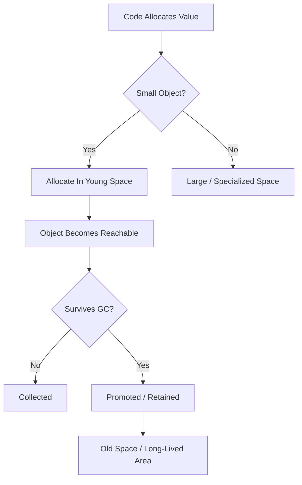
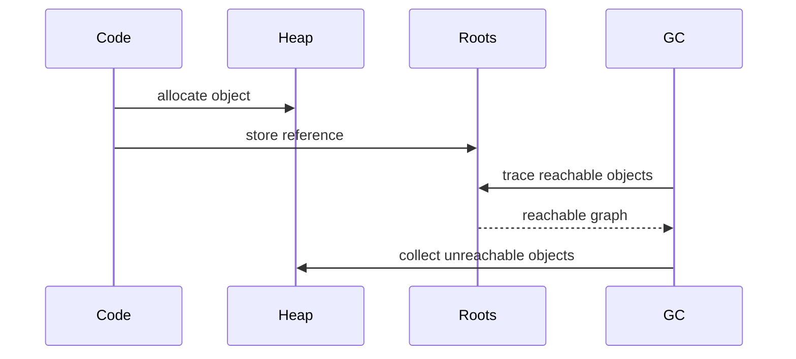
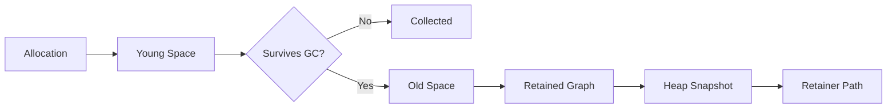
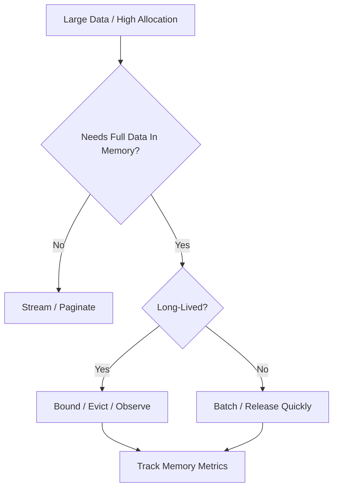

# 002.03.01 Heap Layout

Category: JavaScript Internals<br>
Topic: 002.03 Memory Internals

Heap layout describes how JavaScript runtimes organize dynamically allocated memory: objects, arrays, strings, closures, functions, backing stores, metadata, compiled code, and garbage-collection regions. You do not manually place values in the heap, but your code shape controls what gets allocated, how long it stays reachable, and how much pressure the garbage collector must handle.

This topic is the foundation for garbage collection, memory leaks, heap snapshots, Node memory tuning, browser tab memory issues, and production OOM debugging.

---

## 1. Definition

Heap layout is the runtime's internal organization of dynamically allocated memory.

One-line definition:

- Heap layout is how the JavaScript engine arranges allocated values and metadata so objects can be created, referenced, moved, promoted, inspected, and collected.

Expanded explanation:

- Primitive values may live in registers, stack slots, tagged values, or object boxes depending on context and engine.
- Objects, arrays, closures, functions, strings, Maps, Sets, Promises, and many runtime structures live on the heap.
- Engines divide heap memory into regions or spaces to make allocation and garbage collection efficient.
- In generational collectors, short-lived objects are usually allocated in young space; surviving objects can move to old space.
- Large objects, compiled code, metadata, and external buffers may live in specialized areas.

Conceptual layout:

```text
JavaScript Runtime Memory
  Stack / registers
    active call frames, locals, return addresses
  Managed heap
    young generation
    old generation
    large object area
    code / metadata areas
  External / native memory
    ArrayBuffer backing stores
    Buffers
    DOM/native resources
    engine/host allocations
```

Engine names differ. V8, JavaScriptCore, SpiderMonkey, and Chakra-style engines do not expose a single standard heap layout API.

---

## 2. Why It Exists

JavaScript creates objects constantly:

```js
const user = { id: "u1", name: "Ava" };
const list = users.map((user) => ({ id: user.id }));
const promise = fetch("/api/user").then((r) => r.json());
```

The engine needs a memory strategy that makes common allocation fast while allowing unused memory to be reclaimed.

Heap layout exists to solve:

- fast allocation,
- efficient property access,
- garbage collection,
- object movement/compaction,
- memory locality,
- metadata tracking,
- separation of short-lived and long-lived objects,
- support for external/native resources,
- safe execution of generated code.

Production relevance:

- high allocation rates increase GC pressure,
- long-lived objects move to old generation,
- large payloads can bypass normal young-space assumptions,
- external memory can make RSS high while JS heap looks moderate,
- browser DOM nodes can be retained by JavaScript references,
- Node containers can OOM before V8 heap limit is the only issue,
- heap snapshots require knowing shallow size, retained size, and retainer paths.

Senior-level framing:

- Heap layout is not trivia. It is the reason "small allocation choices" can become latency, memory, and reliability problems under traffic.

---

## 3. Syntax & Variants

There is no standard syntax to allocate into a specific heap region. You influence heap layout through allocation patterns.

### Object allocation

```ts
const user = {
  id: "u1",
  name: "Ava",
  active: true,
};
```

The object and its property storage live in managed memory. Shape metadata is engine-internal.

### Array allocation

```ts
const scores = [10, 20, 30];
```

Arrays have object metadata plus elements storage. Dense numeric arrays can be represented differently from sparse or mixed arrays.

### Closure allocation

```ts
function makeReader(value: string) {
  return () => value;
}
```

The returned function and captured environment may require heap allocation.

### String allocation

```ts
const message = `${user.name}:${user.id}`;
```

Engines can use several string representations: flat strings, concatenated/rope-like strings, sliced strings, internalized strings, and external strings depending on engine and operation.

### Buffer / ArrayBuffer external memory

```ts
const bytes = new ArrayBuffer(1024 * 1024);
```

In Node:

```ts
const buffer = Buffer.alloc(1024 * 1024);
```

Backing memory may count as external/native memory, not only `heapUsed`.

### Typed arrays

```ts
const values = new Float64Array(1_000_000);
```

Typed arrays use contiguous numeric storage and can be better for large numeric workloads.

### Map and Set

```ts
const cache = new Map<string, User>();
cache.set("u1", user);
```

Maps/Sets allocate internal hash/table structures and retain keys/values strongly unless using WeakMap/WeakSet.

### WeakMap and WeakSet

```ts
const metadata = new WeakMap<object, Metadata>();
metadata.set(user, { loadedAt: Date.now() });
```

WeakMap keys do not prevent key objects from being collected.

---

## 4. Internal Working

### Allocation flow



### Generational hypothesis

Most objects die young.

Examples:

```ts
const names = users.map((user) => user.name);
```

Intermediate arrays and callback objects may be short-lived.

Generational collectors exploit this by:

- allocating new objects quickly in young space,
- collecting young space frequently,
- promoting survivors to old space.

### Young space

Typically used for recently allocated objects.

Characteristics:

- fast allocation,
- frequent minor GC,
- optimized for short-lived objects,
- surviving objects may be copied or promoted.

### Old space

Used for objects that survive long enough.

Characteristics:

- less frequent major GC,
- contains long-lived application state,
- leaks often accumulate here,
- major collections are more expensive.

### Large object space

Large allocations may be handled separately because copying them during GC is expensive.

Examples:

- huge arrays,
- large strings,
- large ArrayBuffers or backing stores depending on engine/host.

### Code and metadata spaces

Engines also store:

- bytecode,
- optimized machine code,
- maps/hidden classes,
- feedback vectors,
- source position metadata,
- debugging metadata.

### Stack vs heap

```text
Stack
  -> active function calls
  -> local slots
  -> short-lived execution state

Heap
  -> objects and closures that may outlive a call
  -> arrays, functions, strings, promises
  -> runtime metadata
```

This is a useful model, but modern engines optimize aggressively. Values may be scalar-replaced, kept in registers, boxed, unboxed, moved, or optimized away when safe.

---

## 5. Memory Behavior

### Object graph

The heap is best understood as a graph.

```text
GC roots
  -> global variables
  -> stack variables
  -> closures
  -> module records
  -> timers/listeners
  -> native handles
  -> objects
  -> arrays/maps/sets
```

If an object is reachable from roots, it cannot be collected.

### Shallow size vs retained size

Shallow size:

- memory used by the object itself.

Retained size:

- memory that would become collectable if this object were removed.

Example:

```ts
const cache = new Map<string, BigPayload>();
```

The `Map` shallow size may be small, but its retained size can be huge because it keeps payloads alive.

### Allocation rate

Allocation rate matters as much as heap size.

```ts
for (const item of items) {
  results.push({
    id: item.id,
    label: `${item.name}:${item.type}`,
  });
}
```

High allocation in hot paths can cause frequent GC even if there is no leak.

### Promotion

Objects that survive young-generation collections can move to old generation.

Common promotion causes:

- caches,
- module globals,
- long-lived closures,
- pending timers,
- unresolved Promises,
- request queues,
- retained DOM nodes.

### External memory

Node memory metrics:

```ts
console.log(process.memoryUsage());
```

Important fields:

- `heapUsed`: JS heap currently used.
- `heapTotal`: JS heap currently allocated.
- `rss`: resident set size of the process.
- `external`: memory used by C++ objects bound to JS objects.
- `arrayBuffers`: memory for ArrayBuffers/Buffers where available.

High RSS with moderate heap can indicate external/native memory, fragmentation, code memory, or host allocations.

---

## 6. Execution Behavior

Heap allocation is tied to execution.

### Short-lived allocations

```ts
function labels(users: User[]) {
  return users.map((user) => `${user.id}:${user.name}`);
}
```

The callback execution allocates new strings and a result array. Temporary values may die quickly.

### Long-lived allocations

```ts
const cache = new Map<string, User>();

export function remember(user: User) {
  cache.set(user.id, user);
}
```

The module-level `cache` retains users for process lifetime unless entries are removed.

### Async retention

```ts
async function handle(payload: Payload) {
  await writeAudit(payload.id);
  return payload.data.length;
}
```

`payload` may be retained across the await if needed after resume.

### Browser DOM retention

```js
const nodes = [];

function remember(node) {
  nodes.push(node);
}
```

If a detached DOM node is stored in JS, its native DOM resources can remain alive.

### Execution diagram



### Allocation is cheap until it is not

Modern engines make small allocations fast, but high allocation rates create:

- more GC work,
- worse cache locality,
- promotion pressure,
- latency spikes,
- memory fragmentation risk.

---

## 7. Scope & Context Interaction

Lexical scope controls object reachability.

### Local object dies after call

```ts
function build() {
  const temp = { value: 1 };
  return temp.value;
}
```

If `temp` does not escape, the engine may collect it quickly or optimize it away.

### Escaping object survives

```ts
function build() {
  const temp = { value: 1 };
  return () => temp.value;
}
```

The closure keeps `temp` reachable.

### Module scope survives

```ts
const registry = new Map();
```

Module bindings usually live for the life of the module instance.

### Timer scope survives

```ts
function schedule(data) {
  setTimeout(() => use(data), 60_000);
}
```

The scheduled callback retains `data`.

### Request scope in Node

```ts
async function handleRequest(req) {
  const body = await readBody(req);
  await process(body);
}
```

If `body` is captured by logs, closures, or pending work, request memory may outlive the request.

### Ownership question

For every long-lived reference, ask:

- who owns this object?
- when is it removed?
- what bounds its size?
- what metric proves it is healthy?

---

## 8. Common Examples

### Example 1: Unbounded cache

```ts
const cache = new Map<string, Result>();

export async function getResult(key: string) {
  if (!cache.has(key)) {
    cache.set(key, await compute(key));
  }

  return cache.get(key)!;
}
```

Risk:

- cache grows forever,
- objects move to old space,
- retained size increases until OOM.

Better:

```ts
const cache = new LruCache<string, Result>({ max: 10_000, ttlMs: 300_000 });
```

### Example 2: Avoid holding large payload across await

```ts
async function save(payload: string) {
  const parsed = JSON.parse(payload);
  await write(parsed.id);
  return parsed.status;
}
```

Better if only fields are needed:

```ts
async function save(payload: string) {
  const { id, status } = JSON.parse(payload);
  await write(id);
  return status;
}
```

### Example 3: Streaming instead of buffering

```ts
const data = await response.text();
await process(data);
```

For huge payloads, prefer streaming where possible:

```ts
for await (const chunk of stream) {
  await processChunk(chunk);
}
```

### Example 4: Detached DOM node leak

```js
const retained = [];

function removeCard(card) {
  card.remove();
  retained.push(card);
}
```

The DOM node is removed visually but still reachable from JavaScript.

### Example 5: Buffer memory in Node

```ts
const buffers: Buffer[] = [];

function read(file: Buffer) {
  buffers.push(file);
}
```

`heapUsed` may not fully explain memory pressure because Buffer backing memory can count as external memory.

---

## 9. Confusing / Tricky Examples

### Trap 1: `heapUsed` is not total process memory

Node RSS includes more than V8 JS heap:

- native memory,
- Buffer/ArrayBuffer backing stores,
- code memory,
- thread stacks,
- allocator fragmentation,
- shared libraries.

### Trap 2: No leak, still high GC

High allocation rate can cause frequent GC even when memory eventually returns to normal.

### Trap 3: A small object can retain a huge graph

```ts
const wrapper = { payload: hugeObject };
```

The wrapper's shallow size is small; retained size can be massive.

### Trap 4: WeakMap does not make values weak

```ts
const wm = new WeakMap<object, LargeValue>();
```

The key is weak. If the key is reachable, the value remains reachable through the WeakMap.

### Trap 5: Sliced or concatenated strings can retain more than expected

Depending on engine representation, substring/concat strategies may keep references or create flattened copies. Do not rely on one representation for correctness.

### Trap 6: Memory returns late

Even after objects become unreachable, memory may not immediately return to the OS. The runtime can keep heap pages for reuse.

---

## 10. Real Production Use Cases

### Node service OOM

Symptoms:

- process restarts under load,
- `heapUsed` climbs,
- old-space usage grows.

Investigation:

- heap snapshots,
- allocation profiling,
- cache size metrics,
- request payload histograms,
- GC logs where appropriate.

### High RSS but moderate heap

Symptoms:

- container OOM killed,
- JS heap does not look huge.

Possible causes:

- Buffers,
- ArrayBuffers,
- native addons,
- code memory,
- fragmentation,
- image/PDF processing libraries.

### Browser tab memory growth

Symptoms:

- SPA gets slower after route changes.

Possible causes:

- retained DOM nodes,
- event listeners,
- old route stores,
- closures,
- unbounded client cache.

### Worker throughput degradation

Symptoms:

- jobs/sec drops over time.

Possible causes:

- old-space growth,
- promotion pressure,
- GC time increases,
- payloads retained by retries or logs.

### Large data dashboard

Symptoms:

- dashboard crashes with enterprise tenant.

Possible causes:

- entire dataset loaded into JS heap,
- multiple transformed copies,
- chart library retains old series,
- no pagination/virtualization.

---

## 11. Interview Questions

### Basic

1. What is the JavaScript heap?
2. What usually lives on the heap?
3. What is the difference between stack and heap?
4. What is young generation vs old generation?
5. What is retained size?

### Intermediate

1. Why do engines separate young and old objects?
2. Why can `heapUsed` be lower than process RSS?
3. How can closures retain heap objects?
4. Why can high allocation rate hurt performance without a leak?
5. What is external memory in Node?

### Advanced

1. Explain how a heap snapshot represents an object graph.
2. How would you debug high RSS with normal heapUsed?
3. Why might large objects be handled separately from small objects?
4. How do Buffers and ArrayBuffers affect memory analysis?
5. How can object shape and property storage affect memory?

### Tricky

1. Does setting a variable to `null` always free memory immediately?
2. Can an object with small shallow size retain a huge graph?
3. Does WeakMap make values weak?
4. Can memory be collectable but not returned to the OS?
5. Can memory pressure cause latency even if the app does not crash?

Strong answers should reason from roots, reachability, allocation rate, retained size, and runtime-specific metrics.

---

## 12. Senior-Level Pitfalls

### Pitfall 1: Looking only at heapUsed

Senior correction:

- compare heapUsed, heapTotal, rss, external, arrayBuffers, and container memory.

### Pitfall 2: Treating GC as leak detector only

GC pressure can hurt latency without a leak.

Senior correction:

- profile allocation rate and GC time.

### Pitfall 3: Unbounded caches

Senior correction:

- use TTL, max size, eviction, hit-rate metrics, and ownership.

### Pitfall 4: Retaining full payloads across async boundaries

Senior correction:

- extract needed fields,
- stream large data,
- clear references where lifecycle matters.

### Pitfall 5: Ignoring external/native memory

Senior correction:

- inspect Buffer, ArrayBuffer, native addon, image/PDF, and compression memory.

### Pitfall 6: Misreading heap snapshots

Senior correction:

- distinguish shallow size, retained size, dominators, and retainer paths.

---

## 13. Best Practices

### Allocation discipline

- Avoid unnecessary intermediate arrays in hot paths.
- Stream large payloads instead of buffering.
- Limit Promise concurrency.
- Reuse heavy objects only when safe and measured.
- Prefer typed arrays for large numeric data.

### Lifetime control

- Bound caches.
- Remove event listeners.
- Clear timers.
- Cancel stale async work with `AbortController`.
- Avoid request data in module globals.
- Keep large data out of long-lived closures.

### Observability

- Track heapUsed, heapTotal, rss, external, and GC behavior.
- Add cache size metrics.
- Track payload sizes and queue depths.
- Capture heap snapshots carefully during incidents.
- Monitor browser memory and long sessions for SPAs.

### Debugging

- Compare snapshots before/after growth.
- Inspect dominators and retainer paths.
- Segment by workload, tenant, route, or job type.
- Reproduce with realistic data shape and concurrency.

---

## 14. Debugging Scenarios

### Scenario 1: Old-space growth

Symptoms:

- heap staircase grows after each GC.

Debugging flow:

```text
Take baseline heap snapshot
  -> run workload
  -> take second snapshot
  -> compare retained objects
  -> inspect retainer paths
  -> fix owner/cleanup/bounds
```

### Scenario 2: High RSS, normal heap

Symptoms:

- container OOM,
- heapUsed moderate.

Debugging flow:

```text
Inspect process.memoryUsage
  -> compare rss/external/arrayBuffers
  -> inspect Buffer usage
  -> inspect native libraries
  -> check container limit and fragmentation
```

### Scenario 3: Browser route leak

Symptoms:

- memory grows after navigating between routes.

Debugging flow:

```text
Record heap snapshot
  -> navigate away
  -> force/await collection in devtools if available
  -> compare detached DOM nodes
  -> inspect listeners and closures
```

### Scenario 4: GC latency spikes

Symptoms:

- p99 latency spikes,
- CPU profile shows GC time.

Debugging flow:

```text
Measure allocation rate
  -> identify hot allocation sites
  -> reduce intermediate objects
  -> batch/stream
  -> verify p99 and GC time
```

### Scenario 5: Cache-induced OOM

Symptoms:

- memory grows with tenant count.

Debugging flow:

```text
Inspect cache cardinality
  -> add cache size metric
  -> analyze key space
  -> add TTL/max/eviction
  -> verify hit rate vs memory cost
```

---

## 15. Exercises / Practice

### Exercise 1: Retainer path

Given:

```ts
const cache = new Map<string, Payload>();
cache.set(user.id, payload);
```

Draw the path from a GC root to `payload`.

### Exercise 2: Reduce async retention

Refactor:

```ts
async function handle(payload: BigPayload) {
  await audit(payload.user.id);
  return payload.items.length;
}
```

Goal:

- avoid retaining the full payload across `await` if only two fields are needed.

### Exercise 3: Diagnose metric mismatch

Node reports:

```text
heapUsed: 300 MB
rss: 1.8 GB
external: 1.2 GB
```

What do you investigate?

### Exercise 4: Find allocation pressure

```ts
const result = users
  .map(toDto)
  .filter((user) => user.active)
  .map(addDisplayLabel);
```

What intermediate allocations exist? When is this fine? When might you rewrite it?

### Exercise 5: Browser leak

A detached DOM node is retained by a closure. What cleanup steps do you check?

---

## 16. Comparison

### Stack vs heap

| Dimension | Stack | Heap |
| --- | --- | --- |
| Purpose | Active execution state | Dynamic objects and retained data |
| Lifetime | Call duration | Reachability-based |
| Examples | call frames, local slots | objects, arrays, closures |
| Failure | stack overflow | OOM / GC pressure |

### Young vs old generation

| Space | Best For | Collected |
| --- | --- | --- |
| Young | new, short-lived objects | frequently |
| Old | long-lived survivors | less frequently, more expensively |

### Shallow vs retained size

| Metric | Meaning |
| --- | --- |
| Shallow size | memory of object itself |
| Retained size | memory freed if object and only-retained descendants become unreachable |

### Object vs Map memory behavior

| Structure | Good For | Risk |
| --- | --- | --- |
| Object | fixed fields / DTOs | dynamic keys, prototype concerns |
| Map | dynamic key/value collections | strong retention unless deleted |
| WeakMap | metadata keyed by object lifetime | values live while keys live |

---

## 17. Related Concepts

Heap Layout connects to:

- `002.03.02 Garbage Collection`: collection operates on heap regions and reachability.
- `002.03.03 Leaks and Retainers`: retained object graphs explain leaks.
- `002.01.03 Inline Caches and Hidden Classes`: object layout metadata affects performance and memory.
- `001.03.02 Memory and Garbage Collection`: user-facing memory model.
- `001.04.02 Performance Profiling`: allocation and GC profiles reveal pressure.
- Node.js Performance: RSS, heap, external memory, event-loop delay.
- Browser Performance: DOM retention, long sessions, memory pressure.
- Production Debugging: heap snapshots, OOMs, cache analysis.

Knowledge graph:



---

## Advanced Add-ons

### Performance Impact

Heap layout affects:

- allocation speed,
- GC frequency,
- GC pause time,
- memory locality,
- p99 latency,
- container OOM risk,
- browser responsiveness,
- mobile battery and thermal pressure.

Performance practices:

- reduce allocation in hot paths,
- avoid creating multiple transformed copies of large data,
- stream when possible,
- bound long-lived data,
- monitor GC time and allocation rate,
- optimize after profiling.

### System Design Relevance

Memory layout decisions affect architecture:

- should data be streamed or buffered?
- should a cache exist, and how is it bounded?
- should large processing happen in a worker?
- should tenant workloads be isolated?
- should payload size limits be enforced?
- should large frontend datasets be paginated/server-aggregated?

Decision framework:



### Security Impact

Memory behavior has security implications:

- secrets retained in closures or caches,
- heap snapshots can contain tokens and PII,
- unbounded memory growth can become DoS,
- Buffer reuse mistakes can expose data in unsafe APIs,
- logs and diagnostics can retain sensitive payloads.

Practices:

- bound payload sizes,
- avoid retaining secrets,
- protect heap snapshots,
- scrub diagnostics,
- clear sensitive references when practical,
- prefer safe buffer allocation APIs.

### Browser vs Node Behavior

Browser:

- DOM/native resources can be retained by JS references,
- detached nodes are common leak symptoms,
- background tabs may behave differently,
- memory pressure affects responsiveness and tab eviction.

Node:

- RSS includes heap, code, external/native memory, stacks, and allocator overhead,
- Buffers and ArrayBuffers matter heavily,
- process memory must fit container limits,
- old-space limits can be tuned but tuning is not a substitute for fixing leaks.

Shared:

- reachability controls collection,
- closures retain environments,
- allocation pressure creates GC work,
- heap snapshots reveal object graphs.

### Polyfill / Implementation

You cannot implement the engine heap in JavaScript, but you can model reachability.

```ts
type NodeId = string;

type HeapNode = {
  id: NodeId;
  refs: NodeId[];
};

function markReachable(heap: Map<NodeId, HeapNode>, roots: NodeId[]) {
  const marked = new Set<NodeId>();
  const stack = [...roots];

  while (stack.length > 0) {
    const id = stack.pop()!;
    if (marked.has(id)) continue;

    marked.add(id);

    for (const ref of heap.get(id)?.refs ?? []) {
      stack.push(ref);
    }
  }

  return marked;
}
```

This mirrors the core GC idea: objects reachable from roots are kept; unreachable objects can be collected.

---

## 18. Summary

Heap layout is the runtime organization of JavaScript memory.

Quick recall:

- Objects, arrays, functions, closures, strings, Promises, Maps, and Sets usually live on the heap.
- Active execution state lives on the stack/registers conceptually.
- Young generation is optimized for short-lived allocations.
- Old generation holds longer-lived survivors.
- External memory can make RSS much larger than heapUsed.
- Retained size matters more than shallow size during leak debugging.
- Closures, timers, caches, and DOM references commonly retain objects.
- High allocation rate can hurt performance even without leaks.
- Heap snapshots show object graphs and retainer paths.
- Production memory work requires heap, RSS, external memory, GC, and workload context.

Staff-level takeaway:

- Heap layout mastery lets you move from "memory is high" to the sharper questions: what is allocated, what retains it, which generation it lives in, whether the pressure is JS heap or external memory, and what ownership rule should release or bound it.
