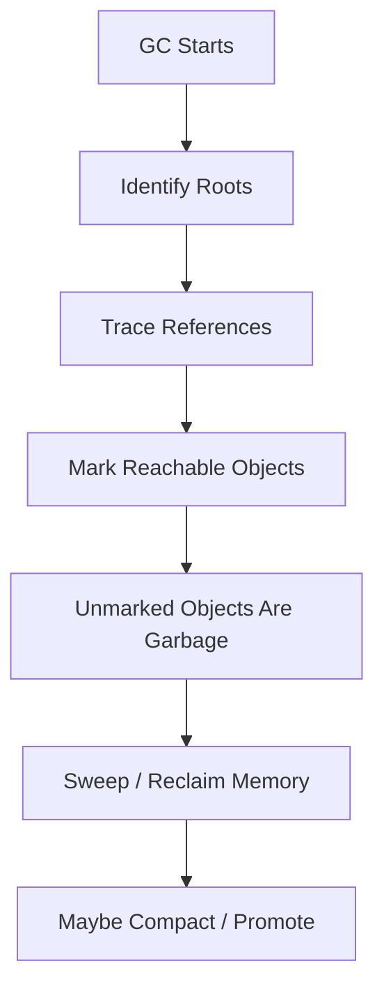
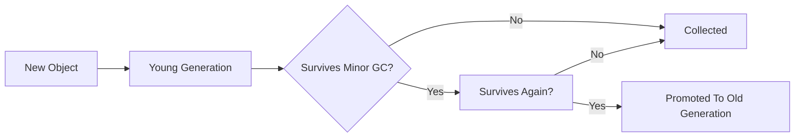
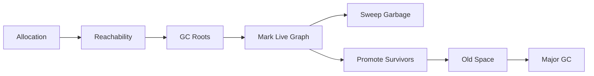
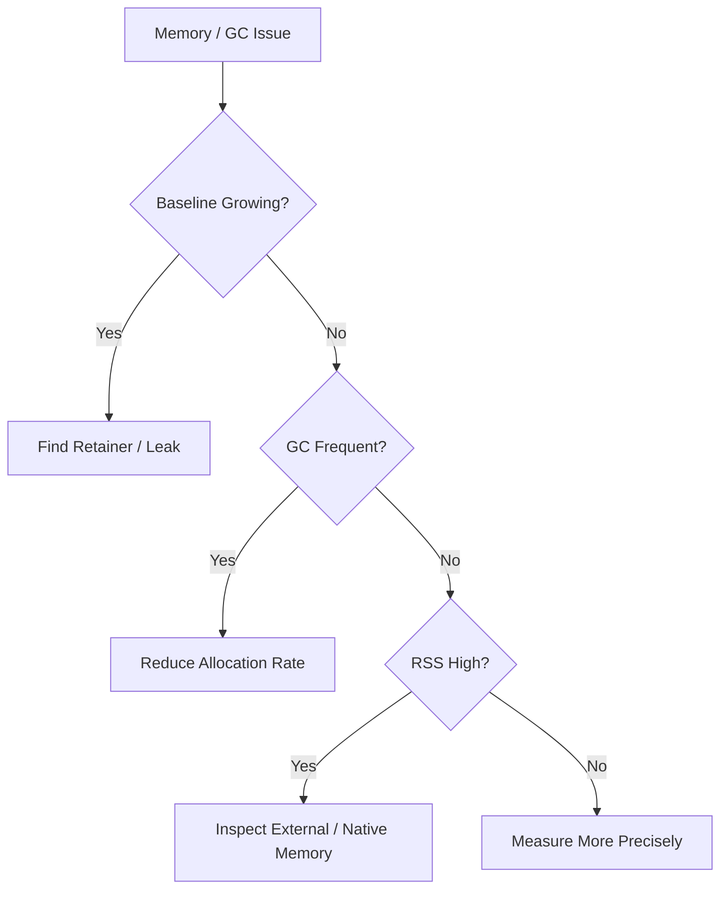

# 002.03.02 Garbage Collection

Category: JavaScript Internals<br>
Topic: 002.03 Memory Internals

Garbage collection is the runtime process that automatically reclaims heap memory that is no longer reachable by the program. It is why JavaScript developers usually do not manually free objects, and also why memory bugs can feel mysterious: objects are collected by reachability, not by whether humans still consider them useful.

GC mastery is not "the engine cleans memory." GC mastery is knowing roots, reachability, generations, promotion, pauses, allocation pressure, retained graphs, weak references, and how these details turn into production latency or OOM incidents.

---

## 1. Definition

Garbage collection is automatic memory reclamation performed by the JavaScript engine.

One-line definition:

- Garbage collection finds heap objects that are no longer reachable from runtime roots and makes their memory reusable.

Expanded explanation:

- JavaScript values are allocated as code runs.
- Some values remain reachable through variables, closures, modules, timers, DOM nodes, native handles, queues, or caches.
- Other values become unreachable after code stops referencing them.
- The garbage collector traces reachable objects from roots.
- Anything not reachable can be reclaimed.

Important:

- GC does not know whether an object is "needed" by the business.
- GC only knows whether an object is reachable.

Example:

```ts
let user: { id: string } | null = { id: "u1" };
user = null;
```

The object may become collectable if no other reference points to it. It is not necessarily collected immediately.

---

## 2. Why It Exists

JavaScript programs allocate constantly:

```ts
const labels = users.map((user) => `${user.id}:${user.name}`);
const response = await fetch("/api/items").then((r) => r.json());
const state = { loading: false, items: response.items };
```

Manual memory management would make everyday JavaScript far more error-prone.

GC exists to solve:

- automatic memory reclamation,
- safety from use-after-free bugs,
- simpler programming model,
- support for closures and dynamic object graphs,
- memory reuse without developer-managed lifetimes.

But GC introduces trade-offs:

- collection uses CPU,
- some phases can pause JavaScript,
- high allocation rates can create latency spikes,
- long-lived objects increase old-space pressure,
- retained objects still leak even with GC,
- finalization is nondeterministic.

Why it matters in production:

- Node APIs can show p99 spikes due to major GC.
- Browser UIs can freeze from allocation bursts and GC pauses.
- Workers can lose throughput when GC consumes CPU.
- Serverless functions can cold-start slowly and churn memory.
- Unbounded caches eventually outgrow heap limits.

---

## 3. Syntax & Variants

JavaScript does not expose normal manual GC control. You influence GC through reachability and allocation patterns.

### Making an object unreachable

```ts
let payload: Payload | null = await loadPayload();

await process(payload);

payload = null;
```

This removes one reference. It helps only if no other references remain.

### Function-local objects

```ts
function buildLabel(user: User) {
  const label = `${user.id}:${user.name}`;
  return label;
}
```

`label` becomes collectable after the call if the returned string is not retained elsewhere. Engines may optimize details differently.

### Closure retention

```ts
function createReader(payload: BigPayload) {
  return () => payload.id;
}
```

`payload` remains reachable through the returned function.

### WeakMap

```ts
const metadata = new WeakMap<object, Metadata>();

function attachMetadata(target: object, data: Metadata) {
  metadata.set(target, data);
}
```

The WeakMap does not keep `target` alive. If `target` becomes unreachable elsewhere, its WeakMap entry can disappear.

### WeakRef

```ts
const ref = new WeakRef(expensiveObject);
const value = ref.deref();
```

WeakRef lets code observe an object only if it has not been collected. It should be rare in application code.

### FinalizationRegistry

```ts
const registry = new FinalizationRegistry((id: string) => {
  console.log("object collected", id);
});

registry.register(object, object.id);
```

Finalizers are nondeterministic. Do not use them for required cleanup.

### Node GC flags

Development diagnostics may use:

```bash
node --trace-gc app.js
```

Manual GC is available only when explicitly enabled:

```bash
node --expose-gc app.js
```

Then:

```js
global.gc();
```

This is for diagnostics, not normal production control.

---

## 4. Internal Working

Most modern JavaScript collectors are tracing, generational collectors with multiple optimizations.

### Core reachability flow



### GC roots

Common roots include:

- global object references,
- module bindings,
- active stack frames,
- closure environments,
- pending Promise reactions,
- timers,
- event listeners,
- native handles,
- DOM references,
- internal engine structures.

### Mark and sweep

Mark:

- start from roots,
- walk references,
- mark every reachable object.

Sweep:

- reclaim unmarked objects,
- return memory to free lists or heap spaces.

### Mark and compact

Compaction moves live objects closer together to reduce fragmentation.

Trade-off:

- improves memory layout,
- costs CPU,
- requires updating references.

### Generational GC

Generational hypothesis:

- most objects die young.

Flow:



### Minor GC

Minor GC collects young generation.

Characteristics:

- frequent,
- usually faster,
- optimized for short-lived objects,
- may copy survivors,
- can promote objects.

### Major GC

Major GC collects old generation.

Characteristics:

- less frequent,
- more expensive,
- more likely to cause noticeable pauses,
- often includes marking, sweeping, and compaction strategies.

### Incremental and concurrent GC

To reduce pause times, engines can split GC work:

- incremental: break marking into smaller chunks,
- concurrent: perform some work on helper threads,
- parallel: multiple threads cooperate during a phase.

JavaScript still may pause during parts of GC because the heap must remain consistent.

### Write barriers

When old objects reference young objects, the collector needs bookkeeping so minor GC does not miss young objects reachable from old objects.

Conceptual example:

```ts
const longLivedCache = new Map();
longLivedCache.set("latest", { id: "new" });
```

The old cache now points to a young object. The engine tracks that relationship.

---

## 5. Memory Behavior

GC behavior is shaped by allocation rate, reachability, generation survival, and heap limits.

### Allocation rate

```ts
for (const item of items) {
  result.push({
    id: item.id,
    label: `${item.name}:${item.type}`,
  });
}
```

This may be fine. In a hot path with large `items`, it creates many allocations and can trigger frequent minor GC.

### Object survival

Objects that survive collections can be promoted.

Long-lived examples:

- caches,
- global registries,
- module state,
- queues,
- active sessions,
- long-running timers,
- unresolved Promise chains,
- retained DOM nodes.

### GC pressure without leak

Memory can return to baseline but still cause latency.

Pattern:

```text
request arrives
  -> allocates many short-lived objects
  -> minor GC runs frequently
  -> CPU and latency increase
  -> heap returns to normal
```

No leak, but still a performance problem.

### Leak with GC

Pattern:

```text
object no longer useful
  -> still referenced by Map/listener/timer/closure
  -> reachable from root
  -> GC keeps it
  -> old space grows
```

### Heap limit

When the heap approaches its limit:

- GC runs more aggressively,
- CPU time can rise sharply,
- latency increases,
- process may crash with out-of-memory.

### External memory interaction

GC tracks JS wrappers for external memory, but RSS can grow due to:

- Buffers,
- ArrayBuffers,
- native add-ons,
- DOM/native objects,
- image/PDF libraries,
- compression libraries.

High RSS is not always explained by JS heap alone.

---

## 6. Execution Behavior

GC can happen between or during execution phases as the engine decides.

### Run-to-completion and GC

JavaScript callbacks run to completion, but the engine may schedule GC at safe points.

Safe points include:

- allocation sites,
- function returns,
- loop backedges in some engines,
- event-loop boundaries,
- explicit diagnostic GC calls.

### User-visible pause

```text
request handling starts
  -> many allocations
  -> GC pause
  -> request completes late
```

GC pauses can show up as:

- p99 latency spikes,
- browser long tasks,
- event-loop delay,
- animation jank,
- worker throughput drops.

### Minor collection behavior

```text
young space fills
  -> minor GC
  -> dead young objects reclaimed
  -> survivors copied/promoted
```

### Major collection behavior

```text
old space pressure grows
  -> major marking starts
  -> live graph traced
  -> sweeping/compaction
  -> old-space memory freed or compacted
```

### Finalization behavior

Finalizers do not run immediately when an object becomes unreachable.

```ts
const registry = new FinalizationRegistry(() => {
  cleanup();
});
```

The cleanup callback:

- may run later,
- may not run before process exit,
- must not be required for correctness.

### Async behavior

Pending async work retains closures.

```ts
async function handle(payload) {
  await slowOperation();
  return payload.id;
}
```

`payload` can stay alive until the async function resumes and no longer needs it.

---

## 7. Scope & Context Interaction

Reachability is created by scope and references.

### Local scope

```ts
function read() {
  const temp = { value: 1 };
  return temp.value;
}
```

`temp` is not reachable after the function returns unless it escapes.

### Closure scope

```ts
function makeReader(temp) {
  return () => temp.value;
}
```

`temp` escapes through the closure and remains reachable.

### Module scope

```ts
const registry = new Set<object>();
```

Module state often lives for the process or page lifetime.

### Event listener scope

```ts
element.addEventListener("click", () => {
  console.log(componentState);
});
```

The listener retains `componentState` while the listener is registered and reachable.

### Timer scope

```ts
const timeoutId = setTimeout(() => {
  use(payload);
}, 60_000);
```

The timer keeps the callback and captured payload alive until it fires or is cleared.

### Weak references

WeakMap and WeakRef allow references that do not force reachability.

Use cases:

- metadata associated with objects,
- caches where values can be recreated,
- framework/runtime internals.

Avoid:

- business-critical cleanup,
- correctness logic dependent on collection timing.

---

## 8. Common Examples

### Example 1: Short-lived allocation

```ts
function sum(values: number[]) {
  return values.reduce((total, value) => total + value, 0);
}
```

Local callback frames and temporary values are short-lived and usually cheap.

### Example 2: Allocation-heavy pipeline

```ts
const activeNames = users
  .map((user) => ({ ...user, label: user.name.toUpperCase() }))
  .filter((user) => user.active)
  .map((user) => user.label);
```

This creates intermediate arrays and objects. Fine for small data; expensive in hot paths.

### Example 3: Reducing allocations in a hot path

```ts
const activeNames: string[] = [];

for (const user of users) {
  if (!user.active) continue;
  activeNames.push(user.name.toUpperCase());
}
```

This avoids some intermediate allocations. Use when profiling proves the path is hot.

### Example 4: Cache leak

```ts
const cache = new Map<string, Payload>();

function remember(id: string, payload: Payload) {
  cache.set(id, payload);
}
```

GC cannot collect payloads while the cache references them.

### Example 5: WeakMap metadata

```ts
const metadata = new WeakMap<object, { createdAt: number }>();

export function tag(target: object) {
  metadata.set(target, { createdAt: Date.now() });
}
```

When `target` becomes unreachable elsewhere, the metadata entry can be collected.

### Example 6: Listener cleanup

```ts
function mount(element: HTMLElement, state: State) {
  const handler = () => render(state);
  element.addEventListener("click", handler);

  return () => {
    element.removeEventListener("click", handler);
  };
}
```

Cleanup makes the captured state collectable when no other references exist.

---

## 9. Confusing / Tricky Examples

### Trap 1: `delete` is not memory cleanup by itself

```ts
delete obj.largeField;
```

This removes one property reference. Memory is collectable only if no other references to the value exist.

### Trap 2: `null` does not force immediate GC

```ts
value = null;
```

This can make an object unreachable, but collection happens when the engine decides.

### Trap 3: Circular references are collectable

```ts
let a: any = {};
let b: any = {};
a.b = b;
b.a = a;

a = null;
b = null;
```

The cycle can be collected if unreachable from roots.

### Trap 4: FinalizationRegistry is not deterministic

Finalizers are not reliable for closing files, committing data, releasing locks, or required cleanup.

### Trap 5: WeakMap values are not weak

If the key is reachable, the value remains reachable through the WeakMap.

### Trap 6: Bigger heap can make pauses worse

Increasing heap size may delay OOM, but it can also allow more live data and longer major GC work.

---

## 10. Real Production Use Cases

### Node p99 latency spike

Symptoms:

- p50 latency normal,
- p99 jumps,
- CPU profile shows GC time.

Likely causes:

- allocation burst,
- old-space pressure,
- large response serialization,
- cache growth,
- payload retained across awaits.

### Browser jank

Symptoms:

- scrolling or typing freezes.

Likely causes:

- long task,
- DOM allocation burst,
- chart/list rendering,
- GC pause after many short-lived objects.

### Worker throughput decline

Symptoms:

- jobs/sec drops over hours.

Likely causes:

- old-space growth,
- retries retaining payloads,
- GC consumes CPU,
- queue depth retains pending jobs.

### Serverless cold/warm behavior

Symptoms:

- warm function becomes slower after many invocations.

Likely causes:

- module-level cache grows,
- old generation accumulates,
- GC pressure rises between invocations.

### SPA memory leak

Symptoms:

- tab memory grows after route changes.

Likely causes:

- detached DOM nodes,
- retained component closures,
- observers/listeners not removed,
- client cache not bounded.

---

## 11. Interview Questions

### Basic

1. What is garbage collection?
2. What makes an object eligible for collection?
3. What is a GC root?
4. Can circular references be collected?
5. Does setting a variable to `null` immediately free memory?

### Intermediate

1. What is mark-and-sweep?
2. Why do generational collectors exist?
3. What is the difference between minor and major GC?
4. What causes promotion to old generation?
5. How can a closure cause memory retention?

### Advanced

1. What are incremental and concurrent GC?
2. What are write barriers and why are they needed?
3. How would you debug high GC pause time in Node?
4. Why can high allocation rate hurt latency without a leak?
5. How do WeakMap, WeakRef, and FinalizationRegistry differ?

### Tricky

1. Is a memory leak impossible in a GC language?
2. Can an object be useless but not collectable?
3. Can increasing heap size make latency worse?
4. Are FinalizationRegistry callbacks guaranteed to run?
5. Is `global.gc()` a production memory management strategy?

Strong answers should use reachability, roots, generations, allocation rate, pause time, and retained graph language.

---

## 12. Senior-Level Pitfalls

### Pitfall 1: Thinking GC prevents leaks

GC collects unreachable objects. It does not collect reachable-but-useless objects.

Senior correction:

- design ownership and cleanup,
- bound caches,
- remove listeners,
- inspect retainer paths.

### Pitfall 2: Optimizing allocation without measurement

Readable allocation is often fine.

Senior correction:

- profile allocation rate and GC time first,
- optimize hot paths only.

### Pitfall 3: Treating heap limit tuning as the fix

Increasing heap may hide a leak.

Senior correction:

- identify retained objects,
- use heap limits as capacity configuration, not a substitute for cleanup.

### Pitfall 4: Ignoring external memory

GC behavior and JS heap metrics do not explain every RSS problem.

Senior correction:

- inspect `external`, `arrayBuffers`, native modules, and container memory.

### Pitfall 5: Using FinalizationRegistry for required cleanup

Finalization timing is nondeterministic.

Senior correction:

- use explicit cleanup APIs and lifecycle ownership.

### Pitfall 6: Comparing heap snapshots without workload control

Snapshots are noisy.

Senior correction:

- use repeatable workloads,
- compare before/after snapshots,
- inspect retained size and dominators.

---

## 13. Best Practices

### Allocation

- Keep hot paths allocation-aware.
- Avoid unnecessary intermediate arrays for large data.
- Stream instead of buffering when possible.
- Limit Promise concurrency.
- Avoid retaining full payloads across awaits when only fields are needed.

### Lifetime

- Bound caches with TTL/max size.
- Remove event listeners and observers.
- Clear timers and intervals.
- Cancel stale async work.
- Avoid request-specific data in module/global state.

### Weak references

- Use WeakMap for object metadata.
- Use WeakRef rarely.
- Do not depend on finalizers for correctness.

### Observability

- Track heap used, heap total, RSS, external memory, GC duration, and event-loop delay.
- Add cache size and queue depth metrics.
- Segment memory by route, tenant, job type, or feature where possible.

### Incident handling

- Take heap snapshots carefully.
- Protect heap dumps as sensitive data.
- Compare snapshots under controlled workloads.
- Roll back memory-heavy deploys when needed.

---

## 14. Debugging Scenarios

### Scenario 1: GC time spikes after release

Symptoms:

- p99 latency increases,
- CPU rises,
- heap returns to baseline.

Debugging flow:

```text
Check deploy diff
  -> capture CPU/allocation profile
  -> identify hot allocation sites
  -> reduce intermediate allocations
  -> verify GC duration and p99
```

Likely root cause:

- allocation pressure, not leak.

### Scenario 2: Old-space grows forever

Symptoms:

- heap staircase after each GC,
- memory never returns to previous baseline.

Debugging flow:

```text
Take baseline snapshot
  -> run workload
  -> take second snapshot
  -> compare dominators
  -> inspect retainer paths
  -> fix owner/cleanup/bounds
```

Likely root cause:

- retained graph through cache, listener, timer, queue, or module state.

### Scenario 3: Node OOM despite calling `global.gc()`

Symptoms:

- manual GC does not lower memory.

Debugging flow:

```text
Check reachability
  -> inspect retained objects
  -> check external memory
  -> check cache and queues
  -> remove references
```

Root cause:

- reachable objects or external memory, not "GC failed."

### Scenario 4: Browser detached DOM leak

Symptoms:

- route changes increase memory,
- heap snapshot shows detached nodes.

Debugging flow:

```text
Inspect retainers
  -> find JS listener/closure/store reference
  -> remove listener on unmount
  -> clear store reference
  -> verify after navigation cycle
```

### Scenario 5: Finalizer-based cleanup misses production case

Symptoms:

- external resource remains open.

Debugging flow:

```text
Find FinalizationRegistry reliance
  -> replace with explicit dispose/close
  -> add try/finally lifecycle
  -> keep finalizer only as diagnostic fallback
```

---

## 15. Exercises / Practice

### Exercise 1: Reachability

```ts
let a: any = { name: "a" };
let b: any = { name: "b" };
a.next = b;
b.next = a;

a = null;
b = null;
```

Can the cycle be collected? Explain.

### Exercise 2: Reduce allocation pressure

Refactor only if profiling proves this path is hot:

```ts
const result = items
  .map(toDto)
  .filter((item) => item.active)
  .map((item) => item.label);
```

### Exercise 3: Find the retainer

```ts
const jobs: Job[] = [];

export function enqueue(job: Job) {
  jobs.push(job);
}
```

What makes jobs reachable? What bounds are missing?

### Exercise 4: WeakMap use case

Design a WeakMap that stores metadata for DOM nodes without preventing node collection.

### Exercise 5: Production diagnosis

You see:

```text
heapUsed rising after each GC
GC duration increasing
cache size rising
p99 latency rising
```

Write the likely root cause and first fix.

---

## 16. Comparison

### Manual memory vs garbage collection

| Model | Strength | Risk |
| --- | --- | --- |
| Manual free | precise resource control | use-after-free, double-free |
| Garbage collection | memory safety and simpler code | pauses, leaks via reachability |

### Minor vs major GC

| Collection | Area | Frequency | Cost |
| --- | --- | --- | --- |
| Minor GC | young generation | frequent | usually lower |
| Major GC | old generation | less frequent | usually higher |

### Leak vs allocation pressure

| Problem | Symptom | Fix Direction |
| --- | --- | --- |
| Leak | baseline grows after GC | remove retention / bound owner |
| Allocation pressure | heap returns but GC frequent | reduce allocation / batch / stream |

### WeakMap vs WeakRef vs FinalizationRegistry

| API | Purpose | Caveat |
| --- | --- | --- |
| WeakMap | metadata keyed by object lifetime | keys must be objects |
| WeakRef | weakly observe target | target may vanish anytime |
| FinalizationRegistry | cleanup notification | nondeterministic |

---

## 17. Related Concepts

Garbage Collection connects to:

- `002.03.01 Heap Layout`: GC operates over heap regions and object graphs.
- `002.03.03 Leaks and Retainers`: leaks are reachable object graphs that should have been released.
- `002.02.02 Lexical Environments`: closures retain lexical environments.
- `001.04.02 Performance Profiling`: allocation and GC profiles reveal pressure.
- Node.js Performance: event-loop delay, RSS, heap limits, Buffers.
- Web Performance: long tasks, jank, detached DOM nodes.
- Caching: memory retention and old-space growth.
- Production Debugging: heap snapshots, GC logs, OOM analysis.

Knowledge graph:



---

## Advanced Add-ons

### Performance Impact

GC affects:

- p95/p99 latency,
- browser responsiveness,
- Node event-loop delay,
- worker throughput,
- CPU utilization,
- battery on mobile,
- container memory headroom.

Optimization hierarchy:

1. Remove unnecessary allocation.
2. Reduce retained lifetime.
3. Bound long-lived collections.
4. Stream or chunk large data.
5. Limit concurrency.
6. Tune heap limits only after understanding workload.

### System Design Relevance

GC affects architecture decisions:

- buffering vs streaming,
- in-memory cache vs external cache,
- single process vs worker isolation,
- tenant memory isolation,
- queue backpressure,
- payload limits,
- large report generation strategy.

Decision framework:



### Security Impact

Memory and GC can affect security:

- secrets retained longer than expected,
- heap snapshots expose PII/tokens,
- unbounded memory growth becomes DoS,
- finalizers are unsafe for security-critical cleanup,
- stale closures can retain old authorization context.

Practices:

- avoid retaining secrets in long-lived objects,
- protect heap dumps,
- bound payloads and caches,
- explicitly close resources,
- fail closed on cleanup failures.

### Browser vs Node Behavior

Browser:

- GC competes with rendering and input responsiveness,
- detached DOM nodes are common leak symptoms,
- low-memory devices suffer earlier,
- devtools memory panels help inspect heap and DOM retention.

Node:

- server processes are long-lived,
- old-space growth matters for uptime,
- RSS includes external/native memory,
- Buffers and ArrayBuffers complicate analysis,
- `--trace-gc` and heap snapshots are useful diagnostics.

Shared:

- reachability decides collection,
- collection timing is nondeterministic,
- high allocation rate creates GC work,
- leaks are caused by unwanted reachability.

### Polyfill / Implementation

You cannot implement real GC for JavaScript objects in JavaScript. You can model mark-and-sweep.

```ts
type ObjectId = string;

type HeapObject = {
  id: ObjectId;
  refs: ObjectId[];
};

function mark(heap: Map<ObjectId, HeapObject>, roots: ObjectId[]) {
  const marked = new Set<ObjectId>();
  const stack = [...roots];

  while (stack.length > 0) {
    const id = stack.pop()!;
    if (marked.has(id)) continue;

    marked.add(id);

    for (const ref of heap.get(id)?.refs ?? []) {
      stack.push(ref);
    }
  }

  return marked;
}

function sweep(heap: Map<ObjectId, HeapObject>, marked: Set<ObjectId>) {
  for (const id of heap.keys()) {
    if (!marked.has(id)) {
      heap.delete(id);
    }
  }
}
```

This captures the central idea: roots determine reachability; unreachable objects can be reclaimed.

---

## 18. Summary

Garbage collection is automatic memory reclamation based on reachability.

Quick recall:

- GC starts from roots and traces reachable objects.
- Unreachable objects can be reclaimed.
- Reachable-but-useless objects are leaks.
- Young generation handles short-lived objects.
- Old generation holds survivors and leaks.
- Minor GC is usually cheaper than major GC.
- Allocation pressure can hurt latency without a leak.
- Closures, caches, timers, listeners, queues, and DOM nodes commonly retain memory.
- WeakMap keys are weak; values are not magically weak.
- FinalizationRegistry is nondeterministic.
- GC tuning is not a substitute for ownership and cleanup.

Staff-level takeaway:

- GC is a safety net, not an ownership model. Senior engineers design lifetimes, bounds, cleanup, observability, and data flow so the collector can actually reclaim memory before memory pressure becomes an incident.
