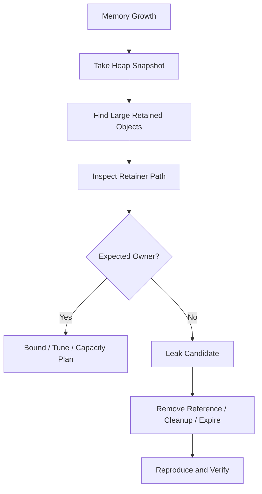
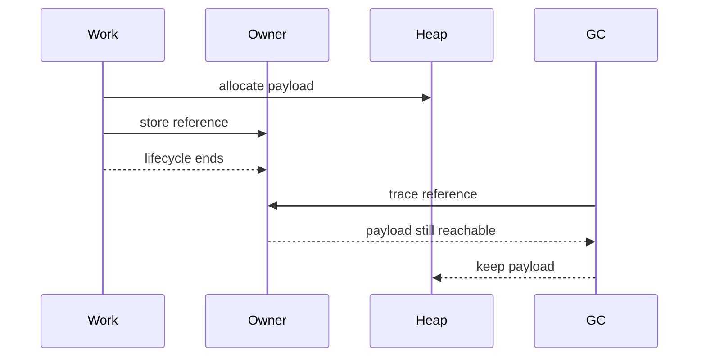
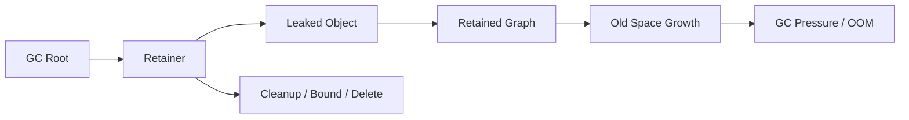
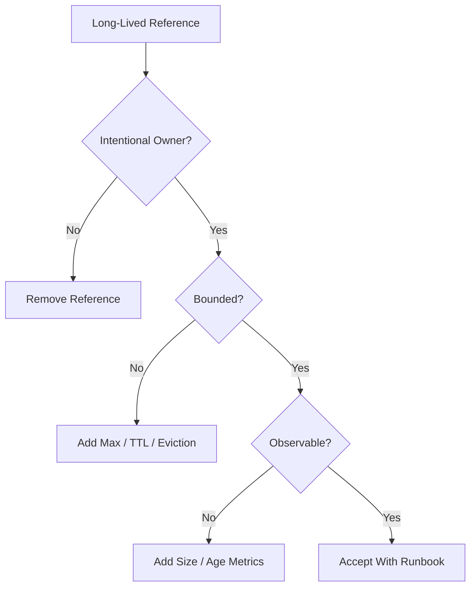

# 002.03.03 Leaks and Retainers

Category: JavaScript Internals<br>
Topic: 002.03 Memory Internals

Leaks and retainers explain why memory stays alive after the application no longer needs it. In garbage-collected JavaScript, a leak is usually not "memory the engine forgot." It is memory still reachable through a reference path: cache, closure, listener, timer, queue, module state, DOM node, native handle, or async continuation.

The fastest way to debug memory leaks is to stop asking "why did GC not free this?" and start asking "who still retains this?"

---

## 1. Definition

A memory leak is memory that remains reachable even though it is no longer useful to the application.

A retainer is an object or reference path that keeps another object alive.

One-line definition:

- Leaks are unwanted reachable objects; retainers are the references that keep them reachable.

Expanded explanation:

- Garbage collection reclaims unreachable objects.
- If an object is reachable from a GC root, it stays alive.
- A leaked object is usually reachable through a surprising or forgotten path.
- Heap snapshots expose these paths as retainers.

Example:

```ts
const cache = new Map<string, Payload>();
cache.set(request.id, request.payload);
```

`request.payload` is retained by:

```text
GC root
  -> module scope
  -> cache Map
  -> entry
  -> payload
```

If the cache is unbounded, this becomes a leak pattern.

---

## 2. Why It Exists

Leaks exist because reachability and usefulness are different concepts.

The engine can know:

- this object is reachable,
- this object is unreachable.

The engine cannot know:

- this old request is no longer useful,
- this cache entry should have expired,
- this listener belonged to an unmounted component,
- this timer should have been cleared,
- this queued job should be dropped,
- this tenant data exceeded a business retention rule.

Retainer analysis exists because memory bugs are graph bugs.

Production impact:

- Node process OOM,
- browser tab memory growth,
- serverless warm instance degradation,
- worker throughput decline,
- p99 latency spikes from GC pressure,
- container kills due to RSS growth,
- stale secrets or PII retained longer than intended.

Senior-level framing:

- GC manages unreachable memory. Engineers manage ownership, lifetime, and bounds.

---

## 3. Syntax & Variants

There is no leak-specific syntax. Leaks come from normal JavaScript references that outlive their intended lifecycle.

### Module-scope retention

```ts
const requests: Request[] = [];

export function track(request: Request) {
  requests.push(request);
}
```

`requests` lives for the module lifetime.

### Cache retention

```ts
const cache = new Map<string, UserProfile>();
```

Maps strongly retain keys and values until deleted or the Map itself becomes unreachable.

### Closure retention

```ts
function createHandler(payload: BigPayload) {
  return () => payload.id;
}
```

The returned function retains `payload`.

### Timer retention

```ts
const timeout = setTimeout(() => {
  process(payload);
}, 60_000);
```

The timer retains callback and captured state until fired or cleared.

### Event listener retention

```ts
element.addEventListener("click", () => {
  render(componentState);
});
```

The listener retains `componentState` while registered.

### Queue retention

```ts
const queue: Job[] = [];
queue.push(job);
```

Queues are supposed to retain work, but they leak when work is never processed, bounded, expired, or dropped.

### WeakMap metadata

```ts
const meta = new WeakMap<object, Metadata>();
meta.set(node, { createdAt: Date.now() });
```

WeakMap is useful when metadata should not keep the key object alive.

---

## 4. Internal Working

Leak analysis follows reachability.



### Retainer path

A retainer path is the chain of references from a root to an object.

Example:

```text
Window
  -> eventListeners
  -> click handler
  -> [[Scopes]]
  -> componentState
  -> hugeData
```

The object is retained because the event listener is still reachable.

### Dominator

In heap analysis, a dominator is an object that controls reachability to a large part of the graph.

If removing object `A` would make many objects collectable, `A` dominates those objects.

Common dominators:

- Map cache,
- array queue,
- root store,
- DOM container,
- global registry,
- module singleton,
- Promise chain.

### Shallow vs retained size

```text
Small Map object
  -> many entries
  -> large payloads
```

The Map's shallow size may be tiny, but retained size may be huge.

### Leak lifecycle

```text
Object allocated
  -> useful for a while
  -> lifecycle ends
  -> reference remains
  -> GC sees object as reachable
  -> old space grows
  -> GC time rises
  -> OOM or latency incident
```

### Snapshot comparison

Single snapshot:

- shows current memory.

Two snapshots:

- show growth.

Three snapshots:

- baseline, after workload, after cleanup.

This is much stronger evidence.

---

## 5. Memory Behavior

Leaks usually show up as retained growth, not one-time allocation.

### Leak pattern

```text
Traffic repeats
  -> memory increases
  -> GC runs
  -> memory does not return to prior baseline
  -> old generation grows
```

### Allocation pressure pattern

```text
Traffic repeats
  -> memory spikes
  -> GC runs
  -> memory returns to baseline
  -> latency may still suffer
```

The first suggests retention. The second suggests allocation pressure.

### Common retainer categories

- Global/module variables.
- Caches and registries.
- Event listeners.
- Timers and intervals.
- Closures.
- Pending Promises.
- Queues and retry buffers.
- DOM nodes.
- Observers and subscriptions.
- Native handles and Buffers.
- Logs/traces retaining payloads.

### Old generation behavior

Leaks often accumulate in old generation because leaked objects survive repeated young-generation collections.

Symptoms:

- old-space used grows,
- major GC becomes more frequent,
- major GC frees less memory,
- process gets closer to heap limit.

### External memory behavior

Retainers can also keep external memory alive.

Example:

```ts
const uploads = new Map<string, Buffer>();
```

The Map retains Buffer objects, and their backing memory contributes to external/RSS memory.

---

## 6. Execution Behavior

Leaks emerge through lifecycle mismatch.

### Mount without cleanup

```ts
function mount(element: HTMLElement, state: State) {
  element.addEventListener("click", () => {
    render(state);
  });
}
```

Each mount adds a listener. If old listeners are not removed, old `state` remains reachable.

### Request stored globally

```ts
const recentRequests: Request[] = [];

app.use((req, _res, next) => {
  recentRequests.push(req);
  next();
});
```

Every request can retain headers, body, sockets, user data, and framework metadata.

### Retry queue never drains

```ts
const failedJobs: Job[] = [];

async function run(job: Job) {
  try {
    await process(job);
  } catch {
    failedJobs.push(job);
  }
}
```

This retains every failed job forever.

### Promise chain retention

```ts
let chain = Promise.resolve();

for (const payload of payloads) {
  chain = chain.then(() => process(payload));
}
```

The chain can retain payloads until earlier work completes.

### Execution diagram



---

## 7. Scope & Context Interaction

Scope controls retention through references.

### Local scope does not leak by itself

```ts
function handle() {
  const payload = load();
  return payload.id;
}
```

After the function returns, `payload` can be collected if it does not escape.

### Closure can leak

```ts
function register(payload: BigPayload) {
  emitter.on("event", () => {
    console.log(payload.id);
  });
}
```

The emitter retains the listener, and the listener retains `payload`.

### Module scope can leak

```ts
const users = new Map<string, User>();
```

Module scope is long-lived. Treat it as process/page lifetime.

### Async scope can retain

```ts
async function process(payload: BigPayload) {
  await slowStep();
  return payload.id;
}
```

`payload` is retained across the await if needed after resume.

### DOM scope can retain JS and native resources

```ts
const detached = document.querySelector("#panel");
detached?.remove();
store.currentPanel = detached;
```

The DOM node is detached from the document but still reachable from JS.

---

## 8. Common Examples

### Example 1: Bounded request log

Bad:

```ts
const requests: Request[] = [];
```

Better:

```ts
const recentRequests: Array<{ id: string; path: string; at: number }> = [];

function remember(req: Request) {
  recentRequests.push({ id: req.id, path: req.path, at: Date.now() });
  if (recentRequests.length > 100) {
    recentRequests.shift();
  }
}
```

Store small metadata and bound it.

### Example 2: Listener cleanup

```ts
function attach(element: HTMLElement, state: State) {
  const handler = () => render(state);
  element.addEventListener("click", handler);

  return () => {
    element.removeEventListener("click", handler);
  };
}
```

The cleanup function breaks the retainer path.

### Example 3: Cache with TTL and max

```ts
type Entry<T> = {
  value: T;
  expiresAt: number;
};

const cache = new Map<string, Entry<Result>>();

function set(key: string, value: Result) {
  cache.set(key, {
    value,
    expiresAt: Date.now() + 300_000,
  });
}
```

A real cache should also enforce max size and evict expired entries.

### Example 4: Avoid payload retention across await

Bad:

```ts
async function handle(payload: BigPayload) {
  await audit(payload.user.id);
  return payload.items.length;
}
```

Better:

```ts
async function handle(payload: BigPayload) {
  const userId = payload.user.id;
  const itemCount = payload.items.length;

  await audit(userId);

  return itemCount;
}
```

### Example 5: WeakMap for metadata

```ts
const meta = new WeakMap<object, { mountedAt: number }>();

function markMounted(component: object) {
  meta.set(component, { mountedAt: Date.now() });
}
```

The metadata does not keep the component object alive.

---

## 9. Confusing / Tricky Examples

### Trap 1: Detached does not mean collectable

Removing a DOM node from the document does not free it if JavaScript still references it.

### Trap 2: A leak can be small per request

```text
2 KB leaked/request * 500 requests/sec = serious incident
```

Small leaks become large under traffic.

### Trap 3: The retainer is often small

A tiny closure can retain a huge payload.

### Trap 4: WeakMap is not a cache eviction policy

WeakMap helps with object-lifetime metadata. It does not replace TTL, max size, or explicit cache ownership for string-keyed caches.

### Trap 5: Logging can retain data

Some logging or tracing systems buffer objects before serialization/export. Passing entire payloads can retain sensitive and large data.

### Trap 6: One snapshot is not proof

A snapshot shows memory at one point. Growth and cleanup behavior require comparison.

---

## 10. Real Production Use Cases

### SPA route leak

Problem:

- memory grows after every route change.

Retainers:

- event listeners,
- observers,
- global stores,
- detached DOM nodes,
- closure over old route data.

Fix:

- cleanup on unmount,
- clear store slices,
- verify detached nodes disappear.

### Node API memory growth

Problem:

- old-space grows with traffic.

Retainers:

- request log,
- per-user cache,
- retry queue,
- unresolved promises,
- module singleton.

Fix:

- bound collections,
- remove request objects,
- store small metadata,
- add cache/queue metrics.

### Worker retry leak

Problem:

- failed jobs retained forever.

Retainers:

- failed job array,
- retry scheduler,
- closure over payload.

Fix:

- retry count,
- dead-letter queue,
- payload compaction,
- TTL cleanup.

### Buffer retention

Problem:

- RSS grows faster than heapUsed.

Retainers:

- Maps or queues holding Buffers,
- upload middleware,
- compression/image processing pipeline.

Fix:

- stream,
- release references,
- bound concurrency,
- monitor external memory.

### Analytics cardinality leak

Problem:

- metrics aggregation grows by user-provided keys.

Retainers:

- object/Map keyed by event name/user/tenant without bound.

Fix:

- cap cardinality,
- reject/normalize keys,
- expire windows,
- use approximate structures where appropriate.

---

## 11. Interview Questions

### Basic

1. What is a memory leak in a garbage-collected language?
2. What is a retainer?
3. What is a retainer path?
4. Why can a closure cause a leak?
5. Why can a cache cause a leak?

### Intermediate

1. How do you debug a Node memory leak?
2. What is retained size?
3. What is a detached DOM node?
4. Why can a pending timer retain memory?
5. How do you distinguish leak from allocation pressure?

### Advanced

1. Explain dominators in heap snapshots.
2. How would you debug high RSS with Buffer retention?
3. How do module singletons create process-lifetime retention?
4. Why is a WeakMap useful for metadata?
5. How would you design leak detection for a worker service?

### Tricky

1. Can an object be useless but not collectable?
2. Can a small object retain a huge graph?
3. Does removing a DOM node free it?
4. Does setting a variable to `null` fix every leak?
5. Is a memory leak always visible in `heapUsed`?

Strong answers should explain roots, reachability, retainers, heap snapshot comparison, and ownership cleanup.

---

## 12. Senior-Level Pitfalls

### Pitfall 1: Looking for the biggest shallow object

The leak is often retained by a small owner.

Senior correction:

- inspect retained size and dominator tree.

### Pitfall 2: Assuming GC failed

GC keeps reachable objects.

Senior correction:

- inspect retainer paths.

### Pitfall 3: Storing full objects for observability

Request, response, job, and payload objects can be huge.

Senior correction:

- store IDs, timestamps, route names, status codes, and bounded metadata.

### Pitfall 4: No lifecycle for temporary compatibility code

Migration maps and feature-flag stores can become permanent.

Senior correction:

- add owners, expiration, and cleanup tasks.

### Pitfall 5: Ignoring non-heap retention

Buffers, DOM nodes, and native handles can dominate memory.

Senior correction:

- inspect RSS/external/native memory and browser DOM retainers.

### Pitfall 6: Fixing by restarting

Restarts reduce symptoms but hide root cause.

Senior correction:

- use restarts as mitigation, not root fix.

---

## 13. Best Practices

### Ownership

- Every long-lived collection needs an owner.
- Every cache needs max size and TTL or explicit invalidation.
- Every queue needs drain/drop/dead-letter behavior.
- Every listener/timer/subscription needs cleanup.

### Data minimization

- Store IDs instead of full objects.
- Store metadata instead of payloads.
- Avoid logging full request bodies.
- Extract fields before `await` when possible.

### Frontend cleanup

- Remove event listeners.
- Disconnect observers.
- Cancel timers.
- Abort fetches for unmounted flows.
- Clear route-level stores.

### Backend cleanup

- Bound in-memory caches.
- Avoid retaining request/response objects.
- Limit concurrency.
- Stream large data.
- Add queue depth and cache cardinality metrics.

### Debugging

- Take baseline and growth snapshots.
- Compare retained size.
- Inspect retainer paths.
- Reproduce with controlled workload.
- Verify memory returns after cleanup.

---

## 14. Debugging Scenarios

### Scenario 1: Heap grows after every request

Symptoms:

- old-space grows,
- request count correlates with memory,
- GC does not return baseline.

Debugging flow:

```text
Run controlled traffic
  -> take heap snapshot
  -> inspect retained request objects
  -> find module/cache/queue retainer
  -> replace with bounded metadata
```

### Scenario 2: Detached DOM nodes

Symptoms:

- browser memory grows after navigation,
- devtools shows detached nodes.

Debugging flow:

```text
Take snapshot after route change
  -> filter detached DOM nodes
  -> inspect retaining JS listener/store
  -> cleanup on unmount
  -> verify after repeated navigation
```

### Scenario 3: Failed job queue leak

Symptoms:

- worker memory grows only during downstream outage.

Debugging flow:

```text
Inspect retry/dead-letter logic
  -> check failed job retention
  -> add retry limits and TTL
  -> store compact payload references
```

### Scenario 4: Buffer RSS leak

Symptoms:

- RSS high,
- heapUsed moderate,
- external memory high.

Debugging flow:

```text
Inspect Buffer retainers
  -> check upload queues
  -> check compression/image pipeline
  -> stream instead of buffer
  -> bound concurrency
```

### Scenario 5: Stale closure retains secrets

Symptoms:

- heap snapshot shows old auth token in retained closure.

Debugging flow:

```text
Find closure retainer
  -> identify listener/timer/promise
  -> remove cleanup gap
  -> avoid capturing full auth object
```

---

## 15. Exercises / Practice

### Exercise 1: Identify the retainer

```ts
const cache = new Map<string, Payload>();
cache.set(payload.id, payload);
```

Draw the retainer path from module root to `payload`.

### Exercise 2: Fix listener leak

```ts
function mount(element, state) {
  element.addEventListener("click", () => render(state));
}
```

Rewrite with cleanup.

### Exercise 3: Reduce request retention

```ts
const recent = [];
app.use((req, res, next) => {
  recent.push(req);
  next();
});
```

Store safe bounded metadata instead.

### Exercise 4: Leak or allocation pressure?

Memory spikes during requests and returns to baseline after GC. Is this a leak? What do you inspect next?

### Exercise 5: Heap snapshot reasoning

A dominator tree shows:

```text
Map @ module cache
  retained size: 1.4 GB
```

What questions do you ask?

---

## 16. Comparison

### Leak vs allocation pressure

| Concern | Leak | Allocation Pressure |
| --- | --- | --- |
| Baseline after GC | grows | returns |
| Main issue | unwanted retention | too much temporary allocation |
| Tool | heap snapshot comparison | allocation profile / CPU profile |
| Fix | cleanup / bounds | reduce allocations / stream |

### Shallow vs retained size

| Metric | Meaning | Debugging Use |
| --- | --- | --- |
| Shallow size | object itself | rarely enough alone |
| Retained size | graph kept alive by object | key for leak analysis |

### Strong vs weak retention

| Structure | Retains Target? | Use |
| --- | --- | --- |
| Array/Map/Set | Yes | owned collections |
| WeakMap key | No | object metadata |
| WeakRef | No | rare advanced caches |
| Closure | Yes for captured bindings | callbacks/state |

### Frontend vs backend leaks

| Environment | Common Retainers |
| --- | --- |
| Browser | DOM nodes, listeners, observers, stores, closures |
| Node | caches, queues, module state, Buffers, timers, requests |

---

## 17. Related Concepts

Leaks and Retainers connect to:

- `002.03.01 Heap Layout`: leaks are retained object graphs in heap memory.
- `002.03.02 Garbage Collection`: GC keeps reachable objects.
- `002.02.02 Lexical Environments`: closures retain bindings and objects.
- `001.04.02 Performance Profiling`: allocation and heap profiles reveal memory pressure.
- Browser Fundamentals: detached DOM nodes and event listener cleanup.
- Node.js: RSS, external memory, Buffers, long-lived processes.
- Caching: bounded lifetime and eviction policies.
- Observability: memory metrics, heap dumps, GC duration, alerts.

Knowledge graph:



---

## Advanced Add-ons

### Performance Impact

Leaks affect performance before they crash the process:

- old-generation collections become more frequent,
- major GC pauses grow,
- CPU time shifts to GC,
- event-loop delay increases,
- browser interactions become sluggish,
- containers approach memory limits.

Optimization focus:

- reduce retained size,
- remove accidental owners,
- bound growth,
- reduce payload size,
- segment large tenants/workloads,
- verify after repeated lifecycle cycles.

### System Design Relevance

Leak prevention is architecture:

- cache policy,
- queue policy,
- retry policy,
- lifecycle ownership,
- observability,
- cleanup ownership,
- tenant isolation,
- payload limits.

Decision framework:



### Security Impact

Leaks can retain sensitive data:

- tokens in closures,
- PII in caches,
- request bodies in logs,
- authorization context in stale callbacks,
- heap dumps containing secrets.

Practices:

- minimize retained sensitive data,
- scrub logs/traces,
- protect heap snapshots,
- clear references to secrets where practical,
- set retention policies for caches and queues.

### Browser vs Node Behavior

Browser:

- detached DOM nodes are common,
- route/component lifecycle matters,
- long sessions expose leaks,
- browser devtools can inspect retainers and DOM nodes.

Node:

- process lifetime is long,
- module state is shared across requests,
- Buffers and external memory matter,
- leaks often appear as old-space growth or RSS growth.

Shared:

- reachability controls collection,
- retainers explain leaks,
- cleanup must match lifecycle.

### Polyfill / Implementation

You cannot inspect real GC retainers directly from normal JavaScript, but you can model a retainer path.

```ts
type NodeId = string;

type HeapNode = {
  id: NodeId;
  refs: NodeId[];
};

function findPath(
  heap: Map<NodeId, HeapNode>,
  roots: NodeId[],
  target: NodeId,
) {
  const queue = roots.map((root) => [root]);
  const seen = new Set<NodeId>();

  while (queue.length > 0) {
    const path = queue.shift()!;
    const current = path[path.length - 1];

    if (current === target) return path;
    if (seen.has(current)) continue;
    seen.add(current);

    for (const ref of heap.get(current)?.refs ?? []) {
      queue.push([...path, ref]);
    }
  }

  return undefined;
}
```

This mirrors what you do mentally in heap snapshots: find the path from a root to the retained object.

---

## 18. Summary

Leaks and retainers are the practical heart of JavaScript memory debugging.

Quick recall:

- A leak is unwanted reachability.
- A retainer is what keeps an object alive.
- Retainer paths lead from GC roots to retained objects.
- Retained size matters more than shallow size.
- Caches, listeners, timers, closures, queues, DOM nodes, and module state are common retainers.
- Detached DOM nodes are still alive if JS references them.
- Maps strongly retain keys and values.
- WeakMap is useful for object metadata.
- Compare heap snapshots under controlled workloads.
- Fix leaks by removing owners, bounding collections, or cleaning lifecycle references.

Staff-level takeaway:

- Memory leaks are ownership bugs. The collector can reclaim only what your architecture makes unreachable.
