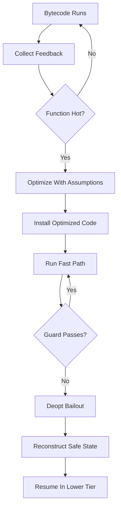
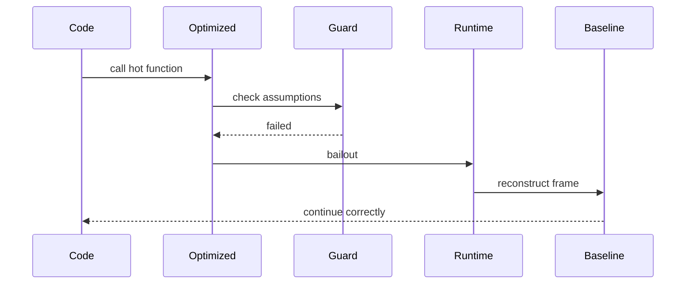
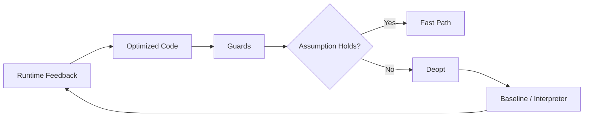
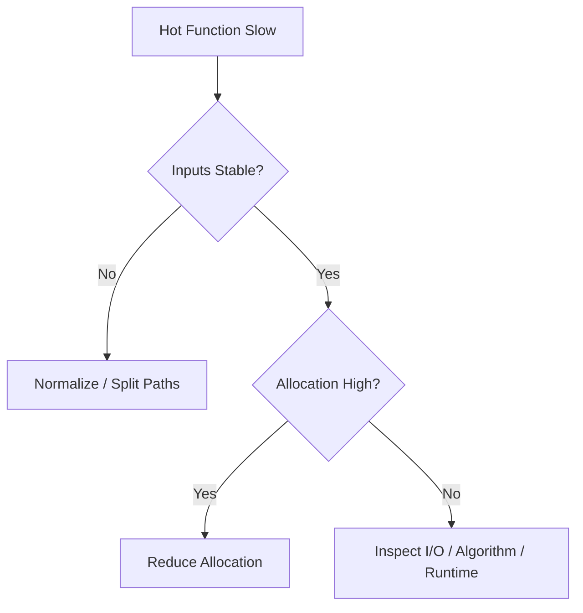

# 002.04.01 Deoptimization

Category: JavaScript Internals<br>
Topic: 002.04 Optimization Boundaries

Deoptimization is the runtime process of abandoning optimized machine code and falling back to a safer execution tier when the assumptions used by the optimizer are no longer valid.

It is one of the most important JavaScript performance concepts because modern engines are fast by speculating. When speculation is correct, hot code runs quickly. When speculation breaks often, the engine spends time bailing out, recompiling, and running generic paths.

---

## 1. Definition

Deoptimization is a correctness-preserving fallback from optimized code to less optimized code.

One-line definition:

- Deoptimization happens when optimized JavaScript code hits a case that violates the assumptions used to make it fast.

Expanded explanation:

- The interpreter runs bytecode and collects runtime feedback.
- The optimizer compiles hot code using assumptions based on observed types, shapes, call targets, and operations.
- Optimized code includes guards that check whether those assumptions still hold.
- If a guard fails, the engine reconstructs a safe execution state and continues in a lower tier.

Simplified flow:

```text
Hot function
  -> optimize using feedback
  -> execute fast path
  -> guard fails
  -> reconstruct interpreter/baseline state
  -> continue safely
```

Deoptimization is not a bug. It is how dynamic JavaScript remains correct while still getting optimized performance.

---

## 2. Why It Exists

JavaScript is dynamic:

```ts
function add(a, b) {
  return a + b;
}

add(1, 2);
add("1", "2");
```

The same operation can mean numeric addition or string concatenation.

To run fast, engines speculate:

- this property access usually sees one object shape,
- this arithmetic usually uses numbers,
- this call usually targets the same function,
- this array usually contains packed numbers,
- this branch usually sees a stable type.

Deoptimization exists because speculation must never break correctness.

It solves:

- safe fallback when runtime behavior changes,
- ability to optimize dynamic language code,
- correctness across rare/unusual values,
- support for prototype changes, accessors, proxies, and dynamic features.

Production relevance:

- frequent deopt can cause CPU spikes,
- p99 latency may worsen under unusual tenant data,
- benchmarks can lie if they avoid deopt cases,
- hot API paths can slow after one polymorphic input,
- frontend rendering can degrade when props/state shapes vary wildly.

---

## 3. Syntax & Variants

There is no standard JavaScript syntax for deoptimization. You influence it through runtime behavior.

### Stable numeric operation

```ts
function multiply(a: number, b: number) {
  return a * b;
}

multiply(2, 3);
multiply(4, 5);
```

This is optimization-friendly when runtime values are consistently numbers.

### Type instability

```ts
function multiply(a: any, b: any) {
  return a * b;
}

multiply(2, 3);
multiply("4", 5);
```

The string input can break numeric assumptions.

### Shape instability

```ts
function readTotal(order: { total: number }) {
  return order.total;
}

readTotal({ id: "1", total: 100 });
readTotal({ total: 200, id: "2" });
```

Same visible fields, different creation order may produce different shapes.

### Prototype mutation

```ts
Object.setPrototypeOf(obj, newProto);
```

Changing prototypes can invalidate optimized property lookups.

### Delete

```ts
delete user.active;
```

Deleting properties can change object layout and hurt optimized access paths.

### Dynamic code

```js
eval("var injected = 1");
```

Direct `eval` and `with` complicate scope and optimization.

### Diagnostic flags

V8/Node local diagnostics:

```bash
node --trace-opt --trace-deopt app.js
```

These are for learning and deep diagnostics. They are noisy and engine-specific.

---

## 4. Internal Working

### Optimization and deoptimization lifecycle



### Runtime feedback

The engine records:

- argument types,
- object shapes,
- property locations,
- call targets,
- array element kinds,
- branch behavior,
- arithmetic result types.

### Optimized assumptions

Example:

```ts
function getPrice(product) {
  return product.price;
}
```

Optimizer may assume:

- `product` has a known hidden class,
- `price` is at a known offset,
- no relevant prototype/accessor/proxy behavior interferes.

Optimized fast path:

```text
if object.shape === expectedShape
  load field at offset
else
  deopt/fallback
```

### Bailout

A bailout is the moment optimized code cannot continue safely.

The engine must:

- stop optimized execution,
- reconstruct logical call frames,
- restore values that may have been optimized away,
- continue from equivalent bytecode/baseline state.

### On-stack replacement

On-stack replacement, often called OSR, lets an engine enter optimized code while a long-running function or loop is already executing.

Deoptimization may also exit optimized code while execution is in progress.

### Deopt churn

Bad pattern:

```text
optimize
  -> deopt
  -> reoptimize
  -> deopt again
```

This churn can be worse than never optimizing.

---

## 5. Memory Behavior

Deoptimization uses memory for optimized code and metadata.

### Optimization artifacts

```text
Bytecode
  -> feedback vector
  -> optimized machine code
  -> guards
  -> deopt metadata
  -> source position / frame reconstruction data
```

### Why metadata matters

If optimized code removes or stores values in registers, the engine still needs enough information to reconstruct the visible JavaScript state during deopt.

Example:

```ts
function calculate(a, b) {
  const total = a + b;
  return total * 2;
}
```

Optimized code may not store `total` as a normal heap object, but if deopt or debugging needs it, the engine must reconstruct state.

### Code memory pressure

Too much optimized code can consume code memory.

Engines manage this through:

- tiering,
- code flushing,
- selective optimization,
- deoptimizing unstable code,
- avoiding optimization for cold code.

### Deopt and allocation

Deoptimization can allocate:

- reconstructed objects,
- materialized stack frames,
- boxed values,
- metadata structures.

Frequent deopt can add CPU and memory pressure.

### Production symptoms

- CPU spikes,
- profile frames in runtime/deopt machinery,
- increased latency for unusual inputs,
- more allocations after rare code paths,
- inconsistent benchmark results.

---

## 6. Execution Behavior

Deoptimization is usually invisible to program correctness but visible to performance.

### Stable execution

```ts
function total(order) {
  return order.subtotal + order.tax;
}

total({ subtotal: 100, tax: 18 });
total({ subtotal: 200, tax: 36 });
```

Stable shapes and number operations can stay optimized.

### Guard failure

```ts
total({ subtotal: "100", tax: 18 });
```

The optimizer may have assumed numeric addition. A string changes semantics.

### Shape guard failure

```ts
total({ tax: 18, subtotal: 100 });
```

Different object layout may fail a shape guard.

### Execution timeline



### User-visible effect

The returned value should still be correct.

The cost may appear as:

- one slow request,
- repeated slow path,
- CPU regression,
- tail latency spike,
- benchmark instability.

---

## 7. Scope & Context Interaction

Some language features make optimization harder because they affect scope or object semantics.

### Direct eval

```js
function run(source) {
  const local = 1;
  return eval(source);
}
```

Direct eval can access local scope, making assumptions harder.

### With statement

```js
with (obj) {
  console.log(value);
}
```

`with` makes identifier lookup dynamic and is disallowed in strict mode.

### Closures

```ts
function outer(value) {
  return function inner() {
    return value;
  };
}
```

Closures are normal and optimized by modern engines, but captured environments affect allocation and optimization.

### Try/catch

Modern engines handle `try/catch` far better than older engines, but exceptions still create unusual control flow. Do not avoid `try/catch` blindly; measure hot paths.

### Prototypes and accessors

```ts
Object.defineProperty(product, "price", {
  get() {
    return computePrice();
  },
});
```

An accessor is not the same as a simple data property. Optimized code must preserve the semantics.

### Proxies

```ts
const proxy = new Proxy(target, {
  get(obj, key) {
    return obj[key];
  },
});
```

Proxies can intercept fundamental operations and block many normal assumptions.

---

## 8. Common Examples

### Example 1: Stable hot mapper

```ts
type Row = {
  id: string;
  amount: number;
};

function toAmount(row: Row) {
  return row.amount;
}
```

This can optimize well if callers pass consistent row shapes.

### Example 2: Megamorphic input

```ts
function getId(entity: any) {
  return entity.id;
}

getId({ id: "user-1", name: "Ava" });
getId({ id: "order-1", total: 100 });
getId({ id: "invoice-1", dueAt: "2026-01-01" });
```

Many shapes at one access site can make inline caches less useful and cause slower generic paths.

### Example 3: Numeric to string instability

```ts
function addTax(amount: any) {
  return amount + amount * 0.18;
}

addTax(100);
addTax("100");
```

`"100" + 18` creates string behavior.

### Example 4: Delete in hot path

```ts
function sanitize(user: any) {
  delete user.passwordHash;
  return user;
}
```

Better:

```ts
function toPublicUser(user: User) {
  return {
    id: user.id,
    name: user.name,
    role: user.role,
  };
}
```

This avoids mutating shape and is safer for security.

### Example 5: Packed array to mixed array

```ts
const values = [1, 2, 3];
values.push("4" as any);
```

Mixed element kinds can force less specialized array handling.

---

## 9. Confusing / Tricky Examples

### Trap 1: Deopt is not incorrectness

If optimized assumptions fail, the engine falls back to preserve semantics.

### Trap 2: One rare input can poison a hot call site

A function that is fast for numeric values may become less optimized after seeing strings or objects.

### Trap 3: TypeScript does not guarantee runtime type stability

```ts
function add(a: number, b: number) {
  return a + b;
}

add("1" as any, 2 as any);
```

Type annotations are erased.

### Trap 4: Microbenchmarks can hide deopt

Benchmarks with perfectly stable data may not represent production input variation.

### Trap 5: Engine-specific advice expires

Optimization heuristics change. Avoid writing strange code based on old engine folklore.

### Trap 6: Polymorphism is not always bad

Engines can handle small, stable polymorphism. The problem is uncontrolled megamorphic churn in hot paths.

---

## 10. Real Production Use Cases

### API serializer regression

Problem:

- CPU increases after adding optional fields.

Cause:

- serializer sees many DTO shapes and deopts/generic paths increase.

Fix:

- normalize DTO shape,
- construct public response objects,
- profile with realistic payloads.

### Data import worker

Problem:

- worker is fast for small customers but slow for enterprise imports.

Cause:

- mixed row types, sparse arrays, string/number instability.

Fix:

- validate/normalize at boundary,
- split code paths by data type,
- avoid one hot function handling every shape.

### Frontend table rendering

Problem:

- hot cell renderer slows after supporting custom rows.

Cause:

- renderer reads properties from many unrelated row shapes.

Fix:

- convert rows into stable view models before rendering.

### Serverless benchmark mismatch

Problem:

- local warmed benchmark is fast, production cold path is slow.

Cause:

- optimized tier not reached or deopt happens on real input.

Fix:

- measure cold and warm behavior separately.

### Feature flag payload variation

Problem:

- dynamic flag objects produce unpredictable shapes.

Fix:

- use stable metadata fields plus `Map`/entries for dynamic keys.

---

## 11. Interview Questions

### Basic

1. What is deoptimization?
2. Why do JavaScript engines deoptimize?
3. Is deoptimization a bug?
4. What is an optimized assumption?
5. What is a guard?

### Intermediate

1. How can type instability cause deoptimization?
2. How can object shape instability affect optimization?
3. Why can `delete` hurt hot-path performance?
4. How do inline caches relate to deoptimization?
5. Why do microbenchmarks need warmup and realistic data?

### Advanced

1. Explain bailout and frame reconstruction.
2. What is on-stack replacement?
3. How can proxies affect optimization?
4. How would you investigate frequent deopt in Node?
5. How can deopt churn affect p99 latency?

### Tricky

1. Does TypeScript prevent deoptimization?
2. Is polymorphic code always slow?
3. Should you remove all `try/catch` for performance?
4. Can one unusual tenant input slow a hot path?
5. Is optimized code always faster overall if it deopts frequently?

Strong answers should connect runtime feedback, speculative optimization, guards, bailout, correctness, and measurement.

---

## 12. Senior-Level Pitfalls

### Pitfall 1: Performance folklore

Senior correction:

- profile current runtime and workload.

### Pitfall 2: Optimizing non-hot code

Senior correction:

- do not trade readability for theoretical deopt avoidance.

### Pitfall 3: Ignoring production data variation

Senior correction:

- benchmark with real shapes, sizes, nulls, outliers, and tenant diversity.

### Pitfall 4: Unsafe TypeScript casts

Senior correction:

- validate at boundaries and preserve runtime type stability.

### Pitfall 5: Mixing many concerns in one hot function

Senior correction:

- split paths by stable domain shape or normalize input.

### Pitfall 6: Treating diagnostics as portable truth

Senior correction:

- V8 flags are useful but engine-specific.

---

## 13. Best Practices

### Code shape

- Keep hot-path input shapes stable.
- Normalize external data at boundaries.
- Avoid deleting properties on hot objects.
- Avoid mixing strings/numbers/objects in hot arithmetic paths.
- Prefer stable DTO factories for high-throughput serializers.
- Avoid proxies and dynamic property tricks in measured hot paths.

### Measurement

- Use CPU profiles before changing code.
- Measure cold start and steady state separately.
- Use realistic input variation.
- Compare p95/p99, not only average.
- Use engine diagnostics only when needed.

### Maintainability

- Keep performance-sensitive code isolated.
- Document measured reasons for less-obvious code.
- Add regression benchmarks for critical hot paths.
- Avoid broad rewrites based on one microbenchmark.

### Architecture

- Separate rare flexible paths from common hot paths.
- Pre-normalize data before rendering/serialization.
- Use workers/services for CPU-heavy workloads.
- Bound dynamic key/value systems.

---

## 14. Debugging Scenarios

### Scenario 1: CPU regression after adding optional fields

Symptoms:

- serializer hot in CPU profile,
- p99 increased.

Debugging flow:

```text
Capture CPU profile
  -> inspect object shapes
  -> compare old/new DTO creation
  -> normalize shape
  -> re-profile with production data
```

### Scenario 2: Benchmark fast, production slow

Symptoms:

- local benchmark stable,
- production p99 bad.

Debugging flow:

```text
Compare inputs
  -> add null/string/outlier cases
  -> measure warmup and deopt
  -> profile production-like workload
```

### Scenario 3: Hot function gets many entity types

Symptoms:

- one helper reads `entity.id` for many domains.

Debugging flow:

```text
Find call sites
  -> classify shapes
  -> split helper or normalize input
  -> verify readability and performance
```

### Scenario 4: Node trace shows repeated deopt

Symptoms:

- `--trace-deopt` shows same function repeatedly.

Debugging flow:

```text
Identify deopt reason
  -> inspect function source
  -> inspect runtime inputs
  -> create minimal reproduction
  -> fix data stability if hot
```

### Scenario 5: Proxies slow state access

Symptoms:

- profile shows many proxy traps.

Debugging flow:

```text
Measure proxy access path
  -> snapshot plain data before hot loop
  -> avoid proxy access in inner loop
  -> verify behavior
```

---

## 15. Exercises / Practice

### Exercise 1: Type instability

```ts
function add(a, b) {
  return a + b;
}

add(1, 2);
add(3, 4);
add("5", 6);
```

Explain which assumption may break.

### Exercise 2: Shape variation

```ts
const a = { id: "1", total: 100 };
const b = { total: 200, id: "2" };
```

Why might these differ internally?

### Exercise 3: Fix hot sanitizer

```ts
function sanitize(user) {
  delete user.password;
  return user;
}
```

Rewrite as a stable public DTO.

### Exercise 4: Benchmark realism

Design benchmark inputs for a function that handles order rows. Include normal, missing, string, null, and large cases.

### Exercise 5: Deopt or allocation?

CPU profile shows slow path after a release. What evidence separates deopt from allocation pressure?

---

## 16. Comparison

### Optimization vs deoptimization

| Concept | Meaning | Goal |
| --- | --- | --- |
| Optimization | compile hot code using assumptions | speed |
| Deoptimization | fall back when assumptions fail | correctness |

### Monomorphic vs polymorphic vs megamorphic

| State | Shapes Seen | Impact |
| --- | --- | --- |
| Monomorphic | one | easiest to optimize |
| Polymorphic | few | often okay |
| Megamorphic | many | generic path likely |

### Cold vs hot code

| Code | Strategy |
| --- | --- |
| Cold | readability and startup matter most |
| Hot stable | optimization matters |
| Hot unstable | normalize/split/measure |

### TypeScript type vs runtime value

| Layer | Guarantees |
| --- | --- |
| TypeScript | compile-time model |
| JavaScript runtime | actual values and shapes |
| Optimizer | observed runtime behavior |

---

## 17. Related Concepts

Deoptimization connects to:

- `002.01.02 Bytecode and JIT`: deopt exits optimized code.
- `002.01.03 Inline Caches and Hidden Classes`: IC feedback drives assumptions.
- `002.04.02 Shape Changes`: shape instability triggers fallback.
- `002.04.03 Benchmarking Pitfalls`: warmup and deopt distort results.
- `001.04.02 Performance Profiling`: profiles reveal hot unstable paths.
- TypeScript Runtime Boundaries: types are erased and must be validated.
- Node Performance: CPU hot paths and p99 latency.
- Frontend Rendering: shape-stable props/view models in hot render paths.

Knowledge graph:



---

## Advanced Add-ons

### Performance Impact

Deoptimization affects:

- CPU throughput,
- p99 latency,
- benchmark stability,
- code memory,
- allocation from frame reconstruction,
- runtime predictability.

Optimization principles:

- stabilize hot inputs,
- normalize at boundaries,
- split rare cases out of hot loops,
- reduce shape chaos,
- measure before and after.

### System Design Relevance

Deoptimization shapes architecture in CPU-sensitive JavaScript systems:

- API gateways normalize payloads before hot middleware.
- Data workers convert input to stable row models.
- Frontend tables convert API data to stable view models.
- Realtime systems use stable message envelopes.
- Serverless handlers keep cold and hot paths separate.

Decision framework:



### Security Impact

Deoptimization itself is an engine behavior, but related patterns matter:

- `eval` and `new Function` are security risks,
- deleting sensitive fields can mutate shared objects,
- unsafe casts can let unvalidated data into trusted paths,
- proxies can hide behavior from simple review.

Practices:

- validate external input,
- create safe DTOs instead of mutating secrets away,
- avoid dynamic code execution,
- keep security-sensitive code explicit.

### Browser vs Node Behavior

Browser:

- JIT/deopt affects render and interaction hot paths,
- mobile devices amplify unstable hot code,
- devtools profiles may show optimized/inlined frames differently.

Node:

- long-running services can warm and optimize hot paths,
- unusual tenant payloads can trigger deopt and p99 spikes,
- `--trace-opt` and `--trace-deopt` help local diagnostics.

Shared:

- engine heuristics vary,
- correctness is preserved,
- frequent deopt is a performance smell only when measured.

### Polyfill / Implementation

You cannot polyfill deoptimization, but you can model guarded fast paths.

```ts
type Shape = "number" | "string" | "other";

function shapeOf(value: unknown): Shape {
  if (typeof value === "number") return "number";
  if (typeof value === "string") return "string";
  return "other";
}

function createOptimisticAdder() {
  let expected: Shape | undefined;

  return function add(a: unknown, b: unknown) {
    const current = shapeOf(a);

    if (!expected) {
      expected = current;
    }

    if (expected === "number" && current === "number" && typeof b === "number") {
      return a + b;
    }

    // Conceptual bailout to generic JavaScript semantics.
    return (a as any) + (b as any);
  };
}
```

Real engines are vastly more sophisticated, but the idea is similar: fast path guarded by assumptions, generic fallback when assumptions fail.

---

## 18. Summary

Deoptimization is the safety valve that lets engines optimize dynamic JavaScript without sacrificing correctness.

Quick recall:

- Optimizers speculate based on runtime feedback.
- Guards check assumptions.
- Deopt happens when a guard fails.
- Deopt reconstructs safe execution state.
- Type instability, shape changes, proxies, dynamic scope, and rare values can trigger fallback.
- Deopt is normal; repeated deopt churn in hot paths is the problem.
- TypeScript does not guarantee runtime stability.
- Profile before optimizing.
- Keep hot inputs stable and normalize external data.

Staff-level takeaway:

- Deoptimization is not something to fear everywhere. It is something to understand deeply enough that when a hot production path becomes unstable, you can prove why, fix the data shape or boundary, and keep the code maintainable.
