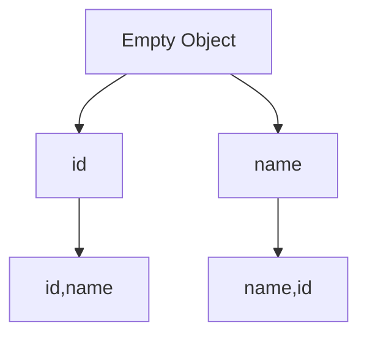
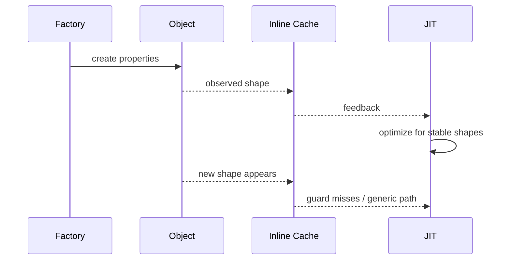
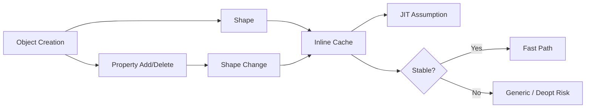
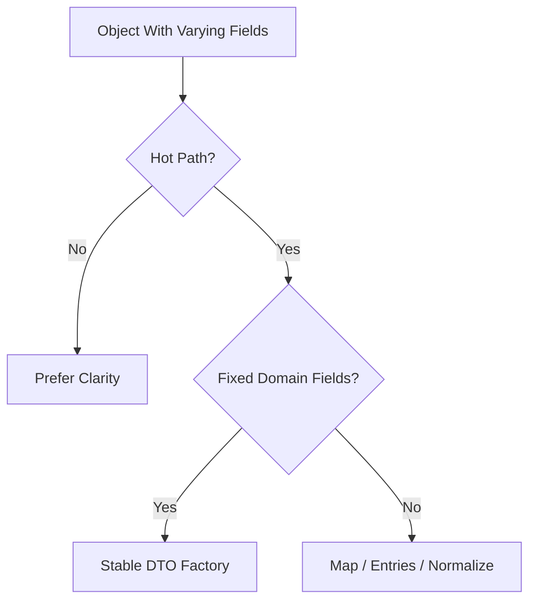

# 002.04.02 Shape Changes

Category: JavaScript Internals<br>
Topic: 002.04 Optimization Boundaries

Shape changes are changes to the runtime layout of JavaScript objects. They matter because engines optimize property access by assuming objects at a call site have predictable shapes. When objects are created, mutated, deleted from, spread, normalized inconsistently, or filled with dynamic keys, those shapes can drift and push hot code toward slower generic paths.

The practical rule is simple: do not contort ordinary code for hidden classes, but do keep hot-path DTOs, rows, messages, and view models shape-stable when profiling shows object layout is part of the bottleneck.

---

## 1. Definition

A shape change is an engine-internal object layout transition caused by adding, deleting, reordering, or dynamically varying properties.

One-line definition:

- Shape changes happen when objects stop sharing the same predictable property layout.

Expanded explanation:

- Engines often assign internal metadata to object layouts.
- V8 commonly calls these maps or hidden classes; other engines use terms like shapes or structures.
- Property access can be optimized when the engine sees stable object layouts.
- When one call site sees too many layouts, inline caches become polymorphic or megamorphic.
- Shape churn can lead to generic property lookup and deoptimization.

Example:

```ts
const a = { id: "1", total: 100 };
const b = { total: 100, id: "1" };
```

These objects have the same visible properties, but may have different internal shapes because the properties were created in different order.

---

## 2. Why It Exists

JavaScript objects are dynamic:

```ts
const obj: any = {};
obj.id = "1";
obj.name = "Ava";
delete obj.name;
obj[Math.random()] = "dynamic";
```

Engines must preserve this flexibility.

But most production code creates many objects with regular structure:

```ts
function toOrderDto(order: Order) {
  return {
    id: order.id,
    total: order.total,
    status: order.status,
  };
}
```

Shape tracking exists so engines can optimize common predictable cases.

Shape changes matter because they affect:

- property read speed,
- property write speed,
- inline cache quality,
- JIT assumptions,
- memory layout,
- serialization hot paths,
- frontend render loops,
- data processing workers.

Production relevance:

- API serializers often create many DTOs.
- GraphQL resolvers read fields repeatedly.
- frontend tables render thousands of row objects.
- analytics workers group data by dynamic keys.
- feature flag payloads often contain unbounded dynamic properties.

---

## 3. Syntax & Variants

Shape changes are influenced by normal JavaScript syntax.

### Stable object literal

```ts
function createUser(id: string, name: string) {
  return {
    id,
    name,
    active: true,
  };
}
```

Each returned object is likely to follow the same shape.

### Different property order

```ts
const a = { id: "1", name: "Ava" };
const b = { name: "Ava", id: "1" };
```

Same fields, different creation order.

### Conditional property

```ts
function createUser(user: User) {
  const dto: any = {
    id: user.id,
    name: user.name,
  };

  if (user.avatarUrl) {
    dto.avatarUrl = user.avatarUrl;
  }

  return dto;
}
```

This creates different shapes depending on `avatarUrl`.

### Predeclared optional field

```ts
function createUser(user: User) {
  return {
    id: user.id,
    name: user.name,
    avatarUrl: user.avatarUrl ?? null,
  };
}
```

More stable shape, but not always necessary. Use for hot paths where it matters.

### Delete

```ts
delete user.passwordHash;
```

This changes layout and can push objects toward slower storage modes.

Better for response shaping:

```ts
const publicUser = {
  id: user.id,
  name: user.name,
  role: user.role,
};
```

### Dynamic keys

```ts
const counts: Record<string, number> = {};

for (const event of events) {
  counts[event.name] = (counts[event.name] ?? 0) + 1;
}
```

For unbounded dynamic keys, `Map` often communicates intent better.

### Object spread

```ts
const next = {
  ...base,
  active: true,
};
```

Spread is useful, but property order and source shape can vary. In hot loops, it can allocate and create layout variation.

---

## 4. Internal Working

### Shape transition chain


Code:

```ts
const user: any = {};
user.id = "u1";
user.name = "Ava";
user.active = true;
```

Objects that follow the same transition chain can share shape metadata.

### Divergent transition



Different property order can create divergent shapes.

### Inline cache impact

```ts
function readName(user) {
  return user.name;
}
```

The access site `user.name` records observed shapes.

Possible states:

- monomorphic: one shape,
- polymorphic: a few shapes,
- megamorphic: many shapes.

### Dictionary mode

Highly dynamic objects may switch to dictionary-like property storage.

Triggers can include:

- many property additions,
- property deletion,
- dynamic/unpredictable keys,
- object used as a mutable hash map.

Dictionary mode helps dynamic use cases but is slower than stable fixed-layout property access.

### Array shape / elements kind

Arrays also have internal representations.

```ts
const values = [1, 2, 3];
values.push(4);
values.push("5" as any);
values[10_000] = 1;
```

Numeric dense arrays, mixed arrays, object arrays, and sparse arrays may use different representations.

---

## 5. Memory Behavior

Shape changes affect memory through metadata, property storage, and array backing stores.

### Shape metadata

Each distinct shape/transition path can use metadata.

High shape variety can increase:

- shape metadata,
- inline cache feedback,
- generic handlers,
- optimized-code guards.

### In-object vs out-of-object properties

Engines can store some properties directly in the object and others in external property storage.

Stable object layouts help engines place fields efficiently.

### Dictionary storage

Dynamic objects may use dictionary storage, trading optimized fixed-offset access for flexible mutation.

### Object spread and copying

```ts
const rows = data.map((row) => ({ ...row, selected: false }));
```

This allocates a new object per row and may copy varying source shapes.

### Production memory risk

Shape churn often appears together with allocation pressure:

- many DTO variants,
- many dynamic keys,
- repeated object spreads,
- row transformations,
- per-request temporary objects.

The performance issue may be CPU, GC, or both.

---

## 6. Execution Behavior

### Stable execution

```ts
function toDto(order: Order) {
  return {
    id: order.id,
    total: order.total,
    status: order.status,
  };
}
```

Repeated calls produce stable layout.

### Branch-based shape variation

```ts
function toDto(order: Order) {
  const dto: any = {
    id: order.id,
    total: order.total,
  };

  if (order.discount) {
    dto.discount = order.discount;
  }

  if (order.error) {
    dto.error = order.error;
  }

  return dto;
}
```

Each combination can create a different shape.

### Hot read site impact

```ts
function renderTotal(row) {
  return row.total.toFixed(2);
}
```

If `row` comes from many factories, `row.total` may become megamorphic.

### Execution diagram



### Correctness

Shape stability affects performance, not correctness. JavaScript semantics remain the same.

---

## 7. Scope & Context Interaction

### Module factories

Factories help centralize shape creation:

```ts
export function createOrderView(order: Order): OrderView {
  return {
    id: order.id,
    total: order.total,
    status: order.status,
    discount: order.discount ?? null,
  };
}
```

Callers that bypass factories may create inconsistent shapes.

### Closure mutation

```ts
function createAccumulator() {
  const state: any = {};

  return (key: string, value: number) => {
    state[key] = value;
  };
}
```

This may be correct, but if keys are unbounded, `Map` may be better.

### Request scope

```ts
req.user = user;
req.tenant = tenant;
req.flags = flags;
```

Mutating framework request objects can create shape variation across middleware. Prefer typed context objects when possible.

### React/Angular state

```ts
setState((state) => ({
  ...state,
  optionalDebugInfo,
}));
```

Frequent object spread in render/state paths may allocate heavily. Shape stability can matter in very hot UI paths.

### Security scope

Deleting secrets from domain objects mutates shape and risks ownership confusion. Construct safe response objects instead.

---

## 8. Common Examples

### Example 1: Stable DTO

```ts
type PublicUser = {
  id: string;
  name: string;
  avatarUrl: string | null;
};

function toPublicUser(user: User): PublicUser {
  return {
    id: user.id,
    name: user.name,
    avatarUrl: user.avatarUrl ?? null,
  };
}
```

### Example 2: Shape-chaotic DTO

```ts
function toPublicUser(user: User) {
  const dto: any = { id: user.id };

  if (user.name) dto.name = user.name;
  if (user.avatarUrl) dto.avatarUrl = user.avatarUrl;
  if (user.debug) dto.debug = user.debug;

  return dto;
}
```

This may create many layouts.

### Example 3: Use Map for dynamic keys

```ts
const counts = new Map<string, number>();

for (const event of events) {
  counts.set(event.name, (counts.get(event.name) ?? 0) + 1);
}
```

### Example 4: Avoid `delete` for public response

Bad:

```ts
delete user.passwordHash;
return user;
```

Good:

```ts
return {
  id: user.id,
  email: user.email,
  role: user.role,
};
```

### Example 5: Dense array

```ts
const values = new Array<number>();
values.push(1, 2, 3);
```

Avoid sparse assignment in hot paths:

```ts
values[100_000] = 1;
```

---

## 9. Confusing / Tricky Examples

### Trap 1: Same fields, different order

```ts
const a = { x: 1, y: 2 };
const b = { y: 2, x: 1 };
```

The objects look equivalent at the JS level but may differ internally.

### Trap 2: Optional fields multiply shapes

Five independent optional fields can create many possible combinations.

### Trap 3: Object spread hides shape variation

```ts
const next = { ...source, active: true };
```

If `source` varies, `next` may vary.

### Trap 4: Map is not always faster

Use `Map` for dynamic key collections. Use objects for fixed field records. Measure hot paths.

### Trap 5: Sealing/freezing is not a universal fix

```ts
Object.freeze(obj);
```

Freezing changes object behavior and may help or hurt depending on engine and path. Do not use it as a blind performance trick.

### Trap 6: TypeScript shape is not runtime shape

Two values can satisfy the same TS type while having different runtime creation paths.

---

## 10. Real Production Use Cases

### API serializers

Problem:

- response serialization CPU increases as optional fields grow.

Fix:

- stable DTO factory,
- `null` for explicit absence where API contract allows,
- avoid mutating ORM entities.

### GraphQL resolvers

Problem:

- resolver receives ORM entity, REST DTO, and synthetic object at same field access site.

Fix:

- normalize parent shape before hot resolver path,
- avoid mixing object families in one helper.

### Frontend tables

Problem:

- table cell renderer handles rows from many sources.

Fix:

- convert all rows into stable view model before rendering.

### Analytics aggregation

Problem:

- object used for high-cardinality dynamic keys.

Fix:

- use `Map`,
- cap cardinality,
- use time-window eviction.

### Middleware request mutation

Problem:

- different middlewares add different properties to `req`.

Fix:

- create explicit typed request context object,
- pass context instead of mutating framework object.

---

## 11. Interview Questions

### Basic

1. What is an object shape?
2. What is a hidden class?
3. How can property order affect performance?
4. Why can `delete` hurt hot-path performance?
5. What is a megamorphic call site?

### Intermediate

1. How do shape changes affect inline caches?
2. When is `Map` better than object?
3. Why can optional properties create shape churn?
4. How can arrays change internal representation?
5. Why is constructing a DTO safer than deleting secret fields?

### Advanced

1. Explain shape transition chains.
2. What is dictionary mode conceptually?
3. How can shape churn cause deoptimization?
4. How would you debug a serializer hot path with many DTO shapes?
5. How do TypeScript structural types differ from runtime shapes?

### Tricky

1. Are hidden classes part of ECMAScript?
2. Should all optional fields always be predeclared?
3. Is object spread always bad?
4. Can two objects with same JSON have different shapes?
5. Does `Object.freeze` guarantee faster access?

Strong answers should balance internals with judgment: shape stability matters most on measured hot paths.

---

## 12. Senior-Level Pitfalls

### Pitfall 1: Turning all code into performance theater

Senior correction:

- optimize shape stability only where hot and measured.

### Pitfall 2: Deleting fields from shared objects

Senior correction:

- create safe DTOs, especially for security-sensitive fields.

### Pitfall 3: Using objects as unbounded dynamic dictionaries

Senior correction:

- use `Map` for dynamic keys and add bounds.

### Pitfall 4: Ignoring data normalization

Senior correction:

- normalize external data once at boundaries.

### Pitfall 5: Mixing domain objects in one hot helper

Senior correction:

- split helpers or use stable interfaces/view models.

### Pitfall 6: Relying on TypeScript only

Senior correction:

- runtime creation path still matters; validate and normalize.

---

## 13. Best Practices

### Hot object creation

- Create fields in consistent order.
- Prefer stable DTO factories.
- Use explicit `null` for absent fields when appropriate.
- Avoid branchy property addition in hot loops.
- Avoid `delete` on hot objects.

### Dynamic data

- Use `Map` for unknown keys.
- Bound high-cardinality structures.
- Normalize user-provided keys.
- Avoid dynamic keys on DTO-style objects.

### Arrays

- Keep hot numeric arrays dense.
- Avoid mixing unrelated element types in numeric workloads.
- Avoid sparse assignment for hot arrays.
- Consider typed arrays for large numeric processing.

### Maintainability

- Prefer clear code by default.
- Document measured performance-sensitive shape choices.
- Avoid engine folklore in normal code review.
- Re-profile after runtime upgrades.

---

## 14. Debugging Scenarios

### Scenario 1: Serializer CPU spike

Symptoms:

- CPU hot in DTO creation and response serialization.

Debugging flow:

```text
Inspect DTO factories
  -> count optional field branches
  -> compare object shapes
  -> create stable response DTO
  -> benchmark with production data
```

### Scenario 2: Request middleware slowdown

Symptoms:

- route latency worsens after adding middleware.

Debugging flow:

```text
Check request mutations
  -> inspect added properties
  -> create separate context object
  -> verify p99 and CPU
```

### Scenario 3: Table renderer slow

Symptoms:

- rendering many rows is CPU-heavy.

Debugging flow:

```text
Profile render
  -> inspect row shapes
  -> normalize rows once
  -> avoid per-cell object spreading
```

### Scenario 4: Analytics worker memory/CPU growth

Symptoms:

- high cardinality creates huge object dictionaries.

Debugging flow:

```text
Inspect key space
  -> switch to Map/windowed aggregation
  -> cap cardinality
  -> monitor size
```

### Scenario 5: Deopt after rare input

Symptoms:

- hot function slows after rare tenant payload.

Debugging flow:

```text
Capture rare input shape
  -> compare to normal shape
  -> validate/normalize at boundary
  -> split rare path if necessary
```

---

## 15. Exercises / Practice

### Exercise 1: Shape order

Explain why these may differ internally:

```ts
const a = { id: "1", name: "Ava" };
const b = { name: "Ava", id: "1" };
```

### Exercise 2: Stable DTO

Refactor:

```ts
function toDto(user) {
  const dto: any = { id: user.id };
  if (user.name) dto.name = user.name;
  if (user.avatar) dto.avatar = user.avatar;
  return dto;
}
```

### Exercise 3: Object vs Map

Pick Object or Map:

```text
1. Fixed API response fields.
2. Counts by arbitrary event name.
3. Config object with known keys.
4. Cache by tenant ID with deletes.
```

### Exercise 4: Delete replacement

Rewrite:

```ts
delete account.secret;
return account;
```

### Exercise 5: Array representation

Explain why sparse arrays may be slower:

```ts
const values = [];
values[100000] = 1;
```

---

## 16. Comparison

### Object vs Map

| Use Case | Object | Map |
| --- | --- | --- |
| Fixed fields | Best fit | Usually unnecessary |
| Dynamic keys | Can work but may churn | Best fit |
| Frequent deletes | Can hurt layout | Designed for it |
| JSON output | Natural | Needs conversion |

### Stable vs dynamic shape

| Pattern | Strength | Risk |
| --- | --- | --- |
| Stable DTO | predictable hot access | more explicit fields |
| Dynamic object | flexible | shape churn |
| Map | dynamic collection semantics | not JSON-native |

### Object literal vs mutation

| Pattern | Shape Tendency |
| --- | --- |
| literal with fixed fields | stable |
| branchy property adds | multiple shapes |
| delete | layout disruption |
| dynamic key writes | dictionary-like behavior |

### TypeScript type vs runtime shape

| Concept | Meaning |
| --- | --- |
| TS structural type | compile-time compatibility |
| Runtime shape | engine-observed layout |
| DTO factory | controlled creation path |

---

## 17. Related Concepts

Shape Changes connect to:

- `002.01.03 Inline Caches and Hidden Classes`: shape metadata powers fast property access.
- `002.04.01 Deoptimization`: failed shape assumptions can deopt.
- `002.04.03 Benchmarking Pitfalls`: shape stability affects benchmarks.
- `002.03.01 Heap Layout`: object layouts and property storage affect memory.
- `001.04.02 Performance Profiling`: profiles reveal hot shape-sensitive paths.
- API Design: DTO consistency and optional field semantics.
- Frontend Architecture: stable view models for large render paths.
- Node.js Performance: serializers, validators, request middleware.

Knowledge graph:



---

## Advanced Add-ons

### Performance Impact

Shape changes affect:

- property access speed,
- inline cache state,
- JIT optimization,
- deoptimization frequency,
- memory metadata,
- allocation and GC pressure.

Performance guidance:

- stabilize measured hot DTOs,
- normalize data before hot loops,
- avoid dynamic keys on record-like objects,
- use `Map` for dictionaries,
- profile before rewriting.

### System Design Relevance

Shape stability appears in architecture through:

- API response contracts,
- BFF transformations,
- GraphQL resolver parent shapes,
- frontend view models,
- analytics aggregators,
- middleware context design.

Decision framework:



### Security Impact

Security-related shape patterns:

- deleting secrets mutates shared objects,
- dynamic object keys can enable prototype pollution if unvalidated,
- merging untrusted objects into trusted config is dangerous,
- DTO creation is safer than mutation.

Safer pattern:

```ts
function toPublicAccount(account: Account) {
  return {
    id: account.id,
    email: account.email,
    role: account.role,
  };
}
```

### Browser vs Node Behavior

Browser:

- shape churn can affect render loops, chart data, table rows, and state transforms.
- mobile devices amplify CPU cost.

Node:

- shape churn commonly appears in serializers, validators, middleware, log enrichers, and data workers.
- long-running services can show p99 impact after hot paths warm.

Shared:

- shape behavior is engine-specific,
- correctness does not depend on shapes,
- measured hot paths are where it matters.

### Polyfill / Implementation

You cannot polyfill hidden-class shape transitions, but you can model shape identity.

```ts
function conceptualShape(obj: object) {
  return Object.keys(obj).join("|");
}

const a = { id: "1", name: "Ava" };
const b = { name: "Ava", id: "1" };

console.log(conceptualShape(a)); // id|name
console.log(conceptualShape(b)); // name|id
```

Real engines do not use `Object.keys()` like this, but this shows why creation order matters conceptually.

---

## 18. Summary

Shape changes are object layout changes that affect JavaScript engine optimization.

Quick recall:

- Runtime shapes describe object property layout.
- Property creation order can matter.
- Branchy optional fields create multiple shapes.
- `delete` can disrupt optimized layouts.
- Dynamic keys often belong in `Map`.
- Arrays also have internal representations.
- Shape churn can make inline caches polymorphic or megamorphic.
- Shape instability can contribute to deoptimization.
- Optimize only measured hot paths.
- Prefer stable DTOs for serializers, render rows, and worker records.

Staff-level takeaway:

- Shape stability is an optimization boundary. Use it where scale proves it matters, and prefer explicit data modeling over mutation-heavy object shaping.
