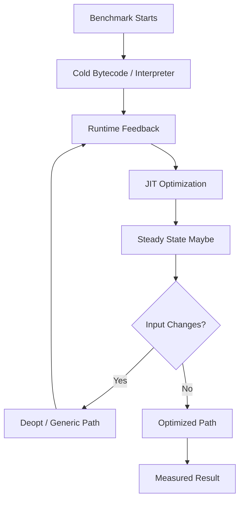
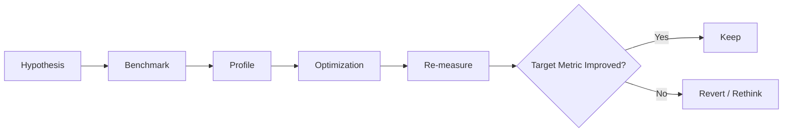
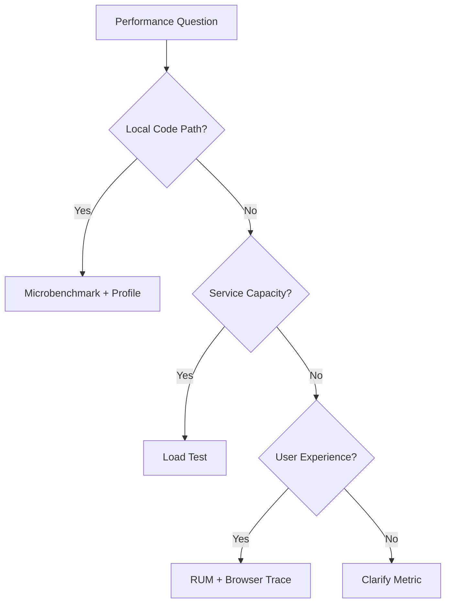

# 002.04.03 Benchmarking Pitfalls

Category: JavaScript Internals<br>
Topic: 002.04 Optimization Boundaries

Benchmarking pitfalls are the ways performance measurements lie. JavaScript benchmarks are especially easy to misread because modern engines use warmup, bytecode, JIT tiers, inline caches, deoptimization, garbage collection, inlining, dead-code elimination, and host scheduling.

The senior skill is not writing a loop with `console.time()`. The senior skill is designing a measurement that answers the right question without accidentally measuring the optimizer, the timer, the logger, the network, the GC, or a toy input that production never sees.

---

## 1. Definition

A benchmarking pitfall is a flaw in a performance experiment that produces misleading, non-reproducible, or irrelevant results.

One-line definition:

- Benchmarking pitfalls are measurement mistakes that make code look faster or slower than it really is for the workload that matters.

Expanded explanation:

- A benchmark is only useful if it represents the question being asked.
- Microbenchmarks measure isolated operations.
- Profiling measures where real execution spends time.
- Load tests measure system behavior under concurrency and saturation.
- Real-user monitoring measures actual user experience.

Bad benchmark:

```ts
console.time("test");
for (let i = 0; i < 1_000_000; i += 1) {
  doWork(sample);
}
console.timeEnd("test");
```

This may include warmup, optimization, deoptimization, dead-code elimination, unrealistic data, and timer noise.

---

## 2. Why It Exists

Benchmarking pitfalls exist because performance is contextual.

The same code can behave differently based on:

- engine version,
- runtime flags,
- cold vs warm execution,
- input shape,
- object layout,
- data size,
- concurrency,
- garbage collection,
- CPU throttling,
- browser tab state,
- production build vs dev build,
- network and I/O,
- downstream dependencies.

Why it matters:

- false wins create unnecessary complexity,
- false losses hide real bottlenecks,
- micro-optimizations can damage maintainability,
- local benchmark results may not improve p99 latency,
- production performance can regress even when a benchmark passes.

Senior-level framing:

- A benchmark is an argument. If the setup is weak, the argument is weak.

---

## 3. Syntax & Variants

Benchmarking uses measurement APIs and tools, but each has limits.

### `console.time`

```ts
console.time("work");
doWork();
console.timeEnd("work");
```

Good for quick local exploration. Weak for rigorous benchmarking.

### `performance.now`

```ts
const start = performance.now();
doWork();
const durationMs = performance.now() - start;
```

Useful for higher-resolution timing in browsers and modern Node.

### Node `hrtime.bigint`

```ts
const start = process.hrtime.bigint();
doWork();
const durationMs = Number(process.hrtime.bigint() - start) / 1_000_000;
```

Useful for precise elapsed duration in Node.

### Benchmark libraries

```ts
import { Bench } from "tinybench";

const bench = new Bench();

bench.add("for loop", () => {
  forLoop(items);
});

bench.add("map", () => {
  mapLoop(items);
});

await bench.run();
console.table(bench.table());
```

Libraries help with repeated runs and statistics, but they cannot fix unrealistic workloads.

### Profiling

Use CPU profiles when asking:

- where is time spent?
- what is the real hot path?
- is GC involved?
- is this CPU or waiting?

### Load testing

Use load tests when asking:

- what happens under concurrency?
- where is saturation?
- what is p95/p99?
- how does memory grow over time?

---

## 4. Internal Working

Benchmark results are shaped by the engine pipeline.



### Warmup

The first iterations may be slower because:

- code is interpreted,
- inline caches are empty,
- functions are not optimized yet,
- modules and data are still loading,
- CPU caches are cold.

### JIT tiering

Engines may move code through:

```text
interpreter
  -> baseline compiler
  -> optimizing compiler
  -> deopt fallback
```

If your benchmark is too short, you measure startup. If too artificial, you measure an unrealistic optimized state.

### Dead-code elimination

If results are unused, the engine may remove or simplify work.

Bad:

```ts
for (let i = 0; i < 1_000_000; i += 1) {
  pureCompute(i);
}
```

Better:

```ts
let sink = 0;

for (let i = 0; i < 1_000_000; i += 1) {
  sink += pureCompute(i);
}

console.log(sink);
```

Even this can be optimized in some cases. Benchmark design matters.

### GC interference

Allocation-heavy code can trigger GC during one benchmark but not another.

Measure:

- allocation rate,
- GC duration,
- heap growth,
- RSS/external memory where relevant.

### Async measurement

Bad:

```ts
console.time("fetch");
fetch("/api/data");
console.timeEnd("fetch");
```

This measures scheduling, not the fetch.

Better:

```ts
console.time("fetch");
await fetch("/api/data");
console.timeEnd("fetch");
```

---

## 5. Memory Behavior

Benchmarks often accidentally measure memory pressure.

### Allocation-sensitive benchmark

```ts
function withMap(items: Item[]) {
  return items.map((item) => ({
    id: item.id,
    label: item.name.toUpperCase(),
  }));
}
```

This measures:

- callback overhead,
- object allocation,
- result array allocation,
- string allocation,
- GC pressure.

### Reusing data incorrectly

```ts
const input = makeInput();

bench("sort", () => {
  input.sort(compare);
});
```

The first run sorts the input. Later runs sort already-sorted data.

Better:

```ts
bench("sort", () => {
  const copy = [...input];
  copy.sort(compare);
});
```

But now the benchmark includes copy allocation. Decide what you actually want to measure.

### Memory leak in benchmark harness

```ts
const results = [];

bench("work", () => {
  results.push(doWork());
});
```

The harness may retain results and distort memory/GC behavior.

### Production memory mismatch

A microbenchmark that runs for 5 seconds may not reveal:

- old-space growth,
- cache leaks,
- queue buildup,
- external memory,
- fragmentation,
- long-session browser memory.

---

## 6. Execution Behavior

### Cold vs warm

Cold benchmark:

- startup,
- parsing,
- compilation,
- first execution,
- cache misses.

Warm benchmark:

- repeated execution after feedback and optimization.

Both can matter.

Example:

- serverless handler: cold path matters.
- long-running worker: steady state matters.
- browser route: first interaction and steady interaction both matter.

### Sync vs async

```ts
async function measure() {
  const start = performance.now();
  const result = await work();
  return performance.now() - start;
}
```

For async work, decide whether you measure:

- scheduling,
- queue wait,
- network time,
- CPU callback time,
- full end-to-end latency.

### Single-user vs concurrent

Microbenchmark:

```text
one operation at a time
```

Production:

```text
many operations, queues, CPU contention, GC, I/O, rate limits
```

### Browser execution

Browser benchmarks can be distorted by:

- devtools open,
- background tabs,
- power saving,
- rendering,
- layout,
- third-party scripts,
- device speed,
- throttling.

### Node execution

Node benchmarks can be distorted by:

- event-loop delay,
- libuv threadpool saturation,
- container CPU limits,
- logging,
- GC,
- JIT warmup,
- OS scheduling.

---

## 7. Scope & Context Interaction

Benchmark scope must match the decision scope.

### Function benchmark

Use for:

- comparing algorithms,
- checking allocation rate,
- validating hot helper changes.

Risk:

- misses system effects.

### Component benchmark

Use for:

- React/Angular render cost,
- chart/table behavior,
- hydration or route transitions.

Risk:

- dev build results may be irrelevant.

### Service benchmark

Use for:

- API throughput,
- p95/p99 latency,
- worker jobs/sec,
- queue behavior.

Risk:

- synthetic data hides real payload variation.

### System benchmark

Use for:

- end-to-end behavior,
- scaling limits,
- dependency bottlenecks,
- failure under load.

Risk:

- harder to isolate root cause.

### Context question

Before benchmarking, ask:

- What decision will this measurement support?
- Which user/system metric should improve?
- Is this cold, warm, isolated, or end-to-end?
- What realistic inputs are required?
- What noise must be controlled?

---

## 8. Common Examples

### Example 1: Bad async timing

```ts
console.time("work");
doAsyncWork();
console.timeEnd("work");
```

This measures call/scheduling time.

Correct:

```ts
console.time("work");
await doAsyncWork();
console.timeEnd("work");
```

### Example 2: Mutating input

```ts
bench("dedupe", () => {
  items.sort();
  dedupeSorted(items);
});
```

Later iterations use already sorted input.

### Example 3: Unrealistic stable shapes

```ts
const row = { id: "1", total: 100 };

bench("read", () => {
  return row.total;
});
```

Production may pass thousands of row shapes.

### Example 4: Measuring logging

```ts
bench("process", () => {
  console.log(processItem(item));
});
```

This mostly measures logging.

### Example 5: Avoiding unused result

```ts
let sink = 0;

bench("compute", () => {
  sink ^= compute(input);
});
```

Use a sink so work cannot be trivially ignored.

---

## 9. Confusing / Tricky Examples

### Trap 1: Faster operation, same user latency

Optimizing a helper from 2 ms to 1 ms does not matter if the request waits 800 ms on a database.

### Trap 2: Average hides tail

```text
avg: 50 ms
p99: 2000 ms
```

Production users feel the tail.

### Trap 3: Benchmark runs optimized path only

Production includes cold starts, invalid input, missing fields, polymorphism, and deopt.

### Trap 4: Development build lies

Frontend dev builds include extra checks and different compilation behavior.

### Trap 5: Tiny data lies

An algorithm that is fine for 100 items may collapse at 1,000,000.

### Trap 6: Benchmarking on a busy machine

OS scheduling, thermal throttling, background tasks, and container limits add noise.

---

## 10. Real Production Use Cases

### API optimization

Question:

- Will this serializer change improve p99 latency?

Needed:

- production-like payloads,
- CPU profile,
- before/after p95/p99,
- GC/allocation metrics,
- route-level measurement.

### Frontend table rendering

Question:

- Should we virtualize, memoize, or change data shape?

Needed:

- production build,
- realistic row count,
- low-end device test,
- render profiling,
- interaction metric.

### Worker throughput

Question:

- Does a batching change improve jobs/sec?

Needed:

- sustained run,
- queue depth,
- memory growth,
- GC time,
- error/retry behavior.

### Serverless cold start

Question:

- Does lazy importing reduce cold latency?

Needed:

- cold measurements,
- warm measurements,
- bundle/import graph,
- p95 across many starts.

### Cache optimization

Question:

- Is this cache worth its memory?

Needed:

- hit rate,
- memory footprint,
- eviction behavior,
- latency improvement,
- stale data risk.

---

## 11. Interview Questions

### Basic

1. What makes a benchmark unreliable?
2. Why is warmup important in JavaScript?
3. What is dead-code elimination?
4. Why is `console.time` often insufficient?
5. What is the difference between microbenchmarking and profiling?

### Intermediate

1. How can GC distort benchmark results?
2. Why should benchmark inputs be realistic?
3. How do you measure async work correctly?
4. Why can average latency be misleading?
5. What is the difference between cold and warm performance?

### Advanced

1. How do JIT tiers affect benchmarks?
2. How can deoptimization change benchmark results?
3. How would you design a benchmark for a Node serializer?
4. How would you benchmark frontend interaction responsiveness?
5. How do you prove an optimization is worth keeping?

### Tricky

1. Can a benchmark get faster because the engine removed the work?
2. Can a local benchmark be correct but irrelevant?
3. Can reducing CPU time increase memory pressure?
4. Can a cache improve average latency but hurt p99?
5. Should you optimize code that wins a microbenchmark but reduces clarity?

Strong answers should connect measurement to decision quality.

---

## 12. Senior-Level Pitfalls

### Pitfall 1: Benchmarking without a decision

Senior correction:

- define the decision and success metric first.

### Pitfall 2: Measuring a toy workload

Senior correction:

- use production-like shapes, sizes, outliers, nulls, and concurrency.

### Pitfall 3: Ignoring variance

Senior correction:

- run multiple samples and report spread, not one number.

### Pitfall 4: Optimizing average only

Senior correction:

- report p50, p95, p99, max, and error rate where relevant.

### Pitfall 5: Mixing changes

Senior correction:

- isolate one meaningful variable when possible.

### Pitfall 6: Keeping complex code after tiny wins

Senior correction:

- weigh performance against maintainability.

---

## 13. Best Practices

### Benchmark design

- State the hypothesis.
- Define success metric.
- Use production-like data.
- Separate cold and warm runs.
- Avoid mutating shared input unless intended.
- Consume results so work is not optimized away.
- Run enough iterations.
- Report variance.
- Measure memory and GC when allocations differ.

### Tool choice

- Use microbenchmarks for isolated algorithm questions.
- Use CPU profiles for real hot paths.
- Use load tests for service capacity.
- Use RUM for actual user experience.
- Use synthetic browser tests for repeatable frontend lab signals.

### Interpretation

- Prefer meaningful user/system metrics.
- Treat tiny differences skeptically.
- Re-run after runtime upgrades.
- Keep benchmark code reviewed.
- Document environment and input data.

### Engineering discipline

- Revert optimizations that do not improve target metrics.
- Keep optimized code isolated and tested.
- Add regression benchmarks only for critical paths.

---

## 14. Debugging Scenarios

### Scenario 1: Benchmark says faster, production unchanged

Debugging flow:

```text
Check target metric
  -> inspect production profile
  -> verify bottleneck contribution
  -> identify bigger waits
```

Root cause:

- optimized code was not on the critical path.

### Scenario 2: Benchmark flips between runs

Debugging flow:

```text
Check warmup
  -> check input mutation
  -> check GC
  -> check machine load
  -> increase sample count
```

Root cause:

- noise or flawed harness.

### Scenario 3: Async benchmark too fast

Debugging flow:

```text
Inspect await/return
  -> confirm operation completes
  -> include error path
  -> measure end-to-end duration
```

Root cause:

- measured scheduling instead of completion.

### Scenario 4: New implementation faster but memory worse

Debugging flow:

```text
Compare allocation profiles
  -> inspect GC duration
  -> measure RSS/heap
  -> check p99 under load
```

Root cause:

- CPU improvement traded for allocation/GC pressure.

### Scenario 5: Frontend benchmark lies

Debugging flow:

```text
Use production build
  -> test low-end device
  -> record performance trace
  -> measure interaction metric
```

Root cause:

- dev build or desktop-only benchmark did not represent users.

---

## 15. Exercises / Practice

### Exercise 1: Fix async timing

```ts
console.time("save");
saveUser(user);
console.timeEnd("save");
```

Rewrite correctly.

### Exercise 2: Avoid input mutation

```ts
bench("sort", () => {
  items.sort(compare);
});
```

Design a fair benchmark and explain what it measures.

### Exercise 3: Add realistic data

For a function that reads `order.total`, create benchmark inputs with:

- stable shape,
- missing field,
- string total,
- different property order,
- large batch.

### Exercise 4: Interpret result

```text
Implementation A: avg 10 ms, p99 120 ms, heap +300 MB
Implementation B: avg 14 ms, p99 30 ms, heap +20 MB
```

Which would you choose for an API and why?

### Exercise 5: Prove value

Write a plan to prove a serializer optimization improved production p99, not just local throughput.

---

## 16. Comparison

### Microbenchmark vs profile vs load test

| Method | Answers | Risk |
| --- | --- | --- |
| Microbenchmark | Which isolated operation is faster? | can be irrelevant |
| CPU profile | Where is real CPU time spent? | needs representative workload |
| Load test | What happens under concurrency? | harder to isolate |
| RUM | What users experience | noisy, needs segmentation |

### Cold vs warm benchmark

| Mode | Measures | Useful For |
| --- | --- | --- |
| Cold | startup and first execution | serverless, page load, CLI |
| Warm | optimized steady state | long-running services/workers |

### Average vs percentile

| Metric | Meaning |
| --- | --- |
| Average | central tendency, hides tail |
| p50 | median user/request |
| p95 | slow but common tail |
| p99 | severe tail behavior |
| max | worst observed, often noisy |

### Faster vs better

| Faster Code | Better System |
| --- | --- |
| wins local loop | improves target metric |
| may allocate more | balances CPU/memory |
| may be obscure | maintainable and tested |
| may ignore tail | improves p95/p99 |

---

## 17. Related Concepts

Benchmarking Pitfalls connect to:

- `002.01.02 Bytecode and JIT`: warmup and tiering affect results.
- `002.04.01 Deoptimization`: production inputs can break benchmark assumptions.
- `002.04.02 Shape Changes`: stable benchmark shapes may hide shape churn.
- `002.03.02 Garbage Collection`: allocation and GC distort timings.
- `001.04.02 Performance Profiling`: profiling finds real bottlenecks.
- Load Testing: validates concurrency and saturation.
- Observability: metrics prove production impact.
- Web Performance: lab vs field performance.

Knowledge graph:



---

## Advanced Add-ons

### Performance Impact

Bad benchmarks create performance debt:

- misleading optimizations,
- unreadable code,
- missed bottlenecks,
- worse p99,
- higher memory,
- false confidence.

Good benchmarks improve:

- decision quality,
- regression detection,
- runtime understanding,
- production performance.

### System Design Relevance

Benchmarking supports architecture decisions:

- in-process vs worker,
- sync vs async,
- cache vs recompute,
- stream vs buffer,
- client vs server compute,
- scale up vs optimize code.

Decision framework:



### Security Impact

Benchmarking can affect security indirectly:

- disabling validation for speed,
- removing checks based on toy benchmarks,
- logging sensitive benchmark data,
- exposing production payloads in test fixtures,
- optimizing away safety boundaries.

Practices:

- never remove security checks for benchmark wins without architecture review,
- sanitize production-derived benchmark data,
- include security-relevant paths in performance tests.

### Browser vs Node Behavior

Browser:

- rendering, layout, paint, throttling, and device class matter,
- production build is essential,
- devtools can affect timing,
- low-end devices reveal real pain.

Node:

- event-loop delay, GC, libuv threadpool, container limits, and I/O matter,
- `process.hrtime.bigint()` is useful for timing,
- CPU profiles and load tests often beat microbenchmarks.

Shared:

- warmup matters,
- JIT/deopt matters,
- realistic inputs matter,
- target metrics matter most.

### Polyfill / Implementation

A minimal benchmark harness can teach discipline, but real tooling should handle statistics better.

```ts
type Case = {
  name: string;
  run: () => unknown;
};

async function bench(cases: Case[], iterations: number) {
  for (const testCase of cases) {
    let sink: unknown;
    const start = performance.now();

    for (let i = 0; i < iterations; i += 1) {
      sink = testCase.run();
    }

    const durationMs = performance.now() - start;

    console.log({
      name: testCase.name,
      durationMs,
      opsPerSecond: iterations / (durationMs / 1000),
      sink,
    });
  }
}
```

Limitations:

- no warmup,
- no variance,
- no GC tracking,
- no outlier handling,
- no async support,
- no isolation.

Use it only as a teaching sketch.

---

## 18. Summary

Benchmarking pitfalls are measurement traps that make performance work unreliable.

Quick recall:

- Define the decision before benchmarking.
- Use realistic inputs.
- Separate cold and warm performance.
- Account for JIT warmup and deoptimization.
- Consume results to avoid eliminated work.
- Do not mutate shared benchmark input accidentally.
- Measure async completion, not scheduling.
- Track memory and GC when allocations differ.
- Prefer p95/p99 for production-facing systems.
- Keep optimizations only when target metrics improve.

Staff-level takeaway:

- A benchmark is not a scoreboard. It is evidence for an engineering decision. Good evidence changes what you ship; bad evidence creates complex code with imaginary wins.
