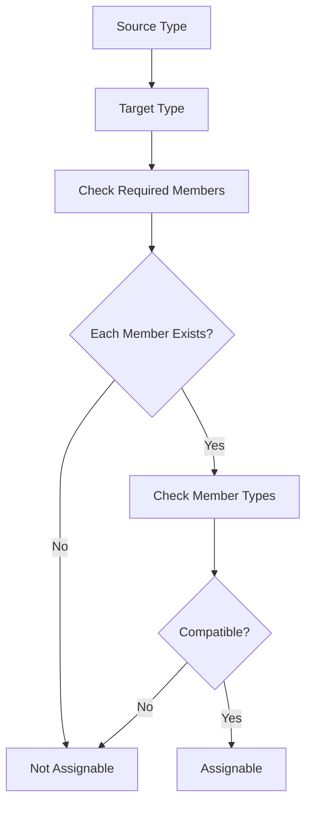
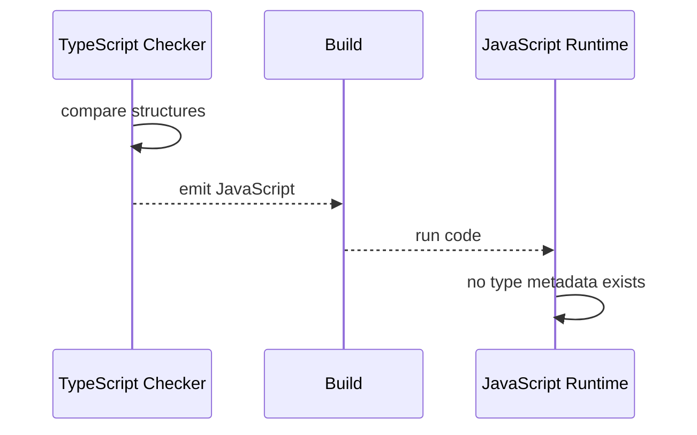
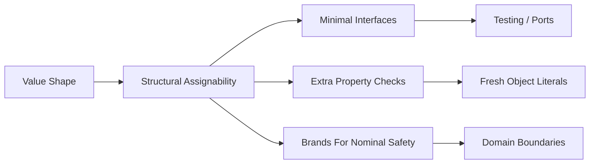
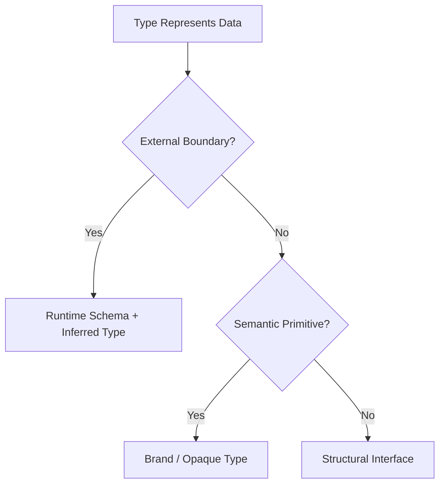

# 003.01.01 Structural Typing

Category: TypeScript<br>
Topic: 003.01 Type System Foundations

Structural typing is the foundation of TypeScript's type compatibility model. TypeScript mostly cares about the shape of a value, not the declared name of its type. If an object has the required members with compatible types, it can be used where that structure is expected.

This is why TypeScript feels natural with JavaScript objects, but it is also why API boundaries, domain IDs, runtime validation, and excess property checks require Staff-level judgment.

---

## 1. Definition

Structural typing means type compatibility is based on structure: properties, methods, parameter types, return types, and call signatures.

One-line definition:

- In TypeScript, a value is compatible with a type when it has the required shape, regardless of the type's name.

Example:

```ts
type User = {
  id: string;
  name: string;
};

const value = {
  id: "u1",
  name: "Ava",
  role: "admin",
};

const user: User = value; // OK
```

`value` has at least the members required by `User`, so it is assignable.

Contrast with nominal typing:

```text
Nominal typing:
  compatible because declared names match.

Structural typing:
  compatible because shapes match.
```

TypeScript is structural by default, with some nominal-like escape hatches such as private/protected class members, unique symbols, and branded types.

---

## 2. Why It Exists

TypeScript was designed to type existing JavaScript.

JavaScript uses object shapes naturally:

```js
function printUser(user) {
  console.log(user.id, user.name);
}

printUser({ id: "u1", name: "Ava", role: "admin" });
```

Structural typing fits JavaScript because:

- objects are often created inline,
- classes are not required,
- data comes from JSON,
- functions care about capabilities, not names,
- libraries often use duck typing.

It solves:

- ergonomic interop with JavaScript,
- flexible API contracts,
- easy testing with object literals,
- reusable functions over shared capabilities,
- lower ceremony than nominal class hierarchies.

Production relevance:

- API DTOs can be checked by shape at compile time.
- Tests can pass simple objects without constructing classes.
- Shared libraries can depend on minimal contracts.
- But domain IDs with the same primitive type can be accidentally mixed.
- Runtime input still needs validation because TypeScript types are erased.

---

## 3. Syntax & Variants

### Type aliases

```ts
type Point = {
  x: number;
  y: number;
};
```

### Interfaces

```ts
interface Point {
  x: number;
  y: number;
}
```

For structural compatibility, type aliases and interfaces behave similarly in many object-shape cases.

### Extra properties through variables

```ts
type User = {
  id: string;
};

const admin = {
  id: "u1",
  role: "admin",
};

const user: User = admin; // OK
```

Extra properties are allowed when assigning a non-fresh object.

### Excess property check for fresh literals

```ts
type User = {
  id: string;
};

const user: User = {
  id: "u1",
  role: "admin", // Error: excess property
};
```

Fresh object literals get extra checking to catch likely mistakes.

### Function compatibility

```ts
type Handler = (event: { id: string }) => void;

const handler = (event: { id: string; name: string }) => {
  console.log(event.name);
};
```

Function parameter compatibility depends on variance rules and compiler options such as `strictFunctionTypes`.

### Class structural typing

```ts
class UserModel {
  constructor(
    public id: string,
    public name: string,
  ) {}
}

type UserDto = {
  id: string;
  name: string;
};

const dto: UserDto = new UserModel("u1", "Ava"); // OK
```

Public class members participate structurally.

### Nominal-like branding

```ts
type UserId = string & { readonly __brand: "UserId" };
type OrderId = string & { readonly __brand: "OrderId" };

function getUser(id: UserId) {
  return id;
}
```

Brands prevent accidentally mixing structurally identical primitive domains.

---

## 4. Internal Working

TypeScript checks assignability by comparing structures.



### Object assignability

```ts
type Target = {
  id: string;
  active: boolean;
};

const source = {
  id: "u1",
  active: true,
  name: "Ava",
};

const target: Target = source;
```

The source has all required target members.

### Freshness

TypeScript gives special treatment to fresh object literals:

```ts
sendUser({
  id: "u1",
  activ: true, // typo caught if target expects active
});
```

This catches common mistakes without banning extra properties everywhere.

### Structural recursion

Nested objects are compared structurally too.

```ts
type Request = {
  user: {
    id: string;
  };
};
```

The checker recursively compares `user.id`.

### Open object types

Most object types are open, not exact.

```ts
type User = { id: string };
```

This means "has at least `id: string`," not "has only id."

### Compile-time only

No runtime object checks are emitted.

```ts
function handle(user: User) {
  console.log(user.id);
}
```

At runtime, this is just JavaScript. Invalid external input can still break code.

---

## 5. Memory Behavior

Structural typing has no direct runtime memory cost because TypeScript types are erased.

```ts
type User = {
  id: string;
};
```

This type does not exist at runtime.

Memory costs come indirectly from patterns you choose:

- runtime validators,
- DTO transformation,
- branded wrapper objects if implemented at runtime,
- generated clients/schemas,
- additional mapping layers,
- defensive copies.

### Type erasure

```ts
type User = { id: string };

const user: User = { id: "u1" };
```

Emitted JavaScript has the object, not the type.

### Runtime validation memory

```ts
const UserSchema = z.object({
  id: z.string(),
});
```

Schemas exist at runtime and consume memory, but provide real boundary validation.

### DTO mapping

```ts
function toUserDto(user: UserModel): UserDto {
  return {
    id: user.id,
    name: user.name,
  };
}
```

This allocates a new object. It may be worth it for boundary safety, stable shapes, and security.

### Production note

Do not assume "TypeScript checked it" means external JSON is safe. Runtime validation is a separate cost and responsibility.

---

## 6. Execution Behavior

Structural typing affects compile-time behavior, not runtime execution.

### Compile-time assignment

```ts
type HasId = {
  id: string;
};

function readId(value: HasId) {
  return value.id;
}

readId({ id: "u1", name: "Ava" });
```

The compiler allows this because the argument has `id`.

### Runtime behavior

Emitted JavaScript behaves like:

```js
function readId(value) {
  return value.id;
}

readId({ id: "u1", name: "Ava" });
```

No runtime type guard is added.

### Runtime failure with unsafe cast

```ts
type User = {
  id: string;
};

const user = JSON.parse("{}") as User;
console.log(user.id.toUpperCase());
```

This compiles but fails at runtime because `id` is missing.

### Boundary-safe version

```ts
const parsed = UserSchema.parse(JSON.parse(input));
console.log(parsed.id.toUpperCase());
```

Structural typing and runtime validation work together.

### Execution diagram



---

## 7. Scope & Context Interaction

Structural typing interacts with module boundaries, API contracts, and domain ownership.

### Minimal capability typing

```ts
type HasLogger = {
  log(message: string): void;
};

function run(logger: HasLogger) {
  logger.log("started");
}
```

The function depends only on capability, not concrete class.

### Cross-module compatibility

```ts
// package-a
export type User = { id: string };

// package-b
export type Account = { id: string };
```

These are structurally compatible even if semantically different.

### Domain ID risk

```ts
type UserId = string;
type OrderId = string;

function getUser(id: UserId) {}

const orderId: OrderId = "o1";
getUser(orderId); // OK, but semantically wrong
```

Use brands for stronger domain boundaries.

### Module public API design

Structural typing makes small public interfaces powerful:

```ts
export type PaymentClient = {
  charge(input: ChargeInput): Promise<ChargeResult>;
};
```

Tests can provide simple fakes with the same shape.

### Exactness illusion

```ts
type Config = {
  port: number;
};
```

This does not mean runtime config has only `port`. TypeScript object types are not exact by default.

---

## 8. Common Examples

### Example 1: Duck typing

```ts
type Runnable = {
  run(): void;
};

class Job {
  run() {
    console.log("job");
  }
}

const runnable: Runnable = new Job();
```

No `implements Runnable` is required for compatibility.

### Example 2: Extra property allowed through variable

```ts
type Point = { x: number; y: number };

const point3d = { x: 1, y: 2, z: 3 };
const point: Point = point3d;
```

Allowed because `point3d` has at least `x` and `y`.

### Example 3: Excess property check catches typo

```ts
type Options = {
  timeoutMs: number;
};

const options: Options = {
  timeout: 1000, // Error
};
```

Fresh object literals get stricter checks.

### Example 4: Branded IDs

```ts
type Brand<T, Name extends string> = T & { readonly __brand: Name };

type UserId = Brand<string, "UserId">;
type OrderId = Brand<string, "OrderId">;

function asUserId(value: string): UserId {
  return value as UserId;
}
```

Brands add nominal-like separation.

### Example 5: Runtime validation

```ts
const UserSchema = z.object({
  id: z.string(),
  name: z.string(),
});

type User = z.infer<typeof UserSchema>;
```

The schema validates runtime input; the inferred type supports compile-time use.

---

## 9. Confusing / Tricky Examples

### Trap 1: Fresh literal vs variable

```ts
type User = { id: string };

const a: User = { id: "u1", role: "admin" }; // Error

const admin = { id: "u1", role: "admin" };
const b: User = admin; // OK
```

This is excess property checking, not exact types.

### Trap 2: Same shape, different meaning

```ts
type UserId = string;
type ProductId = string;
```

They are compatible because both are `string`.

### Trap 3: `as` can lie

```ts
const user = {} as User;
```

This tells the compiler to trust you. It does not create runtime fields.

### Trap 4: Classes are structural

```ts
class A {
  id = "x";
}

class B {
  id = "y";
}

const a: A = new B(); // OK if public structure matches
```

Private/protected members change compatibility.

### Trap 5: Optional property exactness

Without strict exact optional property settings, optional property behavior can surprise teams. Be explicit with `undefined`, `null`, and compiler options.

### Trap 6: Function variance

Function parameter compatibility can be subtle, especially for callbacks and methods. Use `strict` and understand `strictFunctionTypes`.

---

## 10. Real Production Use Cases

### API contracts

Structural typing helps model DTOs:

```ts
type CreateUserRequest = {
  email: string;
  name: string;
};
```

Production rule:

- compile-time type is not enough for HTTP input. Validate at runtime.

### Test doubles

```ts
const fakePaymentClient = {
  charge: async () => ({ ok: true as const }),
};
```

If it matches the `PaymentClient` shape, it can be used in tests.

### Shared packages

Small structural interfaces reduce coupling between packages:

```ts
type Clock = {
  now(): Date;
};
```

### Domain modeling

Structural typing is flexible, but domain concepts may need brands:

```ts
type TenantId = Brand<string, "TenantId">;
type UserId = Brand<string, "UserId">;
```

### Frontend props

React/Angular components can accept minimal prop shapes:

```ts
type UserLabelProps = {
  user: { id: string; name: string };
};
```

This improves reuse but can hide semantic mismatches if the shape is too generic.

---

## 11. Interview Questions

### Basic

1. What is structural typing?
2. How is it different from nominal typing?
3. Why does TypeScript use structural typing?
4. Are TypeScript types available at runtime?
5. What is excess property checking?

### Intermediate

1. Why can a variable with extra properties be assigned to a narrower type?
2. How do branded types create nominal-like behavior?
3. Why is `as` dangerous at API boundaries?
4. How do classes behave under structural typing?
5. How does structural typing help testing?

### Advanced

1. Explain freshness in object literal checks.
2. How does structural typing interact with function variance?
3. How would you design domain-safe IDs in TypeScript?
4. How do you combine runtime validation with structural types?
5. What problems can structural compatibility create in large monorepos?

### Tricky

1. Does `type User = { id: string }` mean only `id` is allowed?
2. Can two different classes be assignable to each other?
3. Does `as User` validate JSON?
4. Are `UserId = string` and `OrderId = string` distinct?
5. Why does an inline object fail but a variable pass?

Strong answers should mention shape compatibility, excess property checks, type erasure, and domain-branding trade-offs.

---

## 12. Senior-Level Pitfalls

### Pitfall 1: Believing object types are exact

Senior correction:

- TypeScript object types usually mean "at least this shape."

### Pitfall 2: Using primitive aliases for domain IDs

Senior correction:

- use branded types for semantically distinct identifiers.

### Pitfall 3: Trusting external input because it has a TypeScript type

Senior correction:

- validate JSON, environment variables, database rows, and queue messages at runtime.

### Pitfall 4: Overusing `any` and `as`

Senior correction:

- prefer `unknown` at boundaries and narrow/validate.

### Pitfall 5: Too-generic shared interfaces

Senior correction:

- model domain intent, not only shape coincidence.

### Pitfall 6: Ignoring compiler options

Senior correction:

- enable `strict`, understand `strictFunctionTypes`, `exactOptionalPropertyTypes`, and related settings.

---

## 13. Best Practices

### Modeling

- Use structural types for capabilities.
- Keep interfaces minimal but meaningful.
- Use brands for IDs and other semantically distinct primitives.
- Prefer discriminated unions for state variants.
- Avoid broad `{ id: string }` when domain distinction matters.

### Boundaries

- Treat external input as `unknown`.
- Validate runtime data with schemas or explicit guards.
- Derive TypeScript types from schemas when possible.
- Avoid unsafe casts at API boundaries.

### Code review

- Watch for `as SomeType` hiding missing validation.
- Watch for primitive alias domain bugs.
- Watch for overly generic shared types.
- Prefer explicit DTO mapping at trust boundaries.

### Architecture

- Use structural interfaces to reduce coupling.
- Use branded/opaque types to strengthen domain boundaries.
- Separate internal domain models from public API DTOs.

---

## 14. Debugging Scenarios

### Scenario 1: Wrong ID passed to service

Symptoms:

- `getUser(orderId)` compiles but fails logically.

Root cause:

- `UserId` and `OrderId` are both aliases of `string`.

Fix:

- use branded types.

### Scenario 2: JSON parse runtime crash

Symptoms:

- code compiles but `user.id.toUpperCase()` crashes.

Root cause:

- `JSON.parse(input) as User` bypassed validation.

Fix:

- parse as `unknown`, validate schema, then use inferred type.

### Scenario 3: Excess property confusion

Symptoms:

- inline object literal errors, but variable assignment works.

Root cause:

- fresh object literal excess property check.

Fix:

- understand freshness; use `satisfies` when checking object shape while preserving extra fields.

### Scenario 4: Fake client silently misses behavior

Symptoms:

- test fake matches method names but not semantics.

Root cause:

- structural typing checks shape, not behavior.

Fix:

- add contract tests or stronger fake helpers.

### Scenario 5: Shared interface too broad

Symptoms:

- unrelated modules accept each other's objects by accident.

Root cause:

- interface captured accidental shape, not domain intent.

Fix:

- split domain-specific types or add brands/discriminants.

---

## 15. Exercises / Practice

### Exercise 1: Freshness

Explain why:

```ts
type User = { id: string };

const a: User = { id: "u1", role: "admin" };

const admin = { id: "u1", role: "admin" };
const b: User = admin;
```

### Exercise 2: Brand IDs

Create branded types for:

- `UserId`
- `OrderId`
- `TenantId`

Write functions that prevent mixing them.

### Exercise 3: Runtime boundary

Refactor:

```ts
const user = JSON.parse(input) as User;
```

into a safe schema-validated flow.

### Exercise 4: Minimal interface

Design a `Logger` interface that allows tests to pass a fake without importing a concrete logger class.

### Exercise 5: Exactness thinking

Given `type Config = { port: number }`, explain why an object with `port` and `debug` can still be assignable.

---

## 16. Comparison

### Structural vs nominal typing

| Model | Compatible When | Example |
| --- | --- | --- |
| Structural | shape matches | TypeScript object types |
| Nominal | declared identity matches | Java, C# classes by name |

### Type alias vs brand

| Pattern | Safety |
| --- | --- |
| `type UserId = string` | same as string |
| `type UserId = string & Brand` | distinct at compile time |

### Fresh literal vs assigned variable

| Source | Extra Property Check |
| --- | --- |
| inline object literal | stricter |
| variable | structural assignability |

### Compile-time type vs runtime validation

| Concern | TypeScript Type | Runtime Schema |
| --- | --- | --- |
| Editor/compiler safety | yes | indirect |
| Runtime JSON validation | no | yes |
| Emitted JavaScript | erased | exists |
| API boundary safety | not enough | required |

---

## 17. Related Concepts

Structural Typing connects to:

- `003.01.02 Narrowing and Control Flow`: after broad shapes, narrowing refines types.
- `003.01.03 Generics and Constraints`: structural constraints power reusable generic APIs.
- `003.03.01 API Contracts`: DTOs and runtime validation.
- Domain Modeling: brands and discriminants protect business meaning.
- Type Guards: runtime checks that refine structural types.
- Clean Architecture: structural ports/interfaces reduce coupling.
- Testing: fakes and mocks depend on structural compatibility.

Knowledge graph:



---

## Advanced Add-ons

### Performance Impact

Structural typing has no runtime performance cost by itself because types are erased.

Indirect costs can come from:

- runtime validation,
- DTO mapping,
- generated schemas,
- defensive copies,
- abstraction layers.

These costs are usually worth it at trust boundaries. Measure hot paths before removing safety.

### System Design Relevance

Structural typing affects large-system design:

- ports and adapters can depend on capabilities instead of concrete classes,
- shared packages can expose small contracts,
- API DTOs can be separated from domain models,
- branded IDs prevent cross-domain mixups,
- runtime schemas protect service boundaries.

Decision framework:



### Security Impact

Security risks:

- trusting unvalidated JSON,
- mixing tenant/user/order IDs,
- unsafe casts bypassing checks,
- broad structural types accepting objects from wrong trust zone.

Practices:

- validate external input,
- brand security-sensitive IDs,
- avoid `any` and unsafe `as`,
- separate trusted internal types from untrusted external payloads.

### Browser vs Node Behavior

TypeScript type checking is compile-time in both browser and Node projects.

Browser:

- structural props and API DTOs are common,
- runtime validation matters for API responses and local storage.

Node:

- structural request/response DTOs are common,
- runtime validation matters for HTTP, queues, env vars, config, and database rows.

Shared:

- types are erased,
- shape compatibility is compile-time only,
- runtime boundaries need validation.

### Polyfill / Implementation

You can model structural checking at runtime with a type guard.

```ts
type User = {
  id: string;
  name: string;
};

function isUser(value: unknown): value is User {
  return (
    typeof value === "object" &&
    value !== null &&
    "id" in value &&
    "name" in value &&
    typeof (value as { id: unknown }).id === "string" &&
    typeof (value as { name: unknown }).name === "string"
  );
}
```

This is not TypeScript's compiler algorithm. It is a runtime guard for one specific shape.

---

## 18. Summary

Structural typing is TypeScript's shape-based compatibility model.

Quick recall:

- TypeScript mostly cares about shape, not type names.
- Object types are usually open, not exact.
- Fresh object literals get excess property checks.
- Variables with extra properties can be assigned to narrower types.
- Classes are structurally compatible through public members.
- Type aliases for primitives do not create new nominal types.
- Brands add nominal-like safety.
- Types are erased at runtime.
- External input must be validated.
- Structural interfaces are excellent for ports, tests, and capability-based design.

Staff-level takeaway:

- Structural typing gives TypeScript its JavaScript-native flexibility. Senior engineers pair that flexibility with runtime validation, branded domain types, and careful public contracts so shape compatibility does not become semantic confusion.
