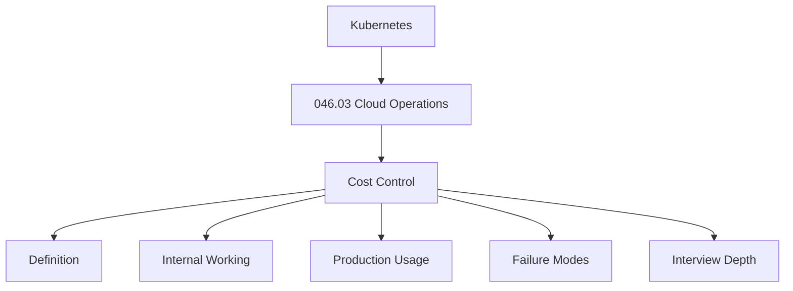
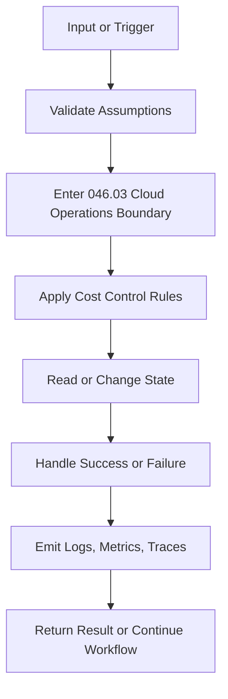
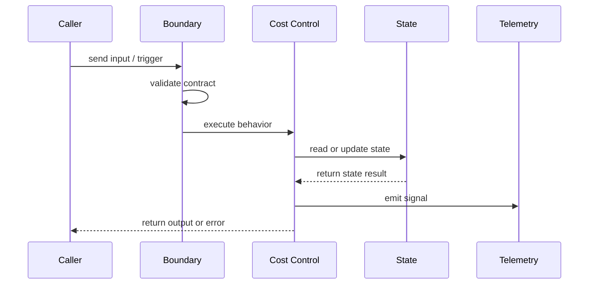
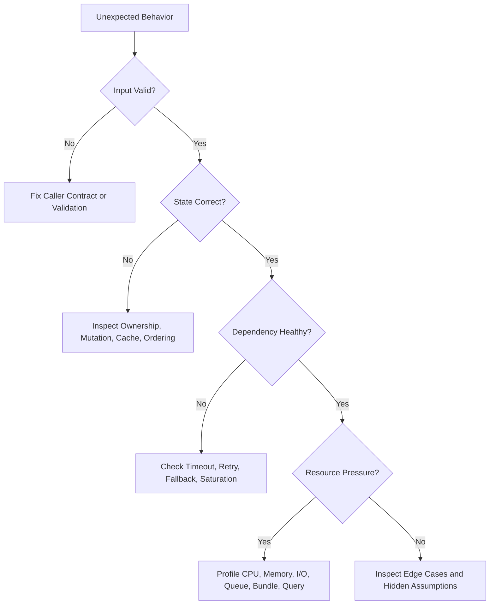
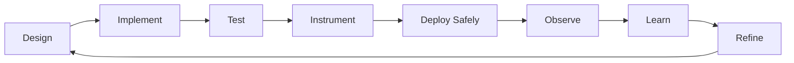
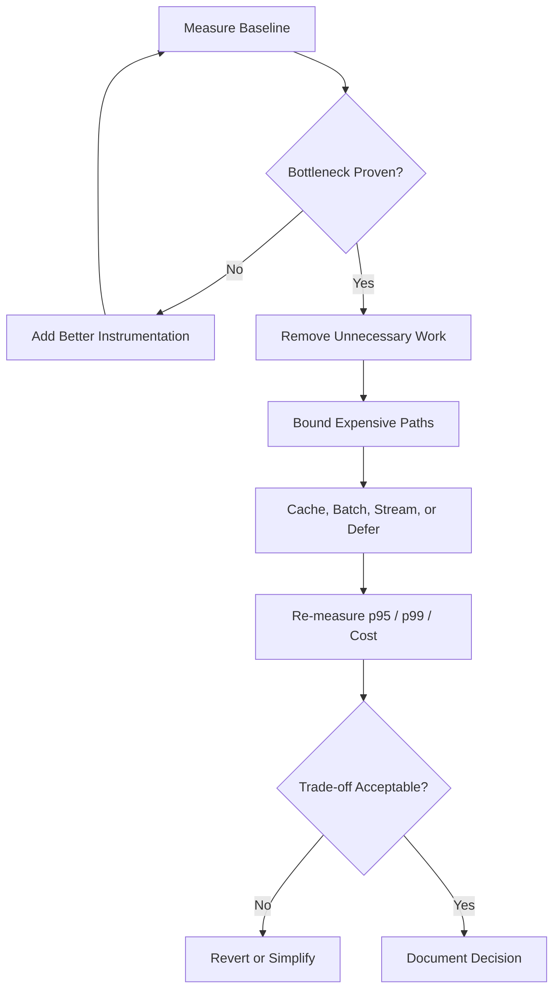
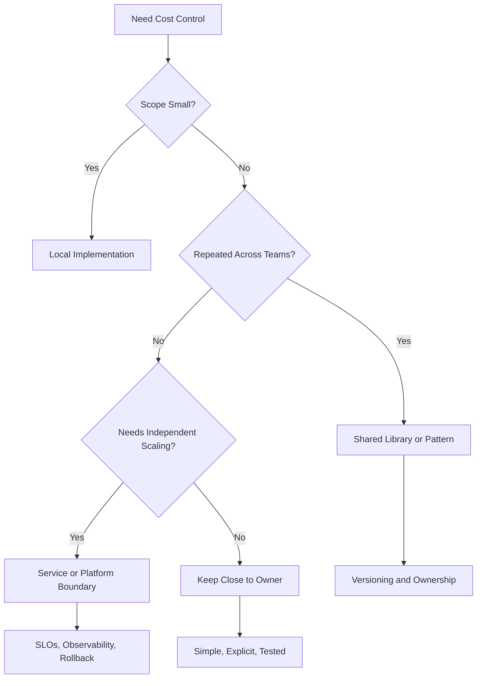
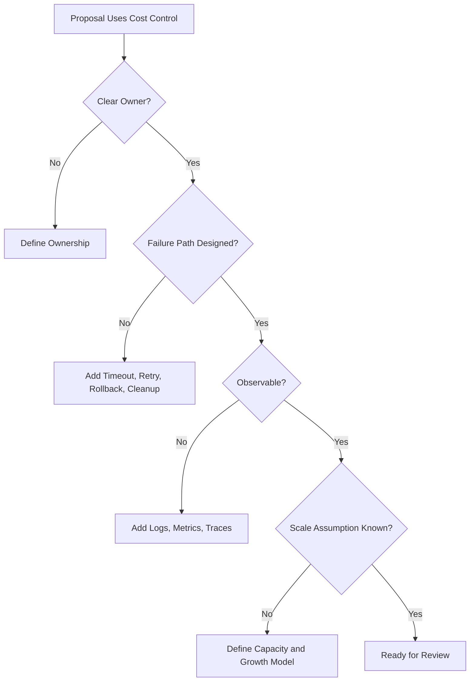

# Diagrams: 046.03.03 Cost Control

Category: Kubernetes

Topic: 046.03 Cloud Operations

Use these diagrams to understand Cost Control visually: normal flow, internal lifecycle, memory/resource behavior, failure handling, debugging, optimization, and system design connections.

## 1. Concept Map



How to read it:

- The category gives the broad engineering domain.
- The topic gives the learning boundary.
- The subtopic is the smallest unit you must explain deeply.
- Mastery requires definition, internals, production behavior, failures, and interview reasoning.

## 2. Learning Flow

```mermaid
flowchart LR
  A["Definition"] --> B["Why It Exists"]
  B --> C["Syntax or Interface"]
  C --> D["Internal Working"]
  D --> E["Memory Behavior"]
  E --> F["Execution Behavior"]
  F --> G["Production Use"]
  G --> H["Debugging"]
  H --> I["Architecture Decisions"]
  I --> J["Interview Readiness"]
```



Use this order when studying. Do not jump to architecture trade-offs before you can explain the mechanics.

## 3. Internal Lifecycle



Lifecycle questions:

- What starts this behavior?
- What state must already exist?
- What invariant must remain true?
- What is observable after completion?
- What cleanup is required if execution fails halfway?

## 4. Memory And Resource Model

```text
Work enters Cost Control
  -> memory, CPU, network, storage, or attention is allocated
  -> core behavior executes
  -> data may be copied, retained, cached, queued, or persisted
  -> resource is released, reused, bounded, or leaked
```

For Kubernetes, pay special attention to:

- availability, error budget burn, saturation, cost, deploy frequency, MTTR, alert quality, and capacity headroom,
- ownership of mutable state,
- lifecycle of retained references,
- bounded vs unbounded work,
- cleanup after cancellation, timeout, or failed deploy.

## 5. Execution Timeline



Trace this sequence for happy path, invalid input, slow dependency, retry, duplicate work, and partial failure.

## 6. Failure Decision Tree



Use this when debugging. It keeps you from blaming the nearest stack trace before checking contracts, state, dependencies, and resource pressure.

## 7. Production Readiness Loop



Production-ready understanding means the topic can survive messy input, concurrency, retries, deploy overlap, degraded dependencies, and human operation during incidents.

## 8. Optimization Loop



Do not optimize Cost Control by intuition alone. Optimize only after measurement identifies the constraint.

## 9. Architecture Decision Map



The right architecture depends on blast radius, ownership, scale, change frequency, and operational maturity.

## 10. Interview Answer Flow

```text
Define
  -> explain why it exists
  -> describe internal working
  -> show code or concrete example
  -> name edge cases
  -> discuss production failures
  -> explain debugging strategy
  -> compare architecture trade-offs
  -> summarize best practices
```

Strong answers move from mechanics to judgment. Weak answers stop at definitions.

## 11. Staff Engineer Review Diagram



Use this in architecture review to move beyond code correctness into operational excellence.

## 12. Revision Checklist

```text
[ ] I can define Cost Control.
[ ] I can explain why it exists.
[ ] I can draw the internal flow.
[ ] I can describe memory/resource behavior.
[ ] I can trace execution behavior.
[ ] I can name edge cases and production failures.
[ ] I can debug it using logs, metrics, and traces.
[ ] I can compare architecture alternatives.
[ ] I can answer interview follow-ups.
```
