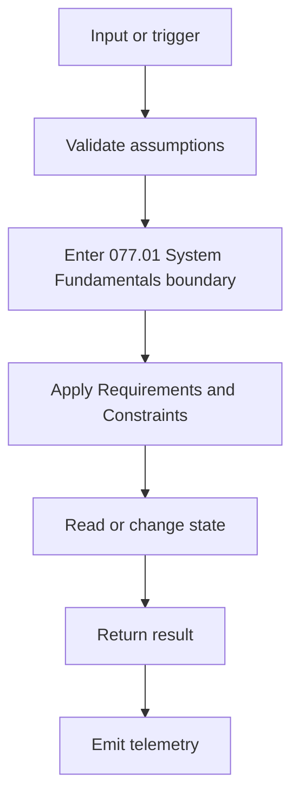
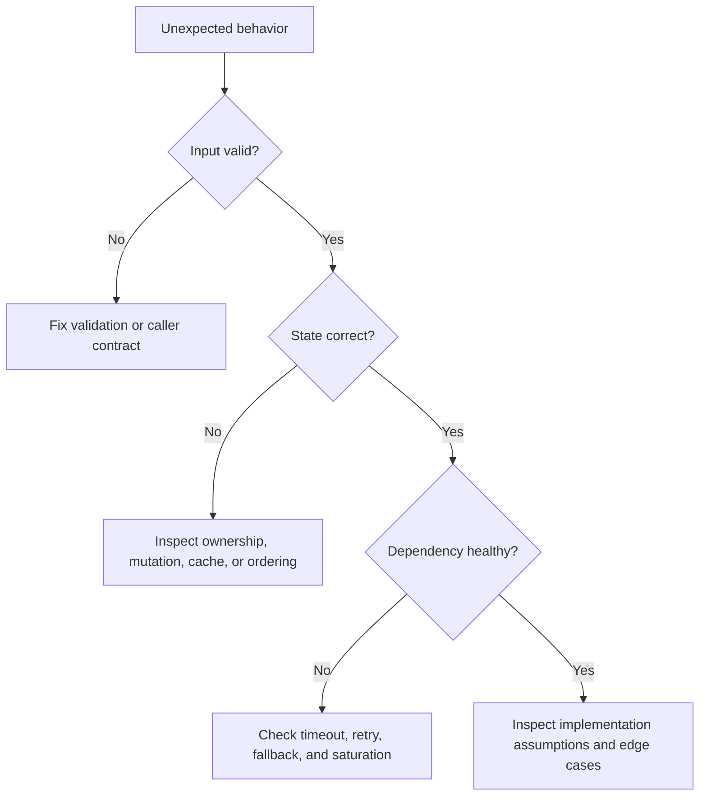

# 077.01.01 Requirements and Constraints

Category: API Gateway

Topic: 077.01 System Fundamentals

## Definition

Requirements and Constraints is a focused engineering concept inside 077.01 System Fundamentals. It describes a behavior, design choice, implementation technique, or operational concern that engineers must understand deeply to build reliable systems in API Gateway.

At a practical level, this topic answers:

- what problem it solves,
- what boundary it belongs to,
- what assumptions it depends on,
- how it behaves during normal execution,
- how it fails under pressure,
- and how to reason about it in production.

The goal is not only to recognize the term. The goal is to explain Requirements and Constraints from first principles, apply it in code or architecture, debug it when it breaks, and defend trade-offs in an interview or design review.

## Why It Exists

Requirements and Constraints exists because real systems need explicit rules for correctness, ownership, execution, and change. Without this concept, teams usually rely on implicit assumptions, and implicit assumptions become bugs when systems grow.

This topic matters because it helps engineers:

- reduce ambiguity in 077.01 System Fundamentals,
- make behavior easier to test and review,
- prevent local decisions from creating system-level failures,
- identify performance and reliability limits before production incidents,
- communicate trade-offs clearly across frontend, backend, platform, security, and product teams.

You should understand this before moving deeper because later topics often depend on the same mental models: state ownership, lifecycle timing, API contracts, failure handling, scaling pressure, and observability.

## Syntax / Interface Shape

Not every engineering topic has programming syntax, but every topic has an interface shape. The interface shape is how the concept appears to the rest of the system.

In API Gateway, Requirements and Constraints commonly appears as a handler, controller, middleware, resolver, guard, interceptor, service, or API contract.

Typical shape:

```ts
type RequirementsAndConstraintsInput = {
  id: string;
  payload: unknown;
};

type RequirementsAndConstraintsResult =
  | { ok: true; value: unknown }
  | { ok: false; error: string; retryable: boolean };

export function handleRequirementsAndConstraints(
  input: RequirementsAndConstraintsInput,
): RequirementsAndConstraintsResult {
  if (!input.id) {
    return { ok: false, error: "missing_id", retryable: false };
  }

  try {
    const value = input.payload;
    return { ok: true, value };
  } catch {
    return { ok: false, error: "unexpected_failure", retryable: true };
  }
}
```

When reading or writing code for this topic, identify:

- the input boundary,
- the output contract,
- the state being read or changed,
- the owner of the behavior,
- the failure path,
- the observability signal.

## Internal Working

The internal working of Requirements and Constraints should be understood as a lifecycle, not as a definition.

```text
Input / trigger
  -> validate assumptions
  -> enter 077.01 System Fundamentals boundary
  -> apply Requirements and Constraints rules
  -> read or update state
  -> handle success, failure, or partial success
  -> emit observable signal
  -> return result or continue workflow
```

For this topic, inspect the real mechanism behind the abstraction:

- request lifecycle, validation, authorization, dependency calls, persistence, serialization, and response mapping,
- ordering and timing,
- ownership of mutable state,
- limits and resource usage,
- retry, cancellation, cleanup, and rollback behavior,
- how the behavior changes between local development, CI, staging, and production.

Senior engineers do not stop at "it works." They ask what the runtime must do, what it keeps in memory, what it sends over the network, what can be retried, what can be duplicated, and what must be protected by invariants.

## Memory Behavior

Every topic consumes or protects memory, state, or another resource. For Requirements and Constraints, reason about memory and resource behavior explicitly.

Common resources:

- memory and retained references,
- CPU and event-loop time,
- network calls and connection pools,
- database locks, indexes, and storage,
- queue depth and worker capacity,
- browser main-thread budget,
- cloud cost and operational attention.

Resource model:

```text
Work enters system
  -> resource is allocated
  -> work is processed
  -> resource is released, retained, cached, or leaked
```

Production questions:

- What grows with traffic?
- What grows with data size?
- What grows with number of tenants, teams, or services?
- What is bounded?
- What can leak?
- What needs cleanup?
- What metric proves the resource behavior is healthy?

For API Gateway, watch p95/p99 latency, error rate, saturation, timeout rate, retry volume, queue depth, and dependency health.

## Execution Behavior

Execution behavior describes what actually happens when the system runs.

Trace Requirements and Constraints through:

- the happy path,
- invalid input,
- missing dependency,
- slow dependency,
- concurrent execution,
- retry after timeout,
- duplicate request or event,
- deploy with old and new versions running together,
- cleanup after failure.

Execution timeline:

```text
Before
  -> required state and configuration exist
During
  -> core behavior runs and may touch dependencies
After
  -> result, side effects, and telemetry are visible
Failure
  -> caller receives error, retry, fallback, or compensation path
```

The most important question is: what invariant must remain true even if the execution path is interrupted?

## Common Examples

### Example 1: Local Implementation

Use a local implementation when the behavior is simple, low-risk, and owned by one module or team.

```ts
type RequirementsAndConstraintsInput = {
  id: string;
  payload: unknown;
};

type RequirementsAndConstraintsResult =
  | { ok: true; value: unknown }
  | { ok: false; error: string; retryable: boolean };

export function handleRequirementsAndConstraints(
  input: RequirementsAndConstraintsInput,
): RequirementsAndConstraintsResult {
  if (!input.id) {
    return { ok: false, error: "missing_id", retryable: false };
  }

  try {
    const value = input.payload;
    return { ok: true, value };
  } catch {
    return { ok: false, error: "unexpected_failure", retryable: true };
  }
}
```

### Example 2: Shared Abstraction

Move the behavior behind a shared abstraction when multiple teams repeat the same logic and the contract is stable.

```text
Consumer
  -> stable interface
  -> shared implementation
  -> logs, metrics, tests, and ownership
```

### Example 3: Platform or Managed Capability

Use a platform capability when correctness, scale, compliance, or operational cost is too important for every team to solve independently.

```text
Product team
  -> platform API
  -> centrally owned reliability, security, and observability
```

## Confusing Examples

### Confusion 1: The Name Sounds Simple

Many developers can define Requirements and Constraints, but cannot trace its lifecycle or failure modes. Interviewers often move quickly from definition to edge cases.

### Confusion 2: Local Behavior Differs From Production

Local environments rarely reproduce production traffic, data shape, dependency latency, permissions, deploy overlap, or noisy neighbors.

### Confusion 3: The Happy Path Hides Ownership

If no one owns the failure path, monitoring, documentation, migration plan, or rollback process, the design is incomplete.

### Confusion 4: Optimization Before Measurement

Optimizing Requirements and Constraints without baseline data can make the system harder to debug while failing to improve the real bottleneck.

## Production Use Cases

Requirements and Constraints appears in production anywhere API Gateway needs predictable behavior across real users, real traffic, real failures, and real team boundaries.

Used in:

- payments, identity, notifications, search, realtime collaboration, SaaS APIs, and partner integrations,
- payment and billing workflows,
- authentication and authorization flows,
- admin and internal platforms,
- realtime or async processing,
- reporting and analytics,
- compliance and audit trails,
- incident response and operational runbooks.

Production makes this harder because:

- inputs are messy,
- clients and services run different versions,
- dependencies degrade before they fail,
- retries multiply load,
- dashboards show symptoms before root cause,
- ownership is split across teams.

## Architecture Decisions

When designing around Requirements and Constraints, compare multiple approaches.

| Approach | Use When | Trade-Off |
|---|---|---|
| Inline/local logic | Small scope, low risk, one owner | Fast to build, easier to duplicate |
| Shared library | Same logic repeated across modules | Versioning and rollout become important |
| Service/API boundary | Multiple consumers need stable behavior | Network, latency, and ownership overhead |
| Platform capability | High scale, compliance, or reliability needs | Requires platform maturity and governance |
| Managed service | Commodity capability with strong provider support | Less control, provider constraints |

Decision questions:

- What is the blast radius if this breaks?
- Who owns the contract?
- How often will it change?
- What must be observable?
- What happens during rollback?
- What is the simplest design that satisfies current correctness and scale?

## Interview Questions

1. What is Requirements and Constraints, and why does it matter in API Gateway?
2. What problem does it solve inside 077.01 System Fundamentals?
3. How does it work internally?
4. What are the most common edge cases?
5. What failure modes appear only in production?
6. How would you implement a minimal version?
7. How would you test it?
8. How would you debug a production issue related to it?
9. What metrics or logs would you add?
10. How does the design change at 10x traffic, data, or team size?
11. What trade-offs exist between simple implementation and platform abstraction?
12. What senior-level mistake do engineers make with this topic?

## Senior-Level Pitfalls

### Pitfall 1: Treating It As Isolated Trivia

Requirements and Constraints is connected to runtime behavior, architecture, operations, and team ownership. A narrow definition is not enough.

### Pitfall 2: Ignoring Failure Semantics

A design that only explains success is not production-ready. Define timeout, retry, cancellation, idempotency, rollback, and cleanup behavior.

### Pitfall 3: Missing Observability

If the system cannot prove what happened, debugging becomes guesswork. Add logs, metrics, traces, and structured identifiers at decision points.

### Pitfall 4: Hidden Shared State

Shared state without clear ownership creates race conditions, stale reads, memory leaks, and cross-request contamination.

### Pitfall 5: Premature Abstraction

Abstracting too early can freeze weak assumptions. Wait until the repeated shape is stable, then extract a clear interface.

## Best Practices

- Start with a precise definition.
- Identify the owner and boundary.
- Make inputs, outputs, and invariants explicit.
- Prefer simple local design until the pressure for abstraction is real.
- Test normal, edge, and failure paths.
- Add observability before relying on the behavior in production.
- Keep resource usage bounded.
- Document assumptions and trade-offs.
- Design rollback and migration paths.
- Revisit the decision when scale, team count, or correctness requirements change.

## Debugging Scenarios

### Scenario 1: Works Locally, Fails In Production

Likely causes:

- different configuration,
- different data shape,
- missing permissions,
- dependency latency,
- concurrency,
- version mismatch.

Debugging steps:

1. Compare environment configuration.
2. Capture one failing input.
3. Trace the request or workflow end to end.
4. Check deploy, data, and dependency timelines.
5. Reproduce with production-like constraints.

### Scenario 2: Intermittent Failure

Likely causes:

- race condition,
- retry interaction,
- shared mutable state,
- timeout boundary,
- cache inconsistency,
- queue ordering.

Debugging steps:

1. Group failures by tenant, version, region, and dependency.
2. Inspect p95 and p99 instead of averages.
3. Add correlation IDs.
4. Check whether retries amplify the issue.
5. Verify cleanup and idempotency.

### Scenario 3: Performance Regression

Likely causes:

- unbounded work,
- inefficient query or algorithm,
- larger payload,
- cache miss pattern,
- excessive serialization,
- synchronous work on a critical path.

Debugging steps:

1. Establish baseline.
2. Profile the hot path.
3. Compare before and after deploy.
4. Measure resource saturation.
5. Optimize the proven bottleneck only.

### Scenario 4: Memory Or Resource Growth

Likely causes:

- retained references,
- unbounded queue,
- missing cleanup,
- long-lived subscriptions,
- growing cache,
- connection leak.

Debugging steps:

1. Capture heap, CPU, or resource profile.
2. Inspect retainers or open handles.
3. Confirm lifecycle cleanup.
4. Add bounds and eviction.
5. Verify recovery after load drops.

## Diagrams

Dedicated diagrams are available in [diagrams.md](./diagrams.md).

### Concept Flow



### Failure Flow



### Production Readiness Loop

```text
Design
  -> implement
  -> test
  -> instrument
  -> deploy safely
  -> observe
  -> learn
  -> refine
```

## Mini Exercises

### Exercise 1

Explain Requirements and Constraints in your own words using three levels:

- beginner explanation,
- intermediate internal explanation,
- senior production explanation.

### Exercise 2

Draw the lifecycle for Requirements and Constraints:

```text
input -> decision -> state change -> output -> telemetry
```

Mark where validation, failure handling, and cleanup happen.

### Exercise 3

Write one example where Requirements and Constraints works correctly and one where it fails because of an edge case.

### Exercise 4

Create a debugging checklist for a production incident involving Requirements and Constraints. Include logs, metrics, traces, and rollback options.

### Exercise 5

Compare two architecture choices for this topic and explain when each is better.

## Summary

Requirements and Constraints is a practical engineering topic, not just a vocabulary item. Mastery means you can define it, implement it, reason about internals, predict edge cases, debug failures, and explain trade-offs.

Remember:

- Start from first principles.
- Identify boundaries and ownership.
- Understand execution and resource behavior.
- Design for failure, not only success.
- Add observability.
- Keep the simplest design that satisfies correctness and scale.
- Revisit the design as production pressure changes.
